# 如何用 SwiftUI 和 AWS Amplify 实现登录(第 1 部分)

> 原文：<https://betterprogramming.pub/sign-in-with-aws-amplify-and-swiftui-978b01a5cf10>

## **登录谷歌**


由 [Gustas Brazaitis](https://unsplash.com/@gustasbrazaitis?utm_source=medium&utm_medium=referral) 在 [Unsplash](https://unsplash.com?utm_source=medium&utm_medium=referral) 上拍摄

# 为什么使用 AWS Amplify/Cognito 进行登录？

有许多关于如何让用户在 iOS 上登录的指南和资源。由此，许多人使用 Firebase，因为它非常简单。

虽然它可能很简单，我过去也用过，但这个平台有一个很大的局限性:你不能在中国使用它。拥有世界上最多的智能手机用户(超过 8 亿)，这当然是一个许多人不想错过的国家。

[](https://www.statista.com/statistics/467160/forecast-of-smartphone-users-in-china/) [## 中国:2017-2023 年智能手机用户

### 了解 Statista 如何支持您的业务。Statista。(2019 年 2 月 18 日)。智能手机用户数量…

www.statista.com](https://www.statista.com/statistics/467160/forecast-of-smartphone-users-in-china/) 

如果我们计划在中国发展和推出，我们不能在使用 Firebase 的同时这样做。对于最初想使用移动后端作为服务的小团队来说，这可能是个问题，尤其是在像台湾这样 Firebase 工作的国家。

在台湾，开发者可能会决定先在当地进行试运行，作为一个较小的市场，他们可以对自己的应用进行多次迭代，并根据用户反馈进行改进，然后在增长后在中国推出，因为中国是一个文化相似的国家。

在这种情况下，从一开始就使用能够支持中国使用的平台是很好的。

当然，如果你在中国推出的应用有多个社交媒体登录选项，用户将无法登录谷歌或脸书，但对中国用户来说，移除这些选项并只允许苹果或电子邮件等提供商比改变整个后端更容易。

不管你想把 AWS 作为一项服务用于你的移动后端的原因是什么，让我们开始吧！

在本教程中，我将假设我们从一开始就启动一个应用程序，并希望为用户添加授权。我将通过谷歌、脸书、苹果和电子邮件完成添加登录的过程。

# 安装

在开始繁重的工作之前，如果您不熟悉 AWS Amplify CLI，您需要遵循[入门指南](https://aws-amplify.github.io/docs/)。这些步骤基本上是注册一个 AWS 帐户，安装它，并配置 CLI。

你可以跟随他们的[入门指南](https://aws-amplify.github.io/docs/ios/start)来开始了解他们的 GraphQL API 是如何工作的，他们甚至有一个演示 [SwiftUI 项目](https://github.com/aws-samples/aws-amplify-swiftui-demo)。

如果您对在开始构建 API 并将数据发送到数据库之前准备登录感兴趣，只需遵循本教程。

让我们首先转到 Xcode 并创建一个新项目。选择*单视图应用*。在*语言*中选择 *Swift* ，在*用户界面*中选择 *SwiftUI* 。给它您想要的产品名称和组织名称。

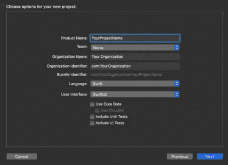

不要忘记为用户界面设置 SwiftUI

创建项目后，记下项目的包标识符:

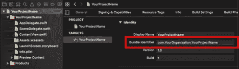

我们一会儿会用到它

在能够编写我们的代码来登录不同的提供商之前，您需要在谷歌和脸书开发者门户上创建一个项目，因为您将被要求提供这些提供商的凭证。

# 在 Google 开发者控制台中创建项目

要启用 Google 登录，我们需要从他们那里获取 OAuth 凭证。

为此，我们转到[谷歌开发者控制台](https://console.developers.google.com)。使用您的 Google 帐户登录，然后为您的应用程序创建一个新项目。之后，转到您新创建的项目。

首先，您需要转到左侧菜单中的“OAuth 同意”屏幕，并在添加凭证之前设置所需的详细信息。

选择*外部*作为*用户类型*，然后填写 app 名称，点击*保存*按钮。您可以在此处填写其他详细信息，或者稍后再回来填写。

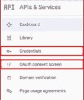

*在这里，我们只需要访问 OAuth 同意屏幕和凭证*

设置同意屏幕后，在左侧菜单中选择*凭证*。选择*创建凭证*、 *OAuth 客户端 ID* 和 *Web 应用*。您可以保存客户端 ID 和客户端密码，或者在需要时返回控制台获取它们。

现在，选择*创建凭证*、 *OAuth 客户端 ID* 和 *iOS* 。输入在 Xcode 上创建项目后获得的包标识符。同样，您可以保存创建的 ID 或稍后再来获取它。

# 在脸书开发人员控制台上创建项目

要启用脸书登录，我们需要遵循类似的流程。

进入[脸书开发者控制台](https://developers.facebook.com)。使用您的脸书帐户登录。进入*我的应用*、*创建应用*。

现在，在左侧菜单中，进入*设置*、*基本*。在底部，点击*添加平台*、 *iOS* ，输入您的项目的包标识符，然后点击*保存更改*。

同样，您可以保存应用 ID 和应用密码，或者稍后再来获取它们。

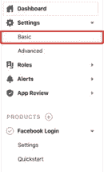

*在这里我们只需要进入设置/基本*

# 将 Amplify 添加到 iOS 项目

在终端中，转到刚刚创建的项目的文件夹，然后运行以下命令:

```
$ amplify init
```

CLI 将带我们完成一些步骤:

*   输入项目名称:通过按 Enter 键选择默认值，或者输入您喜欢的项目名称。
*   输入环境名称:选择您喜欢的环境名称，例如“local”。
*   选择您的默认编辑器:Visual Studio 代码(或您首选的编辑器)。
*   选择你正在开发的应用类型:iOS。
*   是否要使用 AWS 配置文件？Y.
*   请选择您要使用的配置文件:选择您的 AWS 配置文件。

过一会儿，您应该会收到一条成功消息。现在我们的项目已经创建好了，如果你愿意，你可以检查一下 [AWS 放大器控制台](https://console.aws.amazon.com/amplify)，并验证它是否在那里。

当点击您的项目并转到*后端环境*选项卡时，您应该看到该项目还没有启用的类别，如下图所示:

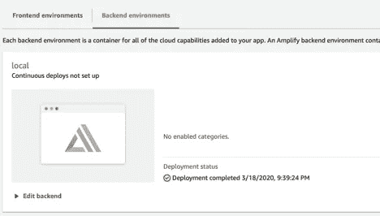

新项目的自动气象站放大器控制台

一旦您添加了*授权*、 *API* 或*分析*，您应该能够从这里访问它们中的每一个。

回到 CLI，转到您的项目文件夹并运行命令:

```
$ amplify add auth
```

CLI 将再次带我们完成一个(有点长的)过程:

*   您想使用默认的身份验证和安全配置吗？社交提供者(联盟)的默认配置。
*   您希望用户如何登录？用户名。
*   您想配置高级设置吗？是的，我想做一些额外的更改。
*   报名需要具备哪些属性？电子邮件、姓名、图片*。
*   您想启用以下任何功能吗？跳过。
*   您希望我们为您创建什么域名前缀？默认或随意选择。
*   在 URI 输入您的重定向标志:Myapp://。
*   你想在 URI 增加另一个重定向标志吗？名词（noun 的缩写）
*   输入您的重定向注销 URI: Myapp://*。
*   您是否希望在 URI 之外添加另一个重定向标志？名词（noun 的缩写）
*   选择要为您的用户群配置的社交提供商:脸书、谷歌。
*   输入您的 OAuth 流的脸书应用 ID:输入您之前获得的脸书应用 ID。
*   输入你的 OAuth 流的脸书应用程序秘密:输入你之前获得的脸书秘密 ID。
*   为 OAuth 流输入您的 Google Web 客户端 ID:输入您之前获得的 Web 客户端 ID。
*   为 OAuth 流输入您的 Google Web 客户端密码:输入您之前获得的 Web 客户端密码。

*请注意，在这里，我选择了电子邮件、姓名和图片作为必需属性，这样我就可以向用户显示这些详细信息。选择您喜欢的属性，只需注意哪些属性对您使用的登录提供程序可用。

*我们使用`myapp://`作为重定向 URI，因为我们想在登录后返回应用程序。

现在您可以运行该命令:

```
$ amplify push
```

一段时间后，您应该会收到一条成功消息。您可以点击链接来测试自动生成的测试 UI。

这将试图把你重定向到 myapp://虽然，你不能在浏览器中这样做。但是如果你在登录后有一个有效的重定向网站，测试 UI 会带你去那里。

# 完成使用 Google 登录的设置

现在让我们回到谷歌开发者控制台。在凭证列表中，编辑 *Web 客户端*。

在*Authorized JavaScript origins*中，添加刚刚从 AWS CLI 获得的 HostedUI 端点，末尾不带“`/`”。它应该是这样的:

```
https://yourswiftuiamplifyprojectf9af9929f9af9929-local.auth.us-east-1.amazoncognito.com
```

在*授权重定向 URIs* 中，增加相同的`HostedUIEndpoint`，末尾加上`/oauth2/idpresponse`。它应该是这样的:

```
https://yourswiftuiamplifyprojectf9af9929f9af9929-local.auth.us-east-1.amazoncognito.com/oauth2/idpresponse
```

现在，您可以保存 web 客户端凭据了。

您需要从 iOS 凭据中获取 iOS URL 方案。你可以通过点击编辑按钮来查看，然后从右上角复制它。

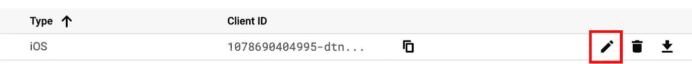

单击图片上显示的编辑按钮，查看您的 iOS 凭据详细信息

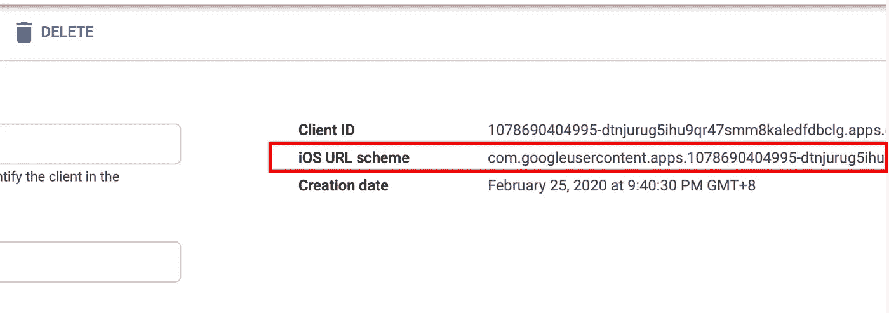

您的 iOS URL 方案应该如下所示

# 完成与脸书的登录设置

我们还需要将端点添加到我们的脸书应用程序。

返回脸书开发者控制台。转到*设置*、*基本*。向下滚动选择*添加平台*、*网站*，然后输入`HostedUIEndpoint`，最后是`/oauth2/idpresponse`:

```
https://yourswiftuiamplifyprojectf9af9929f9af9929-local.auth.us-east-1.amazoncognito.com/oauth2/idpresponse
```

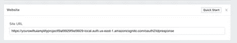

搭建网站平台

向上滚动，在*应用程序域*中输入相同的 HostedUI 端点，并在末尾加上`/oauth2/idpresponse`，然后保存更改。

接下来，在左侧菜单中，选择*产品*、*脸书登录*、*设置*。选择 *iOS* ，忽略快速启动，选择*设置*，在左侧菜单*脸书登录*下:

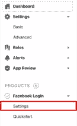

*现在我们只需要进入脸书登录/设置*

在*有效 OAuth 重定向 URIs* 中，输入以`idpresponse`结尾的端点:

```
https://yourswiftuiamplifyprojectf9af9929f9af9929-local.auth.us-east-1.amazoncognito.com/oauth2/idpresponse
```

保存更改，现在我们可以进行下一步了！

# 编辑信息. plist

在文本编辑器中打开您的`Info.plist`文件，这样您就可以以 XML 文件的形式查看它。在文件的顶部，在字典的开头添加以下内容:

需要添加到 Info.plist 文件中的密钥

这里有几个注意事项，在`CFBundleURLTypes`下面，注意在你的 app ID 前面加字母`fb`。向下，在`FacebookAppID`下面，不需要加字母`fb`。您的`Info.plist`文件应该是这样的:

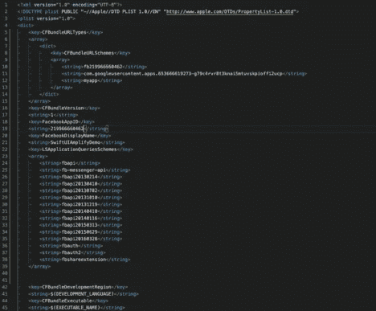

Info.plist 添加以上详细信息后

# 向 iOS 项目添加所需的窗格

要添加 [CocoaPods](https://cocoapods.org/) ，在您的项目文件夹中，运行以下命令:

```
$ pod init
```

在文本编辑器中打开生成的 pod 文件，并添加以下 pod:

现在，通过运行以下命令来安装它们:

```
$ pod install --repo-update
```

打开你的项目`.xcworkspace`，让我们(最终)开始实际编写一些 Swift 代码！

# 将 AWS 配置文件复制到 Xcode 中

在能够使用`AWSMobileClient`之前，你需要复制两个文件到 Xcode: `awsconfiguration.json`和`amplifyconfiguration.json`。

将它们拖到您的项目中，并取消选中“如果需要，复制项目”，这样您就只保留了对原始文件的引用。这样，如果您更新您的放大器配置，Xcode 上的参考将会跟踪这些更改。

您的项目应该如下所示:

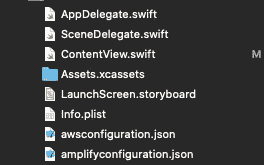

*项目中当前文件的概述*

# 正在初始化 AWS 移动客户端

在您的`AppDelegate`中，在顶部添加以下导入:

```
import AWSMobileClient
```

在`AppDelegate`类中，添加这个函数来初始化 AWS 移动客户端:

在应用程序委托内部初始化 AWSMobileClient 的代码

当然，不要忘记在返回之前对应用程序`didFinishLaunchingWithOptions`中的函数进行分类。你的`AppDelegate` 应该是这样的:

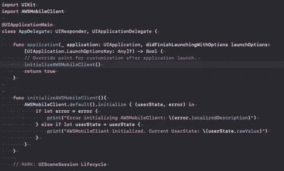

别忘了调用**initializeAWSMobileClient()**！

您可以通过在模拟器中运行您的应用程序来测试 AWS 移动客户端是否正确初始化。您应该会在控制台上看到以下内容:

```
AWSMobileClient initialized. Current UserState: signedOut
```

# 创建 SwiftUI 视图

打开`ContentView.Swift`。让我们添加一个内部带有`Button`的`VStack`来登录 Google。

简单的 VStack 与谷歌登录按钮

目前，当在模拟器或设备上运行时，除了在控制台中打印一些东西之外，按钮没有做任何事情。随意添加任何样式到你的按钮！

# **登录谷歌**

为了在 SwiftUI 中使用`AWSMobileClient`方法，我们需要在`UIViewControllerRepresentable`中使用它。创建一个名为`SignInViewController.swift`的文件，并在其中添加以下内容:

登录方法的 UIViewControllerRepresentable

关于这段代码的一点解释。我们在上面创建了一个`UINavigationController`，因为`AWSMobileClient`期望它显示每个提供者的 UI。

请注意，当我们设置`hostedUIOptions`时，我们设置了“email”和“profile”来获取我们向它们询问的附加细节(如姓名和个人资料图片)。

```
let hostedUIOptions = HostedUIOptions(scopes: ["openid", "email", "profile"], identityProvider: "Google")
```

登录成功后，我们得到`userState`。如果我们想得到上面要求的详细信息(电子邮件，姓名，个人资料图片)，我们需要做一些额外的工作。

文档和论坛答案建议使用`AWSMobileClient` `getUserAttributes`或`AWSCognitoIdentityPool` `getDetails`，但在本文撰写之时(2020 年 3 月)它们并不起作用。

这就是为什么我选择在这一行从 JSON 声明中获取信息:

```
AWSMobileClient.default().getTokens { (tokens, error) in …
```

现在我们需要将`SignInViewController`添加到我们的`ContentView`中。修改主体，使其返回我们已经拥有的`VStack`下的`ZStack`中的`SignInViewController`，如下所示:

将 SignInViewController 添加到 ContentView

之后，您可以在模拟器或您的设备上运行项目。成功登录后，您将看到控制台中打印的用户详细信息。

现在你知道你已经登录，如果你重新启动你的应用程序，你应该会看到以下消息:

```
AWSMobileClient initialized. Current UserState: signedIn
```

让我们做一些更有趣的事情。登录后，我们换到另一个屏幕。

# 登录后切换到另一个屏幕

为了通过应用程序传播更改，我选择创建一个名为`AppSettings`的`ObservableObject`。这将存储用户名等详细信息。

您可以在此添加用户的其他详细信息，例如电子邮件或其个人资料图片的 URL。创建一个名为`AppSettings.swift`的文件，并添加以下内容:

用于访问用户默认值的 AppSettings

在你的`ContentView`里面，在正文之前，添加这个变量:

```
@ObservedObject var settings = AppSettings()
```

现在让我们更改正文，以便`View`在登录后显示不同的消息:

登录后在内容视图上显示消息

如果用户名设置在`AppSettings`上，应用程序将显示不同的消息。

我还在这里添加了两个退出按钮。一个让你可以注销，如果你已经这样做之前，设置用户名。第二个在您登录后显示，因此您可以退出并测试其他登录方法。

我还添加了`Divider` s，所以`Button` s 彼此之间有点距离。

现在，您可能已经注意到，我们在登录后没有在任何地方设置用户名。让我们回到`SignInViewController`并解决这个问题。在顶部添加以下变量，就在`navController`之前:

```
@ObservedObject var settings = AppSettings()
```

就在打印声明之后，您将获得用户名、电子邮件和图片，添加以下内容:

我们需要在主队列中设置这个变量，因为它触发了对 UI 的一些更改。

如果您构建您的应用程序，您会注意到一个错误。现在我们需要将设置`ObservedObject`传递给`SignInController`:

```
let signInVC = SignInViewController(settings: settings)
```

现在，运行您的应用程序后，如果您之前已经登录过，请按“注销”按钮，然后尝试登录和注销以查看屏幕上的更改。现在您知道如何使用 AWS 向您的应用程序添加授权服务了！

如果你想看看整个项目，请查看 [GitHub Repo](https://github.com/rolisanchez/swiftui-amplify-demo) 。