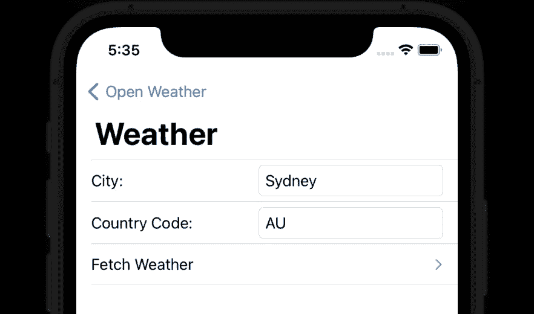
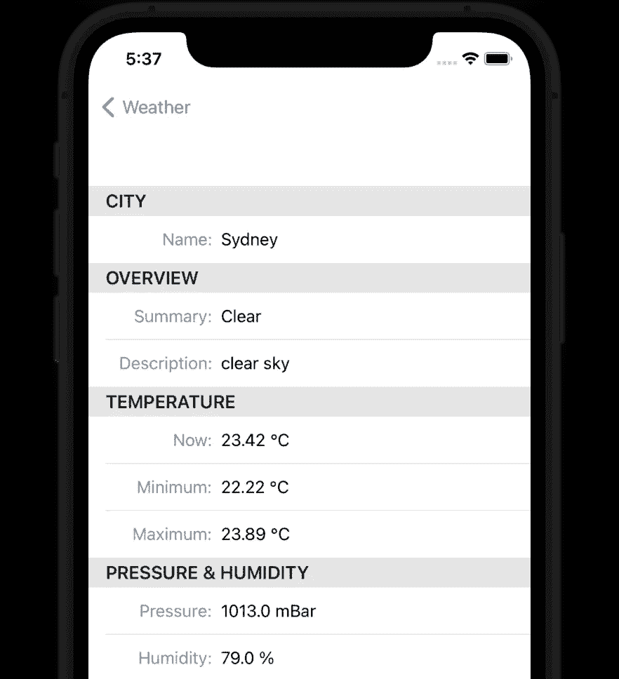

# 简化 Swift 中的 API 调用

> 原文：<https://betterprogramming.pub/simple-and-robust-api-calls-in-swift-4ddf8710d1a0>

## 使用可提取协议


K. Mitch Hodge 在 [Unsplash](https://unsplash.com?utm_source=medium&utm_medium=referral) 上拍摄的照片。

大多数应用程序需要从后端 API 或“服务器”获取数据通常，我们为每次获取编写许多样板、重复的代码。

相反，我们可以创建一个符合可提取协议的类型，这仅仅意味着我们指定:

1.  API 的基本 URL。
2.  获取参数键。
3.  响应中预期的“提取”类型。

Fetchable 为我们处理所有的内部工作。Fetchable 提供了一个组合发布器，我们可以观察它来更新我们的模型和 UI。

# 示例:开放天气

让我们看一个典型的例子。

根据[开放天气 API 文档](https://openweathermap.org/current)，为了获取一个城市的天气数据，我们需要提供:

1.  基本网址:`https://api.openweathermap.org/data/2.5`
2.  结束 URL 路径:`weather`
3.  参数键:`appID`、`q`(站点所在城市和国家代码)、`units`

API 将使用包含`Site`的 JSON 有效负载进行响应。

例如，我们可以用每个参数键的这些值来调用 API:

*   `appID` = `1234567890abcdef`
*   `q` = `Sydney, AU`(澳大利亚悉尼)
*   `units` = `metric`

开放天气会在你[注册](https://home.openweathermap.org/users/sign_up)后为你提供自己的`appID`。它是免费的。

# 可提取请求

为了用上面的示例请求获取天气，我们可以简单地创建一个符合`Fetchable`的`Weather`类型，如下所示:

就是这样！

Fetchable 负责将键映射到请求参数，创建 URL、请求和网络连接。

# 迷人的

为了启动从 API 的实际获取，我们只需要向我们的可获取类型请求一个`publisher`:

让我们对代码进行硬包装，使其可读性更好:

由于键是枚举的大小写，编译器强迫我们正确输入键，并在代码完成弹出菜单中列出它们(当我们键入前导句点时)。

# 自定义功能

我们通常会将密钥作为自定义 Swift 函数中的参数公开:

让我们将我们的单位系统定义为`enum System`，并让 Fetchable 知道它符合`FetchValue`，这样我们就可以在`keyValues`字典中使用它，如上所示。

我们将从视图模型中调用该函数:

# 用户界面

我们可以创建一个这样的用户界面:

如果稍微增加一些样式，它可能看起来像这样:



当用户点击`Fetch Weather`按钮时，应用程序会显示如下获取的站点:



# 响应解码

根据 Open Weather API 文档，JSON 响应将是一个包含如下数据的“站点”:

我们应该按照 [Swift 的 API 指南](https://swift.org/documentation/api-design-guidelines/)创建我们的应用程序模型，因此我们将使用映射到`Decodable` JSON 键的 Swifty 属性名来声明`Site`。大概是这样的:

# 可提取协议

可提取协议为请求计算默认值，这通常为我们节省了很多配置。

例如，我们上面的可获取的`Weather`示例默认使用“天气”的结束 URL 路径，使用`httpMethod = .get`和`dateDecodingStrategy = .iso8601`。

但是，有时您会想要覆盖默认值，例如:

*   `httpMethod = .post`
*   `endURLPath = "some/custom/path"`
*   `encoding = .json`
*   `headers = ["Auhorization": "Bearer 1234567890abcdef"]`

以下是您可以覆盖的所有可用属性:

# 提取密钥

Fetchable 在符合`FetchKey`的关联类型`Key`中查找参数键。通常，正如我们在上面的露天天气示例中看到的，它看起来像这样:

创建 URL 请求时，Fetchable 根据`encoding`选择(`.form`或`.json`)使用键/值对。对于默认的`form` `encoding`，URL 应该是这样的:

```
https://api.openweathermap.org/data/2.5/weather?q=Sydney,AU&**units=metric**&appID=1234567890abcdef
```

但是，有时 API 调用要求一个或多个键/值在 URL 路径中(而不是在查询表单或 JSON 中)。为此，我们可以覆盖`FetchKey`的`var isInURLPath`。

例如，如果我们这样添加`isInURLPath`:

然后，Fetchable 将在 URL 路径中构造带有`units/metric`的请求查询，如下所示:

```
https://api.openweathermap.org/data/2.5/**units/metric/**weather?q=Sydney,AU&appID=1234567890abcdef
```

# 向项目中添加可提取内容

Fetchable 是开源 BFWFetch 库的一部分。您可以将它作为框架添加到您自己的项目中。您可以在以下网址找到它:

*   [比特桶](https://bitbucket.org/barefeetware/bfwfetch/)
*   [GitHub](https://github.com/BareFeetWare/BFWFetch)

你可以按照[添加一个框架到一个 iOS 应用](https://medium.com/p/45c06e39bf23/)的指令(只是用 BFWFetch 替换 BFWControls)来添加它作为一个 Git 子模块。

也可以通过 Cocoapods、Swift 包管理器、Carthage 等来添加。如果你愿意的话。

该库包括一个获取天气的演示应用程序，扩展了上面的代码示例。

# 资源

*   BFWFetch 在[位桶](https://bitbucket.org/barefeetware/bfwfetch/)上
*   在 [Github](https://github.com/BareFeetWare/BFWFetch) 上进行 BFWFetch
*   [打开当前天气的天气 API 文档](https://openweathermap.org/current)
*   [向 iOS 应用添加框架](https://medium.com/p/45c06e39bf23/)说明
*   [Swift API 设计指南](https://swift.org/documentation/api-design-guidelines/)

# 接下来…

💬如果您有任何问题、意见或建议，请在下面添加回复。

🛠将 BFWFetch 添加到您的项目中以简化 API 调用。

👏如果你喜欢这篇文章，最多加 50 个拍手。

👀跟随作者查看更多关于构建 app 的文章。