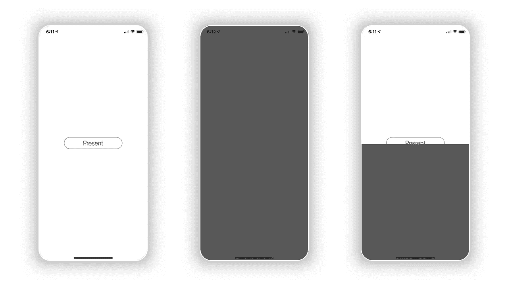

# 一个简单的视图控制器教程

> 原文：<https://betterprogramming.pub/simple-drag-dismiss-on-presented-view-controller-tutorial-5f2f44f86f7b>

## 当用户拖动手指时关闭 ViewController

图片来源:作者

我目前正在开发一个健身应用程序，它要求我通过向下拖动视图控制器来关闭视图控制器。大多数在线解决方案使这项任务过于复杂。下面是我使用 **PanGestureRecognizer** 、**cgaffinitransform**和 **UIView 的简单解决方案。动画**。

解决方案的演示

理论上，您应该能够复制和粘贴代码，但是我还会在代码片段下面包含详细的解释。

这将全部发生在您想要实现该解决方案的 ViewController 中。

# 1)将 addGestureRecognizer 添加到视图

我们将首先向视图控制器的视图添加一个 PanGestureRecognizer。

在视图控制器中添加手势识别器

addGestureRecognizer 将接受 UIPanGestureRecognizer 的一个参数，目标是 ***self*** 和 action***# selector(handleDimiss)。***

# 2)创建 HandleDismiss 函数

我们现在将创建 ***handleDimiss*** 函数作为 Objective-C 函数。

创建一个 objc handleDismiss 函数

# 3)使用开关盒处理发送器

我们创建了 handleDismiss 函数来接受 UIPanGestureRecognizer 的参数。这将允许我们跟踪用户平移的 Y 位置。我们将使用 switch 语句处理用户 pan 的已更改和已结束状态。

## 案例:。已更改:

创建了变量、切换大小写和函数来处理翻译

我们创建了变量***viewtranaltion***，这将允许我们跟踪平移手势的当前位置。

**内*。改变*** 的情况，我们将***view translation***设置为用户的当前平移位置。有了新的平移，我们使用 UIView.animate 根据平移手势 y-translation(使用 CGAffineTransform)动画显示视图的新位置。

## 案例:。结束时间:

完成代码以处理 pan 的更改和结束状态，从而确定视图控制器的解除

当用户完成平移时，**、*。*结束了**案件现在正在处理剩下的工作。在其中，条件语句确定视图是被关闭还是使用。 ***身份*** 。

下面是 [GitHub 演示项目](https://github.com/ModernProgrammer/DragDismissDemo)。

## 小费

在呈现 ViewController 时，将 modalPresentationStyle 设置为 overCurrentContext 以禁用黑色背景。