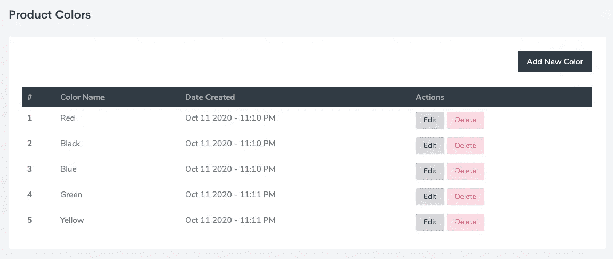
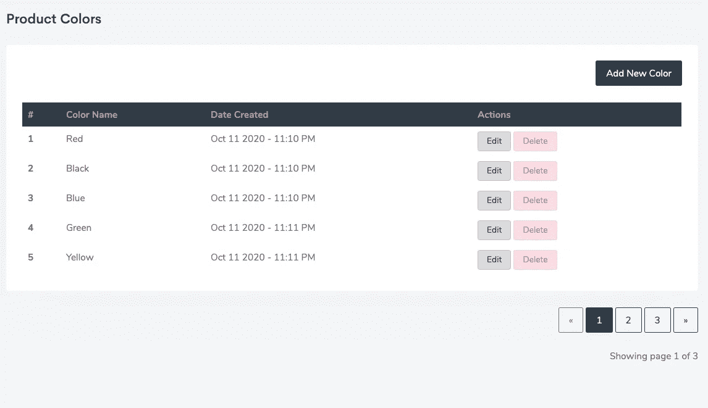

# 简单烧瓶分页

> 原文：<https://betterprogramming.pub/simple-flask-pagination-example-4190b12c2e2e>

## 下面是一个简单的分步教程，介绍如何在 Flask 中实现分页


烧瓶标志

[Flask](https://flask.palletsprojects.com/en/1.1.x/) 以轻便著称，一旦你足够熟练，它会帮助你尽快建造。

我们的任务:返回所有可用的颜色，每页五个项目。

1.  从后端定义数据。(您应该已经在数据库的颜色表中添加了颜色。)

```
@app.route('/colors')
@login_required
*def* colors():
    # Get the data from the database
    colors = Color.query.all()
    *return* render_template('colors/all_colors.html', colors=colors)
```

2.显示页面上的项目。

```
<div *class*="table-responsive">
    <table *class*="table table-sm table-borderless mb-0">
        <thead *class*="thead-dark">
            <tr>
                <th>S/N</th>
                <th>Color Name</th>
                <th>Date Created</th>
                <th>Actions</th>
            </tr>
        </thead>
        <tbody>
            
            <tr>
                <th *scope*="row">{{ loop.index }}</th>
                <td>{{ color.name }}</td>
                <td>{{ color.created_at }}</td>
            </tr>
            
        </tbody>
    </table>
</div>
```

然后将显示所有颜色。


# 现在是分页部分

3.修改视图以适应分页。

```
ROWS_PER_PAGE = 5@app.route('/colors')
@login_required
*def* colors():
    *# Set the pagination configuration* page = request.args.get('page', 1, type=*int*)

    colors = Color.query.paginate(page=page, per_page=ROWS_PER_PAGE) *return* render_template('colors/all_colors.html', colors=colors)
```

使用 [Flask SQLAlchemy](https://flask-sqlalchemy.palletsprojects.com/en/2.x/) 的分页功能对结果进行分页，并根据需要使用任意数量的参数。调用 `paginate()`函数的结果是一个分页对象，它有很多方法可以帮助你达到你想要的结果。您可以在[文档](https://flask-sqlalchemy.palletsprojects.com/en/2.x/)中了解更多信息。

4.修改显示模板

要显示项目，必须调用后端定义的`colors`分页对象的`.items`方法。

```
<div *class*="table-responsive">
    <table *class*="table table-sm table-borderless mb-0">
        <thead *class*="thead-dark">
            <tr>
                <th>S/N</th>
                <th>Color Name</th>
                <th>Date Created</th>
                <th>Actions</th>
            </tr>
        </thead>
        <tbody>
            
            <tr>
                <th *scope*="row">{{ loop.index }}</th>
                <td>{{ color.name }}</td>
                <td>{{ color.created_at }}</td>
            </tr>
            
        </tbody>
    </table>
</div>
```



因为我们设置了`ROWS_PER_PAGE = 5`，所以只返回了五个项目。

5.添加用于导航页面的分页按钮视图。

```
*<!-- Pagination Links-->* <div *class*="text-right">
    <a *href*="{{ url_for('colors', page=colors.prev_num) }}"
       *class*="btn btn-outline-dark 
       disabled">
        &laquo;
    </a>*<!-- Loop through the number of pages to display a link for each-->* 
*<!-- Check for the active page and set the link to "Active"-->* 
            <a *href*="{{ url_for('colors', page=page_num) }}"
               *class*="btn btn-dark">
                {{ page_num }}
            </a>
            
            <a *href*="{{ url_for('colors', page=page_num) }}"
               *class*="btn btn-outline-dark">
                {{ page_num }}
            </a>
            
        
            ...
        
     <a *href*="{{ url_for('colors', page=colors.next_num) }}"
       *class*="btn btn-outline-dark 
       disabled">
        &raquo;
    </a>
</div>
<p *class*="text-right mt-3">
   Showing page {{ colors.page }} of {{ colors.pages }}
</p>
```

这是你的结果:



我希望你喜欢这个简单的教程。