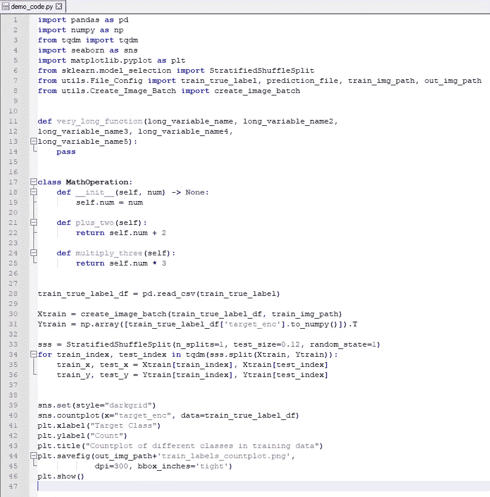
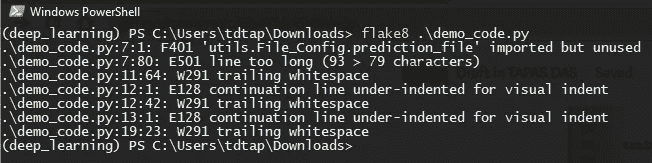
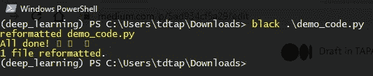
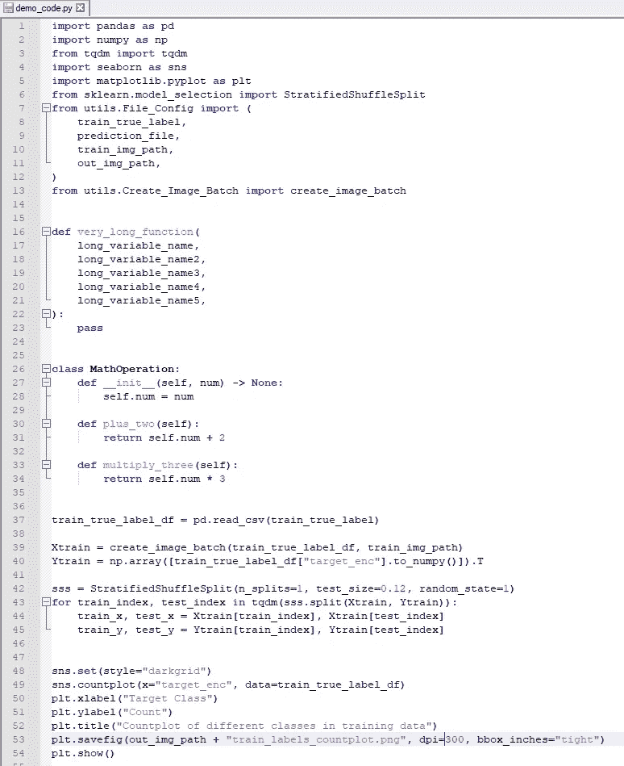
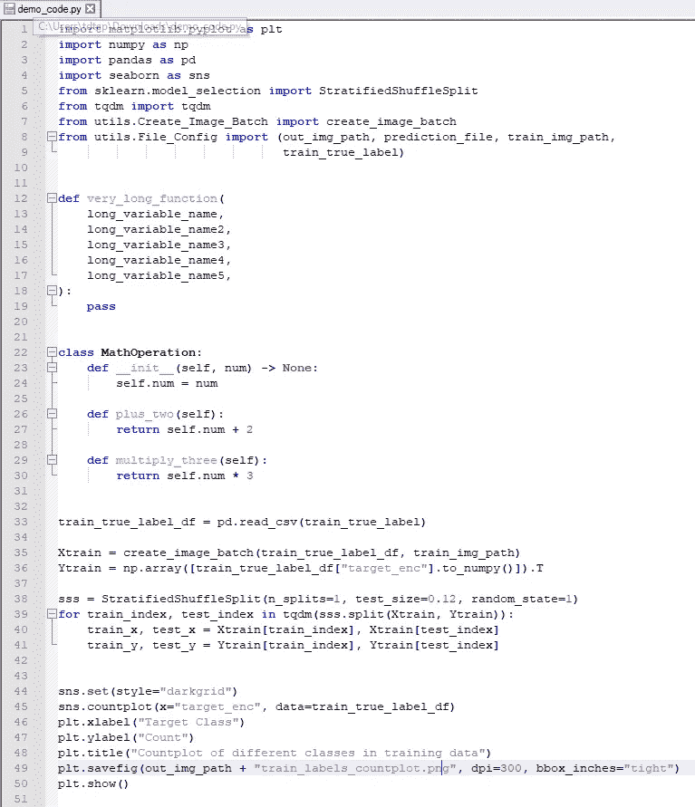
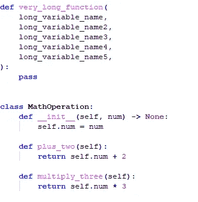
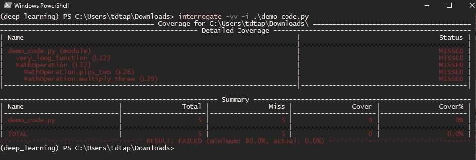
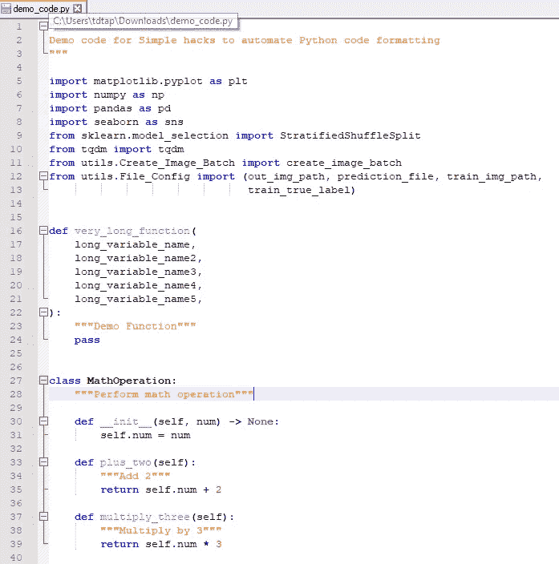
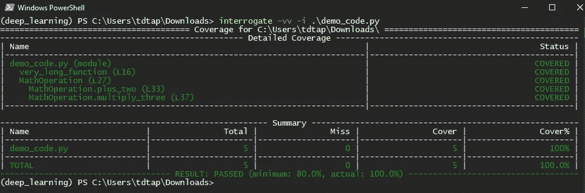

# 4 个 Python 包来美化和格式化你的代码库

> 原文：<https://betterprogramming.pub/simple-hacks-to-automate-python-code-beautification-5ad934cf5a29>

## 自动清理您的 Python 代码


[安德鲁·尼尔](https://unsplash.com/@andrewtneel?utm_source=medium&utm_medium=referral)在 [Unsplash](https://unsplash.com?utm_source=medium&utm_medium=referral) 上拍照

你曾经遇到过一段写得很差的 Python 代码吗？

我说的是一团乱麻，你不得不花上几个小时试图理解哪段代码去了哪里。

编写代码是开发人员角色的一部分。另一方面，编写漂亮整洁的 Python 代码完全是另一回事。这可能会成就或破坏你在分析或数据科学领域(甚至是软件开发领域)作为一名熟练程序员的形象。

那么我们该如何编写这个所谓漂亮的 Python 代码呢？

PEP8，有时拼写为 PEP 8 或 PEP-8，是由吉多·范·罗苏姆、巴里·华沙和尼克·科格兰在 2001 年编写的一个文档，它提供了关于如何编写 Python 代码的指南和最佳实践。PEP 8 的主要目的是提高 Python 代码的可读性和一致性。

> 正如吉多·范·罗苏姆所说，“**代码被阅读的次数比它被编写的次数多得多。**“你可能要花几分钟，或者一整天，写一段代码来处理用户认证。一旦你写了，你就不会再写了。但是你一定要再读一遍。这段代码可能仍然是您正在进行的项目的一部分。每次你回到那个文件，你都必须记住代码做了什么，为什么要写它，所以可读性很重要。

如果你感兴趣，PEP 8 可以在这里找到。

# 动机

作为开发人员，在编写 Python 代码时，您需要确保代码:

*   看起来不错
*   是有组织的
*   符合 PEP 8 风格指南
*   包括文档字符串

然而，每次编写代码时，手动检查所有这些标准可能会让人不知所措。如果您能在提交到版本控制系统之前自动检查和格式化您的代码，那不是很好吗？

让我们开始吧。

# **垃圾 Python 代码示例**

让我们从编写一个混乱的 Python 代码开始，它将违反所有 PEP 8 标准。



# **1。薄片 8**

我们将通过使用 [flake8](https://flake8.pycqa.org/en/latest/) Python 包，从检查 Python 代码的风格和质量开始。

要安装 flake8，请键入:

```
pip install flake8
```

下面是在我们的 Python 代码上运行 flake8 的输出。



正如我们所见，flake8 指出了以下错误类型。

1.  导入但未使用的库
2.  缩进和行太长错误，违反 PEP 8 风格指南

# 2.黑色

现在我们知道了错误是什么，让我们开始用一个[黑色](https://black.readthedocs.io/en/stable/) Python 包格式化代码。

要安装 black，请键入:

```
pip install black
```

下面是在我们的 Python 代码上运行 black 的输出。



瞧啊。代码自动格式化如下！



# 3.伊索特

下一步，让我们尝试按字母顺序对导入的库进行排序，并将它们分成不同的部分和类型，以获得更有组织的代码。

要安装`[isort](https://github.com/PyCQA/isort)`，请键入:

```
pip install isort
```

下面是在我们的 Python 代码上运行`isort`的输出。



酷！进口现在更有条理了。

# 4.审问

有时，我们可能会忘记为类和函数编写文档字符串，如下所示:



所以最后一步，我们可以运行[询问](https://interrogate.readthedocs.io/en/latest/index.html?highlight=pre-commit)来检查丢失的文档字符串，而不是手动查看我们所有的函数和类来查找丢失的文档字符串。

要安装询问，请键入:

```
pip install interrogate
```

下面是在我们的 Python 代码上运行 interrogate 的输出。



瞧啊。从终端输出中，我们知道哪些文件、类和函数没有 docstrings。

因为我们知道丢失的文档字符串的位置，所以添加它们很容易。



# 结论

恭喜你！您刚刚学习了如何在提交之前自动检查、编辑和美化您的 Python 代码。我希望这个博客能让你轻松地检查和格式化你的代码。