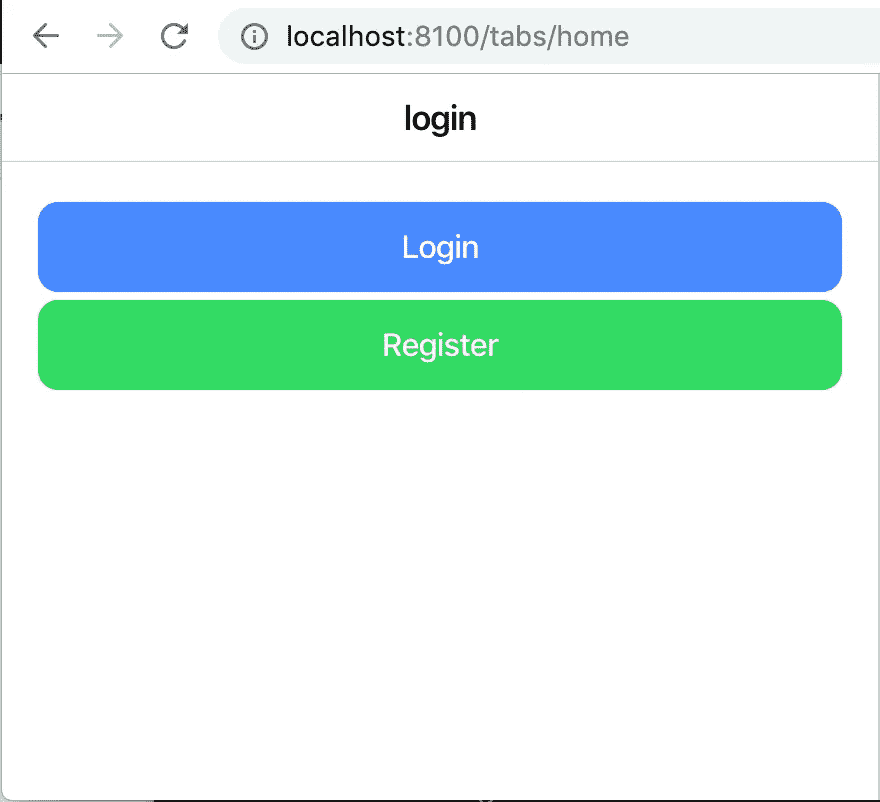
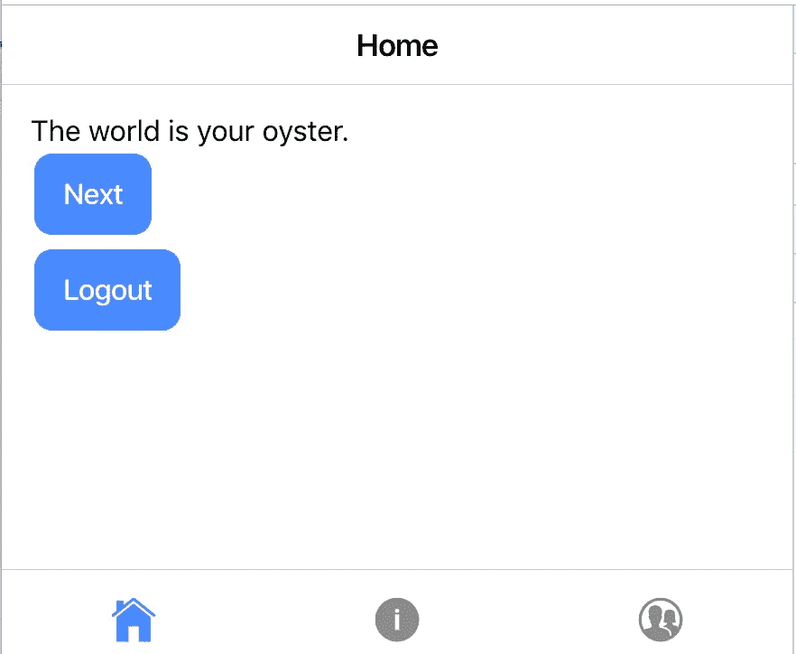

# Angular:带有子路线和受保护路线的简单离子标签应用程序

> 原文：<https://betterprogramming.pub/simple-ionic-tabs-app-with-child-routes-protected-routes-2a8c05e57c4b>

## 使用 Ionic Framework 版本 4 在基于选项卡的应用程序中保护路由和处理子路由

[公园巡警](https://unsplash.com/@parktroopers?utm_source=unsplash&utm_medium=referral&utm_content=creditCopyText)在 [Unsplash](https://unsplash.com/search/photos/kids?utm_source=unsplash&utm_medium=referral&utm_content=creditCopyText) 上拍照

我经常看到发布的关于 Ionic 应用的两个问题是:

1.  我如何处理认证(受保护的路由)和
2.  在 Ionic 中使用选项卡时，如何处理子路线？

因此，我将尝试提出一个简单的基本解决方案，用下面的代码解决这两个问题。我只包含了解决上面列出的问题所必需的代码片段，但是完整的源代码可以在[这里](https://github.com/aaronksaunders/ionicv4-tabs-with-detail)找到。

*此示例代码基于 Ionic Framework 的 v4。*

# 受保护的路线

要获得受保护的路由，您需要能够确定用户的登录状态。为了使事情尽可能简单，我们创建了一个`AuthenticationService`，它有一个将状态设置为真或假的方法，以及一个获取当前登录状态的方法。

接下来我们创建一个新的类，`AuthGuardService`，它实现了`[CanActivate](https://angular.io/api/router/CanActivate)`接口。

在这个例子中，我们所做的就是调用`AuthenticationService`来查看用户是否通过了身份验证。如果用户没有通过认证，那么我们将用户重定向到由路径`/login`定义的路由。我们通过构造一个`UrlTree`对象并返回它来实现，因为根据`[CanActivate](https://angular.io/api/router/CanActivate)` [文档](https://angular.io/api/router/CanActivate)，我们可以从函数中返回一个`boolean`、`Promise`或`UrlTree`。

现在我们有了告诉我们用户状态的`AuthenticationService`和在呈现路线之前用于检查的`AuthGuardService`，我们准备好更新`app-routing.module`。

见下文，我们将`AuthGuardService`添加到默认路线，这样当应用程序首次启动时，用户的身份验证状态将被验证。否则会重定向到`LoginPageModule`。

# 选项卡中的子路线

选项卡路由器模块在这里有一些魔力，可以处理默认路由，还可以正确处理子路由，以管理每个选项卡的导航堆栈。

呈现的第一个组件是`TabsPage`，但是如您所见，该页面有子模块。第一个是`HomePageModule`，会渲染`HomePage`。

1.在下面代码段的底部，我们展示了如何处理选项卡模块的默认路由，将它重定向到 home 选项卡。

在`home`路径下的第二个路由定义演示了如何处理选项卡的子路由，或者呈现一个细节页面。我们已经定义了路径`detail`，我们使用完整路径`/tabs/home/detail`来访问它。

2.这将加载`DetailPageModule`，它将依次加载`DetailPage`，因为它是`DetailPageModule`中的默认路线。

# 处理应用程序中的路线

## **登录**

为了登录到应用程序，我们在`login.page.ts`文件中包含了以下代码。应用程序将首先调用注入的`AuthenticationService`来设置登录状态，然后导航到应用程序的默认路径。

## **注销**

为了注销应用程序，我们在`home.page.ts`文件中包含了以下代码。应用首先调用注入的`AuthenticationService`来设置登录状态，然后导航到应用的登录路径。

## **详细页面**

为了从`HomePage`选项卡导航子根，我们在页面中包含了以下代码；使用`ion-button`

为了简洁起见，我没有在这篇文章中包括所有的源代码，但是 GitHub repo 在这里是。