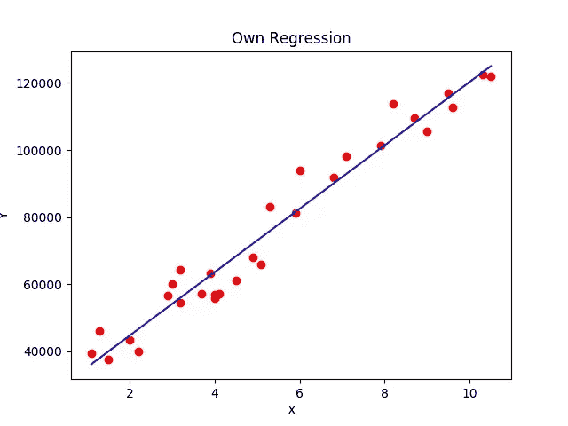

# 不使用 scikit-Learn 使用 Python 实现简单线性回归

> 原文：<https://betterprogramming.pub/simple-linear-regression-using-only-python-5c86af200bca>

## 使用基本库的分步教程

[本杰明·史密斯](https://unsplash.com/@ifbdesign?utm_source=unsplash&utm_medium=referral&utm_content=creditCopyText)在 [Unsplash](https://unsplash.com/search/photos/graph?utm_source=unsplash&utm_medium=referral&utm_content=creditCopyText) 上的照片

关于 Medium 的第一篇文章，我将解释如何在没有 scikit-learn 的情况下使用 Python 实现简单的线性回归。

在这个例子中，我使用了一些基本库，如 *pandas* 、 *numpy* 和 *matplotlib* 来分别获取数据集、求解方程和可视化数据。

您可以在 GitHub [存储库](https://github.com/vyashemang/Linear-Regression)中找到这个例子的数据集。

# 在代码上

让我们来看看下面的代码:

如你所见，我使用正确的方法创建了类`regression`，为了简单起见，我在`x`和`y`中使用了基本的样本数据。

类中的第一个方法求列表的幂和。如果你知道如何在纸上找到回归系数，这对你来说应该不是问题。

一旦我们得到总和，我们需要创建两个方程，因为我们使用的是最小二乘法。

为了解方程，我使用了 numpy 的`linalg.solve` 方法*。*我们返回一个常量，用于获取测试数据集中 x 的值。为了求解这个方程，这个方法将返回两个未知数的列表`*y = a * x + b*`中的`a`和`b`。

使用`predict`方法将创建一个名为 *y_pred* 的列表，其中列出了作为测试通过的值的预测值。

最后，`main`方法应用了我使用过的所有方法并绘制了图表。红色点显示实际值，而蓝色线显示预测值。

线性回归的可视化

# 结论

我希望你喜欢这首曲子。如果您有任何问题或意见，请在下面留下！

感谢您的阅读！

此外，请查看我关于[推荐系统](https://hackernoon.com/popularity-based-song-recommendation-system-without-any-library-in-python-12a4fbfd825e?source=---------4------------------)和[部署机器学习模型](https://towardsdatascience.com/deploy-a-machine-learning-model-using-flask-da580f84e60c)的其他文章。