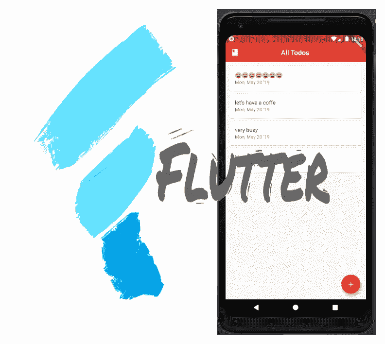
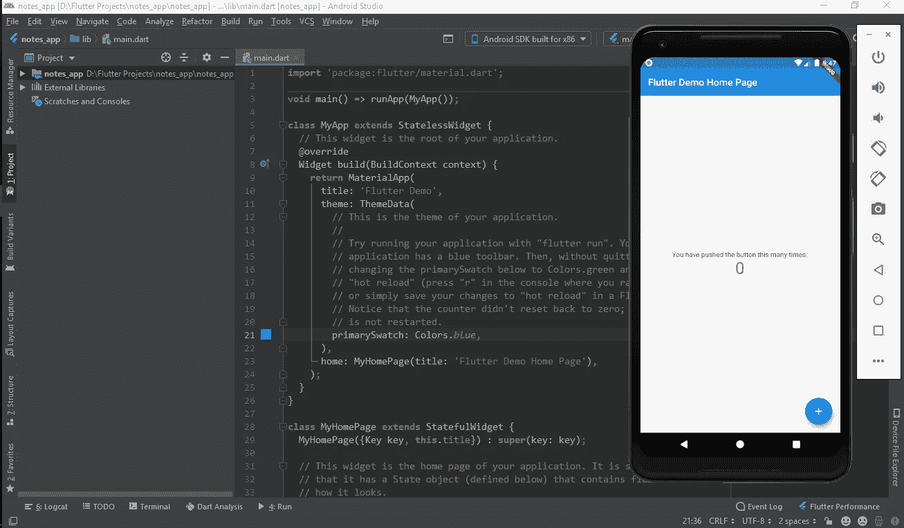
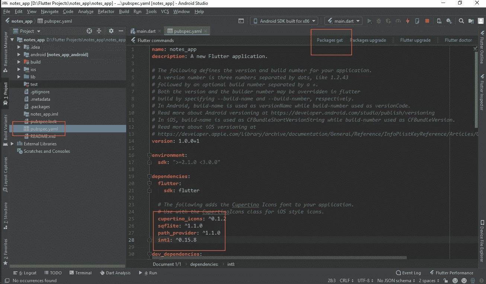
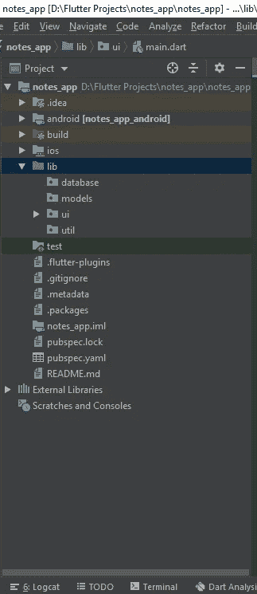

# 一个简单的带 Flutter 的笔记应用程序—第 1 部分

> 原文：<https://betterprogramming.pub/simple-notes-app-with-flutter-part-1-ab66e15c8635>

## 是时候用 sqflite 数据库创建一个 Flutter 应用程序了



T2 是一个流行的创建应用程序的框架。我每天都在探索 Flutter，因为它有很多小部件和很多东西需要学习。

因此，当我们谈论生产性应用时，我们总是在其中有一些本地存储。

在 Flutter 中，我们有三种类型的本地存储:

1.  读取/写入文本文件。
2.  SharedPreferences。
3.  [sqflite](https://pub.dev/packages/sqflite) 。

与 1 . 0 相比，Sqflite 稍微复杂一点。第二。，所以我们要把重点放在 sqflite 的实现上。

在此的帮助下，我们将创建一个简单的笔记应用程序，当然，在我们学习的过程中，你会学到很多不同的东西。

让我们直接进入它。

如果你是 Flutter 新手，建议你去[这个](https://flutter.dev/docs/get-started/install)链接，按照说明操作。一旦你完成了，你就可以设置环境和开发 SDK，然后你就可以加入我了。

# 入门指南

我在 Android Studio 中开发这个应用程序，因为它很容易，它可以帮助我根据 Flutter 的需求设置一切。我对此很满意，但是如果你对 Android Studio 不满意，你可以使用你选择的编辑器。

以下是目前支持 Flutter 的编辑器:

*   [安卓工作室](https://developer.android.com/studio)，3.0 版本或更高版本。
*   [IntelliJ IDEA 社区](https://www.jetbrains.com/idea/download/)，2017.1 或更高版本。
*   [IntelliJ IDEA Ultimate](https://www.jetbrains.com/idea/download/) ，2017.1 或更高版本。
*   [VS 代码](https://code.visualstudio.com/)，最新稳定版本。

首先，您的项目在创建后会是这样的。运行您的项目以确保一切都完美运行。



删除一切，我们从零开始。

你的代码应该和我的一样:

```
**import** 'package:flutter/material.dart';

**void** main() {
  runApp(MaterialApp(
    title: "Notes App",
    home: NotesList(),
  ));
}

**class** NotesList **extends** StatefulWidget {
  @override
  _NotesListState createState() => _NotesListState();
}

**class** _NotesListState **extends** State<NotesList> {
  @override
  Widget build(BuildContext context) {
    **return** Container();
  }
}
```

现在，是时候添加一些插件了。

在这个应用程序中，我们将有以下插件:

1.  [Sqflite 插件](https://pub.dev/packages/sqflite#-installing-tab-)
2.  [路径提供者](https://pub.dev/packages/path_provider#-installing-tab-)
3.  [国际](https://pub.dev/packages/intl#-installing-tab-)

将这些插件添加到项目文件夹下的`pubspec.yaml`文件中，然后点击*获得*包。

您可能在完成所有包后收到此消息(忽略时间，它将根据您的互联网连接获得这些包):

```
Running “flutter packages get” in notes_app… 4.7s
Process finished with exit code 0
```



现在，您已经具备了制作一个成熟的笔记应用程序的所有条件。

在`lib`文件夹下创建一些包，这对于专业开发人员来说是一个好习惯。



难怪，我刚把我的`main.dart`搬进 UI 包。

# **模型类**

让我们创建一个模型来帮助我们做笔记。

在你的模型包中，右键点击*模型包* > *新建* > *镖文件*并将其命名为*注意。*

你的`Class`应该是这样的:

```
**class** Note {
  String _text, _date; //our note contain text,create date and an Id
  int _id;

  Note.update(**this**._text, **this**._date, **this**._id);

  Note(**this**._text, **this**._date);

  Note.map(**dynamic** obj) {
    **this**._text = obj['name'];
    **this**._date = obj['date'];
    **this**._id = obj['id'];
  } 

  Note.fromMap(Map<String, **dynamic**> map) {
    **this**._text = map['name'];
    **this**._id = map['id'];
    **this**._date = map['date'];
  }

  Map<String, **dynamic**> toMap() {
    Map<String, **dynamic**> map = **new** Map<String, **dynamic**>();

    map['name'] = **this**._text;
    map['date'] = **this**._date;

    **if** (id != **null**) map['id'] = **this**._id;

    **return** map;
  }

  **get** name => _text;

  **set** name(value) {
    _text = value;
  }

  **get** date => _date;

  **set** date(value) {
    _date = value;
  }

  int **get** id => _id;

  **set** id(int value) {
    _id = value;
  }
}
```

不要担心所有的方法，随着我们的深入，我会定义所有的方法。因为，实施之后，你会对我们这里做了什么有一个清晰的概念。

# **实用程序类**

按照上面讨论的相同步骤，在 util 包中制作一个`class`，命名为`Constants`。

这将有助于我们不要反复编写相同的变量。因此，在您的项目中添加这些类型的类是一个很好的实践。

```
**class** Constants {
  **static final** String *TABLE_NAME* = "noteTable";
  **static final** String *COLUM_TEXT* = "text";
  **static final** String *COLUM_DATE* = "date";
  **static final** String *COLUM_ID* = "id";
  **static final** int *DB_VERSION* = 1;
  **static final** String *DBNAME* = "notes.db";
}
```

*   `TABLE_NAME`:我们数据库的名称。
*   `COLUMN_TEXT`:注释文本栏。
*   `COLUMN_DATE`:票据创建日期。
*   `COLUMN_ID`:数据库中特定行的 ID。
*   `DB_VERSION`:数据库版本。
*   `BDNAME`:我们数据库的名称。

# **数据库助手实现**

现在，让我告诉你一些关于 sqflite 的事情。

Sqflite 使用单例模式。如果我们用一种简单的方式定义什么是单例，记住单例类可能不需要一次又一次地实例化。

你只有一个实例，你是好的。

导航到你的项目面板，右键点击*数据库包* > *新建* > *Dart 文件*，命名为`database_helper`，点击回车。

创建一个名为`DatabaseHelper`的类，并导入一些库和变量。

```
**import** 'dart:async';
**import** 'dart:io';
**import** 'package:sqflite/sqflite.dart';
**import** 'package:path_provider/path_provider.dart';
**import** 'package:path/path.dart';
**import** 'package:todo_app/utils/constants.dart';
**import** 'package:todo_app/models/note.dart';class DatabaseHelper{**static final** DatabaseHelper *_INSTANCE* = **new** DatabaseHelper.make();

**factory** DatabaseHelper() => *_INSTANCE*;

**static** Database *_db*;

DatabaseHelper.make();}
```

*   `_INSTANCE`:将用于实例化我们的数据库助手一次。
*   `factory`:构造函数用于返回`databasehelper`的实例。
*   `DatabaseHelper.make()`:是一个命名的构造函数，用来制作我们的类对象。
*   是我们实际的数据库，我们将一直与它进行交互。

重要事项:

Flutter 中的数据库执行发生在后台线程中，因为 Flutter 是一个单线程的 UI 框架，所以它有`async`、`await`和`Future`关键字来使事情在后台工作。

让我们初始化我们的数据库。

```
Future<Database> **get** db **async** {
  **if** (*_db* != **null**) **return** *_db*; 
  *_db* = **await** initDB();
  **return** *_db*;
}
------------------------------------------------------------------
initDB() **async** {
  Directory directory = **await** getApplicationDocumentsDirectory();
  String path = join(directory.path, Constants.*DBNAME*);
  **var** myDb =
      openDatabase(path, version: Constants.*DB_VERSION*, onCreate: _onCreate);

  **return** myDb;
}
```

第一个方法是 get 方法，它将返回我们实际的数据库。

现在，我知道你想知道`initDB()`是什么，它是一个帮助返回我们创建的数据库的方法。

看，每个方法都有`async`和`await`关键字，因为 sqflite 中的每个操作都是由 flutter 在后台执行的...那确实是一个美人！

# **_onCreate 方法**

这个方法有一些 SQL 的东西，比如`CREATE TABLE`，用它可以创建一个表来存储我们的笔记。

```
**void** _onCreate(Database db, int version) **async** {
  **await** db.execute(
      "CREATE TABLE ${Constants.*TABLE_NAME*} (${Constants.*COLUM_ID*} INTEGER PRIMARY KEY, "
      "${Constants.*COLUM_TEXT*} TEXT, ${Constants.*COLUM_DATE*} TEXT );");
}
```

插入注释的方法:

```
Future<int> insertNote(Note note) **async** {
  **var** dbClient = **await** db;
  int count = **await** dbClient.insert(Constants.*TABLE_NAME*, note.toMap());

  **return** count;
}
```

*   `insertNote` 方法将一个注释对象作为参数，并将其插入数据库。它将在后台发生，现在你意识到了这一点。
*   `dbClient`:是我们的数据库变量。
*   `count`:在数据库中插入值后，它将返回一个整数，该整数实际上是存储数据的特定行的 ID。我们稍后将使用它从数据库中获取单个注释。

现在是时候定义我们之前在`note.dart`中创建的`toMap()`了，还记得吗？

```
Map<String, **dynamic**> toMap() {
  Map<String, **dynamic**> map = **new** Map<String, **dynamic**>();

  map['name'] = **this**._text;
  map['date'] = **this**._date;

  **if** (id != **null**) map['id'] = **this**._id;

  **return** map;
}
```

Sqflite 以键值对格式保存所有内容。因此，默认情况下，它将`Map<String,dynamic>`对象作为参数在数据库中插入值，因此`toMap()`将为您完成这项工作。它会把你的对象转换成`Map`。

`Map<String,dynamic>`字符串是一个键，它将帮助 Flutter 理解哪个值对应于哪个键。

Dynamic 是一个非常强大和有利的关键字，您可以在`Map`中传递任何值，因为它可以是整数、字符串、布尔、双精度等。这就是颤动的美妙之处。

现在是从数据库中获取所有注释的时候了。

对此我们有办法。

```
Future<List> getAllNotes() **async** {
  **var** dbClient = **await** db;
  **var** result = **await** dbClient.rawQuery(
      "SELECT * FROM ${Constants.*TABLE_NAME*} ORDER BY ${Constants.*COLUM_TEXT*} ASC");

  **return** result.toList();
}
```

我们将从数据库中获取所有数据，放在一个列表`Maps`中。

记住数据库中的所有东西都存储为一个`Map`？因此，它将返回一个地图列表。稍后我们将从中提取数据。现在，就加上这个。

第一部分到此为止，下一部分再见。

觉得这篇文章有用？跟着我 [Mustufa Ansari](https://medium.com/u/8ee4abb8abb8?source=post_page-----ab66e15c8635--------------------------------) 上媒。看看下面我读得最多的文章。

*   [Android recycler 用漂亮的动画观看](https://medium.com/better-programming/animated-fab-button-with-more-options-2dcf7118fff6)
*   [有更多选项的动画浮动动作按钮！](https://medium.com/better-programming/animated-fab-button-with-more-options-2dcf7118fff6)
*   [AndroidX 是什么？](https://medium.com/better-programming/what-is-androidx-1b8c9832af43)