# 用 Node.js 和 Mongoose 构建一个简单的 Notes 应用程序

> 原文：<https://betterprogramming.pub/simple-notes-app-with-node-js-and-mongoosejs-6595cd5d15b>

## 一个简单的项目来磨练你的编程技能


迈克尔·多莱杰斯在 [Unsplash](https://unsplash.com/?utm_source=unsplash&utm_medium=referral&utm_content=creditCopyText) 上拍摄的照片

摆脱教程并开始编写我们自己的软件的最好方法之一是创建一个简单的项目来提高我们的编程技能并修改我们所学的内容。

在本文中，我们将构建一个小的 web 应用程序，您可以在其中存储笔记。

我们的应用程序中的注释列表将由两部分组成:标题和描述。这将是我们最终的结果:

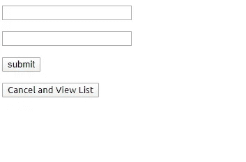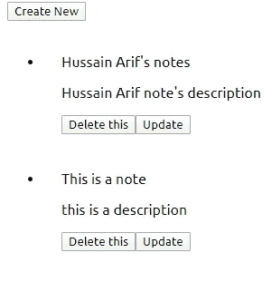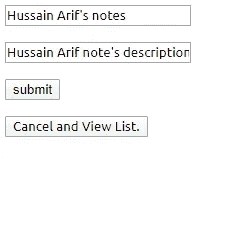

从左到右:创建注释的页面、查看注释的页面和更新注释的页面

让我们开始吧！

# 入门指南

只需安装:

*   `express`处理路由的模块
*   `mongoose`数据库集成模块
*   `body-parser`处理我们收到的数据将如何处理
*   最后，`pug`作为我们的视图引擎，它将充当我们的前端

```
npm install express
npm install mongoose
npm install body-parser
npm install pug
```

现在让我们为我们的应用程序实现一个数据库。

# 创建数据库

## database.js

我们需要一个存储系统来存放我们的笔记，这样即使项目结束，它们也可以保存下来。为了添加持久存储，我们将使用数据库。

我们将使用文件`database.js`连接到数据库，创建一个集合，并将我们的集合命名为`Notes`。

创建一个名为`database.js`的文件，并编写以下代码:

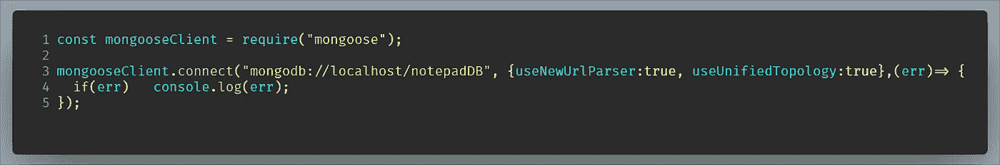

连接到数据库的代码

*   `Line 1`:导入`mongoose`库
*   告诉 Mongoose 连接到我们的数据库。如果出现任何错误，那么它们应该被注销。

现在我们需要为我们的笔记创建一个模式。在`database.js`中，添加下面这段代码:

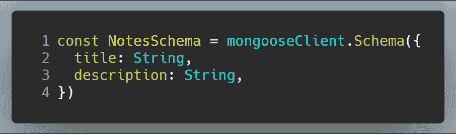

使用模式的代码

我们为我们的笔记创建了一个模式，`NotesSchema`。如代码所示，使用该模式的文档将有两个字段:

*   类型为`String`的`title`字段
*   类型为`String`的`description`字段

现在让我们创建一个名为`Notes`的集合，它将使用`NotesSchema`。

最后，在`database.js`中，编写这段代码:

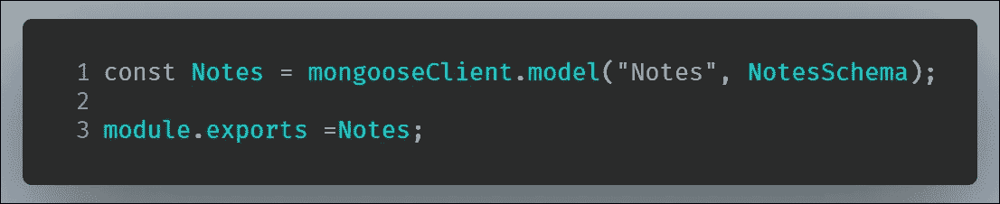

创建一个收藏，然后将其导出

*   第 3 行:在我们的`Notes`模型上使用`module.exports`，这样我们就可以在代码中使用这个集合。

最后，`database.js`应该是这样的:

现在让我们进入应用程序的第二部分，`update-router.js`。

# 用于更新文档的中间件

## 更新-router.js

每当用户导航到以`updatepage`开头的目录时，该文件将处理路由。正如路径所示，这里用户将更新他各自的笔记。

该文件将执行以下操作

*   使用`express.Router()`中间件将`id`数据发送到路径`updatepage`和`updatepage:/__id`
*   这个`__id`字段将是必需的，这样数据库可以选择具有指定 ID 的票据，这将是更新目的所需要的

让我们首先创建一个`express.Router()`的实例，并创建一个临时变量`id`，来存储不同路由的 ID。

在`update-router.js`中，编写以下代码:

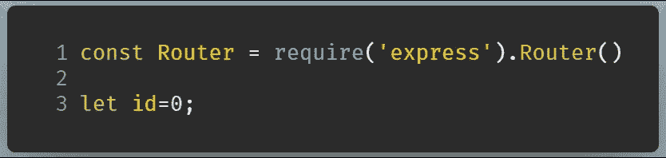

路由器和“id”变量的初始化

*   第 1 行:创建一个快速路由器实例。

由于这个文件是中间件，我们可以向`request`对象添加属性。

让我们对以`/:__id`结尾的路线执行一个`GET`请求，然后将`req.id`属性赋给路线的`__id`参数:

接下来，在`update-router.js`中，编写以下代码:

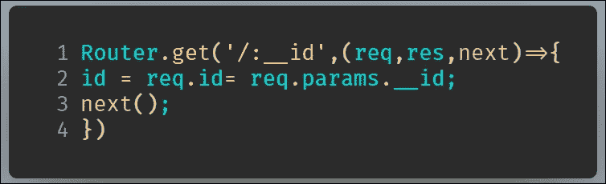

路由器中的“GET”请求

*   第 1 行:处理对`/:_id`路径的`GET`请求。
*   第 2 行:`id`变量被赋予了`req.id`属性。换句话说，URL 中的`__id`参数现在存储在这个`id`变量中。

注意临时变量`id`也被赋予了相同的值。我们这样做是因为`req.id`属性不会在不同的路径中保持不变。

接下来，在`update-router.js`中，编写下面这段代码:

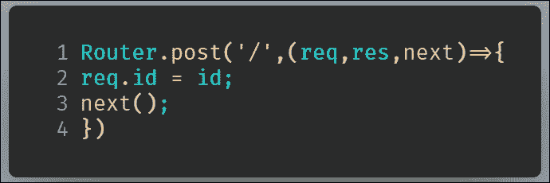

“过帐”请求

*   第 1 行:现在对以`/`结束的路线执行一个`POST`请求。
*   第 3 行:使用`next`函数继续下一个请求。

现在，`req.id`属性在`updatepage/`和`updatepage/:__id`中都是持久的。

最后，使用`module.exports`导出`Router`对象，这样它就可以在其他文件中使用。

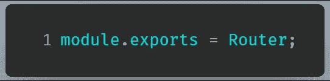

导出路由器

最终，`update-router.js`会是这样的:

# 主 JavaScript 文件

## 主页. js

这个文件`main.js`将处理以下内容:

*   我们的路线
*   所有 CRUD 操作
*   处理客户端发送的传入数据
*   向前端发送数据

## HTML 文件

对于我们的前端，我们将创建以下文件。

*   `notes-add`:用于添加我们的注释。这将是我们的主页。
*   `view`:查看我们创建的笔记
*   `updatepage`:用于更新我们选择的便笺

## 导入库

假设已经安装了所有模块，让我们使用`require`在您的代码中使用它们的功能，并使用我们刚刚导出的`Notes`集合。

在`main.js`中，编写以下代码:

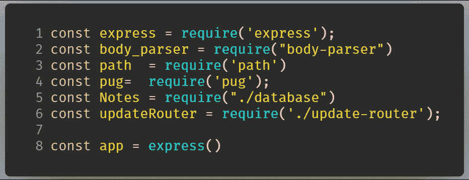

我们需要的模块

## 配置和中间件

现在我们需要配置 Express 的视图引擎，并使用中间件来处理数据。在`main.js`中，编写以下代码:

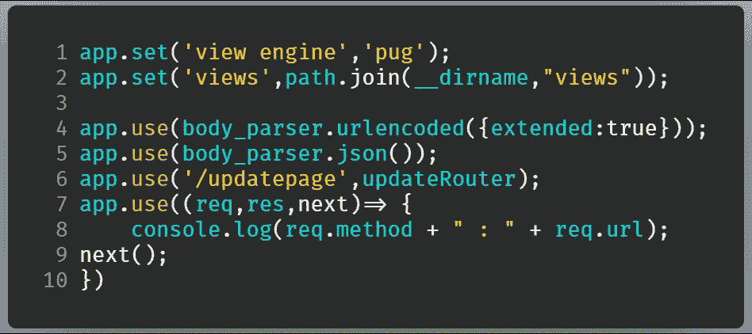

中间件的配置和使用

*   **第 1-2 行:**将前端的视图引擎设置为`pug`，然后指定我们的`pug`文件将保存在哪个文件夹中。在这种情况下，文件将保存在`views`文件夹中。
*   **第 4 行:**使用`body-parser`模块解析传入的数据。`urlencoded()`方法意味着模块将解析来自简单 HTML 表单的数据。
*   **第 6 行:**每当用户导航到以`/updatepage`开头的目录时，使用`updateRouter`中间件来处理路由
*   **第 7-10 行:**查看用户已经导航到的目录以及执行了什么类型的 HTTP 请求(例如`GET`、`POST`等)。)在我们的服务器端终端中

## 创建笔记

每当用户导航到我们的主页，他执行一个`GET`请求。因此，如果用户导航到主页，我们希望呈现一个名为`notes-add.pug`的`pug`文件。

在`main.js`中，编写以下代码:

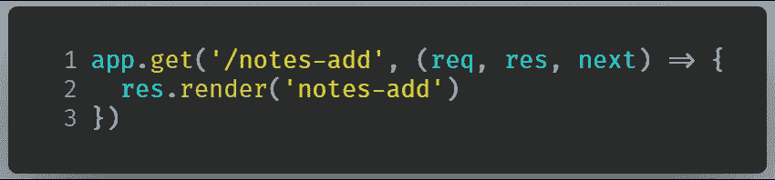

主页的“获取”请求

*   第 1 行:处理对`/notes-add`目录的 GET 请求。
*   第 2 行:渲染`notes-add.pug`文件。

这个页面将由一个简单的 HTML 表单组成。

在`notes-add.pug`中，每当提交一个表单时，就会执行一个`POST`请求。

为了处理这个`POST`请求，在`main.js`中编写以下代码:

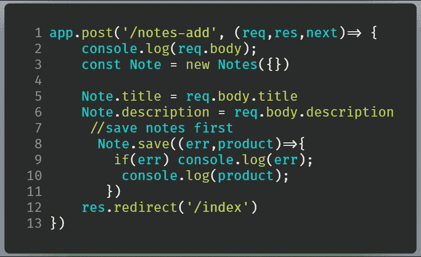

处理“发布”请求

*   **第 5-6 行:**将字段分配给表单将返回的各自的`req.body` 属性
*   **第 8-10 行:**将文档保存到数据库，并输出文档
*   **第 12 行:**操作完成后，重定向到`/index`，查看我们的文档

最后，`main.js`应该是这样的:

现在已经完成了，我们只需要创建一个名为`notes-add.pug`的文件。这将是我们的前端。`notes-add.pug`的代码如下:

这只是一个简单的 HTML 表单。当按下`submit`按钮时，执行路径`/notes-add`的`POST`请求。

通过键入以下命令尝试运行代码:

```
node main
```

转到`localhost:3000/notes-add`。在表单中键入任何内容，然后按回车键。您可能会在下一页遇到错误。但是，在终端窗口中，输出可能如下所示:

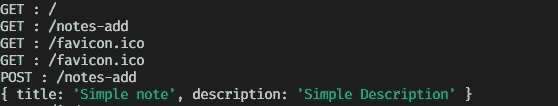

代码输出

现在我们已经添加了我们的笔记，我们想要真正地阅读它们。

## 查找/阅读我们的笔记

如上所述，`/index`路径将帮助我们查看笔记。如果客户端只从这个路径接收数据，我们应该处理哪种 HTTP 请求？

这次我们将处理的请求类型是一个`GET`请求，因为我们只获取数据。

在`main.js`中，编写下面这段代码:

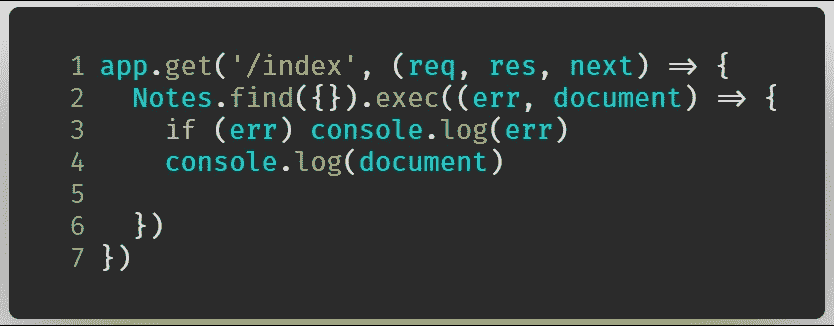

用于处理/索引“GET”请求的代码

*   第 1 行:处理对`/index`路径的`GET`请求。
*   第 2-6 行:我们在数据库中运行一个查询。由于`query`参数为空，这表示我们希望所有的文档都出现在数据库中。
*   **第 4 行:**打印出符合查询条件的文档

现在要运行这段代码，请转到`localhost:3000/index`。控制台中的输出可能如下所示:

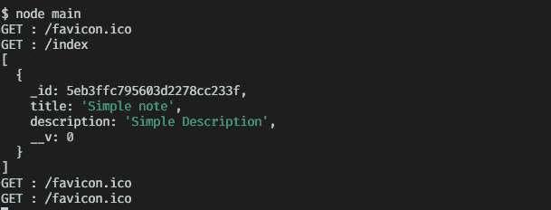

代码的输出

为了构建这个路径的前端，我们需要在一个名为`view.pug`的文件中渲染它。

`view.pug`的代码如下:

最终，我们现在需要修改我们的`GET`请求。在`main.js`中，编写以下代码:

*   第 1 行:处理`/index` GET 请求。
*   第 2 行:告诉 Mongoose 列出`Notes`集合中的所有文档。
*   **第 7 行:**渲染`view.pug`文件，将返回的文档发送到前端(`view.pug`)以便渲染。

现在转到`localhost:3000/index`。输出:


/索引页的前端

客户想要删除一个便笺。现在让我们实现删除功能。

## 删除注释

看一下`view.pug`文件。我们可以这样做:

*   每当用户点击删除按钮时，用户被重定向到一个`/delete`路径，文档的`id`作为一个参数被发送
*   我们可以使用这个`id`字段来识别文档，然后删除它

让我们对`/delete`路径执行一个`GET`请求:

*   `Line 1`:处理对`/delete/:_id`路径的`GET`请求。
*   **第 2 行:**执行一个查询，查找参数中有`id`的文档。一旦找到这份文件。将其从`Notes`收藏中移除。
*   **第 6 行:**将用户重定向到`/index`路径，这将允许他们在操作完成后查看他们所有的文档

转至`localhost:3000/index`，然后按下删除按钮。

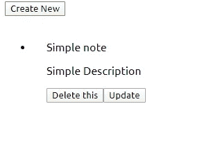

从左到右:单击删除之前和单击删除之后

注意，我们在数据库中有一个文档。删除后，不会留下任何文档。

这是终端中的输出:

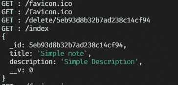

终端中的输出

现在，客户不是删除，而是想纠正笔记中的打字错误。现在让我们在应用程序中实现编辑。

## 更新/编辑我们的笔记

在`view.pug`文件内:

*   注意，当用户点击更新按钮时，应用程序将用户重定向到参数中带有`id`的`/updatepage`目录

我们可以这样做:

*   对`/updatepage`目录执行一个`GET`请求，并获取参数中的`id`字段
*   找到带有给定`id`的文档，并将其发送到一个单独的页面`updatepage.pug`，用于更新目的

在`main.js`中，编写以下代码:

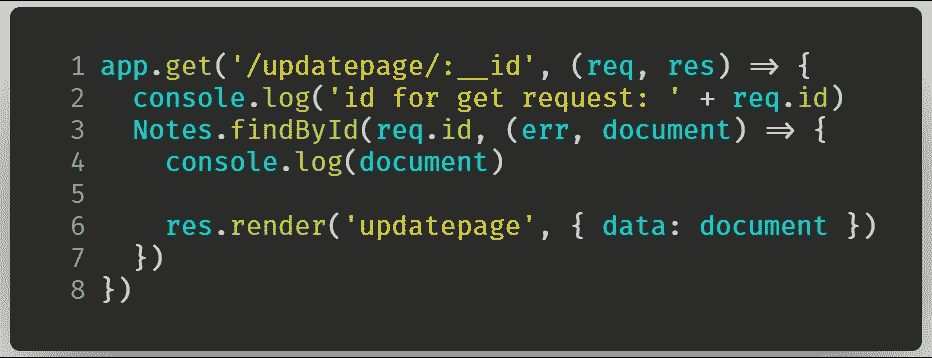

对“更新页面”执行“获取”请求

*   **线 1** :处理`/updatepage/:_id`路径的`GET`请求。
*   **第 3 行**:执行查询，获取相关`id`的票据。
*   **第 6 行:**将这个返回的文档发送到`updatepage.pug`文件

记得我们在`main.js`文件的开头构建了一个中间件，它将把`req.id`属性分配给 URL 中的`id`参数。

转到`localhost:3000/index`，点击更新按钮。

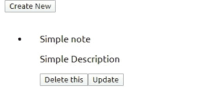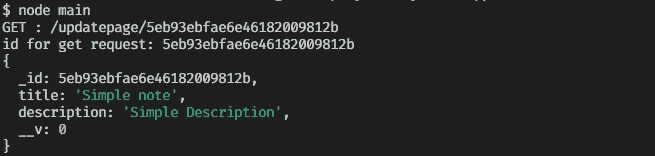

按下更新按钮(左)会在终端(右)中给出以下输出

`updatepage.pug`的代码是这样的:

*   **第 4 行和第 6 行:**将相应的输入值设置到`title`和`description`

提交按钮会将用户重定向到`/updatepage`，它还会执行一个`POST`请求。

让我们来处理`POST`请求:

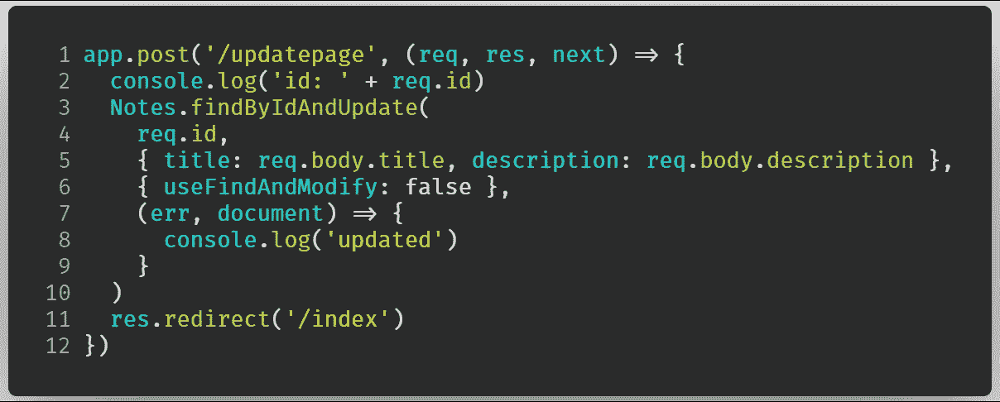

处理“POST”请求

*   **第 1 行**:处理对`/updatepage` URL 的`POST`请求。
*   **第 3-7 行:**执行查询以找到具有特定`id`的文档。分别更新`title`和`description`字段。
*   **第 11 行:**重定向到`/index`目录

现在按下更新按钮，它将渲染`updatepage`。代码的输出是这样的:

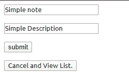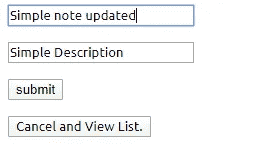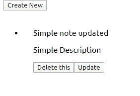

按下更新按钮(左)，然后更新(中)。最后，结果(右)。

最终，处理`POST`和`GET`请求的代码如下:

# 资源

## 密码

[项目的 GitHub 库](https://github.com/HussainArif12/SimpleNoteList/tree/master)

## 其他资源/刷新者

*   [快速路由](https://medium.com/better-programming/express-js-routing-1b48f459d43a)
*   [Express 中的中间件](https://medium.com/javascript-in-plain-english/express-js-middleware-ddcc79d98dc9)
*   [使用 Express 作为网络服务器](https://medium.com/easyread/introduction-to-express-js-246191ec05f2)
*   [使用 Mongoose 和 Node.js](https://medium.com/better-programming/how-to-use-mongoose-with-node-js-913a8073b29c)

# 结论

在下一篇文章中，我们将开始 React 库的学习之旅。

我们已经成功构建了一个具有所有 CRUD 功能的 notes 应用程序。代码一开始可能看起来很复杂；然而，只有当你自己编写代码时，学习才有可能。你将通过做而不是看来学习。

我真的希望你从上面的代码中学到了很多。

呆在家里。注意安全。