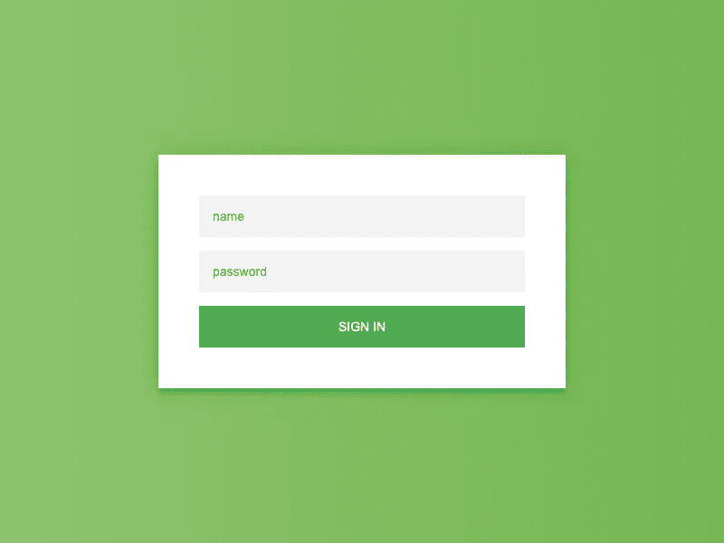
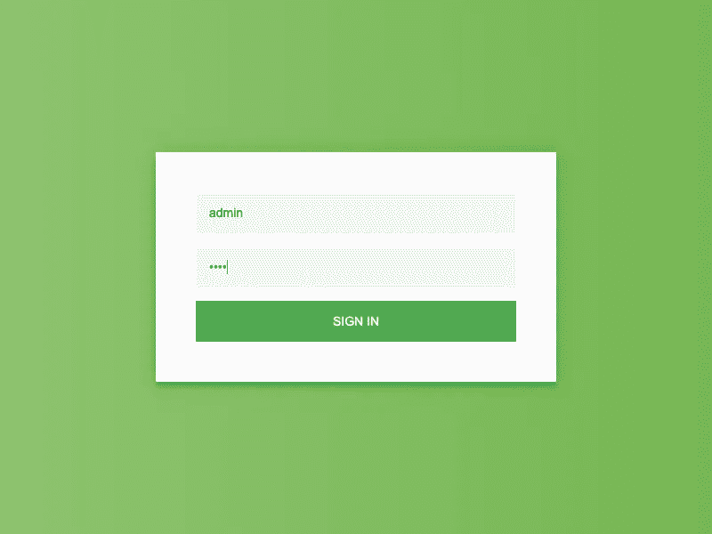
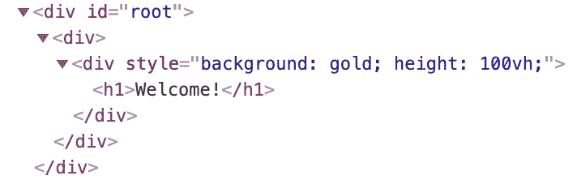

# 使用木偶师进行简单的 React 应用程序测试

> 原文：<https://betterprogramming.pub/simple-react-app-testing-with-puppeteer-979fe882fb80>

## 如何使用这个强大的工具来测试你的应用


[巴德·海利森](https://unsplash.com/@budhelisson?utm_source=medium&utm_medium=referral)在 [Unsplash](https://unsplash.com?utm_source=medium&utm_medium=referral) 上的照片

几年前，引入了一个新的 Node.js 库，它与一个无头 Chrome 一起工作，并为我们提供了一种通过 [DevTool 协议](https://chromedevtools.github.io/devtools-protocol/)以各种方式操纵 DOM 或测试元素的方法。人们对此感到兴奋，因为他们被告知可以在基于 Node.js 的环境中运行 Chrome。

我创建了一个非常简单的 React 应用程序来测试木偶师。该测试旨在检查在填写所有必填字段后，登录过程是否正常工作。你可以从 GitHub 克隆这个项目。

# 先决条件

这篇文章假设你已经知道什么是反应，笑话和木偶师。该项目使用每个库中的最小因子。如果您对它们的背景知识一无所知，我建议您首先阅读它们的文档(可以在本文末尾的参考资料部分找到)。

# 项目设置

我首先克隆了这个 GitHub 库。

```
> git clone [https://github.com/moonformeli/react-jest-puppeteer](https://github.com/moonformeli/react-jest-puppeteer)
```

有两个分支，`master`和`puppeteer`。

```
> git checkout puppeteer
> npm install
> npm start server
```

每当代码改变时，我就使用`webpack-dev-server`包来重新加载页面。以下是我在项目中使用的一些东西:

*   **React** :由脸书管理的用户界面 JavaScript 库。这是最流行和最强大的前端开发库之一。
*   **Webpack** :捆绑 JavaScript 文件或 CSS 文件的模块捆绑器。你需要这个来使用 React。
*   **Babel**:JavaScript 编译器，将 ECMAScript 2015+代码转换成旧版浏览器中 JavaScript 的向后兼容版本。这也将 JSX 和 React 文件编译成纯 JavaScript 代码。
*   Jest :由脸书管理的 JavaScript 测试框架。这是目前最热门的测试框架。React 对 Jest 也很有效。
*   一个 Node.js 库，通过 DevTool 协议控制 Chrome。它可以用于测试或爬行。

启动服务器后，您将看到这个屏幕。



简单的登录表单

有两个输入标签和一个按钮标签要提交。

# 使用木偶师填写用户信息

木偶师给了我们很多命名清晰的方法。我们需要做的第一件事是转到页面。

```
> mkdir __tests__
> touch __tests__/login.spec.js
```

`[beforeEach](https://jestjs.io/docs/en/api#beforeeachfn-timeout)`允许你在文件中的每个测试之前运行一个函数。当您想要在每个测试开始时调用相同的函数时，这非常有用。

`[goto](https://github.com/GoogleChrome/puppeteer/blob/master/docs/api.md#pagegotourl-options)`是一个操纵方法，用于将当前页面导航到您传递给函数的某个位置。确保在执行测试文件之前运行`npm run server`，因为一旦服务器启动`localhost:8080`就可用。

`[type](https://github.com/GoogleChrome/puppeteer/blob/master/docs/api.md#pagetypeselector-text-options)`需要三个参数。第一个和第二个参数是必需的。您必须将 DOM 的查询选择器传递给带有值的函数，该值是您想要放入 DOM 的第二个参数。必须是字符串。

需要记住的一点是**`type`并不清除 DOM 中的现有值。它将新值附加到现有值上。如果您想删除输入中存储的值，请执行以下操作。**

**`[evaluate](https://github.com/GoogleChrome/puppeteer/blob/master/docs/api.md#pageevaluatepagefunction-args)`允许您访问`document`对象。还记得木偶师是 Node.js 库吗？是的，没错。你不能用正常的方式接触到`window`物体。另一方面，对于这种情况来说,`evaluate`是一个非常特殊的方法。你可以在其中使用浏览器 API。如果你想从浏览器中得到某个值，你可以返回这个值。**

```
const num = await page.evaluate(() => {
  return 1;
});console.log(num); // 1
```

**现在，让我们检查一下截图，以确保用户信息填写正确。**

****

**太好了！**

# **ID 和 PW 的安全性呢？**

**这是一个非常好的问题。你不会想向外界透露个人信息。我已经将 ID 和 PW 放在示例的测试文件中，但是您可以安装一个特定的包来帮助您保护这些信息。**

```
> npm i -D dotenv
```

**Dotenv 是一个轻便的库，可以让你在`process.env`中存储任何数据。一旦安装了这个库，就在根文件夹中创建文件。**

```
> touch .env
```

**并在`.env`中设置任意数据，例如:**

```
BUNDLER=webpack
BROWSER=chrome
```

**然后，要将这些变量设置到`process.env`中，您需要做的就是在 JavaScript 文件的顶部运行下面的代码。**

```
// You're all set
// BUNDLER and BROWSER will be stored in process.env
require('dotenv').config();
```

**这是一个简单的`dotenv`的例子。**

**你可以用这个库做什么，`dotenv`，是这样的:**

```
// .env
ID=admin
PW=1234...// login.spec.js
require('dotenv').config();it('login', async done => {
  const id = process.env.ID;
  const pw = process.env.PW; ...
})
```

# **使用木偶师点击登录按钮**

**现在，我们应该单击登录按钮。Puppeteer 还提供了一种很好的方法来用它的方法点击元素。**

**`waitForNavigation`是等待页面导航到另一个页面的方法。你可能会对它的名字感到有点困惑，因为它听起来像是木偶师在等待导航元素，也就是`<nav />`。但是请不要像我一样迷茫！**

> **当页面导航到新的 URL 或重新加载时，这一问题会得到解决。这在您运行将间接导致页面导航的代码时非常有用。— [木偶师等待导航](https://github.com/GoogleChrome/puppeteer/blob/master/docs/api.md#pagewaitfornavigationoptions)**

**通常可以用`waitForNavigation`搭配`Promise.all`。当点击按钮后页面需要被重定向到某个地方时，这种使用模式非常有用。**

**您可以使用`waitFor`方法，该方法接受一个参数，该参数表示您希望代码暂停多长时间(毫秒)。然而，我认为这不是最佳做法。**

```
// Better
await Promise.all[page.click('yourBtn'), page.waitForNavigation()];// Could work but not the best
await page.click('yourBtn');
await page.waitFor(3000); // wait for 3000ms
```

**如果用户名和密码正确，页面应该指向`/login/success`。**

********

**上面页面的元素树**

# **测试我们是否已经登录**

**还记得我之前提到的`evaluate`吗？您可以从该方法中获取一个元素。**

**在本例中，`root`元素的值，应该是 *Welcome！*，将被返回并分配给`const textContent`。**

**最后一步是使用 Jest 来确认返回值是否等于我们放入`toEqual`的值。**

# **结论**

**虽然这是一个非常简单的木偶师的例子，这将是 E2E 测试木偶师的基础。用 Puppeteer 编写 E2E 测试代码是很昂贵的，因为正如您在这个例子中看到的，有很多事情要做:`goto`、`type`、`click`和`evaluate`。但是一旦你熟悉了 Puppeteer，我打赌你会觉得它是一个极其强大和方便的测试库！**

**如果你愿意，你可以克隆我创建的这个库。测试代码在`puppeteer`分支。**

```
> npm i clone [https://github.com/moonformeli/react-jest-puppeteer.git](https://github.com/moonformeli/react-jest-puppeteer.git)> git checkout puppeteer
```

# **资源**

*   **[木偶师 API 文档](https://github.com/GoogleChrome/puppeteer/blob/master/docs/api.md)**
*   **[谷歌开发者中的木偶师介绍](https://developers.google.com/web/tools/puppeteer)**
*   **[Jest API 文档](https://jestjs.io/docs/en/api)**
*   **[React 路由器 dom API 文档](https://reacttraining.com/react-router/web/api/)**
*   **[Codepen 登录表单](https://codepen.io/colorlib/pen/rxddKy)**
*   **[堆栈溢出—如何从输入中删除现有测试](https://stackoverflow.com/questions/52631057/how-to-delete-existing-text-from-input-using-puppeteer)**