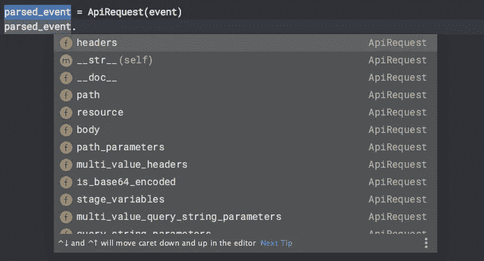
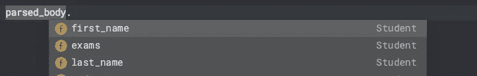

# 简单的无服务器:整洁的 Lambda 函数使用 Powertools

> 原文：<https://betterprogramming.pub/simple-serverless-neat-and-tidy-lambda-functions-use-powertools-935f90574f80>

## 减少开始编写 Lambda 函数的挫败感和时间


克里斯托弗·伯恩斯在 [Unsplash](https://unsplash.com?utm_source=medium&utm_medium=referral) 上拍摄的照片。

我写的每一个 Lambda 函数都是以同样的方式开始的:一堆解包事件然后验证其内容的代码。听起来熟悉吗？

此外，我永远记不住某些事件有效负载的确切键名。我如何再次从一个`ApiGateway`事件中获取标题？是`headers`还是`Headers`？

哦对了，是`headers` *和* `multiValueHeaders`。当然是了。

因此，我创建的每个新 Lambda 函数都以与我创建的其他 Lambda 函数非常相似的方式开始:

*   谷歌事件有效载荷结构。
*   解包内容并调用`json.loads`将字符串转换成字典。
*   验证内容。

# 我的第一个想法


作者照片。

我在编写和重写这类代码时越是沮丧，就越有动力去寻找更好的方法。所以我求助于编写助手库。下面是一个`ApiRequest`的例子:

正如你所看到的，我可以把我的晦涩的`event`变成一个 Python 对象。

这很好，因为现在我不需要记住所有这些事件属性的键名。还有，我的 IDE 会在我输入`parsed_event`的时候提示他们。



IDE 提示在起作用

这太棒了。为了前面的一点努力，我现在节省了大量的时间来设置我的 Lambda 函数。但这还不够。我仍然需要验证事件内容。那么其他事件源呢？

# AWS Lambda Powertools 简介

最初基于[DAZN Powertools](https://github.com/getndazn/dazn-lambda-powertools),[AWS fork](https://awslabs.github.io/aws-lambda-powertools-python/)专注于为 Lambda 函数提供干净、轻量级的实用程序。以下是这个项目的一些原则:

> “简化最佳实践的采用—实用程序的主要优先事项是促进最佳实践的采用，正如 AWS 良好架构的无服务器透镜中所定义的那样；所有其他功能都是可选的。
> 
> 保持精简—出于安全性和易维护性的考虑，仔细考虑了额外的依赖性，并防止对启动时间产生负面影响。
> 
> 我们从社区开始反向工作——我们的目标是找到对 80%的客户最有效的平衡。通过征求意见(RFC)来考虑和讨论新出现的实践
> 
> 习惯用法—实用程序遵循编程语言习惯用法和特定于语言的最佳实践。"

我已经在使用 [AWS Lambda Powertools](https://awslabs.github.io/aws-lambda-powertools-python) 的[日志](https://awslabs.github.io/aws-lambda-powertools-python/core/logger/)和[跟踪](https://awslabs.github.io/aws-lambda-powertools-python/core/tracer/)功能(顺便说一下，这真的很有用)。因此，当他们宣布围绕[事件源数据类](https://awslabs.github.io/aws-lambda-powertools-python/utilities/data_classes/)增加功能时，我既好奇又兴奋。

## 事件源数据类

简而言之，事件源数据类提供了与我上面的助手库相同的功能。但是我看到了转换的一些明显的好处:

*   由一个团队维护——不仅仅是我！
*   涵盖 11 种不同的事件源类型(包括 Kinesis，SQS 等。).
*   [Powertools](https://awslabs.github.io/aws-lambda-powertools-python/) 团队更接近 AWS 生态系统，比我更不容易“错过”变化。

实现这些数据类很简单。此示例实现了与上面我自己的代码相同的功能:

这太简单了——我的 IDE 仍然能够完成在我之前的例子中可以完成的所有重要工作。

但是……仍然没有验证。而且在使用这个数据类的时候，我还是要在请求体上做一个`json.loads`。

# 电动工具来救援！

我们可以构建自己的数据类模型，并使用 [Powertools](https://awslabs.github.io/aws-lambda-powertools-python/) 中的另一个可用功能来验证和解析请求: [Parser](https://awslabs.github.io/aws-lambda-powertools-python/utilities/parser/) 。

为了继续上面的例子，我们将解析 API 请求体。到目前为止，我们可以通过`parsed_event.body`访问它，但是它仍然是一个未知内容的字符串化对象。

首先，我们将通过构建一个模型来定义一个正确形成的请求体应该是什么样子。假设我们正在等待一个请求，告诉我们一个学生的名字、姓氏、最喜欢的颜色，以及他们正在参加或已经参加的考试的列表。我们可以这样定义模型:

请注意，我们使用类型注释来指示每个字段的类型。我们还引用了一个子模型(学生考试)。

在这一点上，我想指出的是 [Powertools](https://awslabs.github.io/aws-lambda-powertools-python/) 使用的这个建模模式实际上是建立在 [Pydantic](https://pydantic-docs.helpmanual.io/) 之上的。Pydantic 是一个非常强大的数据验证库，它提供了比我们在这里演示的更多的功能。

## 从语法上分析

现在我们已经定义了请求体应该是什么样子，让我们来解析它。为此，我们将使用[电动工具](https://awslabs.github.io/aws-lambda-powertools-python/)中的`parse`功能。该函数接受两个输入——您希望解析的数据和解析的模型(第 14 行):

那么这样的好处是什么呢？因为`BaseModel`和`parse`是建立在 [Pydantic](https://pydantic-docs.helpmanual.io/) 之上的，我们现在可以从它提供的所有好的验证中受益，包括:

*   必填字段
*   字段类型

所以我们不需要编写更多的验证代码。

另一个很大的好处是，我们的 IDE 现在也可以代表我们做更多的工作。我们现在在我们的`parsed_body`上得到属性名称提示:



IDE 暗示！

## 更多数据…

让我们继续我们的例子。假设我们的 Lambda 函数负责从另一个源添加学生最喜欢的颜色。注意，在我们上面的模型定义中，我们声明了`favourite_colour: Optional[str]`,这样 [Pydantic](https://pydantic-docs.helpmanual.io/) 知道这个字段在加载时允许为空。但是一旦我们有了这个属性的值，我们就可以给它赋值了。下面是我们设置该值的方式:

```
parsed_body.favourite_colour = "red"
```

我们还可以配置我们的模型，以决定当使用`validate_assignment`配置设置参数时，它是否应该主动验证参数。在[文档](https://pydantic-docs.helpmanual.io/usage/model_config/)中阅读更多相关内容。

# 完整的圆

最后，让我们把这个事件兜一圈。我们希望能够将填充的模型转换回 dict 对象，并将其包含在 API 响应中。

显然，我们不能只返回我们的模型实例。API 网关不会喜欢这样。但是[镇静剂](https://pydantic-docs.helpmanual.io/)再次帮了我们一把。我们的模型从`BaseModel`继承了一个叫做`.dict()`的方法。我们可以调用这个方法将我们的模型实例作为 dict 对象返回(第 25 行)。这是我们完成的 Lambda 的样子:

我认为这段代码看起来很干净。代码易读、简洁。重要的是，不管事件源是什么，它在我们编写的任何其他 Lambda 函数中看起来都非常相似。因此函数之间的上下文切换要容易得多。

# 接下来去哪里？

这仅仅是使用 [AWS Lambda Powertools](https://awslabs.github.io/aws-lambda-powertools-python/) 和 [Pydantic](https://pydantic-docs.helpmanual.io/) 的可能性的开始。我建议查看以下功能，以帮助补充我们在这篇文章中学到的内容:

*   【Pydantic 的 PyCharm 插件
*   [现场定制](https://pydantic-docs.helpmanual.io/usage/schema/#field-customisation)
*   [模型属性](https://pydantic-docs.helpmanual.io/usage/models/#model-properties)

不要就此打住。这个工具有很多可能性。继续你的研究是很值得的。

感谢阅读！我希望你和我一样觉得电动工具有用。