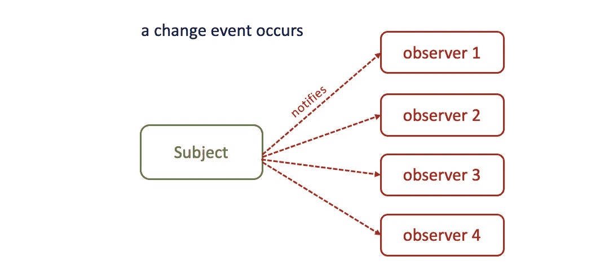
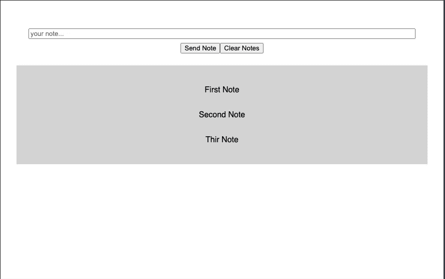

# 与 React 和 RxJS 共享状态的简单技术

> 原文：<https://betterprogramming.pub/simple-technique-for-sharing-state-with-react-and-rxjs-710dc06e9732>

## 让我们通过 React 和 RxJS 了解组件之间的通信技术

照片由[莱昂](https://unsplash.com/@myleon?utm_source=medium&utm_medium=referral)在 [Unsplash](https://unsplash.com?utm_source=medium&utm_medium=referral) 上拍摄

在这篇文章中，让我们来看一个用 React 和 RxJS 在组件之间进行通信的简单技术。

Redux 是很多人处理状态管理的首选库。虽然它是一个强大的工具，但 Redux 不应该被用作解决所有状态管理问题的瑞士刀。

通常，更精简的方法是首选。例如，您可以使用一个简单的观察者模式与 RxJS 共享状态。与 Redux 和 Context API 相比，以这种方式在组件之间进行通信有几个显著的优点。我会在文章的最后列出所有的问题。

# RxJS 用于状态管理

[RxJS](https://rxjs-dev.firebaseapp.com/guide/overview) 是[反应式编程](https://en.wikipedia.org/wiki/Reactive_programming)的流行库。RxJS 帮助编写用于处理副作用和异步操作的声明性代码。为此，它使用了连续数据流和订阅的概念。

RxJS 是一个功能强大的工具。然而，在这篇文章中，我们将把 RxJS 的使用限制在组件间共享状态的数据流上。

简单地说，这个想法是这样的:客户端订阅一个数据流，当新数据到达时，该数据流不断地推送新数据。数据流可以有多个订阅者，他们可以随心所欲地订阅/取消订阅。

我们将使用的主要 RxJS 对象:

1.  主题—带有数据流的对象。
2.  观察者——主体发出的价值的消费者。在我们的例子中，它只是一个在新数据到达时更新状态的函数。

下图说明了主体和观察者之间的关系:

# 使用 React 和 RxJS

## 我们正在建造的东西

我们来搭建一个简单的笔记 app。我们将有两个兄弟组件:

1.  标题—将包含用于清除和添加新注释的控件。
2.  内容—将负责显示注释。

让我们从添加使用共享状态的逻辑开始。下面是我们处理共享状态的`notesState.js`文件:

需要注意的一点是:`getNotes`是一个用于获取笔记当前状态的实用函数。你可以在应用程序的任何地方使用它，而不仅仅是 React 组件。

`useSharedNotes`是一个定制的钩子，你可以用它来获取和改变笔记的当前状态。`useSharedNotes`使用`useEffect`方法在组件加载时订阅主题。

为了订阅，我们使用`subject.subscribe`方法。每当收到新的 notes 数据时，我们的订阅者函数都会更新状态。`subject.subscribe`返回一个订阅对象，每当组件被卸载时，我们用它来取消订阅。

`useSharedNotes`返回`addNotes`、`clear`函数，以及包含当前 notes 状态的`notes`数组。这就是让我们的应用程序正常工作所需的全部内容。

## 成分

现在让我们开始添加`Header`和`Content`组件。
首先我们来定义一下`Header`。该组件包含用于添加和清除新注释的控件。这是我们的 header.js 文件:

很简单。我们有输入和两个按钮，用于添加和清除笔记。我们使用`addNote`和`clear`方法来将更改推送到共享状态。

现在让我们定义负责显示注释的`Content`组件。下面是 content.js 文件:

我们只使用共享状态中的`notes`字段。这是因为这个组件唯一的工作就是显示注释。

仅此而已！如我所说，这是一个比 Redux 更精简的方法。

## 重构共享状态

对于像我们这样简单的应用程序，我们的共享状态代码是可以的。然而，在一个有多个共享状态的大项目中，为每个状态编写单独的钩子可能很麻烦。

让我们使我们的`notesState`更加可重用。shareState.js 文件如下所示:

我们重构后的代码类似于前面的代码。但是现在我们有了一个包含多个不同主题的`subjects`地图。我们使用静态定义的键来访问它们。

我们将这些键作为第一个参数传递给`useSharedState`钩子，以指定我们订阅哪个主题。对于我们的笔记应用程序，我们将使用`NOTES_STATE`键来访问和改变共享状态。对于每个新的状态，我们可以不断添加新的键，并根据需要使用它们。

# 我们方法的优势

让我们总结一下 React 和 RxJS 使用共享状态的好处:

1.  **更精简的代码。这种共享状态的方法通常需要编写更少的代码。**
2.  **从任何地方进入该州。**使用 redux 和上下文 API，您只能从组件或 Redux 动作访问全局状态。使用我们的共享状态方法，您可以使用`getSharedStateValue`从任何地方读取状态，包括静态 util 方法。
3.  **明显的副作用。**使用共享状态方法可以更容易地跟踪副作用。使用 Redux，您首先需要找到受操作影响的 reducer，然后是订阅这些 reducer 的所有组件。使用我们的方法，您可以搜索一个订阅密钥(如`NOTES_STATE`)，您将立即看到订阅它的所有组件。
4.  **避免重新渲染整个组件树。与 Context API 相比，这种方法的一个优点是它只会重新呈现订阅的组件。有了上下文 API，当状态有任何变化时，整个组件树都会被重新渲染。**

这个帖子到此为止！希望您发现这种模式足够简单和有用，可以在您的项目中尝试。对于大的应用，我建议结合 Redux 使用。对于不经常改变的全局状态，如用户会话和令牌，使用 Redux。对于经常变化并且影响少量组件的事情，使用 RxJS。

这里是本教程的[代码沙箱](https://codesandbox.io/s/react-rxjs-tq3j0)的链接。

*原载于 2021 年 4 月 26 日 https://isamatov.com***。**