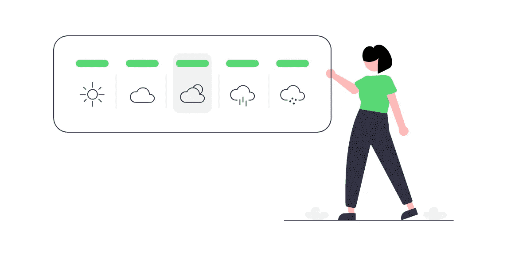
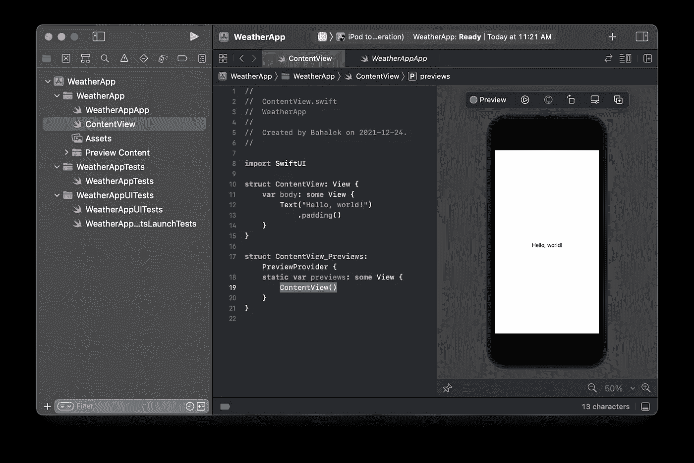
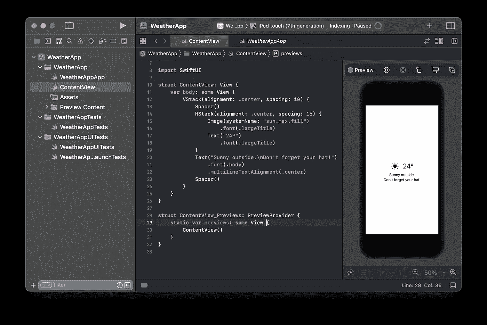
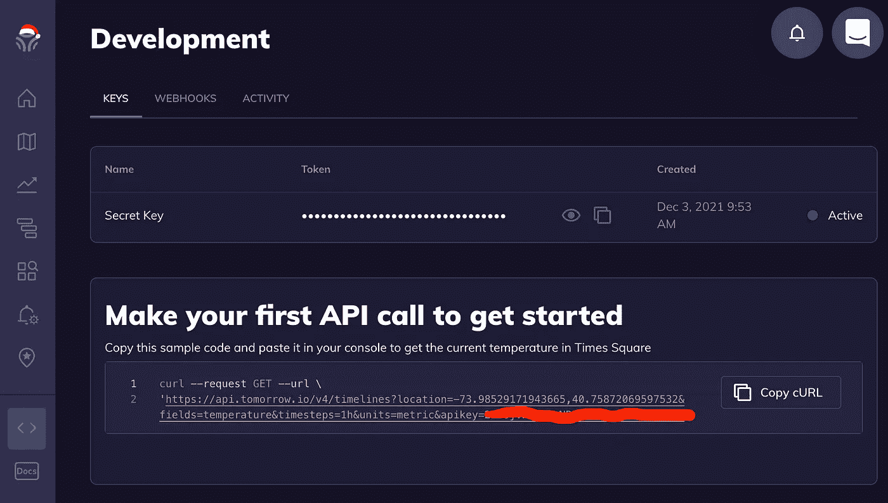
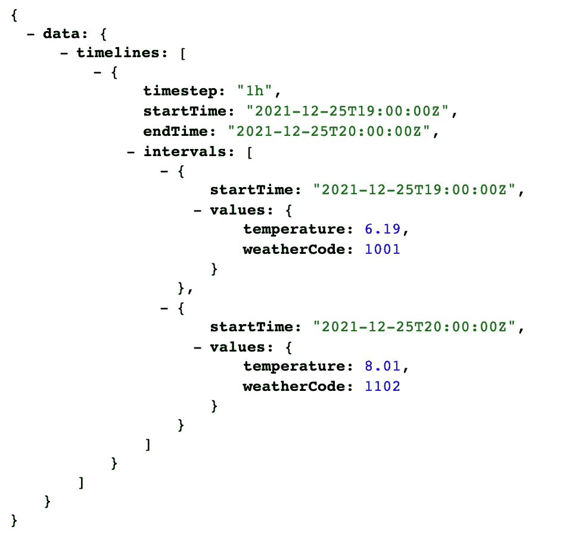
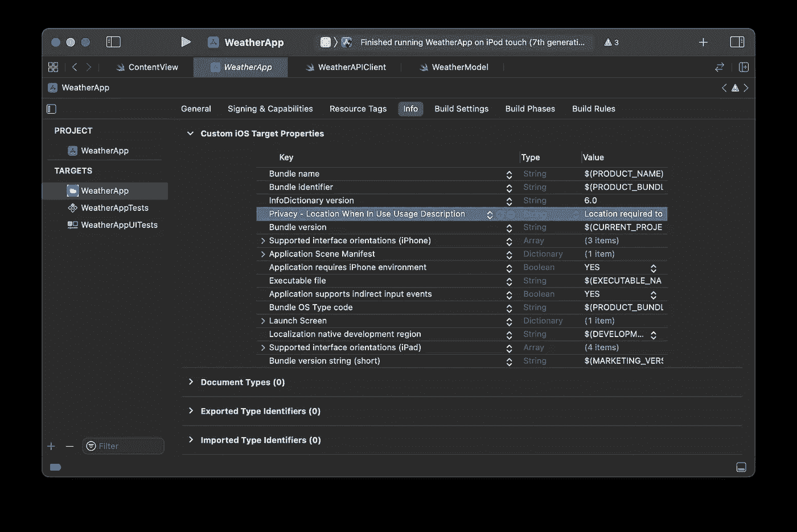
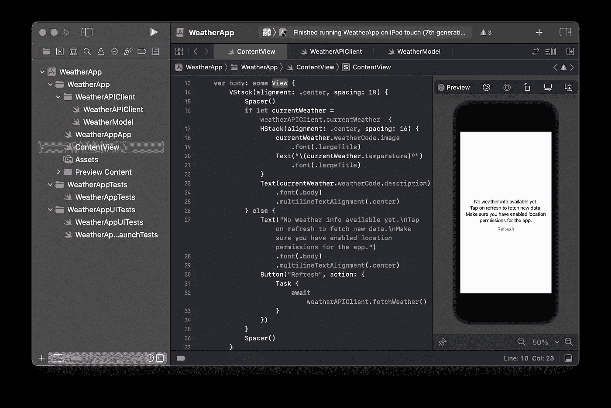
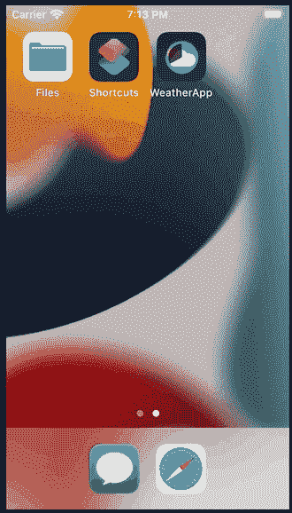

# 构建一个 iOS 天气 SwiftUI 应用程序

> 原文：<https://betterprogramming.pub/simple-weather-app-with-swiftui-ac41200a9d4d>

## 利用 tomorrow.io API 显示当天的天气



来源: [undraw](https://undraw.co/)

对于我们公司最近的一次黑客马拉松，我们的团队决定在我们现有的 iOS 应用程序中添加一个手表应用程序。

我的工作是集成一个第三方天气 API，根据当天的天气为用户提供建议，并在手机和手表上显示每日通知。我们没有赢得黑客马拉松比赛，但这篇文章却诞生于此。

本教程分为三个部分。下一部分的链接在最后。

在第一部分中，我将介绍如何将天气 API 与新的 iOS 应用程序集成在一起。在第二部分，我将向现有的 iOS 应用程序添加一个手表应用程序。第三部分将讨论手表连接以及在 watchOS 应用程序和 iOS 应用程序之间发送数据。

我将使用 Xcode13.2 和 SwiftUI。

# 选择第三方天气 API

第一步是找到适合你的 API。我用[这篇文章](https://rapidapi.com/blog/access-global-weather-data-with-these-weather-apis/)帮助我开始。从这篇文章开始，我选择看以下三个选项，直到我停在 tomorrow.io。

*   OpenWeatherMap 有一个非常简单的 API，很好的文档，也很容易实现。您只需要为自己生成 API 密钥，就可以开始了。然而，在撰写本文时，这个 API 不支持 HTTPS 请求，这是对我们的应用程序的否定。
*   DarkSky 也有一个非常简单的 API 可以使用。然而不幸的是，在撰写本文时，他们已经不接受任何新的注册。他们加入了苹果公司，并将在 2021 年底停止支持他们的 API。
*   [tomorrow.io](https://app.tomorrow.io/home) 拥有强大的功能、文档和客户支持。他们也支持 HTTPS。这对我们的应用程序来说有点大材小用，因为响应是一个嵌套的 json，需要使用 Swift 的`Codable`协议解析几个结构，但如果我们想扩展应用程序的功能，它会非常方便。他们有多种订阅选项，免费版本足以用于个人兼职项目/黑客马拉松。你每天会接到 500 个电话，一个用户和一个地点。

所以我将在本教程中使用 tomorrow.io。

# 创建新的 Xcode 项目

这一步我就不赘述了。[这里](https://developer.apple.com/documentation/xcode/creating-an-xcode-project-for-an-app)是苹果的文档，告诉你如果你需要的话，如何创建一个新的 Xcode 项目。

选择 iOS 应用模板，命名为“WeatherApp”，界面选择 SwiftUI。选择一个文件夹来存储项目，Xcode 应该会生成开始编写我们的应用程序所需的所有文件。您的项目结构应该是这样的:



# 创建虚拟用户界面

让我们首先用硬编码的天气值创建一个虚拟 UI，稍后我们将根据调用`tomorrow.io`得到的结果更新这些值。将您的`ContentView`替换为:

这将创建一个垂直布局，我们将有两个主要部分。

顶部将包含当前天气的图标*(第 4 行)*，旁边是温度文本*(第 6 行)*。

在那下面，我们将有一个建议文本*(第 9 行)*，它将根据天气而变化。

对于天气图标，我使用的是苹果为你的应用程序提供的 SF 符号。您可以使用[这个应用程序](https://developer.apple.com/sf-symbols/)查看所有可用的符号。

您最终应该会看到以下用户界面:



我们将在 Watch 应用程序中重用相同的视图，所以现在让它保持简单。

# 整合 Tomorrow.io

在 tomorrow.io 上注册，然后去你的[开发仪表板](https://app.tomorrow.io/development/keys)获取你的访问密钥，并尝试一个示例 API 调用。您的仪表板应该是这样的:



浏览他们的[文档](https://docs.tomorrow.io/reference/key-concepts),了解使用 tomorrow.io API 还能获得哪些信息。

对于这个演示应用程序，您将使用[时间线 API](https://docs.tomorrow.io/reference/get-timelines) ，并且您只需要响应中当前小时的`temperature`和`weatherCode`字段。

您可以在此找到所有其他可用数据[。修改您的请求以包括`weatherCode`字段，并限制当前小时只有 1 个值。请用您的访问密钥替换`{$YOUR_KEY}`。最后的请求应该是:](https://docs.tomorrow.io/reference/data-layers-overview)

```
[https://api.tomorrow.io/v4/timelines?location=40.7579787,-73.9877313&fields=temperature&fields=weatherCode&units=metric&timesteps=1h&startTime=2021-12-25T19:36:11Z&endTime=2021-12-25T20:36:11Z&apikey=](https://api.tomorrow.io/v4/timelines?location=40.7579787,-73.9877313&fields=temperature&fields=weatherCode&units=metric&timesteps=1h&startTime=2021-12-25T19:36:11Z&endTime=2021-12-25T20:36:11Z&apikey=2IG0jVndUp4wNRP2kEJUGb5chDLWPWsZ){$YOUR_KEY}
```

在您的浏览器中尝试一下。响应将是以下格式的 JSON:



现在，您已经准备好将 API 集成到您的应用程序中了。

# 向您的应用程序添加 API 客户端和响应模型

由于我们只需要发出一种类型的请求，并且编写一个可伸缩的 API 客户端不是这个演示的目的，所以我们的 API 客户端将会非常简单。

关于如何编写一个更加复杂和可扩展的 API 客户端的教程，请点击这个[链接](https://medium.com/makingtuenti/writing-a-scalable-api-client-in-swift-4-b3c6f7f3f3fb)，它有点过时了，但是概念和架构仍然是相关的。这里有[另一个好的](https://medium.com/macoclock/swift-generic-api-854afdb9315e)是最近的，使用了联合收割机。

出于我们的目的，创建一个文件夹`WeatherAPIClient`,存储所有与请求天气 API 的业务逻辑相关的文件。

首先，让我们为响应创建模型。我们将使用`Codable`协议对 [JSON 进行解析](https://www.avanderlee.com/swift/json-parsing-decoding/)。

从上面的 JSON 中，我们需要检索`temperature`和`weatherCode`字段。其余的可以丢弃。

在新文件夹中创建一个新的 Swift 文件，并将其命名为`WeatherModel.swift`。用以下模型填充它:

接下来，我们可以创建 API 客户机本身，它将在请求成功完成时返回`WeatherValue`。

在同一个文件夹中创建一个新文件`WeatherAPIClient.swift`。填充下面的代码:

为了进行 API 调用，我们需要用户的当前位置和按照 API 文档用`ISO8601`格式格式化的`startTime`。

所以我们需要一个位置管理器和一个日期格式化对象。我们在初始化时请求用户位置。稍后，每次用户位置更新时，我们都会请求天气更新。

根据 Apple 文档，您需要将正确的密钥添加到您的`info.plist`文件中:

> 要准备您的应用程序调用`[requestWhenInUseAuthorization()](https://developer.apple.com/documentation/corelocation/cllocationmanager/1620562-requestwheninuseauthorization)`或`[requestAlwaysAuthorization()](https://developer.apple.com/documentation/corelocation/cllocationmanager/1620551-requestalwaysauthorization)`，您必须将带有目的字符串的密钥添加到您的应用程序的`Info.plist`文件中。系统在授权请求对话框中显示您的目的字符串。

使用 Xcode 13 生成的 SwiftUI 项目不会获得单独的`info.plist`文件。相反，您可以使用目标设置的信息选项卡，如下所示。

对于我们的应用程序，我们只需要应用程序正在使用时的位置，所以添加`NSLocationWhenInUseUsageDescription`键，并添加一个描述字符串，说明为什么您需要用户位置。

当向用户显示“位置授权许可”对话框时，将显示此文本。



为了发出 API 请求，我们使用了 URLSession 和 [async/await](https://docs.swift.org/swift-book/LanguageGuide/Concurrency.html) 来使语法更加清晰，使用了更少的闭包。

`async`代表异步，用于定义函数正在执行异步工作。`await`用于调用异步函数来标记执行暂停点。一旦`async`函数与 await 返回相匹配，我们就从那一点继续执行。

我暂时没有处理这些错误。您可以决定在弹出窗口中向用户显示错误，或者根据需要对错误进行任何其他处理。

# 将模型连接到用户界面

现在我们需要将 API 请求的结果与我们的 UI 连接起来。

首先，我们需要将从`tomorrow.io`接收的`weatherCode`转换成我们的自定义 enum，它将有一个图像和一个文本描述。

将以下内容添加到您的`WeatherModel.swift`中:

添加将在`ContentView`内部使用的模型。将`Weather`结构添加到`WeatherModel.swift`中。

它需要符合`Identifiable`协议，以便我们可以在 API 客户机中将它设置为一个发布变量，并在每次数据改变时更新 UI。

现在更新`WeatherAPIClient`类以符合`ObservableObject`协议，并发布对`weather`变量的更改。

另外，将`WeatherAPIClient`类中的`currentWeather`变量更新为`@Published`属性包装器:

```
@Published **var** currentWeather: Weather?
```

然后，您需要更新我们如何处理对 API 调用的响应。

我们需要确保从响应中创建新的`Weather`结构。

因为现在它是一个已发布的变量，所以我们需要在主队列上做这件事。

最后`WeatherAPIClient.swift`应该如下图所示:

最后，我们需要更新我们的`ContentView`来观察发布的变量，如果天气信息不可用，用`Refresh`按钮显示一个默认视图。

您最终的`ContentView.swift`代码应该是这样的:

运行中的 iOS SwiftUI 应用程序的输出是:



现在，您已经准备好运行应用程序了。最终结果:



# 结论

现在您有了一个与 tomorrow.io 集成的 SwiftUI 项目，可以获取当前位置的当前天气。

下一步将是为此应用程序创建一个配套的手表应用程序。你可以在下一个教程中完成。

编码快乐！