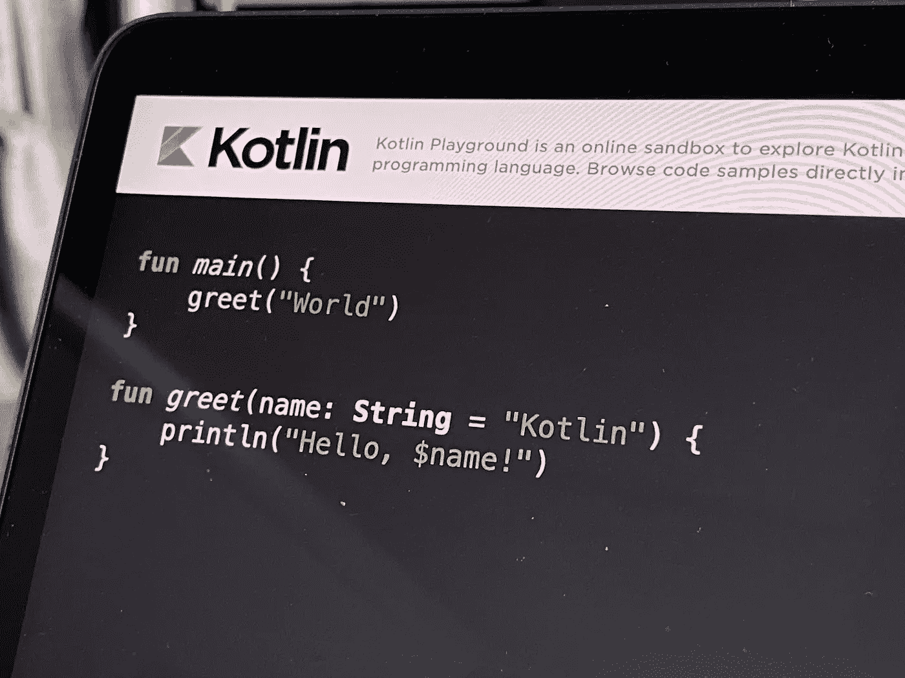
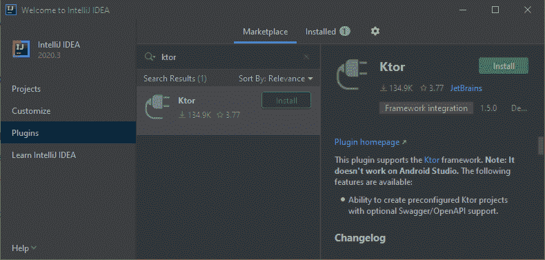
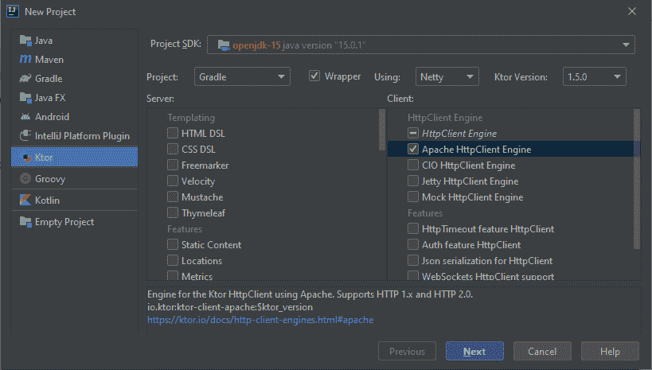

# 用 Kotlin 和 Ktor 创建一个简单的 Web 应用程序

> 原文：<https://betterprogramming.pub/simple-web-app-with-kotlin-and-ktor-540b9a412943>

## 让我们从科特林开始构建网络吧



照片由[路易·蔡](https://unsplash.com/@louis993546?utm_source=unsplash&utm_medium=referral&utm_content=creditCopyText)在 [Unsplash](https://unsplash.com/@louis993546?utm_source=unsplash&utm_medium=referral&utm_content=creditCopyText) 上拍摄

保持务实，开始在 web 后端开发中使用 Kotlin。

# 开始

首先，你需要下载 [IntelliJ IDEA](https://www.jetbrains.com/idea/download/#section=windows) 。用社区版就可以了。安装完 [Ktor](https://ktor.io/) 后，进入插件>市场，在搜索栏中输入“Ktor”。



下载 Ktor 插件

安装 Ktor **插件。重新启动 IDE，您就可以开始了！**

现在点击新建项目，选择 Ktor 项目预置。确保项目 SDK 被设置为项目类型“Gradle”在客户端组框中，您需要选择 Apache HttpClient Engine，然后选择 Next。



创建新项目

您可以将 GroupId 设置为“com.example”，但将 ArtifactId 更改为“simple-ktor-web”然后单击 Next，再次将项目名称设置为“simple-ktor-web”指定您希望项目源代码所在的项目位置。

浏览文件夹，从根文件夹`simple-ktor-web`到`src`文件夹，打开`Application.kt`文件。这是您的主应用程序文件，应用程序逻辑从这里开始。

```
package com.example

import io.ktor.application.*
import io.ktor.response.*
import io.ktor.request.*
import io.ktor.client.*
import io.ktor.client.engine.apache.*
import io.ktor.routing.*

fun main(args: Array<String>): Unit = io.ktor.server.netty.EngineMain.main(args)

@Suppress("unused") // Referenced in application.conf
@kotlin.jvm.JvmOverloads
fun Application.module(testing: Boolean = false) {
    val client = HttpClient(Apache) **{

    }** }
```

要用默认设置创建 HTTP 客户端，需要调用`HttpClient()`构造函数。我推荐阅读 Kotlin 官方文档[中关于如何设置 HTTP 客户端的内容。要开始通过 HTTP 提供数据，您需要指定路由。你可以在官方](https://kotlinlang.org/docs/mobile/use-ktor-for-networking.html#set-up-an-http-client) [Ktor 文档](https://ktor.io/docs/routing-in-ktor.html)中阅读更多关于 Ktor 路由的内容。为了使路由工作，我们将定义几条路由:

*   根路由/
*   测试路线/测试

恭喜你。现在我们完成了！在运行应用程序之前，请确保端口:8080 未被使用。然后你可以立即运行你的第一个简单的 Kotlin 网络应用程序。此外，您可以通过导航到`application.conf`文件中的`resources`文件夹来更改端口。打开浏览器，在浏览器地址栏中输入 http://localhost:8080/your browser。

一个简单的 Ktor 应用程序现在包含两条路线:

*   http://localhost:8080
*   http://本地主机:8080/test

不要犹豫，去我的 [GitHub](https://github.com/liumedz/simple-ktor-web) 库获取源代码。如果您想了解关于如何托管 Kotlin 应用程序或如何将其用于 Web Sockets 的未来内容，请点击星号按钮。我很快会补充最相关的内容。

# 结论

我希望你喜欢阅读关于如何用 Kotlin 创建 web 应用程序的简短介绍。现在我们可以得出结论，对于那些喜欢用 Kotlin 进行开发的人来说，有一些开放的选择。例如，移动开发者现在可以通过 Ktor 使用 Kotlin 轻松创建 web APIs。

尤其是在移动领域，拥有合适的工具来构建后端 API 并保持它们之间的一致性是至关重要的。现在，您可以通过在后端和移动前端都使用 Kotlin 来实现这一点。这种务实的方式让我们有机会在未来尽可能高效地开发移动应用程序。