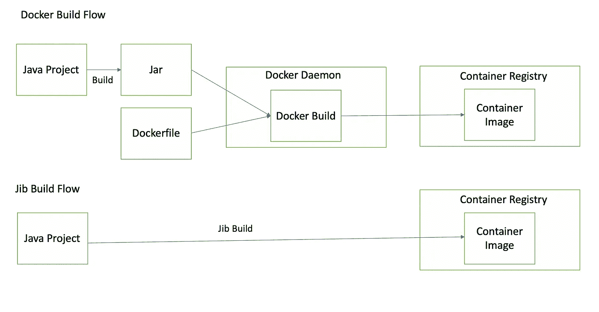
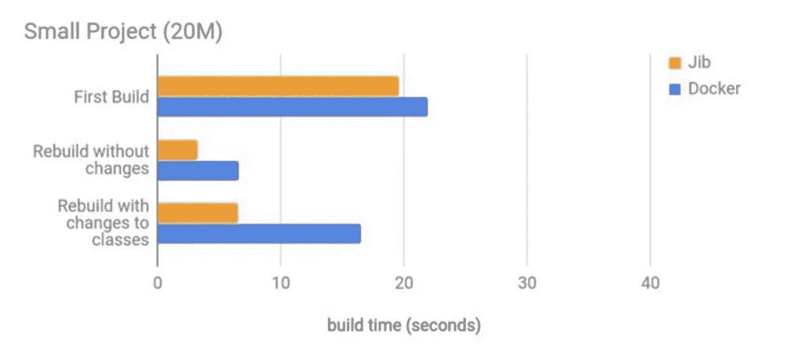
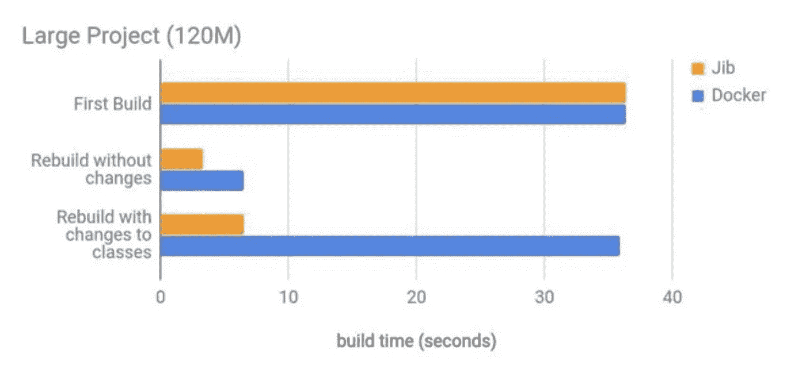

# 面向 Java 微服务的简化 Docker 映像构建

> 原文：<https://betterprogramming.pub/simplified-docker-image-builds-for-java-microservices-316648e0de81>

## 使用 Jib——来自 Google 的开源 Java 容器



到目前为止，我们中的许多人已经在使用 [Docker](https://www.docker.com/) 来部署 Java 应用程序/微服务。为什么不呢？如今，它已经成为应用程序部署的事实标准。

然而，人们需要正确地学习和理解 Docker 来实现最佳实践。我们中的许多人迷失在 Dockerfile 文件的复杂性中。

在这篇文章中，我将谈论一个非常酷的开源项目，它允许我们使用简单的 [Maven](https://maven.apache.org/) / [Gradle](https://gradle.org/) 构建来构建和部署 dockerized Java 应用程序。

# 典型的 Java 应用程序停靠化过程

如果您是一名 Java 开发人员，并且想要将您的应用程序 dockerize，您倾向于遵循以下步骤:

1.  使用 Maven/Gradle build 构建一个胖罐子。
2.  写一个 Dockerfile 文件。
3.  从 Docker 文件构建一个映像。
4.  将图像推送到容器注册表。

作为一名 Java 开发人员，第一步非常简单，但是到了下一步，我们大多数人都依赖于互联网上的内容。典型的 docker 文件可能如下所示:

```
FROM open-jdk:8-jdk-alpine 
COPY target/myapp-*.jar /app.jar
ENTRYPOINT java -jar /app.jar
```

如果我使用这个 Docker 文件，我将能够构建并使用我的应用程序的 Docker 映像，但是这可能不是我能够构建的最有效的映像。

如果我在互联网上搜索得更多，我也许可以通过遵循 [Dockerfile 最佳实践](https://docs.docker.com/develop/develop-images/dockerfile_best-practices)来改进 Dockerfile。

上述 Dockerfile 文件存在各种问题。

1.  这是使用 JDK 基础映像而不是 JRE。运行应用程序时，JRE 是必需的，而不是 JDK。如果我们改变这一点，那么我们将能够大大减少图像的大小。JRE 映像大约是 55 MB，而 JDK 映像是 192 MB。
2.  该应用程序是使用 fat jar 构建的，这意味着在 Docker 映像中将只为该应用程序创建一个层。如果我们做了任何更改，那么每次我们推送 app 的整个层时，都需要重新构建。我们可以通过将依赖项和应用程序代码分离到不同的层来改进这一点。您可以使用下面的 maven 命令来分离依赖项:`mvn dependency:copy-dependencies -DoutputDirector=target/dependencies`。

因此，经过改进后，docker 文件将如下所示:

```
FROM open-jdk:8-jre-alpine 
COPY target/dependencies /app/dependencies
COPY target/resources /app/resources
COPY target/classes /app/classes
ENTRYPOINT java -cp /app/dependencies/*:/app/resources/:/app/classes hello.Application
```

# Jib 简介

Jib 是来自 Google 的开源 Java 容器，它允许开发者从 Maven/Gradle 构建中构建他们的 Java 应用程序的 Docker 映像。

如上所述，如果您不熟悉最佳实践，Docker 映像构建是一个复杂的过程。Jib 试图解决这个问题，但是提供了一个 Maven 和 Gradle 构建插件。

因此，如果您必须构建一个 Java 应用程序的 Docker 映像，您只需要做两件事。

1.  在`pom.xml`中添加 Maven 依赖项。

```
<plugin> <groupId>com.google.cloud.tools</groupId> <artifactId>jib-maven-plugin</artifactId> <version>1.8.0</version> <configuration> <to> <image><path-to-container-registry>/hello-jib</image> </to> </configuration></plugin>
```

2.运行以下命令:

```
mvn compile jib:build
```

这将在内部应用 Docker 最佳实践，将您的应用程序分成多个层，构建映像，并推送到容器存储库。

## 起重臂的好处

使用 Jib 有各种好处。

*   作为一名 Java 开发人员，我需要做的就是专注于 Java，不要为 Docker 的复杂性而烦恼。
*   因为这是 Maven/Gradle 构建的一部分，所以实现和部署很快。
*   因为 Jib 使用 Docker 最佳实践，所以构建的图像是轻量级的、标准的和分层的。
*   您不需要 Docker 守护进程来创建和推送 Docker 映像。

## 码头工人与起重臂

下面是两种方法直接比较的一些结果。



[https://speaker deck . com/cool log/build-containers-faster-with jib-a-Google-image-build-tool-for-Java-applications？slide=51](https://speakerdeck.com/coollog/build-containers-faster-with-jib-a-google-image-build-tool-for-java-applications?slide=51)



[https://speaker deck . com/cool log/build-containers-faster-with jib-a-Google-image-build-tool-for-Java-applications？slide=52](https://speakerdeck.com/coollog/build-containers-faster-with-jib-a-google-image-build-tool-for-java-applications?slide=52)

# 参考

1.  [https://speaker deck . com/cool log/build-containers-faster-with-jib-a-Google-image-build-tool-for-Java-applications](https://speakerdeck.com/coollog/build-containers-faster-with-jib-a-google-image-build-tool-for-java-applications)
2.  [https://github.com/GoogleContainerTools/jib](https://github.com/GoogleContainerTools/jib)

```
Hey, if you enjoyed this story, check out [Medium Membership](https://deshpandetanmay.medium.com/membership)! Just $5/month!*Your membership fee directly supports me and other writers you read. You’ll also get full access to every story on Medium.*
```