# 简化的函数式编程

> 原文：<https://betterprogramming.pub/simplified-functionaldd-programming-fdc07b4b1084>

## 函数式编程的可视化介绍


由[杰克森·乔斯特](https://unsplash.com/@jacksonjost?utm_source=medium&utm_medium=referral)在 [Unsplash](https://unsplash.com?utm_source=medium&utm_medium=referral) 上拍摄的照片。

# 什么是函数式编程？

函数式编程是纯函数的流水线。

那是什么意思？

为了理解这个定义，我们将使用一个真实的例子。让我们假设我们有一个运输仓库和一个包含各种产品(书籍、衣服、某些罐头食品、家用电器等)的大型商店。).

我们仓库里的东西是如何工作的？

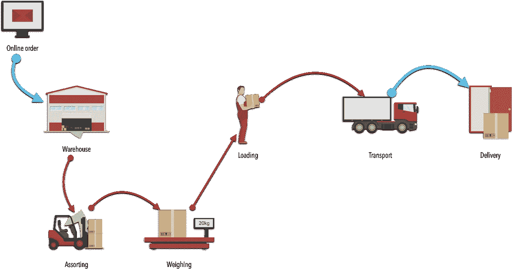

仓库内部——作者图片

我们的工作流是一系列小的处理步骤，每个元素的输出都是下一个元素的输入:流水线。每个步骤只存在一次。

功能代码的工作单位是函数。每个功能都是独一无二的(单责干——不要重复自己)。

函数式编程使用管道作为其独特的构建方法。

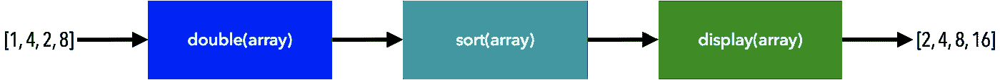

函数管道—图片由作者提供

在数学中，函数是一个连接输出和输入的简短公式。相同的输入总是产生相同的输出。在短公式中，变体和行为在单个短关系中恢复。

函数式编程是声明性的(*什么*比*如何*更重要)。

让我们来看看这两种将数组中的元素加倍的方法:

*   `double1`是一个*命令式*代码，它一步一步地详细说明了如何将数组的每个元素加倍。
*   `double2`是一个*声明性的*简洁的代码，它将函数的结构简化为最重要的部分(一个公式)。

在仓库工作流程中，产品是否发生了变化？

不要！从一个阶段到另一个阶段，我们在不改变或改变原有产品的情况下增加新的配件。

例如，在分类步骤中，我们将订购的产品分组放在一个包装内，然后进行称重步骤。当最终用户收到订单并打开包装时，他们将能够获得没有突变或损坏的产品。

这就是函数式编程的工作方式:组合函数来转换输入而不改变它们。


通过函数转换的不可变输入—作者图片

一个函数从不改变它的输入变量，而是创造新的、丰富的输出。不改变输入的函数是纯函数。

## 概述

*   功能代码的工作单位是函数。
*   函数式编程是纯函数的流水线。
*   函数式编程是声明性的(*什么* > *如何*)。

这样的后果是什么？

## 隔离并替换

我们仓库中的每个阶段都独立于其他阶段，并且不知道它们的存在(之前或之后)。类似地，每个函数只依赖于它的输入。没有共享状态或外部依赖性。

如果出现任何问题，我们可以很容易地检测出问题的根源，并隔离有缺陷的组件，以快速恢复。

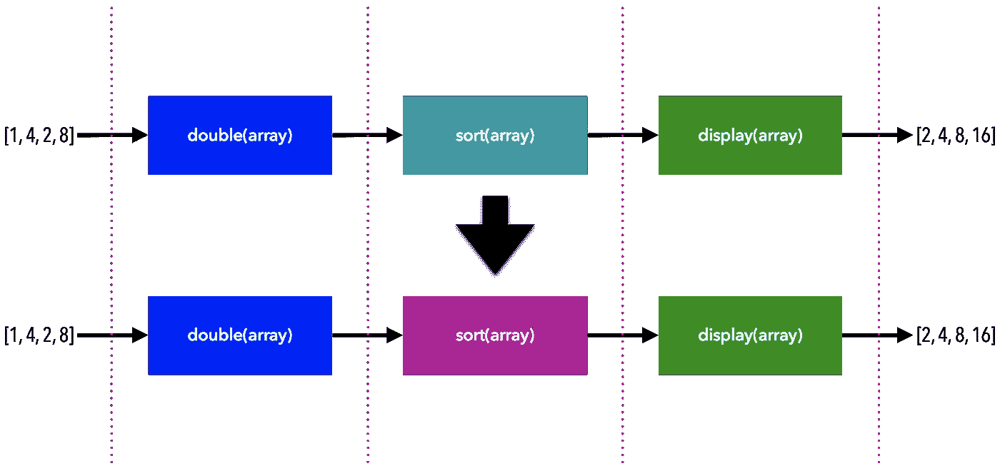

易于隔离错误并更换有缺陷的组件—图片由作者提供

如果我们能容易地隔离一个函数，我们就能容易地对它进行单元测试！

每个功能都充当独立和隔离的微服务。

函数类似于数学函数:

*   一个函数只依赖于它的输入。
*   一个函数不会产生任何副作用。例如， *f(x)* 不会改变输入 *x* 但是会产生一个新值。

## 可扩展且易于重新排列

如果我们想在称重和装载之间增加一个称为自动监控的新步骤，以检查包装内的所有物品(质量改进)，该怎么办？

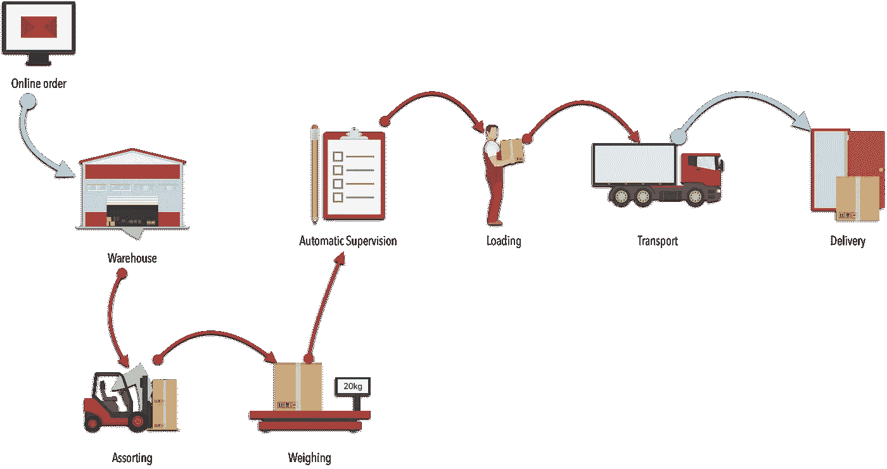

增加了自动监督步骤——图片由作者提供

为了有效操作，步骤的输入和输出必须兼容:

*   称重的输出应与自动监控的输入兼容。
*   自动监控的输出应与加载的输入兼容。

仅此而已！我们不需要知道每一步内部是如何工作的(弱耦合)！

如果我们想添加一个函数，以便在`double`和`sort`函数之间只保留大于 4 的项目:

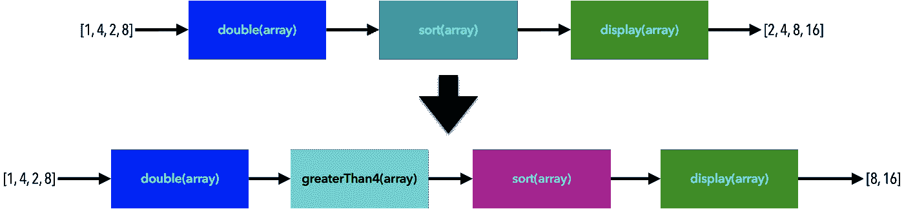

插入新功能—作者图片

函数输入和输出必须在类型和 arity 上兼容:

*   类型—一个函数返回的类型必须与接收函数的参数类型相匹配。
*   Arity —接收函数必须声明至少一个参数，以便处理从前面的函数调用返回的值。

连接函数必须在 arity 和类型方面兼容。

当它们的类型和 arity 兼容时，我们也可以很容易地重新排列。

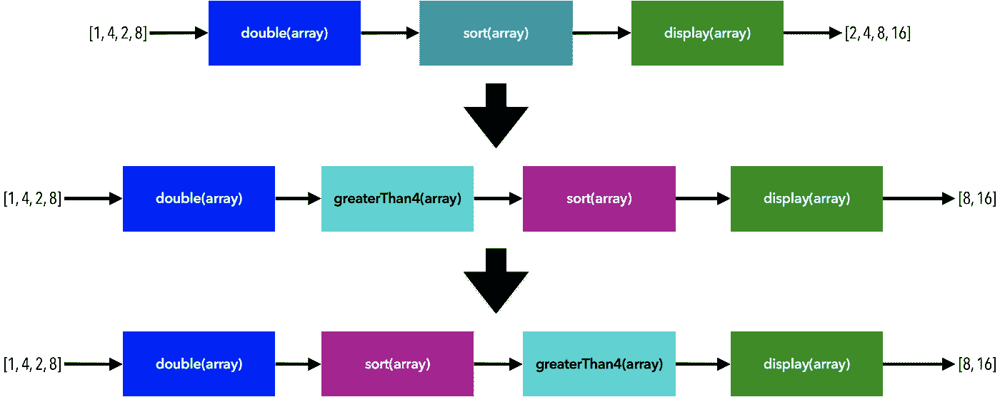

重新排列—作者的图像

## 可预测和确定性

在函数式编程世界中:

*   没有共享状态。
*   函数是纯的(不变性)。
*   每个功能都作为一个独立和隔离的微服务(没有副作用)。

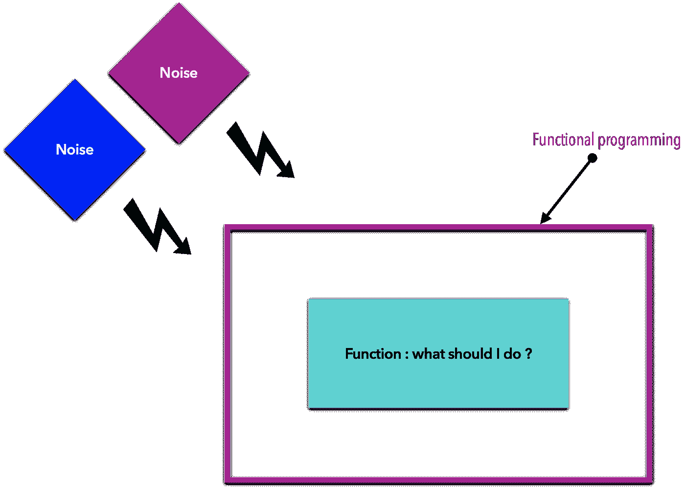

函数式编程过滤掉了所有外部噪音——图片由作者提供

如果不稳定因素被过滤掉，我们可以很容易地预测任何时候的产量。

我们可以创建一个时间机器，让我们在程序的生命周期中前进或后退:


可预测的行为—作者的图像

可预测性、确定性和隔离是好的单元测试所需要的代码质量！

## 降低复杂性

函数式编程是简短的、单一职责的、纯函数的组合。

这是什么意思？让我们看一个例子。

怎么才能算出 *(2x+3)* ？

*   第一步，计算 *(2x+3)* 。
*   然后平方输出。

```
f(x) = (2x+3)g(x) = x²h(x) = (g º f)(x) =  g(f(x)) = (2x+3)²
```

复杂的数学函数是由简单的小函数组合而成的！


合成以降低复杂性—图片由作者提供

```
const finalOutput 
= double º sort º display 
= display(sort(double(array)))
```

*   计算`double(array)`。
*   然后通过管道将结果排序。
*   然后通过管道显示结果。

关键是组成小步骤，而不是拥有一个做所有事情的函数。

我们从中获得了什么？很容易隔离、调试和测试！

构图有很多种。最重要的是高阶函数和链接。

让我们开始吧！

# 高阶函数

> 对其他函数进行运算的函数，无论是将它们作为参数还是返回参数，都称为高阶函数— [雄辩的 JavaScript](https://eloquentjavascript.net/05_higher_order.html)

那是什么意思？

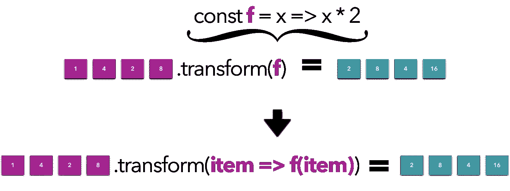

高阶函数——作者图片

`transform`是以`f`为自变量的高阶函数。

为什么？我们来看看`transform`可以怎么写:

`transform`是纯粹的:我们返回一个副本，而不是突变原始数组。

```
const data = [1, 4, 2, 8];const double = x => x * 2;
const plusOne = x => x + 1;console.log('double array : ', transform(data, double));
console.log('plus one array : ', transform(data, plusOne));
```

`transform`包含迭代数组并将函数应用于其项目的重复代码。

这是重用代码的一种方式！

我们不是重复相同的代码，而是创建一个通用的高阶函数(抽象)。

我们会发现`transform`是在编程语言中实现的，还是仅仅是一个数学概念？

让我们看看。

## JavaScript 中的高阶函数

在 JavaScript 世界中，我们有以下几种可用的方法:

1.  `map`要转换一个数组:

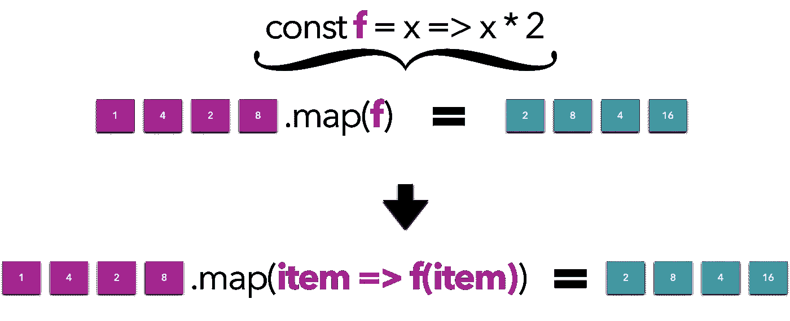

映射以转换数组—图片由作者提供

```
const sequence = [1, 2, 3, 4, 5];
const doubleSequence = sequence.map((item) => item * 2); // [2,4,6,8,10]
```

`map`:

*   返回一个不影响原数组的新数组(纯无副作用)。
*   输入数组长度 **=** 输出数组长度。

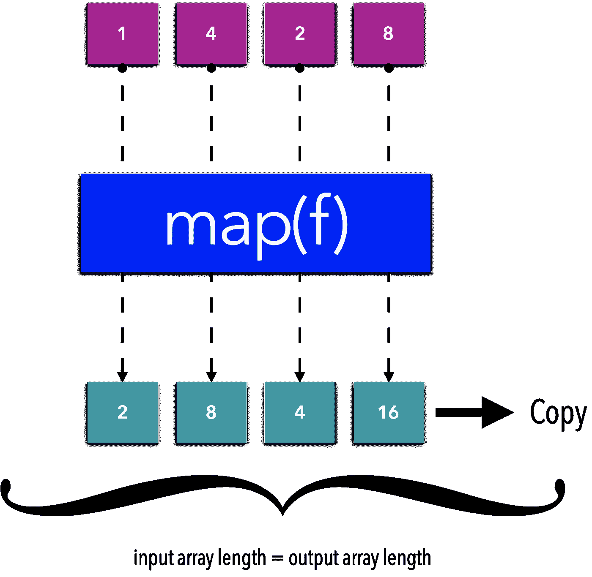

JS 地图如何工作—图片由作者提供

2.`filter`要过滤一个数组:

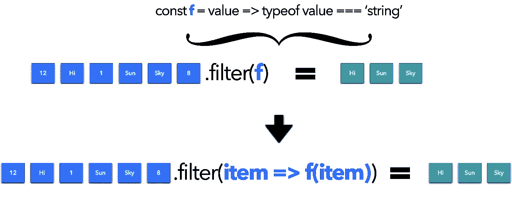

过滤一个数组-作者图片

`f` 是谓语功能。

```
const **isString** = value => typeof value === 'string';const values = [12, 'Hi', 1, 'Sun', 'Sky', 8];const valuesMatched = values.**filter(isString)**;console.log('valuesMatched : ', valuesMatched); 
// "valuesMatched : ", ["Hi", "Sun", "Sky"]
```

`filter`:

*   返回一个不影响原数组的新数组(纯无副作用)。
*   输出数组长度取决于有多少元素匹配谓词(max =输入数组长度)。

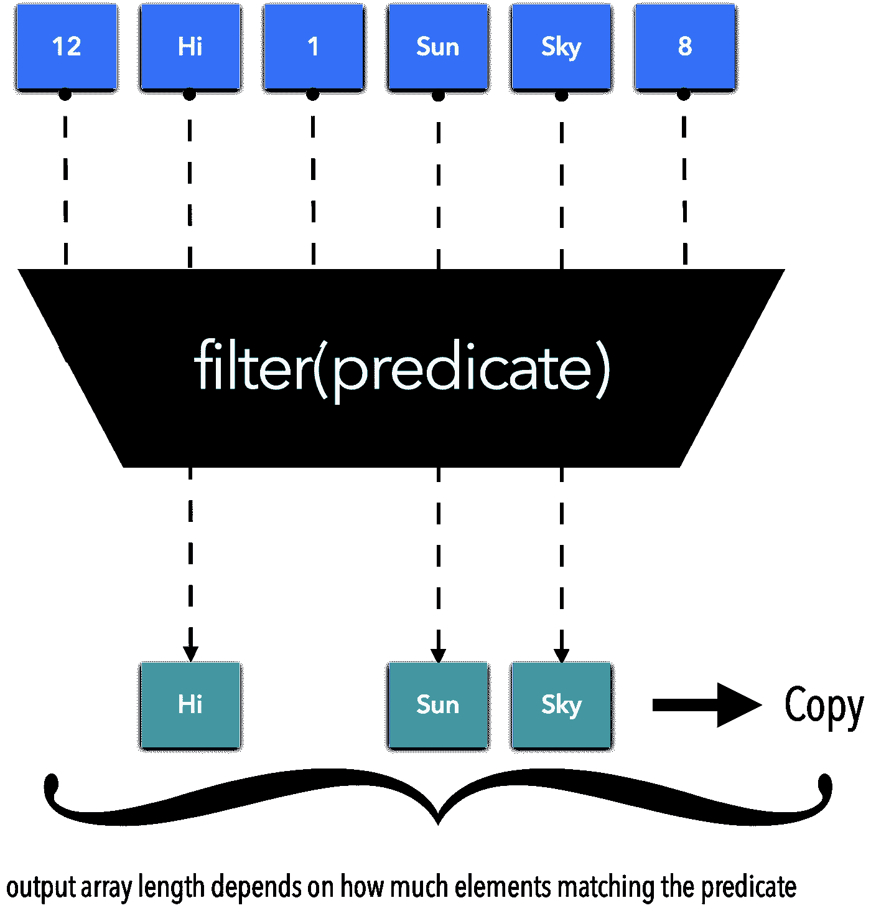

JS 滤镜如何工作—图片由作者提供

3.`every`和`some`。

`every`测试数组的所有元素是否满足条件:

```
[12, 5, 8, 130, 44].every(elem => elem >= 10); // false
[12, 54, 18, 130, 44].every(elem => elem >= 10); // true
[{a:1, b:2}, {a:1, b:3}].every(elem => elem.a === 1); // true
[{a:2, b:2}, {a:1, b:3}].every(elem => elem.a === 1); // false
```

`some`测试数组中是否至少有一个元素通过条件:

```
[2, 5, 8, 1, 4].some(elem => elem > 10); // false
[12, 5, 8, 1, 4].some(elem => elem > 10); // true (12)
```

# 如何链接函数

链接函数为您提供了组合小行为以获得复杂结果的可能性:

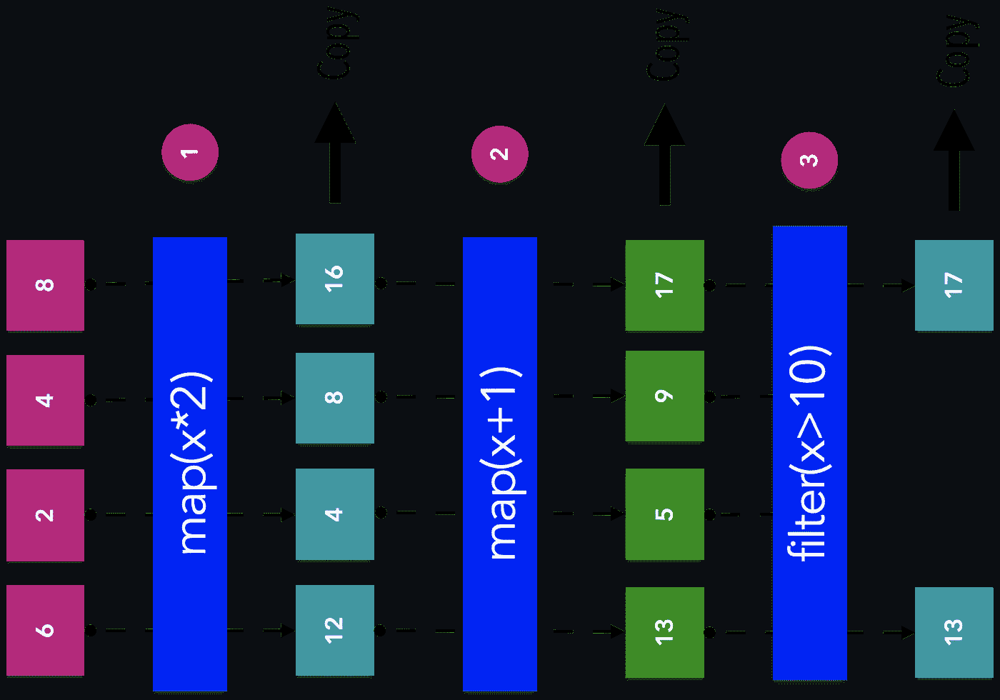

链接小函数—作者图片

```
const complexArray = [6, 2, 4, 8]
.map(x => x * 2)
.map(x => x + 1)
.filter(x => x > 10);console.log('complexArray : ', complexArray); 
// "complexArray : ", [13, 17]
```

连接函数必须在 arity 和类型方面兼容。

# 函数式编程的安全性

## 函子

让我们看看下面的代码:

```
const increment = v => v + 1increment('5') // '51'increment({ v: 5 }) **// "[object Object]1"**
```

怎么了?`{v: 5}`是一个对象。

我们如何保护我们的功能？

现在让我们添加一个计算数字双精度的函数:

```
const double = (v) => {
  if (typeof v !== 'number') {
    return NaN
  }
  return v * 2
}
```

怎么了?在`increment`和`double`之间有重复编码。

有没有更好的办法？让我们看看:

神奇！让我们来了解发生了什么:

*   对于给定的输入，我们检查它是否是一个数字。
*   如果是，那么`NumberBox`可以应用函数`(fn)`并将结果传递给下一个函数。
*   否则，该函数不被应用，并且`Nan`被传送到下一个函数。
*   上下文保存在`applyFunction`(管道)之间。
*   相同的检查一直持续到最后一个映射，其中`NumberBox`返回上下文中最后保存的值。

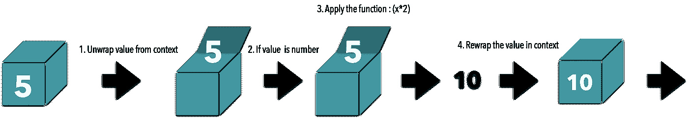

数字盒子背后的魔法——作者的图像

我们没有将值传递给函数，而是将函数传递给值。

我们可以对我们的`NumberBox`做一个小小的改变:

我们用`map`替换`applyFunction`:

是的，这就是我们的`map`，这就是我们如何在函数之间安全地链接！

那什么是函子？

> 本质上，函子只不过是一种数据结构，您可以映射函数，目的是将值提升到包装器中，修改它们，然后将它们放回包装器中。这是一种设计模式，定义了 fmap 应该如何工作的语义。— Luis Atencio，[JS 中的函数式编程](https://livebook.manning.com/concept/javascript/functor)

完美！

> 它们的实际目的是创建一个上下文或抽象，允许您安全地操作和应用操作到值，而不改变任何原始值。这在 map 将一个数组转换成另一个数组而不改变原始数组的方式中显而易见；这个概念同样适用于任何容器类型。—路易斯·阿坦西奥，[JS 中的函数式编程](https://www.htmlgoodies.com/beyond/javascript/js-ref/javascript-functors-explained.html)

这就是我们想要的！安全链接！

函子充分吗？

不为什么不呢？

当出错时，仿函数安全地继续执行，直到最后一个`map`并返回上下文中最后保存的值:

```
const safeResult = NumberBox({
  v: 5})
.**map**(v => v * 2) // -> executed
.**map**(v => v + 1) // -> executed
.value // NaN
```

即使出现错误，仿函数也会安全地继续执行(`map`)。

我们将通过使用称为单子的函子的高级版本来解决这个问题。

让我们看看！

## 可能单子

如何写一个`Maybe`:

一个神奇的例子:

一个`Maybe`单子是一个函子，因为我们也`map`这个函数。

然而，当`Maybe`遇到问题时，它不会继续。它跳过并转到默认语句:`getOrElse`。

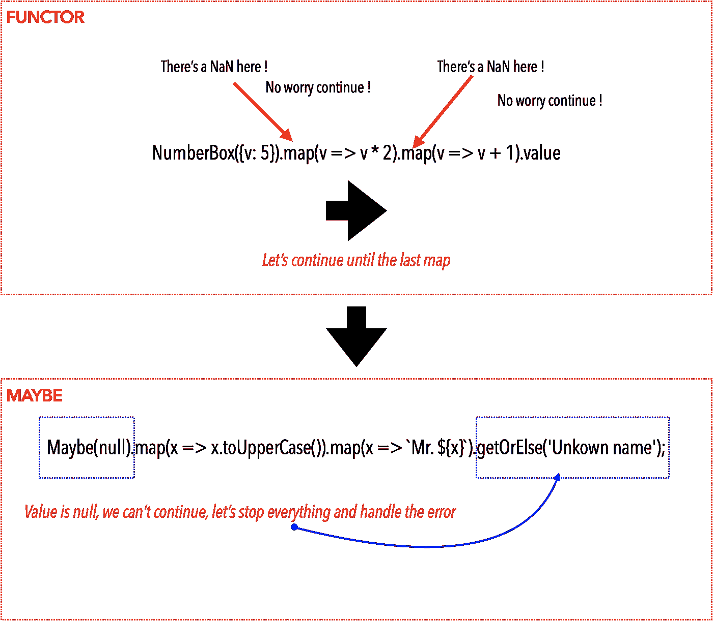

函子与可能—作者图片

没错，是魔法！

一个`Maybe`有两个流程:一个成功，一个失败。相比之下，仿函数只有一个流:

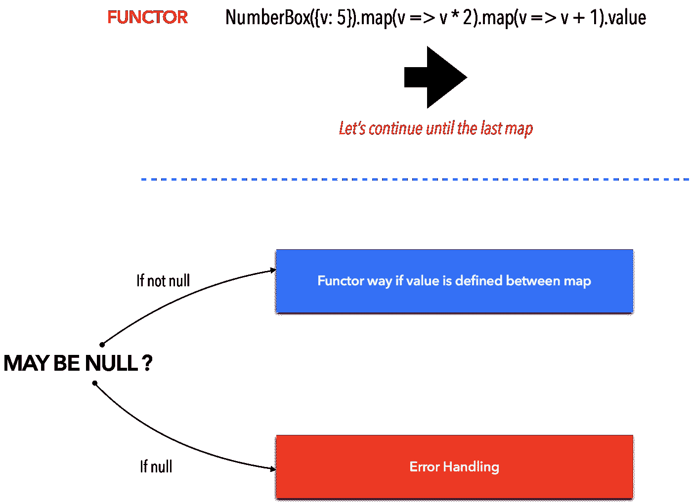

也许是流动——作者的形象

这有什么帮助？

一个具体的使用示例是处理从后端接收到的响应。我们不知道收到的数据是否已定义，也不知道它是否符合预期的类型和格式。

因此，我们可以用`Maybe`包装数据，并链接转换函数。如果一步失败，所有的步骤都会失败。

```
**MayBe**(Backend.Call()).map().map().getOrElse();
```

关于函数式编程的这篇文章到此为止！

# 结论

在本文中，我们讨论了什么是函数式编程，它的好处以及可用的模式。

函数式编程是简短的、单一职责的、纯函数的组合。Pure 意味着函数永远不会改变它的输入。该功能不会产生或导致副作用。

函数更像数学函数:声明性的，简洁的(公式)。

我们从中获得了什么？

*   我们可以轻松地隔离功能，从而轻松地对它们进行单元测试。
*   由于每个功能都作为一个独立和隔离的微服务，我们可以很容易地扩展和重新安排全局行为。怎么会？通过使用组合、高阶函数和链接等技术。

最后，我们看到了一些关于函数式编程的安全提示:

*   仿函数帮助我们安全地链接应用于一个值的函数。然而，它们不处理错误和异常。
*   `Maybe`单子丰富了函子处理错误的能力。

# 进一步的信息

[](https://www.amazon.fr/Functional-Programming-Javascript-Luis-Atencio/dp/1617292826) [## JavaScript 中的函数式编程:如何使用函数式来改进你的 JavaScript 程序

### 诺特/5。JavaScript 中的 Retrouvez 函数式编程:如何使用函数式来改进您的 JavaScript 程序…

www.amazon.fr](https://www.amazon.fr/Functional-Programming-Javascript-Luis-Atencio/dp/1617292826) [](https://www.amazon.fr/Functional-Light-JavaScript-Pragmatic-Balanced-English-ebook/dp/B0787DBFKH) [## 轻功能 JavaScript:JavaScript 中实用、平衡的 FP(英文版)

### achetez et téléchargez ebook Functional-Light JavaScript:实用、平衡的 FP in JavaScript(英文版)…

www.amazon.fr](https://www.amazon.fr/Functional-Light-JavaScript-Pragmatic-Balanced-English-ebook/dp/B0787DBFKH)