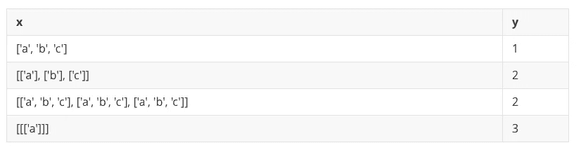
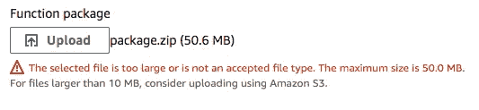
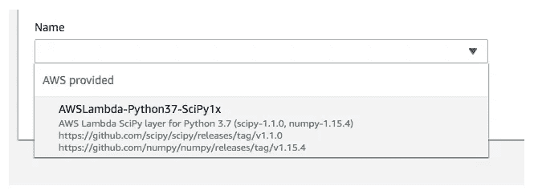

# 使用层简化 AWS Lambda 依赖关系

> 原文：<https://betterprogramming.pub/simplify-aws-lambda-dependencies-using-layers-763a5a9448a4>

## 为 Lambda 函数提供依赖关系的简单方法


[塞巴斯蒂安·阿尔瓦雷斯](https://unsplash.com/@sebastianalvarez?utm_source=unsplash&utm_medium=referral&utm_content=creditCopyText)在 [Unsplash](https://unsplash.com/search/photos/layers?utm_source=unsplash&utm_medium=referral&utm_content=creditCopyText) 上拍照

# 什么是层？

随着无服务器技术变得越来越流行，AWS 继续向其无服务器计算服务添加新功能。这些新功能之一是*层*。

层使得用定制的运行时代码运行 Lambda 函数成为可能。层给 Lambda 带来的最令人兴奋的好处之一是能够在任何编程语言中运行 Lambda 函数。

然而，层带来的另一个好处是简化了 Lambda 函数中的依赖关系。在层之前，部署具有依赖性的 Lambda 函数，在 Lambda 中启动和运行时增加了额外的复杂性。

简而言之:Lambda 层提供了一种简单的方式来为你的 Lambda 函数提供依赖关系。

# 问题是

今天我们将在 Python 中创建一个简单的 Lambda。

我们的 Lambda 函数将接收一个多维数组作为输入，并输出该数组的维度。很简单，对吧！

好吧，让我们从一些样板文件开始:

这定义了我们的 Lambda 处理程序来获取一个名为`array`的输入事件，并返回`array`中的维数。



相当琐碎。让我们用 Lambda 运行这段代码吧！

转到 AWS 控制台，创建一个新的 Lambda 函数。确保选择 Python 3.7 作为您的运行时。

首先，您可能会尝试将 Lambda 函数复制并粘贴到 AWS 控制台中。这很简单，你只是想测试一下你写的这个函数。

但是，如果您尝试这样做，将会收到以下错误:

```
{
  "errorMessage": "Unable to import module 'lambda_function': No module named 'numpy'",
  "errorType": "Runtime.ImportModuleError"
}
```

此时，您正在搜索如何将 [NumPy](https://www.numpy.org/) 依赖项添加到 Lambda 函数中。

您很可能会收到从 pip 下载 NumPy 并使用 NumPy 压缩 Python 函数的建议。

首先创建一个名为`lambda_handler.py`的文件，如果你还没有的话，然后粘贴你的 Lambda 代码。

然后运行以下命令:

这将从 pip 下载 NumPy 并用您的`lambda_handler`功能将其压缩。

返回到 AWS 控制台中的 Lambda 函数，并在`Code entry type`下拉列表中选择`Upload a .zip file`。从出现的文件选择器中选择`package.zip`文件。

如果您能够顺利通过这一步，那么恭喜您！然而，如果你像我一样，你会得到这个错误:



(请注意，我正在处理的项目与我上传的代码并不完全匹配，我包含了三个依赖项`scipy, pandas, and numpy`，这增加了包的大小)

现在怎么办？亚马逊给我们提供了一个建议:把功能上传到 S3。这是一个完全有效的选择，也是唯一的选择，直到亚马逊创建了 Lambda layers。

# 层

要添加一个层到你的 Lambda 函数，点击 Lambda 函数上的`layers`按钮。

从这里，选择名称下拉菜单，您应该会看到以下内容:



这一层将让我们访问到 SciPy 和 NumPy。

添加后，回到你的项目。您可能需要再次保存。此时，您应该可以点击`Test`并成功运行您的功能。

恭喜你！您刚刚成功地用 Python 编写了一个带有依赖项的 Lambda 函数。

# 后续步骤

Lambda layers 简化了为我们的函数添加依赖项的过程。

但是除了 SciPy 和 NumPy 之外的依赖关系呢？

Lambda 层提供了创建自己的层来满足这些需求的选项。此外，一个 Lambda 函数最多可以添加五个层，所以一定要根据 Lambda 函数的需要来组合层。

本页列出了许多最受欢迎的 Lambda 图层:[https://github.com/mthenw/awesome-layers](https://github.com/mthenw/awesome-layers)

# 结论

Lambda 层使得依赖于依赖关系的 Lambda 函数的部署更加容易。对于像 NumPy 这样的标准依赖项来说尤其如此。

层的另一个有趣的方面是，它们允许你在定制的运行时环境中运行 Lambda 函数；我将在以后的文章中谈到这一点。