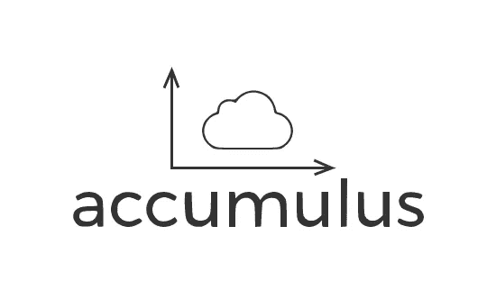
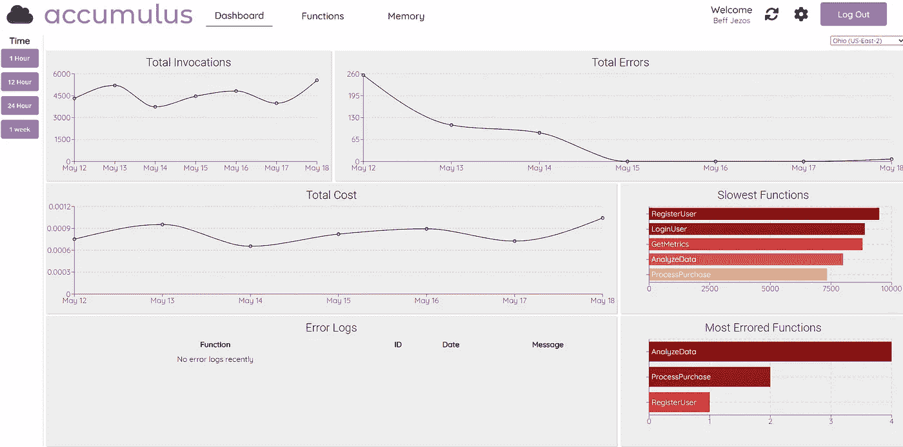
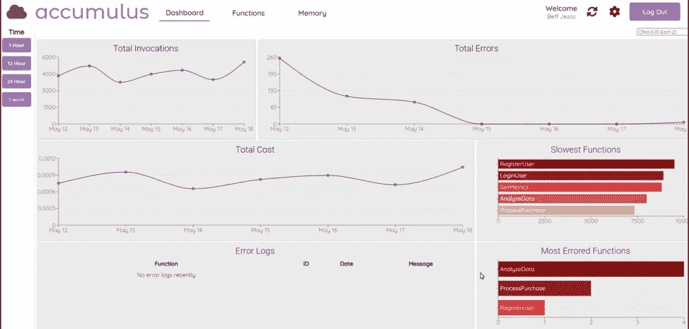
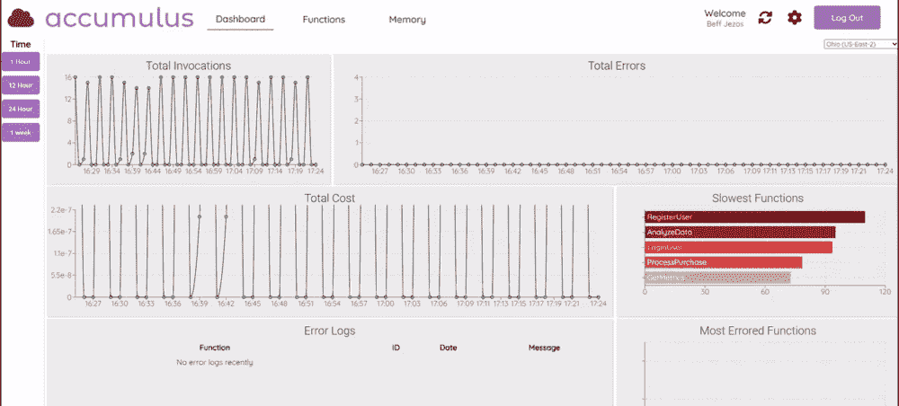
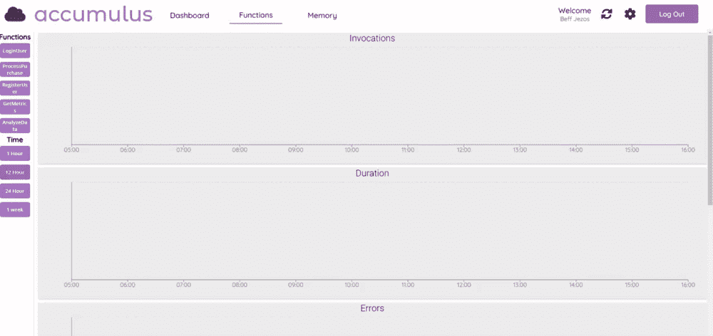
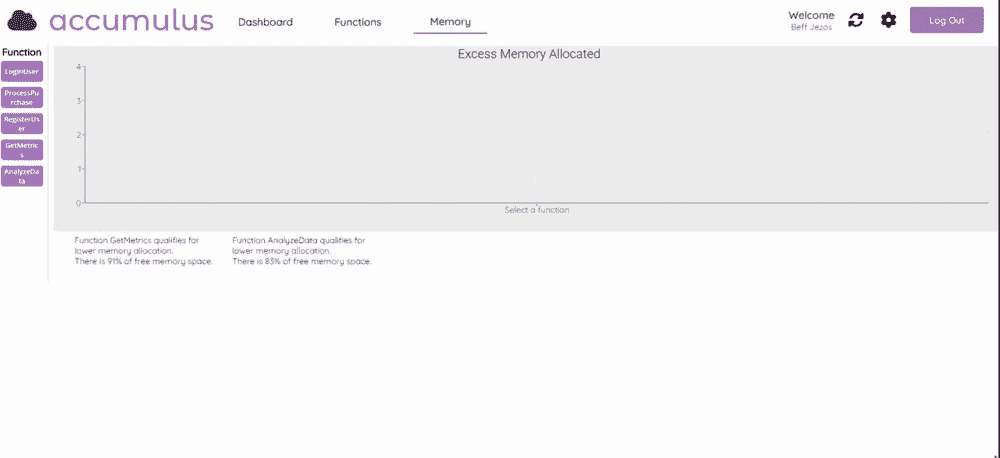

# meet accu mulus——简化 AWS Lambda 视图的工具

> 原文：<https://betterprogramming.pub/simplify-your-aws-lambda-view-7ebb7dbaac4b>

## Accumulus 是一款简单易用的开源工具，面向需要评估和比较 AWS Lambda 函数的开发人员。



# **AWS 和无服务器架构概述**

管理服务器承担了开发团队运营开销的重担。在可伸缩性和维护方面必须考虑很多因素。

Amazon Web Services(AWS)无服务器产品线的引入解决了这个问题，它允许开发人员快速获得和管理生产应用程序，同时还抽象出底层开发操作系统。

特别是，AWS Lambda 提供了一个利用 AWS 功能计算实例的模型，而不用担心 EC2 管理。Lambda 支持全球各地区的即时服务器供应、可伸缩性和高可用性。此外，使用 Lambda，开销成本是“随用随付”，为传统托管服务器的标准按秒付费成本模式提供了一种替代方案。

## **少了点什么**

目前，用于监控 AWS Lambda 功能的工具(如 AWS Cloudwatch)需要繁琐的搜索查询配置，以创建用于可视化功能指标和日志的图形。久而久之，Lambda 函数的列表可以增长，这给同时快速浏览一个或多个函数的性能带来了不必要的困难。

## **输入累计量**

Accumulus 试图为开发者改善这种体验。Accumulus 是一个免费的开源工具，用于快速更新用户的 AWS Lambda 功能指标和日志。与其花时间浏览现有的难以使用的工具，不如尝试 Accumulus 作为简化体验的替代方案。

Accumulus 可以监控诸如调用、持续时间和限制等指标。它还可以显示错误日志以及跟踪操作成本。可以在 1 小时到 1 周的可配置时间段内查看四个北美 AWS 地区的数据:俄亥俄州、弗吉尼亚州、加利福尼亚州和俄勒冈州。

## **如何入门**

*   从参观 https://accumulus.dev/开始
*   点击“开始”
*   如果您是现有用户，请使用您的电子邮件和密码登录。
*   对于新用户，单击“注册”创建新用户帐户。
*   按照说明进行注册。
*   将创建一个 CloudFormation 堆栈，该堆栈将返回注册所需的输出 ARN。
*   该 ARN 标识 Accumulus 有权使用的新创建的角色，授予读取数据的权限。Accumulus 是非侵入性的，不能从该角色写入或更新任何数据。

## **如何演示工具**

没有带有 Lambda 函数的 AWS 帐户？别担心，请登录:

*   电子邮件:email@gmail.com
*   密码:密码

这个预配置的演示帐户具有为演示设置的 Lambda 函数。

# **λ功能监控**

## **仪表盘视图**

登录或创建帐户后，您会看到仪表板。该仪表板提供了从指定区域和时间段的所有功能汇总的数据的洞察力。如果用户希望总体了解该区域的功能如何运行，这可能会有所帮助。



仪表板视图

通过单击左侧的一个按钮来更改时间段:



更改左侧的时间段

“同步”按钮可以刷新页面以反映最新数据:



单击同步按钮刷新数据

## **功能视图**

要更深入地了解一个或多个功能，请导航到“功能”页面。使用左侧的按钮选择功能和时间段，以配置图表



功能视图

## **内存视图**

导航到内存页面，深入了解每个 Lambda 函数的已分配内存。列出了过度分配了 80%可用空间的函数。这些功能可能有资格在分配设置中进行调整。我们强烈推荐检查另一个伟大的开源工具，AWS Lambda Power Tuning(T8)来优化你的函数的计算能力和成本。



内存视图

## **如何投稿**

欢迎希望做出贡献的开发者！你可以在这里找到 GitHub 库。

发现了窃听器？请在此提交问题[。](https://github.com/oslabs-beta/Accumulus/issues/new/choose)

如果您有任何问题或反馈，请随时直接联系团队！

```
**Connect with the Accumulus team:** Matt Femia: [Github](https://github.com/mattfemia) | [LinkedIn](https://www.linkedin.com/in/mattfemia/)
Eric Wu: [Github](https://github.com/EZW1) | [LinkedIn](https://www.linkedin.com/in/ericzfwu/)
Christian Sansovich: [Github](https://github.com/christiansansovich) | [LinkedIn](https://www.linkedin.com/in/christian-sansovich/)
Dan Teng: [Github](https://github.com/danwteng) | [LinkedIn](https://www.linkedin.com/in/dan-teng-094aa59a/)
Mark Yancheske: [Github](https://github.com/markyencheske) | [LinkedIn](https://www.linkedin.com/in/mark-yencheske-62698122b/)
```