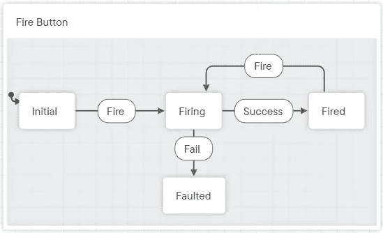

# 用状态机简化 React 组件的状态

> 原文：<https://betterprogramming.pub/simplify-your-react-components-state-with-a-state-machine-8e9c9a4ee1f6>

## 使用**减速器**不费吹灰之力实现全类型状态机。


蒂莫·沃尔茨在 [Unsplash](https://unsplash.com?utm_source=medium&utm_medium=referral) 上拍摄的照片

作为 React 开发人员，我们都不得不在状态变得无法管理的组件上工作。在我们修改它之前，它可能是一个笨拙而有效的组件。我们添加的一点点额外代码又给组件制造了一个崩溃的机会。裂缝很快开始出现。

这种恐怖故事通常涉及组件有条件地做事情或显示东西，并且组件的可能状态有很多。

# 走错路的旅行

让我带你一起踏上一段旅程，在这段旅程中，实现一个简单的组件很快就会走错方向。

假设我们被要求实现一个写着**的“启动”按钮💥点击时发出砰的一声。酷，我们声明一个按钮，点击时改变它的状态，根据它的状态设置文本，我们就完成了:**

到目前为止，一切顺利。

接下来，我们被告知需要在点击按钮时调用一个名为`fire`的函数。这是一个需要时间来完成的异步功能。所以我们应该显示文本**🚀在等待的时候开火。**

好吧…所以当用户点击按钮的时候，我们要记住`fire`已经被调用了，但是还没有触发。所以我们添加另一个布尔 as 状态，我们称之为`firing`:

嗯，那有点天真。如果我们运行这段代码并点击按钮，它只会说**🚀无限期开火。发现错误了吗？是的，我们忘记在操作完成后重置`firing`状态。所以我们现在处于一个无人区，在这里`firing`和`fired`同时都是真的。**

好吧，让我们来修复这个处理程序:

```
const handleClick = async () => {
  setFiring(true);
  await fire();
  **setFiring(false);**
  setFired(true);
};
```

但是等等！如果用户想重新开火，再次点击按钮怎么办？我们还需要在函数开始时重置`fired`标志:

```
const handleClick = async () => {
  **setFired(false);**
  setFiring(true);
  await fire();
  setFiring(false);
  setFired(true);
};
```

所有案件处理完毕！

咚咚咚。新的要求来了！我忘记说了，但是`fire`功能可能会不时地失败……当这种情况发生时，我们希望将文本改为**🤷哦…'** 并防止再次发生火灾(健康和安全，你知道…)

咩！再来一面旗子，就搞定了。`faulted`怎么样？我们可以使用一个 **try-catch** 块来设置它。如果设置了`faulted`标志，我们将忽略点击。
此外，我们不要忘记在发生这种情况时重置其他标志，因为我们刚刚了解到…

这应该是这样的:

嗯……让我们再读几遍，以确保它是正确的。是的，我想是的。实现起来并不难，不是吗？真的，还不算太糟。

几天或几周后，新的需求出现了。我们已经忘记了这个代码。现在看起来不再那么清晰了。我们可能需要向它添加更多的状态，改变条件或者添加更多的 UI 来改变当前的状态。事实是，我们已经为裂缝的出现创造了机会。如果我们不注意，随着要处理的案例数量不断增加，组件最终将处于一种不可能的状态。

# 我们能做得更好吗？

我们当然可以！

有经验的开发人员会注意到组件只能处于几种状态:

*   `initial`:按钮没有被交互
*   `firing`:我们已经给`fire`打了电话，正在等待完成
*   `fired` : `fire`已成功完成
*   `faulted` : `fire`失败

因此，我们可以只用一个枚举来存储当前状态，而不是三个布尔。使用这个枚举，我们只需要处理 4 种情况(可能的状态)，而不是潜在的 8 种情况(2^3，3 个布尔值的可能组合的数量)。

但还有更多！以前使用过`[useReducer](https://reactjs.org/docs/hooks-reference.html#usereducer)`钩子的开发人员知道，reducers 提供了一种管理复杂状态和避免不一致的好方法。这个想法是，你分派一个动作(比如:‘fire’…)，reducer 负责剩下的，返回一个新的状态。

所以我们刚刚说过，我们的组件只能处于多种状态(fire，fired…)，而且`[useReducer](https://reactjs.org/docs/hooks-reference.html#usereducer)`可以用于管理状态和调度动作(“fire”…)。

对我来说，这听起来很像一个[状态机](https://en.wikipedia.org/wiki/Finite-state_machine):

> 一个**有限状态机** ( **FSM** ) […]或者简称为**状态机**，是一个数学[计算模型](https://en.wikipedia.org/wiki/Model_of_computation)。它是一个[抽象机器](https://en.wikipedia.org/wiki/Abstract_machine)，在任何给定的时间，它可以处于有限个 [*状态*](https://en.wikipedia.org/wiki/State_(computer_science)) 中的一个状态。FSM 可以根据某些[输入](https://en.wikipedia.org/wiki/Input_(computer_science))从一种状态变为另一种状态；从一种状态到另一种状态的变化称为*转换*。

当然，按照`useReducer`的行话，我们只是把这些转换*动作叫做*。但是是一样的。这些转变有时也被称为*事件*。

# 状态机宝宝！

因此，让我们尝试用我们已经确定的状态和事件(转换)来绘制一个模式:



Fire 按钮，表示为状态机

然后，我们可以用 TypeScript 枚举状态和事件，并编写一个从一种状态转换到另一种状态的`reducer`函数:

在上面的代码中，我们已经将状态机转换为一个`switch`语句，该语句查看当前状态并基于接收到的事件返回一个新状态。`Initial`和`Fired`状态已经合并在一起，因为它们以相同的方式处理“火灾”事件，并且`Faulted`已经从语句中省略，因为它是一个死胡同(没有从该状态出来的转换)。

另外，请注意，我们已经使用了`Reducer<ButtonState, ButtonEvent>`来强制状态和动作的类型(或者在本例中是*事件*)被 reducer 接受。这将在我们使用它时给我们类型安全和正确的完成。

作为一个旁注，我觉得我必须提到`ButtonState`和`ButtonEvent`可以使用 [**文字类型**](https://www.typescriptlang.org/docs/handbook/2/everyday-types.html#literal-types) 来声明:

```
*type ButtonState = "initial" | "firing" | "fired" | "faulted";
type ButtonEvent = "fire" | "success" | "fail";*
```

这个比较简洁，我经常看到在状态机中使用。它也比枚举更有效，因为 TypeScript 不必为它发出额外的 JavaScript。

我想你可以叫我布玛儿，因为我仍然在这里使用枚举。不要像我一样！

这里我们有一个健壮的、全类型的状态机。要使用它，我们所要做就是用函数`reducer`调用`useReducer`并指定初始状态。钩子将返回当前状态和一个我们可以调用来触发转换的`dispatch`函数:

它变短了吗？也许吧。不确定。为了清晰起见，我们稍微改变了设置按钮文本的方式，仍然有添加进去的**缩减器**的代码。

但更重要的是，我们已经消除了无效状态的风险，并将所有状态逻辑提取到一个地方。组件本身的声明性更强，因此更容易阅读，并且不再需要担心导致状态改变的许多条件。

# 就这些吗？

是的，就这些。在 React 中实现状态机非常简单。这很好，因为它允许我们关注我们的状态机应该是什么样的，而不是如何实现它们。

当然，我们可以通过在 **reducer** 、中使用`console.warn`来进一步改进代码，以防被调度的事件在当前状态下不受支持(或者抛出一个错误， *#FailFast* )。在这个例子中，我们决定简单地忽略它并返回到当前状态。

但是如果你想寻找更多，你可能想去看看`[XState](https://xstate.js.org/docs/)`。它可以说是目前实现状态机的最好和最全面的库。我之前做的模式实际上是用他们的可视化编辑器设计的，[庄严的](https://stately.ai/)。你甚至可以让它为你生成代码！只是要注意[类型脚本支持不是为胆小的](https://xstate.js.org/docs/guides/typescript.html)准备的，所以你可能想把它留给更高级的用例。