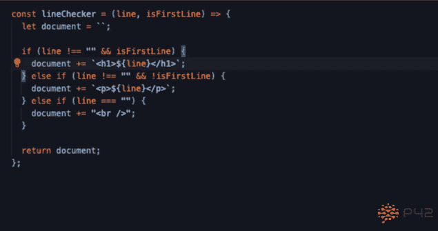
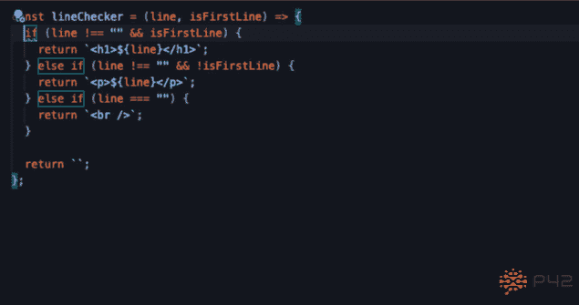
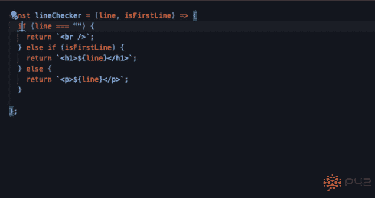

# 用 12 个自动化重构简化 JavaScript 函数

> 原文：<https://betterprogramming.pub/simplifying-a-javascript-function-with-12-automated-refactorings-24fa92d364c>

## 在 VS 代码中使用重构助手


连续执行许多自动化重构是快速改进代码的一种有效方法。这种方法相对于手工重构的优势在于，它不太可能引入错误，而且使用正确的键盘快捷键通常会更快。然而，链接重构是一种艺术，因为它可能涉及非直观的操作来实现进一步的步骤。

这篇博文展示了一个例子，展示了如何在不改变行为的情况下，通过 12 次自动化重构来简化一个小的 JavaScript 函数。我将使用 [Visual Studio 代码](https://code.visualstudio.com/)和 [P42 JavaScript Assistant 重构扩展](https://marketplace.visualstudio.com/items?itemName=p42ai.refactor)。

最初，该函数(来自这篇[博客文章](https://dev.to/luigizaccagnini/refactoring-code-in-octo-3397))看起来如下:

```
const lineChecker = (line, isFirstLine) => {
  let document = ``; if (line !== "" && isFirstLine) {
    document += `<h1>${line}</h1>`;
  } else if (line !== "" && !isFirstLine) {
    document += `<p>${line}</p>`;
  } else if (line === "") {
    document += "<br />";
  } return document;
};
```

重构后，函数变得更短，也更容易理解:

```
const lineChecker = (line, isFirstLine) => {
  if (line === "") {
    return `<br />`
  } return isFirstLine ? `<h1>${line}</h1>` : `<p>${line}</p>`;
};
```

以下是我重构该函数的步骤:

# 简化控制流程并删除变量

第一次重构消除了文档变量，简化了控制流。这种变化使得推理函数变得更容易，因为状态更少(即，没有文档变量)并且几个执行路径提前返回。

1.  **将** `**+**` **从** `**+=**` **赋值中拉出，变成常规字符串串联**。这一步允许在下一步中引入早期 return 语句。
2.  **用提前返回语句替换重新分配** `**document**` **变量。**这一步简化了控制流，并支持内联`document`变量。
3.  **行内** `**document**`行内**变量**。这一步删除了一个不必要的变量，并允许在下一步中删除空字符串。
4.  通过将空字符串合并到模板中来删除它们。

应用这些步骤后，函数如下所示:

```
const lineChecker = (line, isFirstLine) => {
  if (line !== "" && isFirstLine) {
    return `<h1>${line}</h1>`;
  } else if (line !== "" && !isFirstLine) {
    return `<p>${line}</p>`;
  } else if (line === "") {
    return `<br />`;
  } return ``;
};
```



# 简化条件并删除代码

下一个目标是简化 if 语句中的条件，并删除死代码或不必要的代码。这一变化进一步降低了函数的复杂性，使其更容易理解，因为代码更少，条件更简单。

1.  **将** `**isFirstLine**` **条件分离成嵌套的 if 语句。**
2.  **从** `**!==**` **拉起否定。**这两个步骤为删除多余的 else-if 条件做准备。
3.  **删除 else-if** 上的冗余条件，因为它始终为真。在删除多余的 else-if 条件后，最终的`return`语句显然是不可达的。
4.  **删除无法访问的代码。**不可及的代码毫无用处，毫无益处地消耗了我们的一些注意力。移除它几乎总是更好。
5.  **把否定推回** `**===**` **。这个重构恢复了先前的一个步骤，这个步骤对于进一步的重构是暂时必要的。**
6.  **反转** `**!==**` **条件并合并嵌套 if。**由此产生的`line === ""`条件更容易理解，因为没有否定。更好的是，它允许将内部 if 语句提升到 else-if 序列中，并指示空行处理可能是一种特殊情况。

应用这些步骤后，函数如下所示:

```
const lineChecker = (line, isFirstLine) => {
  if (line === "") {
    return `<br />`;
  } else if (isFirstLine) {
    return `<h1>${line}</h1>`;
  } else {
    return `<p>${line}</p>`;
  }};
```



# 提高可读性

最后一组重构旨在通过将特例`line === ''`移入一个 guard 子句并使用条件返回表达式来提高可读性。

1.  将`line === ''`条件转换为 guard 子句。
2.  用条件表达式简化返回。
3.  格式，例如保存时用[更漂亮的](https://prettier.io/)。

以下是最终结果:

```
const lineChecker = (line, isFirstLine) => {
  if (line === "") {
    return `<br />`
  } return isFirstLine ? `<h1>${line}</h1>` : `<p>${line}</p>`;
};
```



# 其他注意事项

这篇博文展示了如何使用自动化重构来简化 JavaScript 函数而不改变其行为。实际上，还有许多其他考虑因素:

*   自动化测试覆盖范围自动化测试对于确信重构没有无意中改变代码的行为是必不可少的。当存在容易出错的手动重构步骤时，这一点尤为重要。当测试覆盖率不足时，在重构代码之前添加测试是至关重要的。
*   **发现潜在的错误**
    更简单的代码可以发现潜在的错误，您可以在重构完成后调查这些错误。在这里的例子中，即使当`isFirstLine`是`true`时，函数也会返回一个`<br />`，这可能不是预期的行为。
*   **其他重构**
    从这篇博文来看，重构函数的方法有很多。我着重于简化函数，但是重命名或者甚至分解它也是可能的。查看帖子"[你将如何重构这个 JS 函数？](https://dev.to/p42/how-would-you-refactor-this-js-function-4n71)“求更。

我希望这篇文章能让你了解如何对自动化重构步骤进行排序，以实现更显著的重构变化。