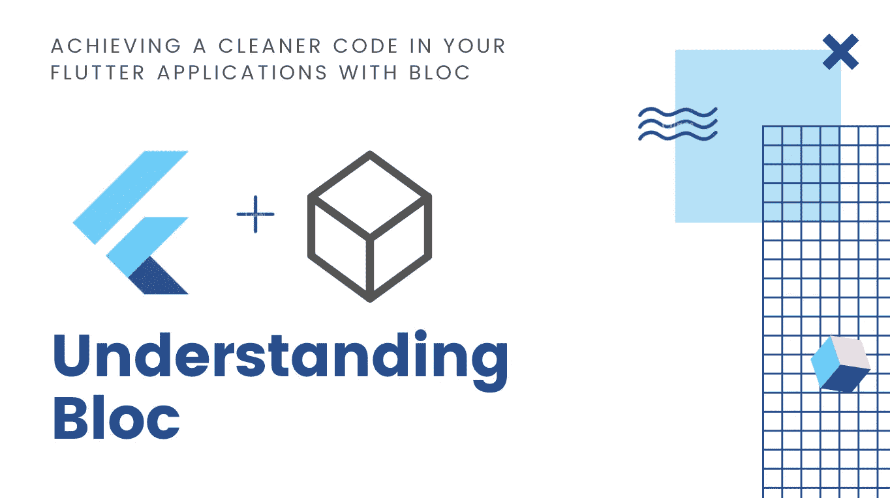
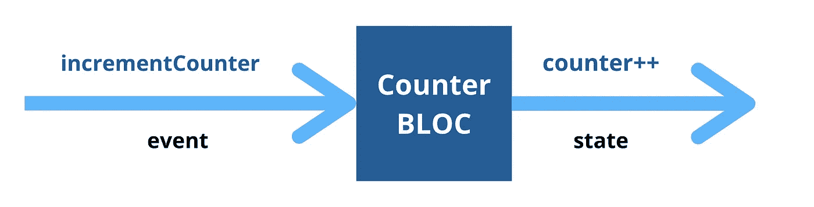
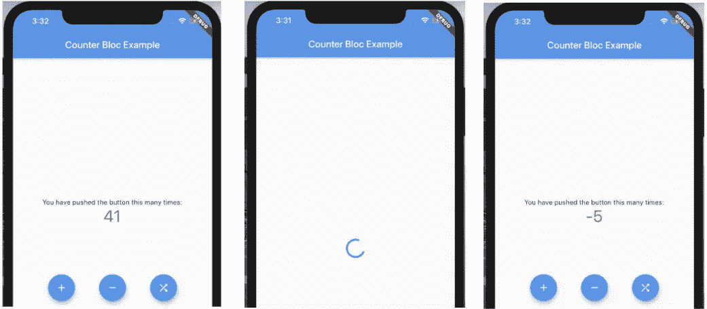
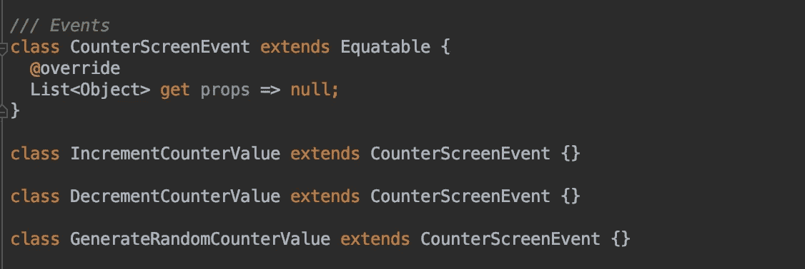
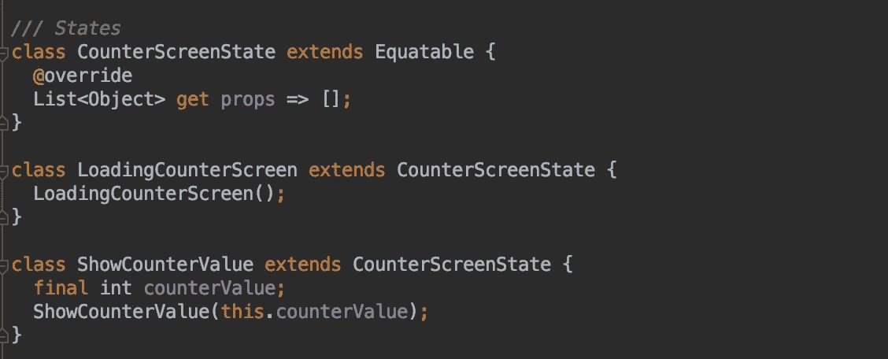
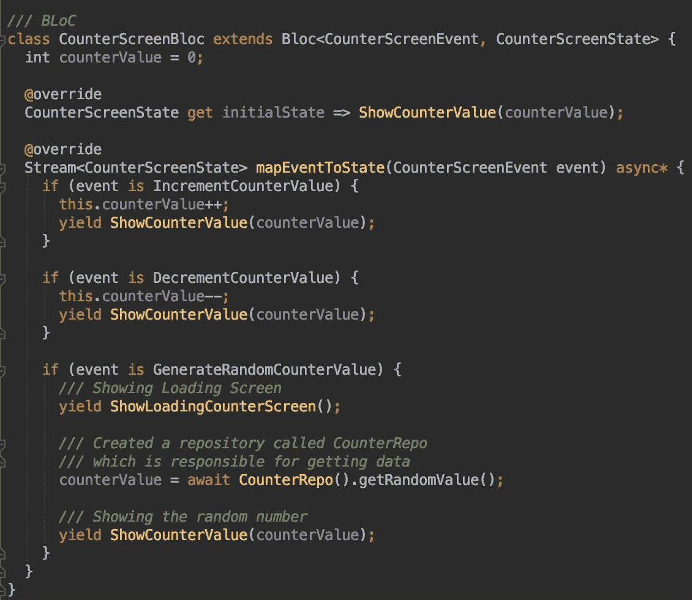
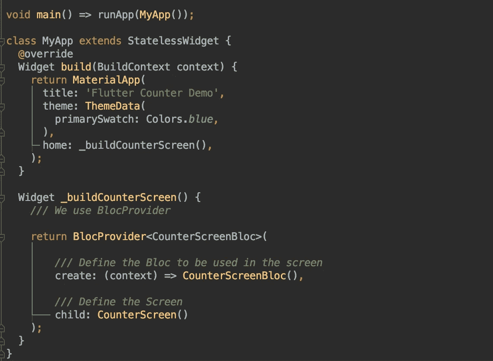
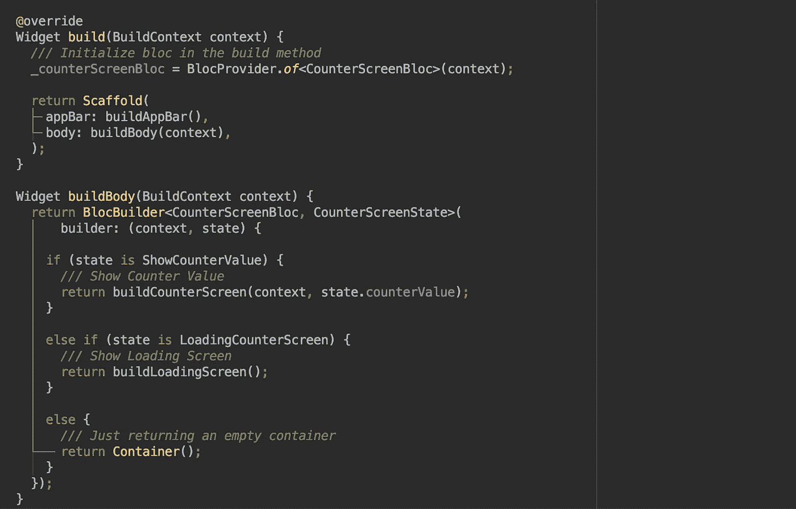

# 简化颤振中的阻塞状态管理

> 原文：<https://betterprogramming.pub/simplifying-bloc-state-management-in-flutter-a8de43a994e4>

## 用 Bloc 实现 Flutter 中更干净的代码



如果你一直在开发 Flutter 应用程序，你应该知道以最好的方式管理应用程序的状态是至关重要的。

Flutter 为我们提供了许多状态管理选项，比如 Provider、Bloc、Redux 和 MobX。

今天，我们来看看集团。

我知道这可能有点难以理解，对我来说也是如此。但现在我想我明白了，所以我来为你简化一下。

我们知道，在 Flutter 中，很容易将 UI 逻辑与业务逻辑混淆，这并不是开发可维护应用程序的最佳方式。

Bloc 为你的应用程序提供了一个更好的结构——通过分离应用程序的 UI 和业务逻辑。但是在我们进入如何实现它之前，让我们先了解一下…

这篇文章会有点长，但是作为一个初学者，到最后你会对如何使用 Bloc 充满信心。

# **Bloc** 到底是什么？

*Bloc* 代表*业务逻辑和组件。*它就像一个黑匣子，把你所有的业务逻辑(和相关的组件)包装起来，把各种 app 事件映射到 app 状态。


如果这个定义对你来说太专业了，让我们通过几个例子来更好地理解它。

## 如果您正在使用天气应用程序:

你的应用程序中会有各种各样的事件，比如`getWeather()``setLocation()`和`resetWeather()`，这些事件会被用户的动作或者你的应用程序的一些内部逻辑所触发。

成功执行操作后，这些操作将相应地用新状态更新您的应用程序的 UI。

## ***再比如——默认的颤振计数器 app***

这里只有一个事件，那就是`incrementCounter`，它生成新的状态，显示计数器的递增值。



`bloc`是一个黑盒，告诉你应该对哪个事件执行哪个操作，然后在操作完成后应该产生哪个状态。

# 你如何为你应用程序定义阻塞？

## 要付出一点小小的代价

Bloc 的一个主要缺点是我们必须编写大量的样板代码——即使是最小的 UI 更改。

这是我到目前为止看到的唯一缺点，但它确实通过将所有 UI 逻辑从业务逻辑中分离出来简化了你的应用程序代码。

因此，您可以将所有样板代码作为一种投资，使您的代码易于维护和理解。

## 这是你得到的

例如，假设您正在使用 Bloc 构建一个天气应用程序。您已经定义了所有的事件和状态，您的应用程序运行良好。

现在，如果您必须在同一个屏幕中添加另一个功能，您可以非常简单地在您的`bloc`中定义一个新事件和一个新状态，以及如何将新事件映射到一个新状态的一点逻辑。

你完了！你不需要接触/干扰其他已构建的事件和状态，你可以非常简单地添加你的新特性集，不会有太大的问题。

这类似于固体原理的开闭原理告诉你要做的事情。

# 我们将会建造什么



我们将构建一个计数器应用程序的修改版本，这将帮助您更清楚地了解`bloc`。

将有四个按钮:

*   **递增计数器值:**即时更新计数器值
*   **递减计数器值:**立即更新计数器值
*   **生成随机值:**我们将模拟一些延迟，然后更新该值

如果你理解了需求，你可以看到我们上面加粗的是事件，冒号右边的解释是状态。

# 1.将这些依赖项添加到您的 pubspec.yaml 中

截至 2020 年 3 月，我将为 Flutter 添加这种依赖性。

```
flutter_bloc: ^3.2.0
equatable: ^1.1.0
```

`[bloc](https://pub.dev/packages/bloc)`是由 bloclibrary.dev 团队创建的库，它提供了`bloc`模式的核心基础。但是它稍微复杂一点——因此，我们得到了 `flutter_bloc`,由同一个团队创建，只是为了让 Flutter 开发者更容易。

谢谢团队！

# 2.创建您的“集团”类

我的 UI 代码将在`counter_screen.dart`文件内的`CounterScreen`中。
(我们稍后会谈到 UI 部分。)

用名称`counter_screen_bloc.dart`为您的`bloc`类创建一个新的 Dart 文件。我们将定义这个`bloc`类文件。

在`bloc`屏幕中，我们将定义三样东西:

*   **事件:**显示所有可能的事件
*   **状态:**显示所有可能的状态
*   如何将这些事件映射到状态

这些是后续步骤所需的导入语句。

```
import 'package:bloc/bloc.dart';
import 'package:equatable/equatable.dart';
```

# 3.定义事件

在空白的`bloc`类文件中，首先定义一个事件。

我把它命名为`CounterScreenEvent`。



`Equatable`使我们的类等价/可比，这是`bloc`类内部映射逻辑所需要的。

`Equatable`要求您像我们在这里所做的那样覆盖`get props`。

# 4.定义状态

在这些下面，让我们定义每一个将被映射到的状态。



## **为什么，就两个状态？**

用户要么会在屏幕上看到递增/递减的计数器值，要么会在我们试图生成模拟网络呼叫的随机数时看到加载屏幕。

`ShowCounterValue`状态将有一个与之相关联的计数器值。因此，我们在该类中定义了一个名为`counterValue`的属性，帮助您将计数器值从 Bloc 传递到应用程序的 UI。

# 5.最后，定义我们的“集团”

是的，我们终于可以定义我们的`bloc`。

```
*/// BLoC* class **DashboardScreenBLoC** extends Bloc<**CounterScreenEvent**, **CounterScreenState**> { **int counterValue = 0;**@override
  CounterScreenState get **initialState** => **ShowCounterValue**(**counterValue**);

  @override
  Stream<CounterScreenState> **mapEventToState**(CounterScreenEvent event) **async*** {
    // *TODO : Map event to state* }
}
```

*   在第一行中，我们有`DashboardScreenBloc`，它扩展了前面定义的`Bloc<Event,State>`
*   我们为我们的计数器值定义了一个名为`counterValue`的属性，它将用于维护我们的计数器的状态
*   现在我们要定义`initialState`。当`bloc`加载时，初始状态将被设置为`ShowCounterValue(counterValue)`。
*   最后，我们有一个`mapEventToState`函数(正如它的名字所表示的那样)。如果你看一下这个函数，你会看到它被标记为`async*`。

为了让大家保持一致，我将解释一下
`async`和`async*`。

如果您的函数在执行某个操作后返回一个未来值，我们将该函数标记为`async`。这些函数只返回值一次，它们的执行以 return 语句结束。

另一方面，标记为`async*`的函数返回一个流。这个函数产生不同的值，并不只是返回它们。它们的执行仍在继续，并且它们可以产生您想要的任意多的值。

这就是为什么它们的输出被称为*流。*

让我们通过将事件映射到状态来结束我们的`bloc`。



下面是完整的`counter_screen_bloc.dart`代码。

```
Important Thing To Know
```

关于`bloc`需要知道的一件重要事情是，如果`nextState == currentState`的计算结果为`true`，那么`bloc`会忽略状态转换。

如果您不将 state 类扩展为`Equatable`，那么您将从`yield`调用的所有状态都将被视为唯一的。

如果这符合您的要求，您不应该太麻烦，但是如果有可能会出现一个接一个重复的状态，为什么要浪费您的性能来重建相同的状态呢？

因此，我们扩展了`Equatable`并覆盖了`props`方法。

```
class ShowCounterValue extends CounterScreenState {
  @override
  List<Object> get props => [counterValue]; final int counterValue; ShowCounterValue(this.counterValue);
}
```

如果你不覆盖`props`方法，你的`bloc`将不知道如何比较这两个状态类，并且很可能将它们视为相同。因此，您不会看到新状态被触发。

# 6.让我们在用户界面上工作

## **从 main.dart 开始**



因为我们在名为`CounterScreen`的 UI 中使用了名为`CounterScreenBloc`的`bloc`，所以我们使用了一个`BlocProvider`并定义了哪些`bloc`必须提供什么。

这里是完整的`main.dart`代码。

## **让我们看看里面的** `**'counter_screen.dart’**`

在`CounterScreen`的`build`函数中，我们必须初始化`bloc`。类似地，在 dispose 函数中，我们必须关闭我们的`bloc`来避免内存泄漏。

```
It's a good practice to dispose the bloc in the **dispose()** function of the same widget whose **build()** you may have used to initialize the bloc.
```



以下是完整的`counter_screen.dart`:

就是这样！你应该有一个正常工作的项目。

下面是整个项目的代码:

[](https://github.com/devDeejay/Flutter_Bloc_Counter_Example) [## devDeejay/Flutter _ Bloc _ Counter _ Example

### 新的颤振应用。这个项目是颤振应用的起点。一些资源让你…

github.com](https://github.com/devDeejay/Flutter_Bloc_Counter_Example) 

# 结论

就是这样！这就是你需要知道的，用干净的代码构建一个超棒的 Flutter 应用程序——这都要感谢 Bloc。

同样，您看到的样板代码是保持代码可维护性的一种投资。

也正因为如此，我不建议你在所有的屏幕上都应用它——只有在涉及到很多不同状态的时候。

否则， [Provider](https://pub.dev/packages/provider) 是另一个很好的状态管理解决方案，可以在应用程序中提供更简单的特性。