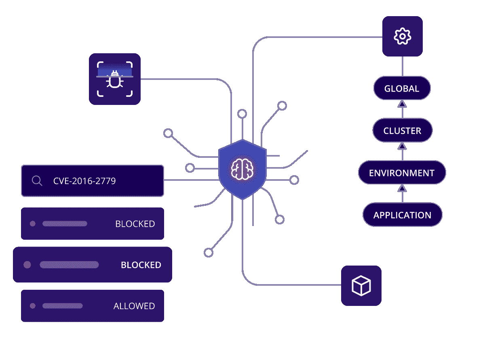
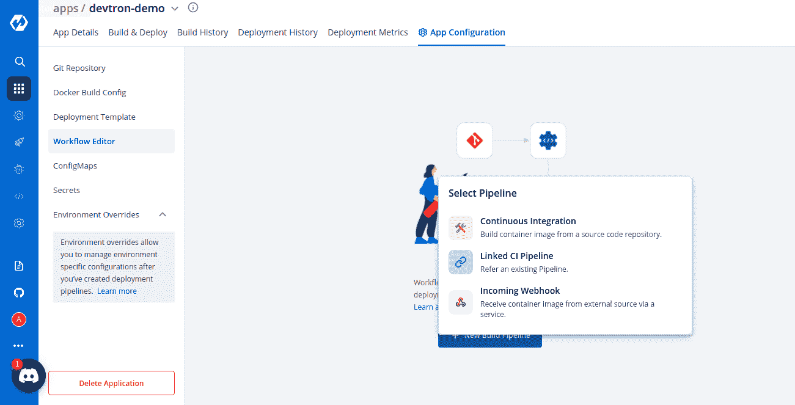
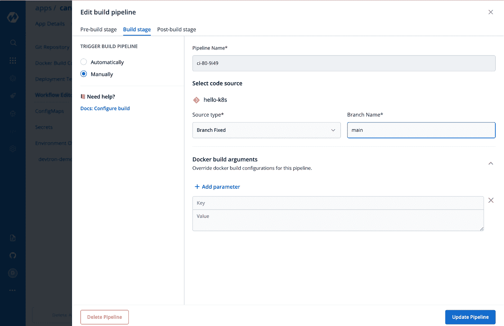
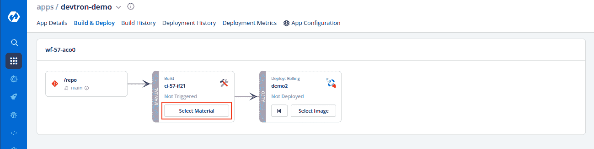
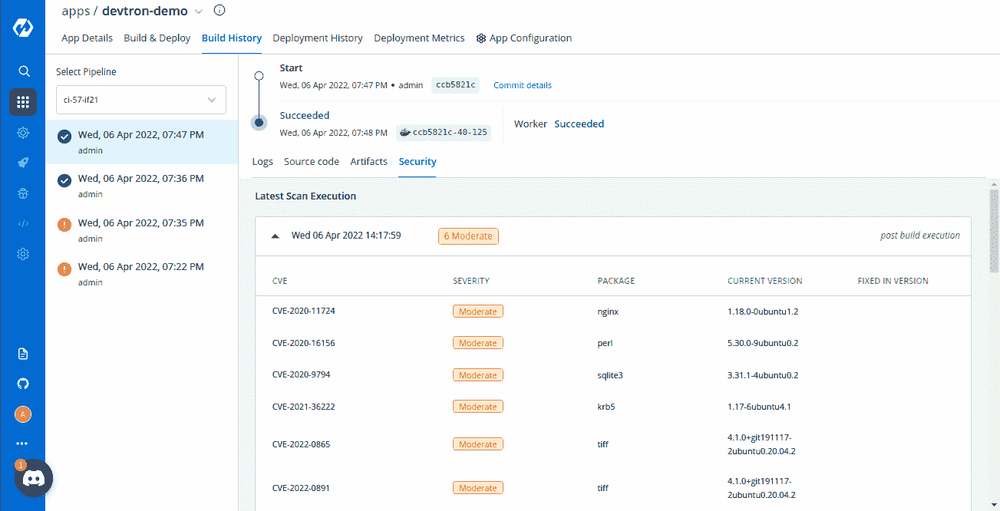
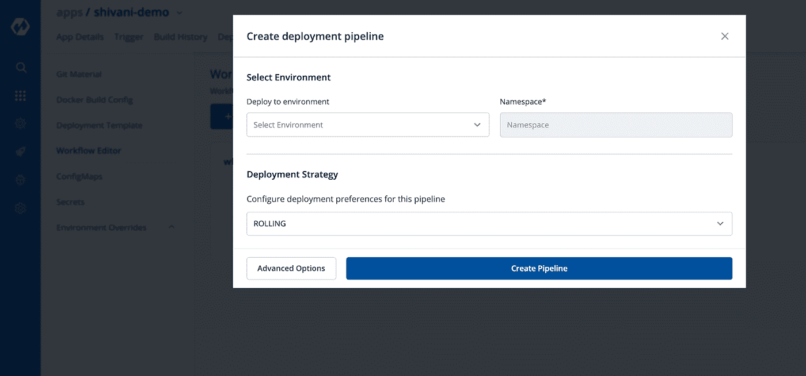
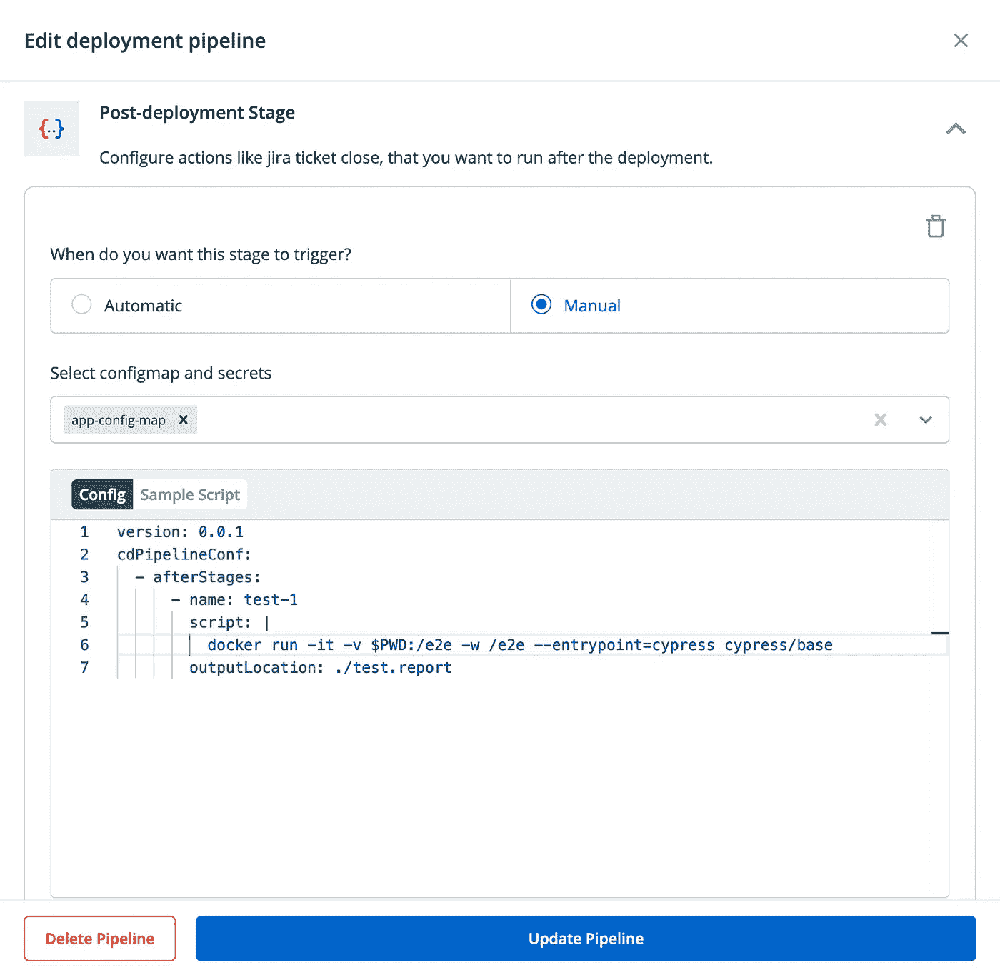
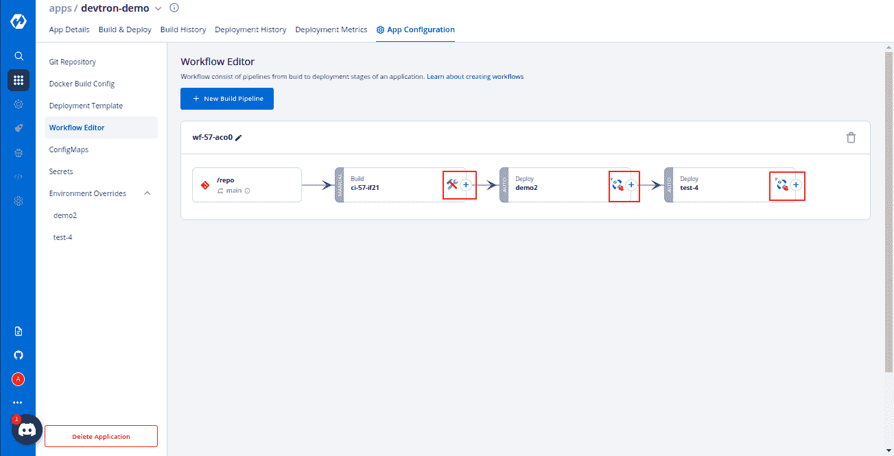

# 使用 Devtron 简化 Kubernetes CI/CD

> 原文：<https://betterprogramming.pub/simplifying-ci-cd-with-devtron-a4e1eae80779>

## 如何让开发者实现一个有效的 CI/CD 管道而不用处理 YAML



当组织考虑培养 DevOps 文化时，构建有效的持续集成(CI)和持续部署(CD)管道通常是成功的第一步。如今，基础设施团队拥有过多的开源和授权工具，如 Jenkins、CircleCI、Github Actions 和 ArgoCD，来实现各种 CI/CD 管道和部署策略。然而，这些工具中的大多数依赖于复杂的 YAML 模板来触发管道，这可能会阻碍那些只想简单地构建应用程序并将其部署到云原生环境的开发人员。

Devtron 是一个开源的软件交付工作流程编排器，内置 CI/CD 生成器来解决这个问题。在本文中，我们将回顾如何通过 Devtron 配置一些常见的 CI/CD 步骤。

# CI 管道

在 Devtron 中，CI 管道可以通过 CI 工作流编辑器(从代码存储库触发)创建，链接到现有管道(如模板)，或通过传入的 webhook 与外部提供商集成。



要创建新的配置项管道，选择“持续集成”选项打开**工作流编辑器:**


开发人员无需通过 YAML 文件指定各种分支类型和触发器，只需选择源类型(如分支、PR、标记)或分支名称即可触发管道。Devtron 在 CI 步骤中提供了三个简单的阶段:

1.  预构建阶段:在构建容器映像之前要运行的任务(例如，林挺、单元测试)
2.  构建阶段:创建容器映像
3.  构建后阶段:创建映像后要运行的任务(例如，扫描漏洞)



构建向导将指导您设置这些配置参数。如果团队已经有一个现有的 CI 模板，开发人员可以选择链接该管道或集成外部工具(如果团队从遗留提供商(例如 Jenkins)迁移)。

如果管道设置为自动触发，要么提交到分支，要么提交 PR 来触发操作。或者，用户可以点击“选择材料”来触发构建。



在“Build History”选项卡下，如果在“advanced options”下启用了该功能，开发人员还可以看到漏洞。这种内置的集成是避免手动添加开源扫描仪(例如 Anchore、Clair、Trivy)或付费工具(例如 Jfrog Xray)的好方法。



# CD 管道

一旦设置了 CI 管道，我们就可以扩展管道以包括 CD 部分。只需通过工作流编辑器单击管道的(+)号，然后选择部署环境(即目标命名空间/集群)和部署策略。



与 CI 部分一样，CD 也有三个不同的阶段:

1.  预部署阶段:在应用程序部署之前执行数据库/模式迁移或配置设置非常有用
2.  部署阶段:利用四种策略(重新创建、金丝雀、蓝绿色和滚动升级)中的一种[进行部署的步骤，可根据使用案例进行配置](https://docs.devtron.ai/devtron/user-guide/creating-application/workflow/cd-pipeline#deployment-strategies)
3.  部署后阶段:在部署后运行，以更新吉拉票证、发送通知或运行清理任务

所有这些阶段都可以使用工作流编辑器进行配置。由于 CD step 更加开放，更复杂的工作流将需要编写一些 YAML，但每个阶段的配置相对较少。

使用如下配置，将预部署阶段配置为自动运行或手动运行。以下示例显示了如何使用 Flyway 来管理数据库迁移。


部署后阶段的工作方式与部署前阶段类似:



部署后，您可以在较低的环境中运行冒烟测试或端到端测试。如上所示，您可以使用一个节点或者 cypress docker 映像来运行测试:

```
$ docker run -it -v $PWD:/e2e -w /e2e --entrypoint=cypress cypress/base
```

最后，如果必须按顺序触发多个部署或特殊作业，可以链接这些管道来创建顺序管道。要创建顺序管道，请单击现有管道组件右侧的`+`符号来添加新作业:



这些管道可以链接起来，以便按顺序部署到多个环境中(例如，开发→质量保证→ UAT →生产)。

# 结论

如今市场上有如此多的选择，大多数团队在没有拼凑大量工具的情况下努力创建一个内聚的 CI/CD 体验。虽然这些工具的灵活性提供了巨大的价值，但是对于一些团队来说，仅仅建立一个简单的管道就足够了。这就是 Devtron 可以提供价值的地方，它通过一个直观的小部件来指导开发人员建立一个为云原生应用程序做好准备的管道。

## 资源

*   [使用 CI/CD 管道部署示例应用的完整端到端演示](https://dzone.com/articles/zero-to-hero-on-kubernetes-with-devtron)
*   [安装 Devtron 并部署样本舵图](https://medium.com/dev-genius/devtron-open-source-software-delivery-workflow-for-k8s-23bd136efe06)