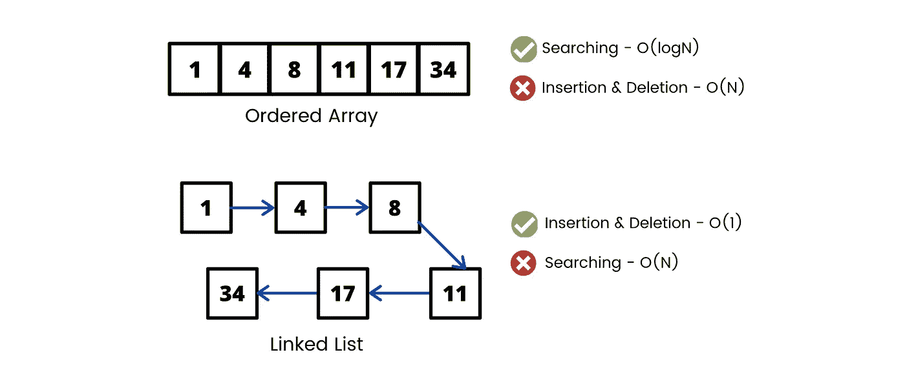
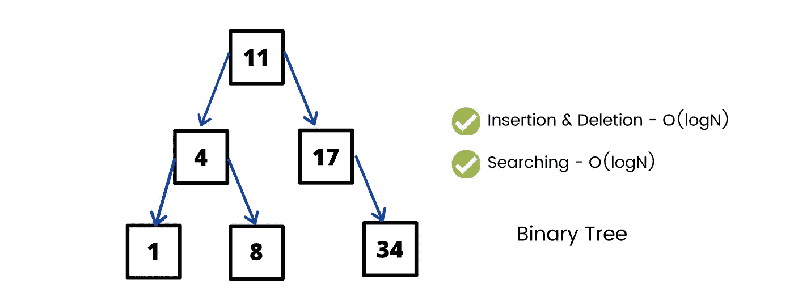
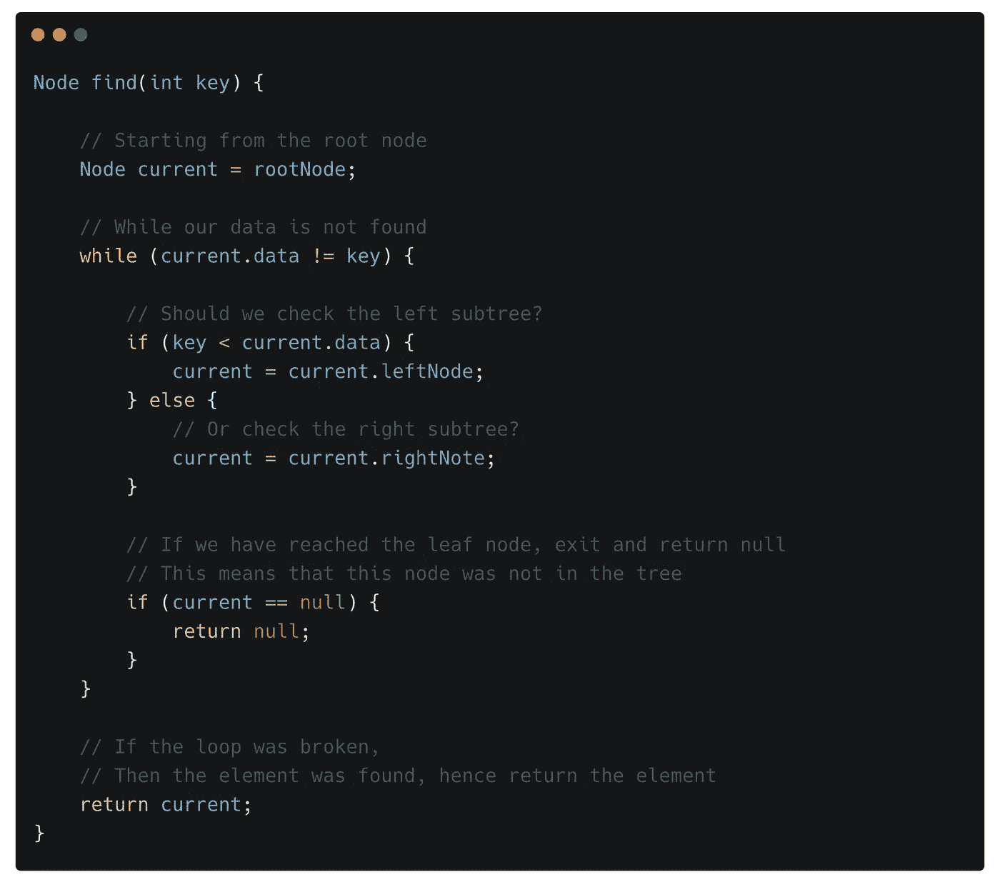
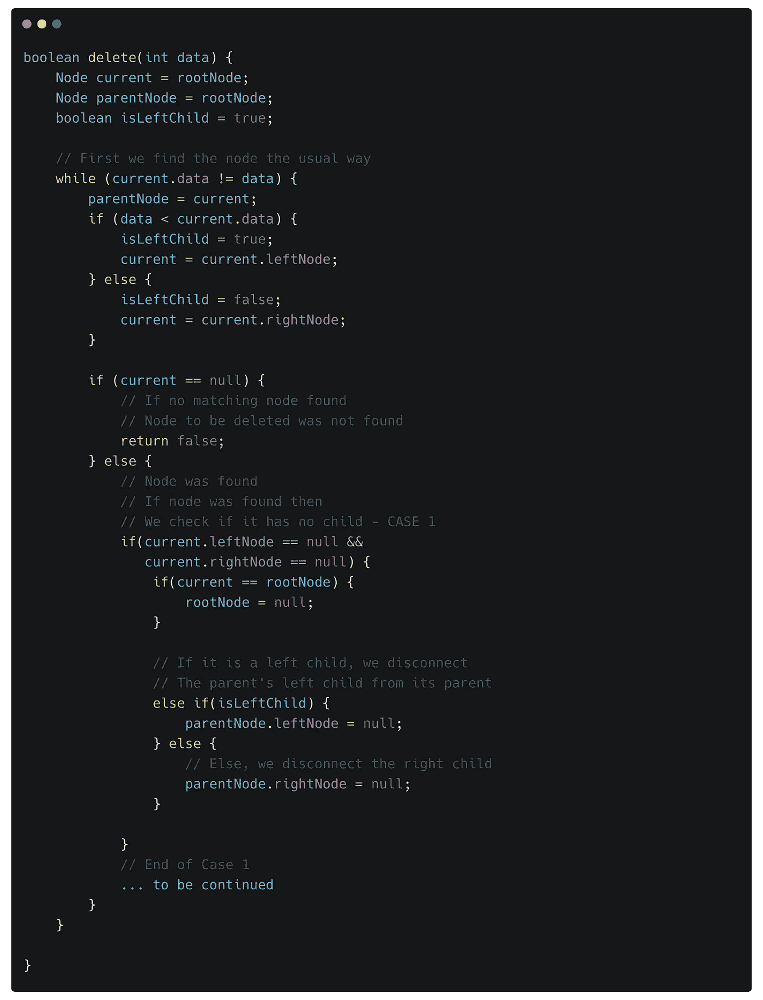
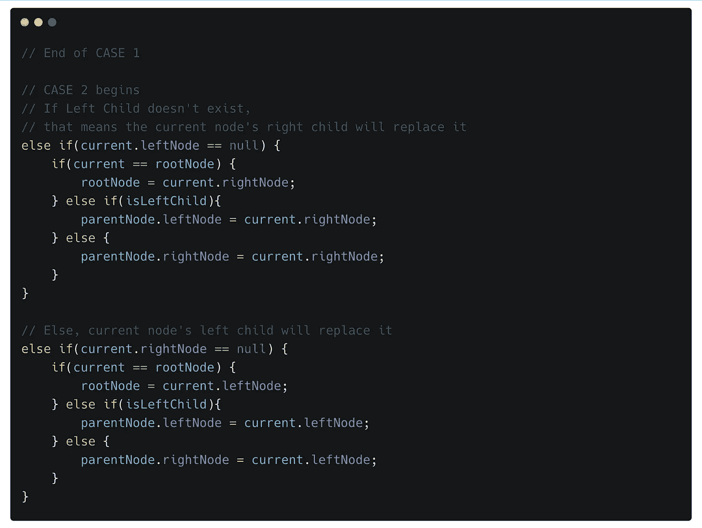
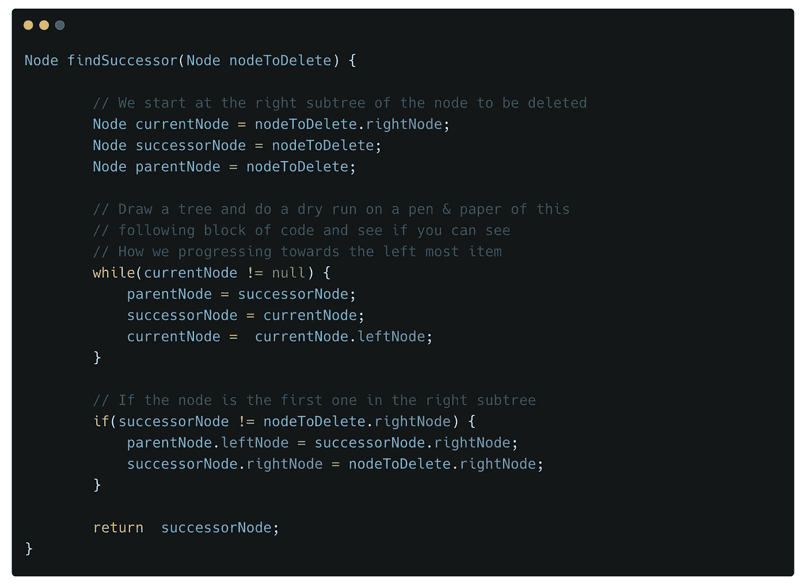
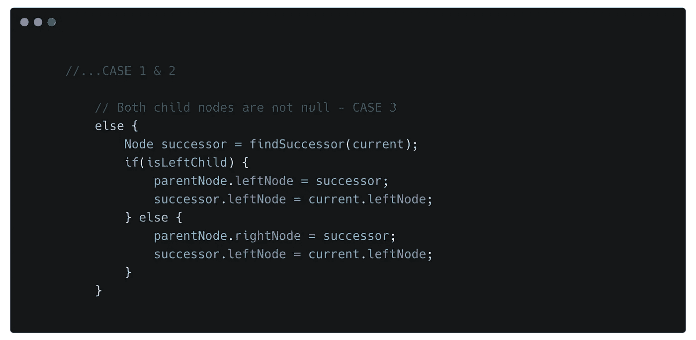

# 简化二叉树数据结构

> 原文：<https://betterprogramming.pub/simplifying-the-binary-trees-data-structure-8a08e640cc48>

## 成为编码二叉树的忍者


[马约菲](https://unsplash.com/@mayofi?utm_source=medium&utm_medium=referral)在 [Unsplash](https://unsplash.com?utm_source=medium&utm_medium=referral) 上拍照

树是一种重要的数据结构，因为它们提供了优于其他传统数据结构的主要优势。树结合了有序数组和链表的优点:

*   有序数组的搜索速度很快，而链表的插入和删除速度很快。
*   但是在链表中搜索很慢，对于有序数组插入和删除也很慢。



比较搜索和插入/删除操作-时间复杂度



# 二叉树

如果一棵树的每个节点最多可以有*个*个子节点，那么该树称为*二叉树。*

*   二叉树在表示代数表达式和编译器解析语法方面非常有用。
*   它们也用于压缩算法，如霍夫曼编码树。

## 代码入门

让我们从最简单的树节点开始。每个树节点都有自己的 ID 和一些数据。

因为它是一个二叉树，我们的节点可以保存对另外两个节点的引用，即`left`和`right`节点。

二叉树的节点类

让我们来看看`BinaryTree` 类。我们的二叉树只需要包含`Root`节点，它的类型是`Node`。

然后，您可以对您的树执行各种操作——我们一会儿将逐一查看它们。

二叉树类—包含根节点和其他与树相关的方法

# 二叉树操作

## 1.寻找节点

在一棵树中，我们只能直接访问根节点，所以我们的搜索算法将从那里开始。

然后，我们检查我们想要查找的项目是在左子树中还是在右子树中。我们来看看简单的[代码](https://gist.github.com/devDeejay/fd1e869e6e856257703fc26ec961c4fc):



该搜索算法的时间复杂度为 O(logN)。

## 2.插入节点

要插入一个节点，我们首先要确定它应该被插入的位置，除非内存不足，否则这个位置总是可以找到的。

我们将从根节点开始，检查它是否存在。如果没有，我们的新节点将成为根节点——这是最简单的情况。

如果我们的根节点存在，那么我们将检查我们的新节点数据应该放在根节点的左边还是右边。如果新数据少于根节点的数据，它将向左移动。否则，一切都会好的。我们重复这个过程，直到我们找到一个地方。

我们还需要在代码中保留对父节点的引用，这样我们就可以在正确的父节点插入子节点。

让我们[编码](https://gist.github.com/devDeejay/79db24202de25e30a683bcba3775d3ce)它。


要理解*删除*，我们必须理解*树的遍历。*

## 3.遍历树

遍历树意味着以指定的顺序访问节点。

树的遍历并不是一个快速的过程，在很多算法中非常有用，我们稍后会了解到。

有三种类型的树遍历:

**顺序遍历/中缀符号**

*Inorder traversal* 允许我们以升序访问我们的树，这意味着将从低到高访问节点。这显然意味着我们按以下顺序访问树:

*   处理左侧节点/子树
*   处理当前节点
*   处理右边的节点/子树

*Process* 可以表示任何东西，但是对于我们的目的，我们只是打印节点的数据。

代码可以表示为一个简单的递归函数:

```
void **inorderTraversal**(Node node) {
    if(node != null) {
        **inorderTraversal**(node.leftNode);
        System.*out*.println(node.data);
        **inorderTraversal**(node.rightNode);
    }
}
```

**前序遍历/前缀符号**

在*前序遍历中，*我们遵循这个顺序:

*   处理当前节点
*   处理左侧节点/子树
*   处理右边的节点/子树

代码可以表示为一个简单的递归函数:

```
void **preOrderTraversal**(Node node) {
    if(node != null) {
        System.*out*.println(node.data);
        **preOrderTraversal**(node.leftNode);
        **preOrderTraversal**(node.rightNode);
    }
}
```

**后序遍历/后缀符号**

在*后序遍历中，*我们遵循这个顺序:

*   处理左侧节点/子树
*   处理右边的节点/子树
*   处理当前节点

代码可以表示为一个简单的递归函数:

```
void postOrderTraversal(Node node) {
    if(node != null) {
        postOrderTraversal(node.leftNode);
        postOrderTraversal(node.rightNode);
        System.*out*.println(node.data);
    }
}
```

## 4.寻找最小和最大元素

我相信您现在已经猜到了:在二叉查找树中，最左边的节点是最小值，最右边的节点是最大值。

```
Node **minimumElement**() {
    Node currentNode = rootNode;
    Node lastNode = null;

    **// We traverse the left subtree
    // Until we find a null at the left place
    // Then we just return the last not-null node**
    while(currentNode!=null) {
        lastNode = currentNode;
        currentNode = currentNode.leftNode;
    }
    return lastNode;
}
```

同样，对于最大元素:

```
Node **maxElement**() {
    Node currentNode = rootNode;
    Node lastNode = null;

   ** // We traverse the right subtree
    // Until we find a null at the right place
    // Then we just return the last not-null node**
    while(currentNode!=null) {
        lastNode = currentNode;
        currentNode = currentNode.rightNode;
    }
    return lastNode;
}
```

## 5.删除节点

删除树节点是最复杂的操作。但我们会一起掌握它。

首先，我们必须找到要删除的节点，然后我们有三种可能的情况:

1.  **要删除的节点没有子节点**

这是一个简单的例子——我们可以简单地从它的父节点中删除它的引用，然后这个节点就会从树中被删除。

我们不担心删除节点，我们只是从树中删除它的引用。Java 垃圾收集会处理未被引用的变量。



2.**要删除的节点有一个子节点**

如果要删除的节点只有一个子节点，该子节点将成为它的后继节点。我们只需要检查是左孩子还是右孩子。



3.**要删除的节点有两个子节点**

真正的乐趣从这里开始。真的没那么复杂。

要记住的简单规则是，要删除的节点应该由它的有序后继节点(下一个最大的节点)替换，因为它是一个二叉查找树。

我们首先转到要删除的节点的右边的子节点，然后我们向最左边的子节点移动，这将是我们的后继节点。简而言之，我们必须找到要删除的节点的右子树中的最小元素。

让我们编写`findSuccessor`方法的代码:



用笔和纸，用一棵假想的二叉树来做这个练习

一旦我们找到了后继者，我们就用它的后继者替换将要删除的节点，这取决于左右方向。



# 结论

下面是删除方法的[完整代码。](https://gist.github.com/devDeejay/cfbb2ee5db7ed5d3f7cfb29d05122bce)

这里有一个包含所有方法的[代码片段。](https://gist.github.com/devDeejay/8322a3ad7f938aeb986c4e255436ab9f)

```
Time Complexity:Look Up - O(Log N)
Insertion - O(Log N)
Deletion - O(Log N)
```

至此，你已经完成了所有重要的二叉树操作。一定要为自己走到这一步而感到自豪。我真的为你感到骄傲！

感谢您的阅读！

# #奖励积分

## 完美二叉树

*   每个节点恰好包含两个子节点，树是好的，直到所有节点都有子节点，我们才移动到下一级。
*   当我们移动到每一层时，节点的数量就会翻倍。
*   第 n 层的节点数=前几层的节点总数+ 1。

```
The number of nodes at nth level will be = (2^n)The number of nodes in total when the height is ‘h’ = (2^h) - 1
```

这样，我们一半的数据位于最后一个节点，因此在访问它们时，我们往往会跳过许多其他元素，这将我们的时间复杂度降低到 O(log n)。

如果树是不平衡的，那么它将表现得像一个长链表，因此我们的树应该尽可能接近完美的二叉树，这样你就可以真正地拿走树的最佳性能。