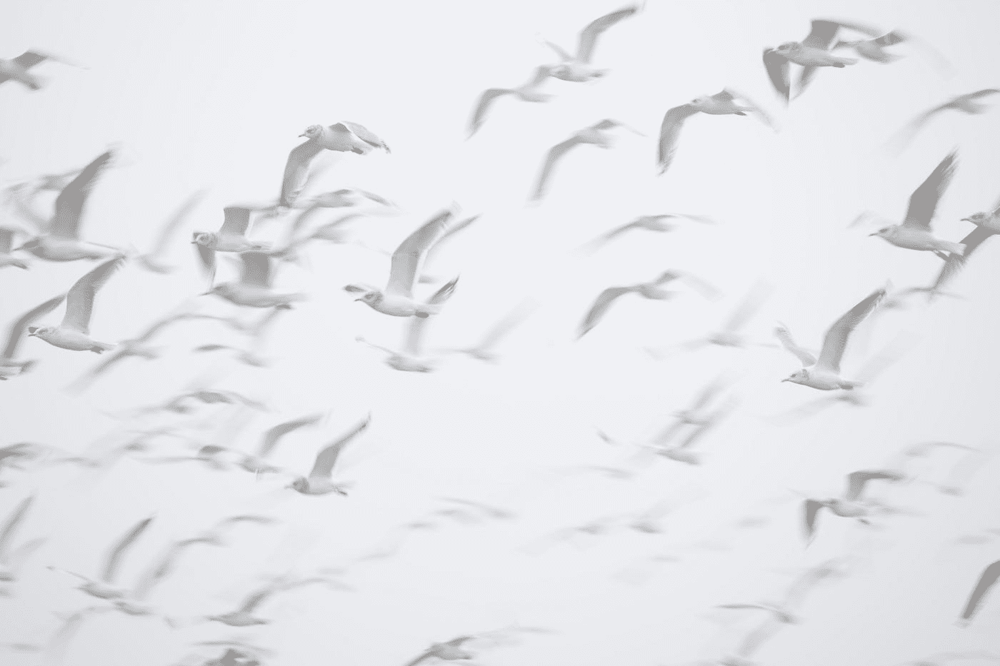

# 使用颤动火焰模拟鸟群

> 原文：<https://betterprogramming.pub/simulate-birds-flocking-using-multi-agent-system-and-flutter-flame-69e8b1aca4ef>

## 一个深入的指南，这个迷人的项目使用多代理系统

thom masat 在 [Unsplash](https://unsplash.com?utm_source=medium&utm_medium=referral) 上拍摄的照片

# 介绍

## 关于多智能体系统

> 多智能体系统(或“自组织系统”)是由多个相互作用的智能体组成的计算机化系统。多智能体系统可以解决单个智能体或单一系统难以或不可能解决的问题。智能可能包括方法、功能、程序方法、算法搜索或强化学习。[维基](https://en.wikipedia.org/wiki/Multi-agent_system)。

正如你所看到的，构建一个多智能体系统是一个用很少的参数来模拟和理解复杂系统的聪明方法。每个代理必须是自治的，本地知道它的环境，并且对其他代理没有权限。你可以在网上交易、灾难响应、监视、结构建模和像模拟城市这样的视频游戏中找到这种系统。

## 目标

本文的主要目的是熟悉多智能体系统，并用[颤振火焰](https://docs.flame-engine.org/1.4.0/)进行实验。为此，我决定模拟一群鸟。首先，它看起来非常令人满意，其次，我们可以调整参数，如它们的飞行能力或视野，看看它如何影响它们的感知行为。

> 在[这篇文章](http://www.cs.toronto.edu/~dt/siggraph97-course/cwr87/)中了解更多信息。

## TL；速度三角形定位法(dead reckoning)

在我的 GitHub 上获取完整的项目。玩它或者[看它在那里直播](https://sma-birds.web.app)。

 [## 演示鸟多代理系统

### 一群鸟的模拟。

sma-birds.web.app](https://sma-birds.web.app)  [## GitHub-duribreux/SMA-birds:模拟鸟群的多智能体系统

### 此时您不能执行该操作。您已使用另一个标签页或窗口登录。您已在另一个选项卡中注销，或者…

github.com](https://github.com/duribreux/sma-birds) 

# 概观

在使用 Flame 之前，我们需要定义我们的模型。它需要 2D 坐标、速度、方位、视野、视距和限制其机动性的约束条件。所有这些都将用[国际单位制](https://en.wikipedia.org/wiki/International_System_of_Units)表示。

使用这些能力，它必须能够遵循三个规则:

*   向鸥群的中心移动以躲避捕食者。
*   远离其他鸟类以避免碰撞。
*   和它视野中最近的鸟飞向同一个方向。

最后，为了接近真实世界的比例，模拟将全屏运行，每个像素等于一米。此外，我们将认为环境是复曲面的，这意味着左上角将连接到右下角。

# 让我们开始吧

通常，我喜欢创建一个`environment`容器，在模拟过程中向`agents`提供数据。在这种情况下，我们不需要太多。

为了增加趣味性，我们将创建两种类型的`Agent`，代表两种不同的鸟类。每只鸟都和它们的同类一起飞翔。

在每次渲染计算期间，一只鸟将执行`action`来模拟它的行为，而`updatePositionInToricSpace`将处理我们环境的复曲面约束。

关键看方法是`action`。当我们到达实际的实现时，这就是行为将驻留的地方。`dt`是两个动作之间经过的时间差值，单位为秒。

我们的模拟将处理`pigeon`和`sparrow`。它们有一些共同的飞行特征，但是我们假设麻雀比鸽子更快更敏捷。

# 助手方法

> 每当一只鸟试图超过它的最大速度时，我们就调整它的速度矢量。

> 行为方法应该只考虑当前方法的`*fieldOfView*`和`*distanceView*`中的代理。你终究看不到你脑袋后面的东西。

# 行为方法

> 第一条规则，平均他们的位置，计算新的向量，并应用内聚因子来控制他们收敛的速度。

> 第二个规则，计算它们中每一个比碰撞范围更近的新的回避矢量，并应用分离因子来处理它们改变轨迹的速度。

> 第三个规则，平均邻居速度，并应用对齐因子来处理我们改变速度的快慢。

# 最后

所有这些导致了下面的`action`方法中所表达的行为。向同类鸟群的中心移动，避免与所有鸟类碰撞，并以同类相同的方向/速度飞行。同样的道理也适用于`Sparrow`类。

最后，我们需要为每种类型的鸟创建我们的`Component`。这些是火焰将用来渲染我们的鸟的类。

`action`被覆盖只是为了更新`PositionComponent`提供的`position`向量，`dt`只是两帧之间的时间差，我们都知道`distance = speed * time`。

然后我们只需要在我们的世界里随机放满鸟，就大功告成了！

# 结论

如你所见，多智能体系统是用简单规则理解复杂行为的强大工具。您可以通过添加捕食者、障碍物、食物位置和每个代理的特征变化来扩展这个示例。

你的想象力是极限！

 [## 用 Flutter 和 Firebase 构建一个协作像素艺术应用程序

### 创建您自己的休息/场所

better 编程. pub](/build-a-collaborative-pixel-art-app-with-flutter-and-firebase-d4a027b4534b)