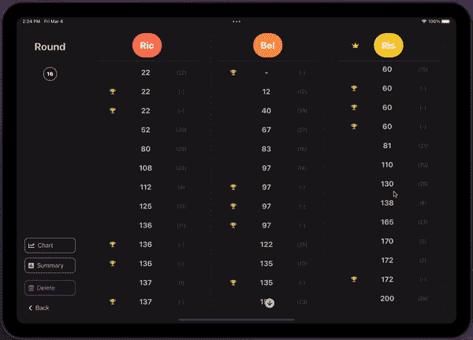

# 使用自省同时滚动 SwiftUI ScrollViews

> 原文：<https://betterprogramming.pub/simultaneously-scrolling-scrollviews-in-swiftui-2e8ef70ee993>

## 构建直观的用户界面

使用`UIKit`的同时滚动`UIScrollView`可以通过使用`UIScrollViewDelegate`轻松实现。这个想法非常简单:观察一个`UIScrollView`的`contentOffset`，当值改变时将它应用到另一个。

然而，`SwiftUI`目前并没有提供一个 API 来实现同样的功能。

至少`iOS 14`有了一个新的 API 来做类似的事情，但这还不足以复制想要的用例:

 [## 如何使用 ScrollViewReader 将滚动视图移动到某个位置

### Paul Hudson @twostraws 在 iOS 14 中为 Xcode 13.2 新更新如果你想以编程方式让 SwiftUI 的 ScrollView…

www.hackingwithswift.com](https://www.hackingwithswift.com/quick-start/swiftui/how-to-make-a-scroll-view-move-to-a-location-using-scrollviewreader) 

# 使能同时滚动`SwiftUI`中的`ScrollView`

由于没有 API 来实现这一点，我们需要访问底层的`UIKit`元素并在那里设置`contentOffset`。这就是通过提供对`UIKit`元素的访问 [SwiftUI-Introspect](https://github.com/siteline/SwiftUI-Introspect) 派上用场的地方。

 [## GitHub-siteline/SwiftUI-Introspect:从 swift ui 检查底层 UIKit 组件

### Introspect 允许您获取 SwiftUI 视图的底层 UIKit 或 AppKit 元素。例如，用内省…

github.com](https://github.com/siteline/SwiftUI-Introspect) 

将`Introspect`添加到您的项目后，您可以像这样访问`UIKit`元素:

这样，我们现在可以实现一个组件来同时滚动`UIScrollView` s。

为简单起见，我们称这个组件为`SimultaneoulsyScrollViewHandler`。我们需要在这个组件中注册我们想要同步的所有`UIScrollViews`，以便能够观察和调整它们的`contentOffset`。

> 在这里找到一个现成的 Swift 包:[同时滚动查看](https://github.com/stonko1994/SimultaneouslyScrollView)

现在我们需要得到关于数组中`UIScrollView`的`contentOffset`变化的通知，并将其应用到所有其他注册的`UIScrollView`中。

我们可以通过实施`UIScrollViewDelegate`来实现这一点:

有了这个新组件，我们现在可以回到我们的`SwiftUI` `View`并在`introspectScrollView`中使用它，如下所示:

> **看看它的作用:**

# 从这里去哪里？

我建议将`simultaneouslyScrollViewHandler`存储在某个视图模型中。例如`@ObservedObject`或`@StateObject`。

*上述实施包含一些问题。*

一个是`scrollViews` `Array`永远不会被清除，并将保留所有`UIScrollView`的所有`SwiftUI`重绘。这可以通过使用某种弱引用存储来解决。

在我的 GitHub 概要文件的最终实现中可以找到这一改进和其他改进:

 [## GitHub-stonko 1994/simultaneous scroll view:用 SwiftUI 同时滚动滚动视图…

### 支持 SwiftUI 的同时滚动 scroll views Swift Package Manager 是一个管理发行版的工具…

github.com](https://github.com/stonko1994/SimultaneouslyScrollView)