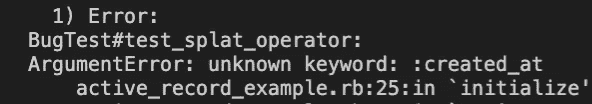

# 探索 Ruby Splat 运算符

> 原文：<https://betterprogramming.pub/single-and-double-splat-operators-in-ruby-55dbe771ace6>

## 看一下单双 splat 算子

开发人员一学会 splat 操作符的用法，就会尝试使用它。运营商是伟大的，并在许多情况下工作，但我们必须意识到它的力量和后果。

在这篇文章中，我将描述什么是 Ruby Single 和 Double splat 操作符，以及我在生产中看到的危险用法。其目的是展示操作者有信心**使用它**的能力，并在代码审查期间识别危险情况。

# Splat 运算符

Splat 运算符有两种类型:单( ***** )和双(**)。两个操作符都有两个主要功能:构造和展开。

**单个 Splat 操作符(*)** 构造并展开数组。让我们看一些例子:

在前面的例子中，我们可以看到单个 splat 操作符获取了`prime`数组的元素并将它们展开。抓取数组中的项目并将其分配给另一个变量也很有帮助，如前面的示例中的`rest`变量所示。

我们也可以将数组元素插入另一个数组。在下面的例子中，`primes`元素被添加到`numbers`数组中，从调用`*primes`的位置开始。

我们也可以用它从单个元素构造一个数组。将 Splat 添加到该值会将该值转换为一个新数组。请参见以下示例:

**double Splat 操作符**是在 2.0 Ruby 版本上发布的，工作原理类似。我们可以构建并传播**散列。**参见下面的例子:

**这些运算符可用于功能**。要么在函数的定义中(作为参数)，要么在调用函数作为参数值时。为了深入这两种情况，我们先来看看 Ruby 函数可以有哪些类型的参数。

# Ruby 中的参数类型

一个函数可以有不同类型的参数:

*   位置参数。
*   关键字参数(也称为 kwargs)。
*   Splat 参数(单运算符和双运算符)

位置参数是最简单的。关键字参数有一个键(一个符号)。一个例子描述了一千个单词:

`arg_1`和`arg_2`是位置论元，`key_1`和`key_2`是夸尔格。

这两种类型的参数可以有默认值，这意味着调用者不需要传递它们。

# 函数中的单个 Splat 运算符

## 调用函数时使用单个 Splat 运算符

splat 操作符允许我们将数组的元素传递给函数。

在这个例子中，调用`*arr`展开数组`arr`元素，并按照给定的顺序将其值作为位置参数传递给函数。

注意，如果数组`arr`包含的值比位置参数(2)多，它将出错(尝试传递`arr = ["1", "2", "3"]`)。同样，如果传递的参数较少，将会出现错误。 ***传递的参数数量必须与函数*** *接受的位置参数数量相匹配(考虑带有默认值的参数)。*

## 单个 Splat 运算符作为函数定义中的参数

我们已经看到了如何使用 Splat 操作符作为值，但是我们也可以在函数定义中使用它作为参数。请参见以下示例:

`arg_1`是一个使用 splat 操作符的参数，这意味着位置参数是数组`arg_1`的元素。因此，您可以向函数传递 0 个或多个位置参数。

不一定要成为最后一个论点。它可以位于函数的中间，如下例所示。

# 函数中的双 Splat 算子

这个操作符与单个操作符非常相似，但是它是针对散列(和 kwargs)的。

## 调用函数时使用双 Splat 运算符

要记住两件重要的事情:

*   **哈希必须具有完全相同的键。**
*   **哈希必须将关键字作为符号，而不是字符串。如果你好奇为什么它不使用字符串，请阅读本期。**

## Double Splat 运算符作为函数定义中的参数:

该函数接受 0 个或多个属于`hash`的 kwargs。与可以在任何位置的单 splat 运算符不同，**双 Splat 参数必须在参数列表的最后**。

您可能想知道在函数定义中使用 Splat `**`和仅仅使用散列变量有什么区别？嗯，有一些不同之处:

*   双 Splat 是可选的。您不需要向函数传递值。
*   Double Splat 不能有默认值，而 simple Hash 可以。Double Splat 的默认值是隐式的空散列值(`{}`)。
*   如果位置参数中有默认值，结果可能会不同。请参见以下示例:

# 结合不同类型的论点

只要 double Splat 是最后一个参数并且满足所需的参数数量，就可以组合使用 single 和 Double Splat 运算符。请看这个例子:

# **小心！**

我在生产中看到过与这个操作符相关的不同错误，所有这些错误都有一个确切的原因:传递的参数大小不同于所需的大小。这会影响双运算符和单运算符。

让我们看一个例子。花点时间看看下面这段代码，在看下面的原因之前，想想这段代码为什么可怕。

假设我们有一个`ActiveRecord`类`Post`链接到包含三列`id`、`title`和`description`的表`posts`。

类`PostSchema`是`Post`类的包装器。它有一个构造函数，该构造函数接受的表所具有的三个属性。

`Service`有一个方法，它接收一个`post_id`并在表中查找文章。如果找到一篇文章，它将获得其符号化散列的属性，并将它们赋给`attributes`变量。然后，它使用带有`attributes`变量的双 Splat 创建一个`PostSchema`。最后，我们打印出`PostSchema`。

你注意到这段代码有什么问题吗？如果没有，花点时间读一下`print_post`函数。

如果我更改了`posts`表的模式会发生什么？例如，让我们向`posts`表中添加一个新列`created_at`:

💥💥💥💥💥嘣！测试现在失败了！原因是 Splat 操作符现在传递了一个构造函数不支持的新参数`created_at`。

这是一个角落的情况，但肯定像这样的情况发生！其他错误可能是由不同的因素引起的，例如将按键作为字符串使用 double Splat，但我没有见过很多。

# **结论**

splat 操作符是有益的，我建议使用它。但是，在函数中使用它时应该小心。主要是，确保函数满足传递的参数的大小。此外，当有默认值时要格外注意，如果使用 double Splat 作为参数值，要确保键是符号。