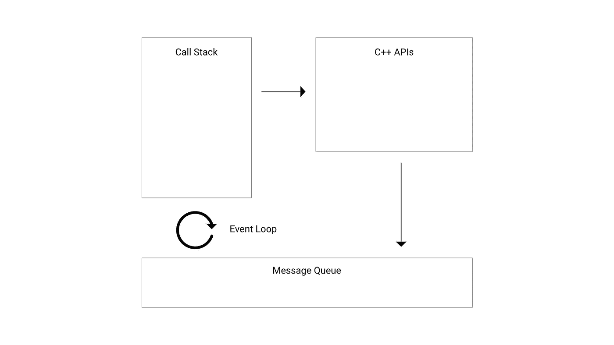
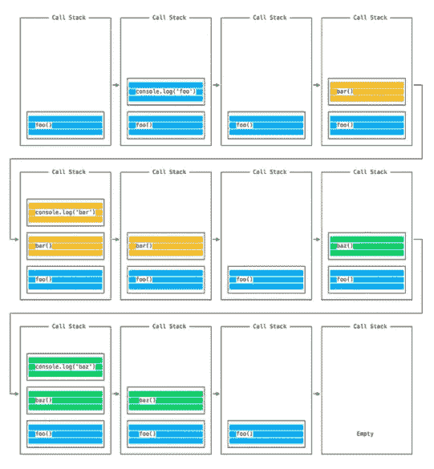
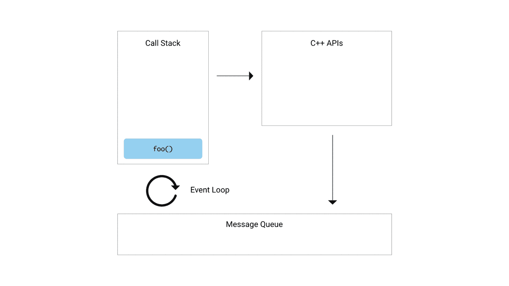

# 单线程和异步 Node 是如何做到的？

> 原文：<https://betterprogramming.pub/single-threaded-and-asynchronous-how-does-node-do-it-d964100766a>

## 简单解释 Node.js 如何在幕后处理异步操作


Zachariah Aussi 在 [Unsplash](https://unsplash.com?utm_source=medium&utm_medium=referral) 上拍摄的照片。

JavaScript 是单线程的，这一点你们很多人肯定已经听说过了。这仅仅意味着它一次只能执行一个任务。JavaScript 中执行的所有任务都运行在一个叫做主线程*的线程上。*

Node.js 是一个 JavaScript 运行时环境，允许您解析、编译和执行 JavaScript 代码。Node 在 V8 引擎的帮助下做到了这一点，V8 引擎是谷歌用 C++编写的开源 JavaScript 引擎。

借助 V8 引擎，Node 能够在用户看不到的情况下执行 JavaScript 和 C++。这允许您在单线程环境中编写同步和异步 JavaScript 代码，而不必担心线程或并发性。

# 事件循环

*事件循环*使节点应用程序能够在单线程上运行，但支持异步操作并具有非阻塞 I/O。要理解事件循环的功能，我们必须知道*调用堆栈*、*消息队列*、和 c++ API*是什么。*

**

*用于处理并发性的组件*

*调用栈基本上是一个 LIFO(后进先出)栈，它跟踪下一个要在主线程上执行的任务。当您的代码被执行时，您在 JavaScript 代码中定义的任务被推入这个堆栈。让我们看看下面的代码是如何使用调用堆栈执行的:*

*上面的代码是一个简单的同步程序，因此不需要 c++ API 或消息队列的参与。*

**

*来源:[节点单据](https://nodejs.dev/learn/the-nodejs-event-loop)*

*程序中的每个任务都被推入调用栈并以 LIFO 方式执行。控制台上的输出如下所示:*

```
*foo
bar
baz*
```

*当执行异步任务时，这个过程变得稍微复杂一点，这就是消息队列和 c++ API**发挥作用的地方。假设您正在运行下面的代码片段:***

***控制台上的输出如下所示:***

```
***foo
baz
bar***
```

***`console.logs`的奇怪顺序背后的原因是，尽管`setTimeout`的最小等待时间是零毫秒，节点还是将`setTimeout`作为异步操作执行。***

******

***执行上面的代码片段***

***Node 将异步任务从调用堆栈卸载到 c++ API，并使用系统内核执行它们。大多数系统内核都是多线程的，可以在后台同时执行多个任务。***

***一旦一个异步任务完成，相关的回调函数被放入消息队列*。*它是一个 FIFO(先进先出)队列，保持回调函数运行的正确顺序。***

***事件循环总是检查调用栈和消息队列*，*，如果调用栈为空，它从消息队列中取出第一个任务并将其推送到调用栈。等待调用堆栈为空的事件循环解释了为什么前面代码片段的输出以奇怪的顺序记录。***

# ***作业队列***

***Javascript ES6 版本引入了*作业队列*。这有点类似于消息队列，但是有了作业队列，异步任务就不必等到调用堆栈上的所有任务都执行完了。这允许异步任务的结果在调用堆栈上的当前任务完成执行后立即执行。JavaScript promises 的功能是基于作业队列的。***

# ***结论***

***Node 允许用户创建能够执行异步操作的单线程应用程序，并在事件循环的帮助下拥有非阻塞 I/O。由于 Node 是单线程的，用户不必担心线程或并发性，这是 Node 非常受欢迎的部分原因。***

***感谢阅读！***