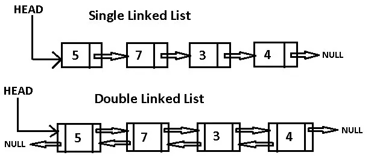
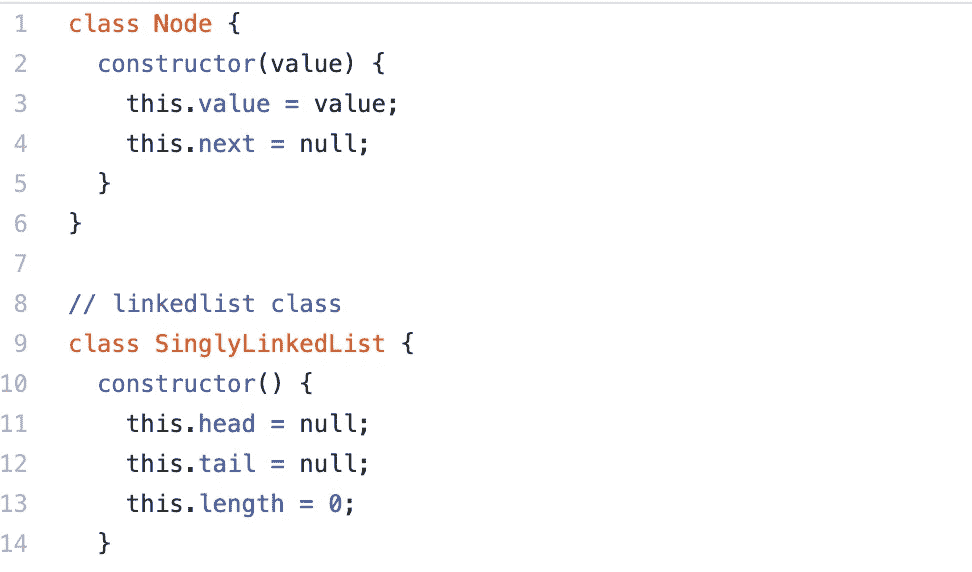
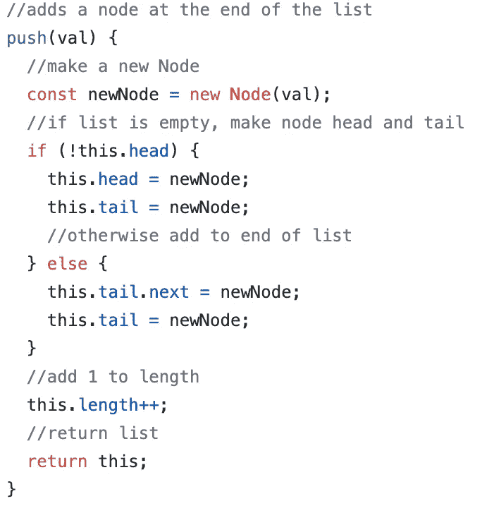
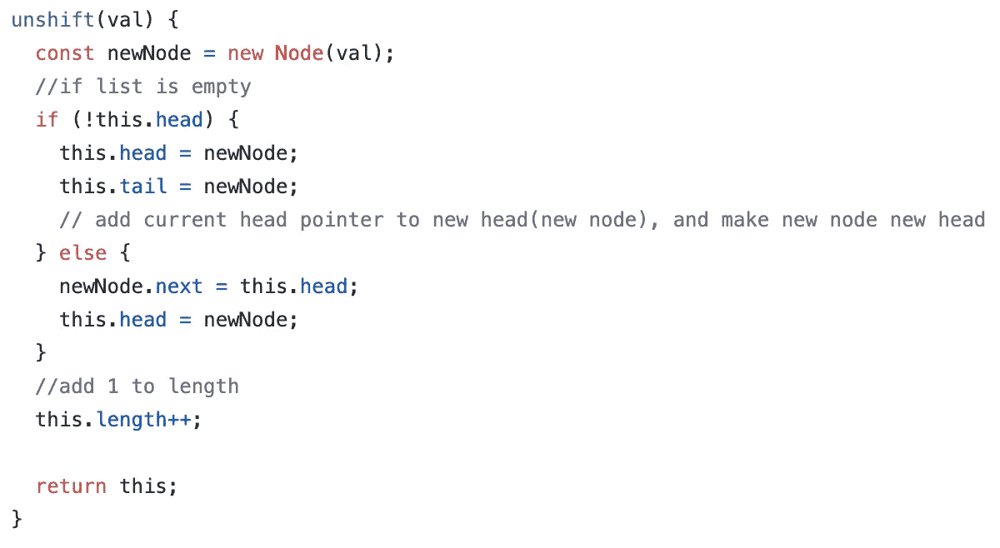
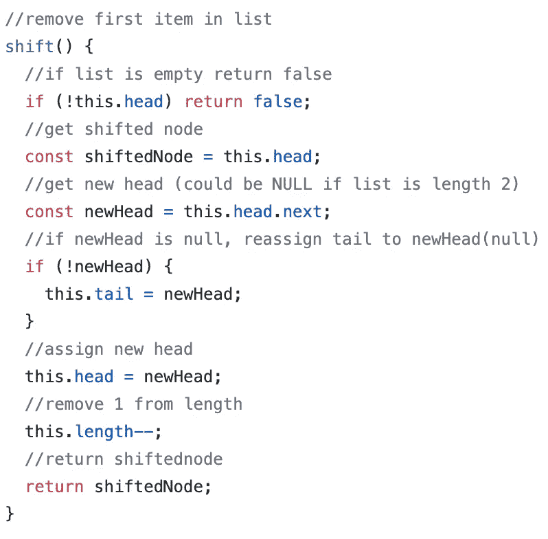
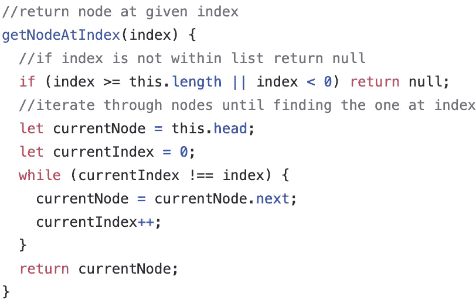
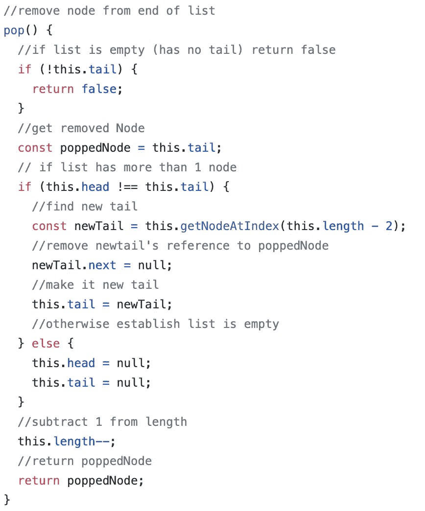
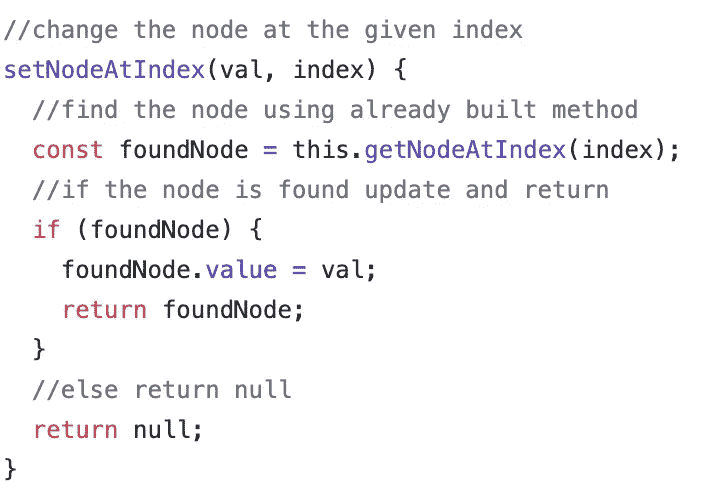
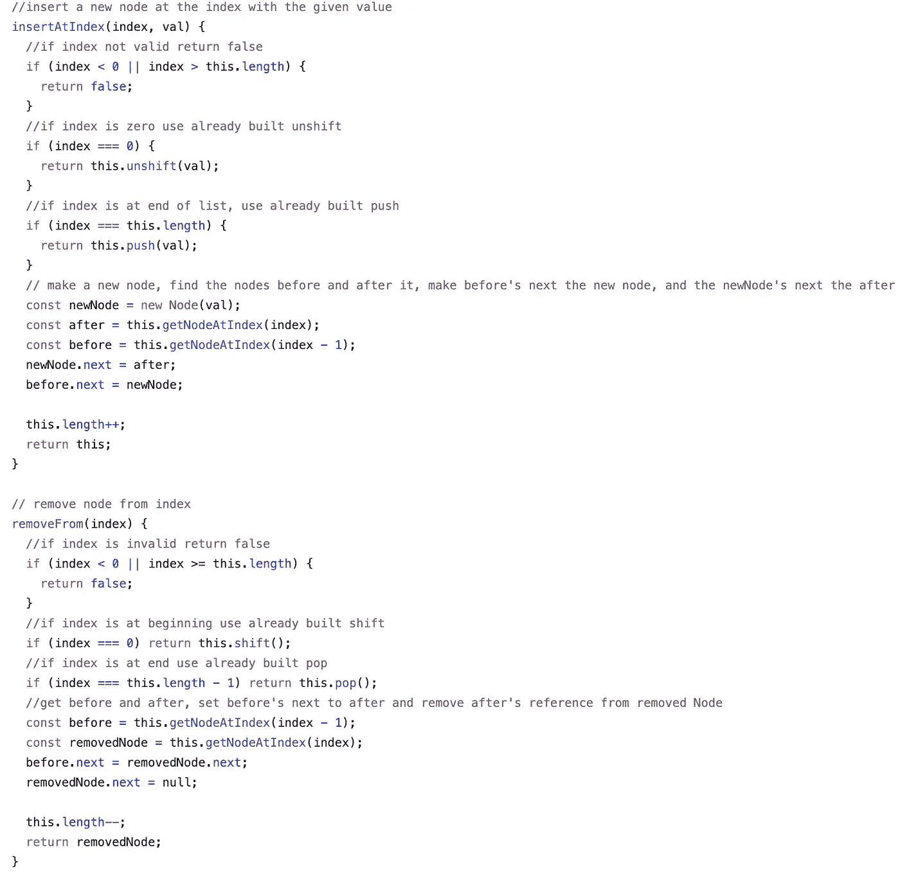

# JavaScript 中的单向和双向链表

> 原文：<https://betterprogramming.pub/singly-and-doubly-linked-lists-in-javascript-7515f47c9f60>

## 列表不仅仅是数组

不是那种链接…来源:[https://yattatachi . com/TBT-how-the-legend-of-zelda-was-kinda-its-own-genre](https://yattatachi.com/tbt-how-the-legend-of-zelda-was-kinda-its-own-genre)

程序员看到“列表”这个词，我们通常会马上想到“数组”。

数组非常适合存储要迭代的数据，但是因为它们有编号索引，所以操作数组中的元素在时间和空间复杂度方面代价很高。

例如，如果我们想在一个 100 个元素的数组中的第 10 个索引处插入一个新元素，我们必须在插入后重新索引其他 90 个元素。

如果我们需要处理一个不断更新的数据列表，我们可能想要使用一个被称为*链表*的数据结构。可以把链表想象成一条链，它是一组节点，有固定的头、尾和长度。

每个节点包含一个值和一个指向链中下一个节点的指针。单向链表有指向列表中下一个节点的指针，而双向链表有指向链中上一个和下一个节点的指针。

单链表和双链表的例子。

# 创建单链表

(我推荐跟随 [Visualgo](https://visualgo.net/en/list) 的例子)。我们需要为一个`Node`和一个`List`创建类。请参见下面的每个属性。

我们的链表类的基础

为了操作链表中的任何东西，我们需要遵循三条规则:

1.  添加或删除节点时，请确保增加或减少列表的长度。
2.  确保列表有正确的头部、尾部，并且所有节点都有准确的指针。
3.  删除时，确保指向已删除节点的所有指针都被切断，以确保该节点已从内存中正确删除。

## 推动和取消移动

当我们向列表的任意一侧添加节点时，我们需要确保列表的头部和尾部是正确的。

由于一个列表中一个节点的头部和尾部是相同的，我们需要在实现中考虑这种情况。看看下面的注释代码。

推送的实现

unshift 的实现

## Pop 和 shift

当我们从列表的任何一边移除一个节点时，我们需要考虑另外两件事——一个只剩下一个节点的列表(因为我们需要确保我们的尾部和头部是准确的),以及一个空列表(这样我们可以避免运行时错误)。

移位的实现

根据链表的性质，我们可以通过简单地检查当前头的指针来访问链表的新头。

然而，当我们从列表中弹出时，我们需要遍历列表以找到新的尾部。我将使用一个助手方法，我们可以在我们的类`getNodeAtIndex`的后面的方法中重用它。

getNodeAtIndex 的实现

这个函数使用一个计数器并遍历列表，直到我们找到需要的节点的索引。在这种情况下，我们需要倒数第二个节点，或者列表长度减二。

Pop 的实施

## 获取和设置

因为我们已经实现了上面的用于 pop 实现的`get`方法，所以我们需要做的就是实现`set`方法。

此方法在指定的索引处查找一个节点，并将其值更改为传入的变量。它也将使用我们的 getter 方法。我们只需要处理没有找到节点的情况。

setNodeAtIndex 的实现

## 插入和移除

通过我们刚刚编写的所有前面的方法，在链表中插入和移除条目变得更加容易。我们需要遵循以下步骤:

1.  检查链表中是否存在该索引(如果不存在，返回`false`)。
2.  如果在列表的开头或结尾删除/添加，使用已经编写好的方法(不用再担心尾部/头部！).
3.  获取插入/移除节点前后的节点，并正确分配它们的指针。

removeFrom 和 insertAt 的实现

我在页面底部的 GitHub gist 中包含了完整的实现，以及一个打印测试节点的方法。

# 双向链表

双向链表也有类似的实现，但是对链表中前一个和后一个节点的引用都有一些优点和缺点。

1.  我们必须跟踪前一个的*和后一个*的*指针，并确保在改变列表时正确设置它们。*
2.  因为我们可以访问前面的节点引用，所以我们不再需要为`pop`方法遍历列表。
3.  双向链表每个节点使用更多的内存，因为它们有两个指针，但是它允许我们双向遍历链表。
4.  双向链表在已知位置插入和删除的时间是常数，而单向链表的时间是线性的。

# 单链表的完整实现

单链表的完整实现

# 双向链表的完整实现

双向链表的完整实现

# **资源**

 [## 链表

### 在计算机科学中，链表是数据元素的线性集合，其顺序不是由它们的物理…

en.wikipedia.org](https://en.wikipedia.org/wiki/Linked_list#Linked_lists_vs._dynamic_arrays)  [## Java 中单链表和双链表的区别

### 单链表和双链表都是链表的实现，其中每个元素都是链表的一部分

www.tutorialspoint.com](https://www.tutorialspoint.com/difference-between-singly-linked-list-and-doubly-linked-list-in-java)  [## 现实世界中的数据结构——链表

### 双向链表—音乐播放列表

medium.com](https://medium.com/journey-of-one-thousand-apps/data-structures-in-the-real-world-508f5968545a)  [## 小数学到大 O

### 谁害怕大坏蛋？

medium.com](https://medium.com/swlh/small-math-to-big-o-901a90998871)