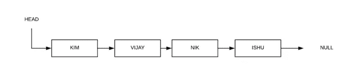

# Swift 中的单链表算法

> 原文：<https://betterprogramming.pub/singly-linked-list-algorithms-in-swift-104368d7b0e7>


照片由 [JJ 英](https://unsplash.com/@jjying)在 [Unsplash](https://unsplash.com/photos/PDxYfXVlK2M) 上拍摄

链表是一种线性数据结构。它不是将数据存储在某个位置，而是使用指针将元素链接起来。

链表中的每一项都由一个节点表示。一个节点由数据和指向下一个节点的指针(或引用)组成。

有三种类型的链表:

1.  单向链表
2.  双向链表
3.  循环链表



单向链表

在本教程中，我们将介绍单链表算法，例如:

1.  附加
2.  插入
3.  删除
4.  印刷

让我们首先创建一个节点类作为泛型类型。

```
public class Node<T> {var value: Tvar next: Node<T>?init(value: T) {self.value = value}}
```

现在创建一个`SingleLinkedList<T>`类，我们将在其中追加、插入或删除项目。

```
class SingleLinkedList<T>{var head: Node<T>public var isLinkedListEmpty:Bool {
   return head == nil
}public var firstItem: Node<T>? 
{         
   return head     
}}
```

`isLinkedListEmpty`是检查`LinkedList`是否为空的属性。如果磁头为零，则`LinkedList`为空。

# **在单链表中追加项目/节点**

Append 函数会在单链表的末尾添加一个新的节点，为此，我们必须使用一个名为`temp`的头部临时节点引用来遍历链表。

如果我们发现`temp`引用为零，这意味着我们已经到达了单链表的末尾。在该引用中，我们可以添加新节点。

```
public func append(value: T) {let newNode = Node(value: value)if var temp = head {while temp.next != nil {temp = temp.next!}temp.next = newNode} else {head = newNode}}
```

# 在单链表中的某个位置插入项/节点

要在一个特定的位置插入一个项目，首先我们需要设置前一个节点的`next`引用到一个新项目，并设置新项目的`next`到在那个位置出现的当前项目。

将下面的插入函数添加到上面的单链表类中。

```
func insert(data : T, at position : Int) {let newNode = Node(value: data)if (position == 0) {newNode.next = headhead = newNode}else {var previous = headvar current = headfor _ in 0..<position {previous = currentcurrent = current?.next}newNode.next = previous?.nextprevious?.next = newNode}}
```

# 从单链表中删除某个位置的节点

要删除一个节点，我们需要将前一个节点的引用设置为要删除的节点的`next` 。

将下面的删除函数添加到上面的单链表类中。

```
func deleteNode(at position: Int){if head == nil{return}var temp = headif (position == 0){head = temp?.nextreturn}for _ in 0..<position-1 where temp != nil {temp = temp?.next}if temp == nil || temp?.next == nil{return}let nextToNextNode = temp?.next?.nexttemp?.next = nextToNextNode}
```

# 打印单链表项

```
func printList() {var current: Node? = headwhile (current != nil) {print("SLL item is: \(current?.value as? String ?? "")")current = current?.next}}
```

在我们的单链表类中组合所有上述函数:

```
class SingleLinkedList<T> {var head: Node<T>? public var isEmpty: Bool {return head == nil}public var first: Node<T>? {return head}public func append(value: T) {let newNode = Node(value: value)if var temp = head {while temp.next != nil {temp = temp.next!}temp.next = newNode} else {head = newNode}}func insert(data : T, at position : Int) {let newNode = Node(value: data)if (position == 0) {newNode.next = headhead = newNode}else {var previous = headvar current = headfor _ in 0..<position {previous = currentcurrent = current?.next}newNode.next = previous?.nextprevious?.next = newNode}}func deleteNode(at position: Int){if head == nil{return}var temp = headif (position == 0){head = temp?.nextreturn}for _ in 0..<position-1 where temp != nil {temp = temp?.next}if temp == nil || temp?.next == nil{return}let nextToNextNode = temp?.next?.nexttemp?.next = nextToNextNode}func printList() {var current: Node? = head//assign the next instancewhile (current != nil) {print("SLL item is: \(current?.value as? String ?? "")")current = current?.next}}}
```

现在执行上述功能:

```
let sll = SingleLinkedList<String>()sll.append(value:"Kim" )sll.append(value: "Nik")sll.append(value: "Ishu")sll.printList() // First Print sll.insert(data:"Vijay" , at: 1)sll.printList() .  // Second Printsll.deleteNode(at: 2)sll.printList() . // Third Print
```

输出将是:

```
// First Print**SLL item is: Kim****SLL item is: Nik****SLL item is: Ishu**//Second Print (Inserting string "Vijay" at position 1)**SLL item is: Kim****SLL item is: Vijay****SLL item is: Nik****SLL item is: Ishu**// Third Print (Deleting Node at Position 2)**SLL item is: Kim****SLL item is: Vijay****SLL item is: Ishu**
```