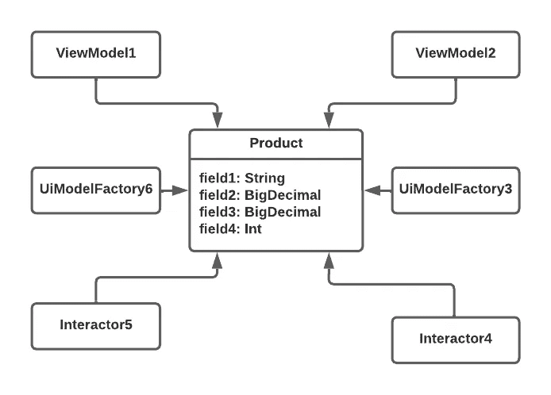
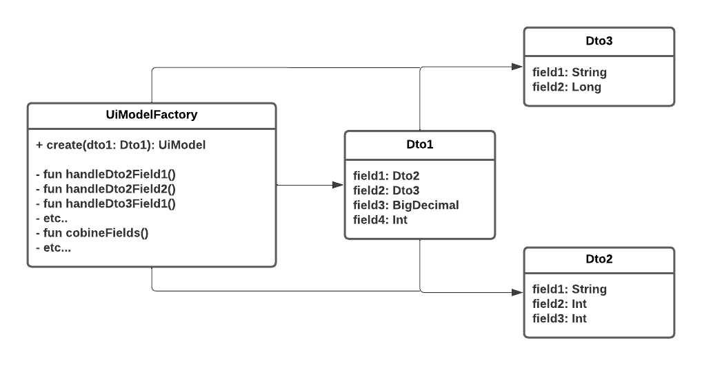

# DTO 的罪恶

> 原文：<https://betterprogramming.pub/sins-of-dto-b612160ef936>

## 对于避免为模型编写方法的开发人员来说

卡斯帕·卡米尔·鲁宾在 [Unsplash](https://unsplash.com?utm_source=medium&utm_medium=referral) 上的照片

## 什么是 DTO？

[Martin Fowler](https://martinfowler.com/eaaCatalog/dataTransferObject.html) 将 DTO 定义为在进程间传送数据的对象，以减少方法调用的数量。

代表 DTO 的类没有方法。

DTO 的例子

但是 DTO 的缺点是什么呢？

## 第一:代码复制

代码重复是广泛使用 dto 的应用程序最常见的疾病。

看看下面的图表。

只要`Product`类是 DTO，你很可能会产生与另一个开发人员甚至是你不久前在另一个类中编写的代码相同的代码。

通常，我们既没有时间也没有意愿去查看每一个使用 DTO 的类，以找到我们需要的私有方法，并把它移到其他地方。

也不可能使用多态性，这会导致代码重复，看起来像重复的 when (if)表达式。

## 第二:大而复杂的依赖类

DTO 没有方法。所有基于 DTO 成员进行计算的方法都在依赖类中。

依赖类依赖的 dto 越多，该类拥有的私有方法就越多。类的私有方法越多，理解代码和编写单元测试就越难。

## 第三:传输/存储数据不是一种责任

我问过使用 DTO 的开发者，他们为什么要这么做。最常见的问题是:“因为 dto 传输/存储数据。根据单一责任原则(后来的 SRP)，这是他们的责任。DTO 的职责是传输/存储数据。”

我真的相信他们误解了 SRP 的意思，即一个类应该只有改变的理由。

另一个原则是，一个方法应该做一件事，并且只做一件事，而且要做好。

这两个原理乍一看很相似。这就是人们困惑的原因。

他们更关注“责任”一词，而不是 SRP 的定义。他们认为一个类有一个责任意味着这个类做一件事。但那是完全错误的结论。*一个责任意味着一个类应该对一个且只有一个 actor* 负责。据我理解，SRP 更多的是关于人，而不是一个对象做什么。

dto 什么都不做，因为他们没有方法。这就是为什么他们没有行为。这就是为什么他们没有责任。

## 什么时候可以使用 DTO

使用 DTO 来解析从 REST API 获得的 JSON 对象是可以的。

使用 DTO 将数据传递给视图来显示某些东西是可以的。

如果服务器做所有的计算，使用 DTO 是可以的。

如果一个类完全没有逻辑，使用 DTO 也是可以的。

## 如何减少 DTO 的使用？

*   为类编写方法。
*   不要让客户端代码在类之外进行计算。
*   将使用类成员的逻辑移到该类的方法中。尽你所能去做。但是请记住将**关注点分离原则**考虑在内。

## 如何理解逻辑应该属于什么类？

[应应用信息专家原则](https://medium.com/@ruberoid55/grasp-principles-lead-by-examples-for-android-development-part-1-ed9e087b5fe1)。