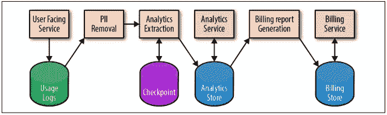
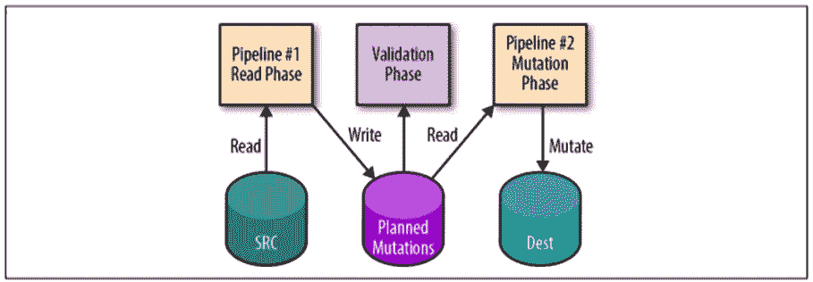

# 数据管道的现场可靠性工程最佳实践

> 原文：<https://betterprogramming.pub/site-reliability-engineering-best-practices-for-data-pipelines-44a78e91f6f0>

## 以谷歌的方式管理生产数据管道


照片由 [JJ 英](https://unsplash.com/@jjying?utm_source=unsplash&utm_medium=referral&utm_content=creditCopyText)在 [Unsplash](https://unsplash.com/s/photos/pipelines?utm_source=unsplash&utm_medium=referral&utm_content=creditCopyText)

到目前为止，你们中的大多数人可能已经听说过站点可靠性工程的概念。如果没有，这里有一个简单的定义—

当你把操作当成一个软件问题时，你就会得到 SRE。

谷歌长期以来一直使用这些原则管理其生产系统。他们出版了几本关于这个主题的书:

*   网站可靠性工程:谷歌如何运行生产系统
*   站点可靠性工作手册:实施 SRE 的实用方法

在这篇文章中，我将讨论《站点可靠性工作手册:实施 SRE 的实用方法》一书的第 13 章中讨论的最佳实践的摘要。

# 数据管道

如今，我们在生产系统中运行各种类型的数据管道。

## **数据转换/事件处理管道**

*   提取、转换、加载(ETL)模型是数据处理中的一种常见模式:从源中提取数据，对其进行转换，并可能进行反规范化，然后将其“重新加载”为特定的格式。
*   转换阶段可以服务于各种用例，例如更改数据格式以添加或删除字段、聚合跨数据源的计算功能，以及对数据应用索引以使其具有更好的特征来服务于使用数据的作业。

## 机器学习管道

机器学习(ML)应用程序用于各种目的，如帮助预测癌症，对垃圾邮件进行分类，以及为用户提供个性化的产品推荐。

典型地，ML 系统具有以下阶段:

*   从更大的数据集中提取数据要素及其标注。
*   ML 算法在提取的特征上训练模型。
*   该模型在一组测试数据上进行评估。
*   该模型可供其他服务使用。
*   其他系统使用模型提供的响应做出决策。

为了维护这些管道，这里有一些在书中讨论过的最佳实践。

# 管道最佳实践

通常，在处理数据管道时，应遵循以下最佳实践。

## 定义和衡量服务级别目标

SRE 实践基于一些重要的概念，如服务级别目标(SLO)、服务级别指标(SLI)和错误预算。

对于数据管道，我们可以考虑用以下约束来定义 SLO。

数据新鲜度:

*   Y 【秒、日、分】中处理的数据的 X%。
*   最旧的数据不会早于 Y 【秒、天、分】。
*   管道作业已在 Y 【秒、天、分钟】内成功完成

数据正确性:

*   很难定义。
*   对于数据接收，您可以比较源和目标。
*   回顾性分析。例如，从管道输出数据提供坏数据或错误的小时数或天数。

数据隔离/负载平衡:

*   数据段:高/中/低。
*   它可以使用不同的队列、硬件、网络层等来实现。
*   端到端测量非常重要。
*   即使管道有几个阶段，建议测量端到端交付的 SLO，而不是每个阶段。在每个阶段，SLO 不会对客户价值产生太大影响。

## **依赖故障计划**

*   一旦你定义了你的 SLO，首先检查你是否没有过度依赖那些不能满足 SLO 的产品。
*   在谷歌，为了鼓励考虑到依赖性失败的管道开发，SREs 实施了计划停机。
*   即使是最好的产品也会出现故障和停机。
*   定期练习灾难恢复场景，以确保您的系统能够应对常见和不常见的故障。
*   评估您的依赖性并尽可能自动化您的系统响应。

## **创建和维护管道文件**

*   精心编写和维护的系统文档可以帮助工程师可视化数据管道及其依赖性，理解复杂的系统任务，并有可能在停机时缩短停机时间。
*   这本书推荐了三种类型的文档。

1.系统图:



示例系统图

2.流程文件:

*   例如，如何将管道发布到生产中。
*   一旦记录了所有任务，就要寻找自动化的机会。

3.剧本条目:

*   系统中的每个警报状况都应该有相应的行动手册条目，描述恢复步骤。

## 绘制您的开发生命周期

数据管道的开发周期应计划如下:

*   原型制作。
*   用 1%的干运行进行测试。
*   分期付款。
*   金丝雀。
*   执行部分部署。
*   部署到生产环境。

## 减少热点和工作负载模式

*   当资源因过度访问而过载，导致操作失败时，就会发生热点。
*   为了避免热点，建议重新构造您的数据或访问模式，以平均分配负载。
*   降低锁粒度以避免数据锁争用。

## 实施自动缩放和资源规划

*   工作负载峰值很常见，如果您没有做好准备，可能会导致服务中断。
*   自动缩放可以帮助您处理这些峰值。
*   预测系统的未来增长并相应地分配容量，可以确保您的服务不会耗尽资源。

## 遵守访问控制和安全策略

遵循以下隐私、安全和数据完整性原则:

*   避免在临时存储中存储个人身份信息(PII)。如果需要临时存储 PII，请确保数据已正确加密。
*   限制对数据的访问。仅授予每个管道级从上一级读取输出数据所需的最低访问权限
*   对日志和 PII 设置生存时间(TTL)限制。

## 幂等和两相突变

管道可以处理大量数据。当管道出现故障时，必须重新处理一些数据。您可以使用*幂等突变*设计模式来防止存储重复或不正确的数据



简而言之，在进行数据摄取时，首先写入阶段表，只有当阶段表检查正确时，才将数据写入实际表。

## 实现检查点

*   检查点是一种技术，它使长时间运行的流程(如管道)能够定期将部分状态保存到存储中，以便它们可以在以后恢复该流程。
*   虽然检查点通常用于失败的情况，但它在任务需要被抢占或重新调度时也很有用。
*   检查点还有一个额外的好处，它使管道能够跳过潜在的昂贵的读取或计算，因为它已经知道工作已经完成。

# 参考

*   [网站可靠性工程:谷歌如何运行生产系统](https://landing.google.com/sre/books/)
*   [网站可靠性工作手册:实施 SRE 的实用方法](https://www.amazon.com/Site-Reliability-Workbook-Practical-Implement/dp/1492029505)
*   [第 13 章—数据处理](https://landing.google.com/sre/workbook/chapters/data-processing/)

```
Hey, if you enjoyed this story, check out [Medium Membership](https://deshpandetanmay.medium.com/membership)! Just $5/month!*Your membership fee directly supports me and other writers you read. You’ll also get full access to every story on Medium.*
```