# 6 种高级 Python 装饰模式

> 原文：<https://betterprogramming.pub/six-advanced-decorator-patterns-5ffe67552691>

## 通过模板开发解释 Python decorator 的代码示例


图一。装饰器(淡紫色)包裹着一个函数(橙色)。在 [Unsplash](https://unsplash.com/s/photos/macro?utm_source=unsplash&utm_medium=referral&utm_content=creditCopyText) 上由[先生拍摄的 Starman](https://unsplash.com/@lucas_starman?utm_source=unsplash&utm_medium=referral&utm_content=creditCopyText) 照片。

# 计算机语言编码经验

在许多方面，我的编码经历类似于考古挖掘中的冰层。

底层——或最老的层——是几个不同的汇编器。以下各层按层龄顺序分别是 FORTRAN、Lisp(几个变种)、C、PL/1、SQL、C++和 Java。最后几层，代表过去八年，混合了 R、Python、Ruby、Scala 和 Go。

在 C 中使用宏，C++是简单的替换。许多权威人士认为在 Java 中使用宏是一种不好的做法。Lisp 宏可能太强大了吗？

对我来说，最优雅的宏是 Python decorator。

*注意:如果 Python 被编译成静态伪代码并具有无需人工干预的并发性，那么它将是我最喜欢的语言。对我来说，使用 PySpark、云或跳到另一种语言来受益于多核 CPU 感觉很糟糕。*

我假设您对初级和高级 Python 装饰器的使用都很熟悉。

如果您需要复习 Python decorator 概念，请阅读下面的文章。它提供了我所遇到的 Python decorators 的最佳解释:

[](https://medium.com/techtofreedom/7-levels-of-using-decorators-in-python-370473fcbe76) [## 在 Python 中使用 Decorators 的 7 个层次

### 掌握 Python 最神奇的特性

medium.com](https://medium.com/techtofreedom/7-levels-of-using-decorators-in-python-370473fcbe76) 

在本文中，我将介绍用于日志记录、调试、显示函数元数据和枚举的 decorator 模式。

# 1.基本装饰模板:日志记录

我将从一个用于日志记录的通用装饰器开始。

`log_call`是一个基本的 Python 装饰器。它封装了`add_one`函数调用前后的日志执行。

```
def log_call(fun):
    """
        Decorator [@log_call](http://twitter.com/log_call) wraps the funtion 
        with log events.
    """
    def wrapper(*args, **kwargs):
        #Pre:
        logger.info("before function: {}".format(fun.__name__))
        result = fun(*args, **kwargs)
        #post:
        logger.info("after function: {}, result:
                   {}".format(fun.__name__,result))
        return result
    return wrapper[@log_call](http://twitter.com/log_call)
def add_one(x):
    x = x+1
    return(x)y=0
y = add_one(y)
y
```

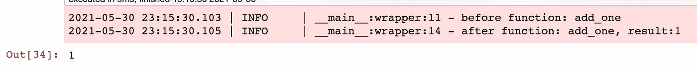

图二。用 decorator log_call 包装的 add_one 的输出。图片:作者终端截图。

代码在 [Jupyter 笔记本](https://github.com/bcottman/pyprobasic/blob/main/src/decorator-blog.ipynb)中给出并运行。

`login_call`装饰器是我们的第一个模式例子。您可以在`login_call`装饰模式中替换任何之前或之后的样板代码或名称。

## 带参数模板的装饰器(错误)

如果装饰模式有参数，它会变得更加强大。

添加参数的一个简单的 Pythonic 方法是将`*a, **kw`放在调用签名中的`func`之后。

```
def log_call(func,*a, **kw):
    """
        Decorator [@log_call](http://twitter.com/log_call) with arguments wraps the funtion 
        with log events.
    """
    def wrapper(*args, **kwargs):
        #Pre
        result = func(*args, **kwargs)
        #post:
        logger.info("function: {}, result:{}".format(func.__name__,result))
        return result
    return wrapper[@log_call](http://twitter.com/log_call)(1, ERROR=True)
def add_one(x):
    x = x+1
    return(x)
y=0
```

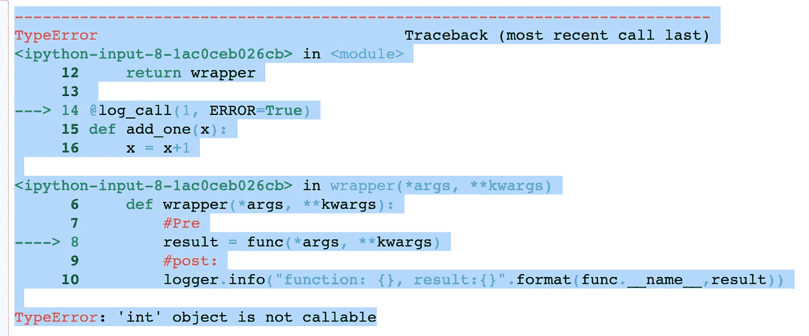

图 3。尝试用带参数的 decorator log_call 包装 add_one 的输出。图片:作者终端截图。

在调用签名中的`func`后添加`*a, **kw`不起作用。

下一节将展示一种创建带参数的装饰器的正确方法。

# 2.带参数的装饰器:日志记录(正确)

一个带参数的装饰器需要`@wrap`和另一个功能层。我把这个新功能层任意命名为`decorator`。

```
def log_call(*a, **kw):
    """
        Decorator [@log_call](http://twitter.com/log_call) wraps the funtion 
        with log events.
    """
    def decorator(func):
        [@wraps](http://twitter.com/wraps)(func)
        def wrapper(*args, **kwargs):
            #Pre:
            result = func(*args, **kwargs)
            #post:
            logger.info("function: {}, result:{}".format(func.__name__,result))
            return result
        return wrapper
    return decorator[@log_call](http://twitter.com/log_call)(ERROR=True)
def add_one(x):
    x = x+1
    return(x)
y=0
y = add_one(y)
y
```

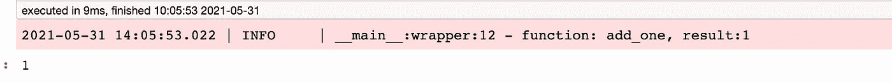

图 4。add_one 的输出用带参数 log_call 的 decorator 包装。图片:作者终端截图。

接下来，我们深入研究一下`@wrap`，找出我们为什么需要它。

# 3.@wrap 保留函数元数据

通常没有必要保留功能对象实例元数据。然而，我们需要函数对象实例引用来正确包装装饰器。

内置的 Python 函数`dir(function-symbol)`详述了函数元数据。在下面的例子中，我们使用`dir(function-symbol)`创建一个装饰器来详述函数的元数据。

```
def bad_dir(*a, **kw):
    """
        Decorator [@bad_dir](http://twitter.com/bad_dir) wraps a call of dir
        on the funtion inefficently.
    """
    def decorator(func):
        [@wraps](http://twitter.com/wraps)(func)
        def wrapper(*args, **kwargs):
            #Pre:
            result = dir(func)
            #post:
            logger.info("function: {}, a:{},
                       kw()".format('bad_dir',a, kw))
            logger.info("function: {}, args:{}, kwargs()".format(func.__name__,args, kwargs))
            return result
        return wrapper
    return decorator[@bad_dir](http://twitter.com/bad_dir)(1, ERROR=True)
def add_one(x):
    x = x+1
    return(x)y=0
add_one(y)
```

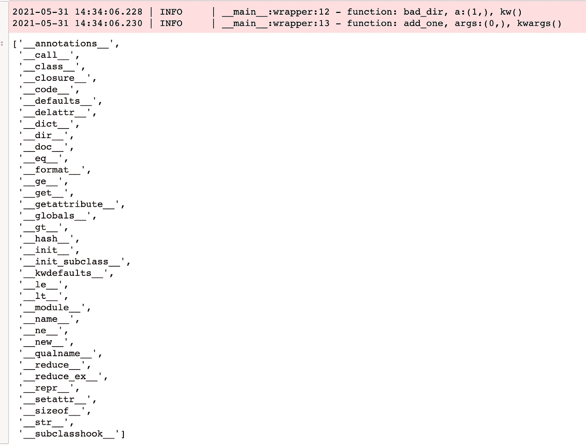

图 5。用 decorator bad_dir 包装的 add_one 的输出。图片:作者终端截图。

我们的`log_call`装饰器使用了`__name__`函数对象属性，但是您可以查看列表来找到其他有用的函数对象属性。

*注:*[*@ wrap*](https://stackoverflow.com/questions/308999/what-does-functools-wraps-do)*在* `*functools*` *包里。*

# 4.带参数的装饰模板:日志记录使用参数

我们需要使用`log_call`装饰器参数的助手函数的封装代码。

`log_output`功能具体实际是做什么的？

```
from typing import Dict, List, Any
def log_output(fun, result:Any, kw:Dict, check_state:List ) -> None:
    for key in kw:
        keyl = key.lower()
        if  keyl in check_state:
            if kw[key]:
                eval('logger.'+keyl)("function: {}, result:
                                   {}".format(fun.__name__,result))
```

我们接下来创建`log_call`装饰器，使用新的装饰器模式接受参数。

```
def log_call(*a, **kw):
    """
        Decorator [@log_call](http://twitter.com/log_call) wraps the funtion 
        with log events.
    """
    def decorator(fun):
        [@wraps](http://twitter.com/wraps)(fun)
        def wrapper(*args, **kwargs):
            #Pre:
            result = fun(*args, **kwargs)
            #post:
            check_state = ('debug', 'info', 'success',
                           'warning', 'error', 'critical')
            log_output(fun, result, kw, check_state)
            return result
        return wrapper
    return decorator[@log_call](http://twitter.com/log_call)(ERROR=True)
def add_one(x):
    x = x+1
    return(x)
y=0y = add_one(y)
y
```

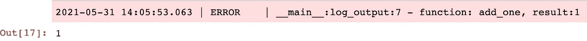

图 6。add_one 的输出用带参数 log_call 的 decorator 包装。图片:作者终端截图。

输出显示我们通过调用`@log_call(ERROR=True)`成功地改变了日志记录状态。

使用`@log_call(ERROR=True, CRITICAL=True, FAIL=True)`的输出会是什么？

# **5。使用两个装饰器:add_one**

我们将`add_one`变成一个装饰器，将全局`call_count`加 1。

```
#GLOBAL 
call_count= 0
def add_one(fun):
    """
            Decorator pre-function call and post-function call of function func.
    """
    def wrapper(*args, **kwargs):
        global call_count
        #Pre action
        result = fun(*args, **kwargs)
        logger.info('call_count:{}'.format(call_count))
        call_count = call_count+1
        logger.info('Increase call_count:{}'.format(call_count))
        return result
    return wrapper
```

实际上，我们用了三个装修工。`@wraps`算作应用于函数`pow`的装饰器。

```
[@log_call](http://twitter.com/log_call)(CRITICAL=True)
[@add_one](http://twitter.com/add_one)
def pow(x,y):
    return(x**y)print('',call_count)
print(pow(2,10))
```

结果是:

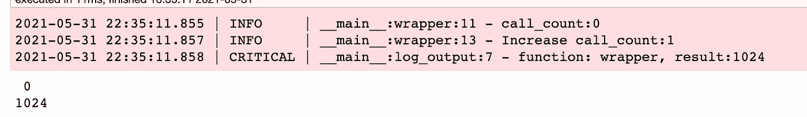

图 7。pow 函数的输出用 decorators log _ call、wraps 和 add_one 包装。图片:作者终端截图。

# 6.使用四个装饰者:jit

在这个模式中，我们使用了四个装饰者。`[@jit](https://numba.readthedocs.io/en/stable/user/jit.html)`是*即时*编译成 C 存根的缩写。记住，`@wrap`是用在函数`decorator`里面的。

为了展示`[@jit](https://numba.readthedocs.io/en/stable/user/jit.html)`的效果，一开始我们不使用。

```
[@log_call](http://twitter.com/log_call)(ERROR=True)
[@add_one](http://twitter.com/add_one)
def cum_one(x:int,y:int) -> int:
    total = 1 
    for i in range(2,y,1):
        total += 1
    return(total))cum_one(2,100_000_000)
```

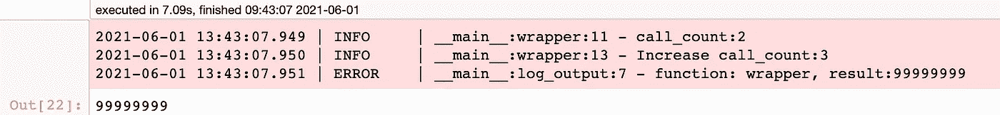

图 7。用 decorators log_call、wraps 和 add_one 包装的 cum_one 函数的输出。图片:作者终端截图

没有`@jit`，需要 7.09 秒的挂钟时间。

***注*** *:* `*jit*` *是* `[*numba*](http://numba.pydata.org/)`*包的一部分。*

```
[@add_one](http://twitter.com/add_one)
[@log_call](http://twitter.com/log_call)(ERROR=True)
[@jit](http://twitter.com/jit)
def cum_one(x:int,y:int) -> int:
    total = 1 
    for i in range(2,y,1):
        total += 1
    return(total)
```

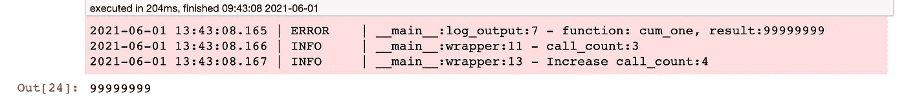

图 8。用 decorators add _ one、log_call、wraps 和 jit 包装的 cum_one 函数的输出。图片:作者终端截图

使用`@jit`，需要 0.24 秒的挂钟时间。大约 30 倍的加速。

`@jit`缓存每个编译后的命名函数，从而在第二次调用中获得更快的速度。没有`@jit`编译开销。

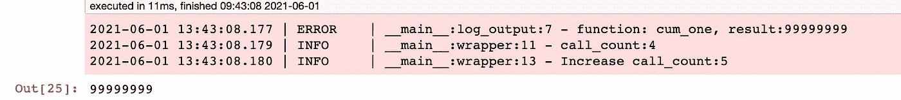

图 9。cum_one 函数的输出演示了@it 缓存的效果。图片:作者终端截图。

`@jit`结果是挂钟时间的 0.011 秒。大约 640 倍的加速比。

## 装饰器调用的顺序对@jit 很重要

当我们调用`log_call`结果然后调用`add_one`时会发生什么？

```
[@log_call](http://twitter.com/log_call)(ERROR=True)
[@add_one](http://twitter.com/add_one)
[@jit](http://twitter.com/jit)
def cum_one(x:int,y:int) -> int:
    total = 1 
    for i in range(2,y,1):
        total += 1
    return(total)cum_one(2,100_000_000)
```

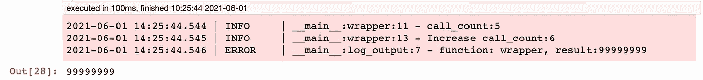

图 10。cum_one 函数的输出演示了 decorator 调用效果的排序。图片:作者终端截图。

`log_call`的日志事件先于`add_one`的日志事件。

让我们看看我们是否先给`@jit`打电话。

```
[@jit](http://twitter.com/jit)
[@log_call](http://twitter.com/log_call)(ERROR=True)
[@add_one](http://twitter.com/add_one)
def cum_one(x:int,y:int) -> int:
    total = 1 
    for i in range(2,y,1):
        total += 1
    return(total)cum_one(2,100_000_000)
```

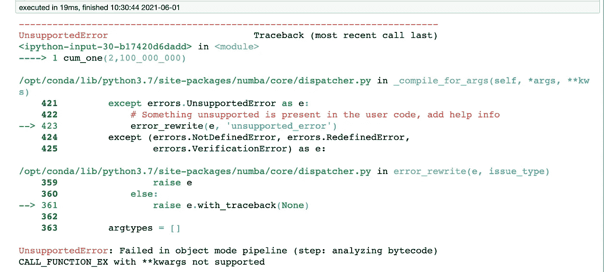

图 11。cum_one 函数的输出演示了@ JIT not last decorator 调用的效果。图片:作者终端截图。

哎哟！似乎`@jit`需要在函数之前被调用。

我远离哲学。我更像是一个*完成*类型的人。我会让你决定这是`@jit`的一个特点还是一个缺陷。

# 摘要

在本文中，我讨论了:

1.  没有日志记录参数的 Decorators。
2.  带有日志参数的装饰器。
3.  `@wraps`的值。
4.  使用三个装饰者。
5.  `@add_one`装饰工。
6.  使用四个装饰者。
7.  使用`@jit`装饰器可以获得什么样的加速。
8.  装饰者的顺序是不可传递的。

本文中的代码在 [Jupyter 笔记本](https://github.com/bcottman/pyprobasic/blob/main/src/decorator-blog.ipynb)中给出并运行。

在下一篇文章中，我将展示一个包，用于方便地记录和使用 YAML 文件的参数。

编码快乐！