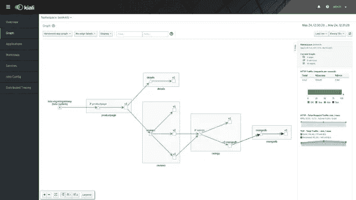

# 开始使用 Istio 前的 6 个提示

> 原文：<https://betterprogramming.pub/six-tips-before-you-start-using-istio-fb017ba9af58>

## 在安装 Istio 之前、期间和之后，请考虑这些因素


克里斯特尔·海斯在 [Unsplash](https://unsplash.com?utm_source=medium&utm_medium=referral) 上的照片。

毫无疑问，在 K8s 中部署和维护应用程序对任何 DevOps 团队来说都可能是苛刻的。服务变得越来越复杂，涉及几个外部服务、不同版本和几个 API。正是由于这些原因，安全性、身份验证、监控和维护变得困难且耗时。

[Istio](https://istio.io) 在 K8s 从业者和 DevOps 中越来越受欢迎，因为它简化了服务之间的连接。随着社区的不断发展，它已经成为任何生产环境中必须考虑的工具。

我与 Istio 合作了一年，在单集群和多集群环境中用不同的安装过程测试了四个版本。如果你正在考虑在你的 K8s 集群中使用 Istio，在你成为 Istio 之前，看看我的六个建议。

# 1.了解 Istio 及其组件

在撰写本文时，1.7.2 是最新版本。从 1.5 开始，为了简化，内部组件已经过重组。您可以期待新版本的定期发布。这意味着 Istio 非常“有活力”。

在开始设计任何部署之前，您必须了解 Istio 的组件和实体。我必须坚持这一点。有许多你应该熟悉的 CRD。不要忘记理解它的主要概念(飞行员、城堡、网关、网格……)。

我必须承认，我对 Istio 的文档没有什么好的体验。实际上，如果有更多更新的文档，我可以节省很多时间。我推荐看一看 [Istio 讨论](https://discuss.istio.io/)什么时候不工作。通常，其他用户会注意到同样的错误，分享经验可能是最好的解决方案。另外， [GitHub 问题](https://github.com/istio/istio/issues)可能真的很有帮助。

# 2.定义您的安装方案

Istio 设计用于单集群和多集群场景。首先，您需要定义哪一个最适合您的场景。我建议将 Istio 安装在开发集群中进行测试。这听起来可能很天真，但是 Istio 附带了过多的配置参数，您可能需要调整其中的一些参数。Istioctl 是一个 CLI 客户端，旨在促进与 Istio 组件的交互。你可能会找到几种在 Google 上安装 Istio 的方法。然而，坚持使用 Istioctl ，因为这是文档*中使用的方法。*

在单个集群中基本安装 Istio 应该不难。对于多个集群来说，事情会变得更加麻烦。Istio 基于控制平面的复制提供了两种多集群模式。我将对这两种模式进行简要说明。

## 2.1.具有复制控制平面的多集群

在这个[型号](https://istio.io/docs/setup/install/multicluster/gateways/)中，Istio 安装在两个完全隔离的 K8s 集群中。这意味着荚和集群的 CIDR 可以重叠。Istio 实体必须在集群之间手动复制，因为它们不共享控制平面。集群 A 中的服务可以从集群 B 中访问，因为它们被声明为外部服务。

这种方法有一些缺点。维护服务的一致性可能是一个问题。如果一个服务从一个集群中删除，它必须在其他集群中更新。这必须手动完成。但是，对于简单的安装或者出于安全原因强制手动配置某些集群，这种解决方案已经足够好了。

## 2.2.具有共享控制平面的多集群

在这个[型号](https://istio.io/docs/setup/install/multicluster/shared/)中，控制平面在单个集群上运行。其他集群需要与主集群连接，以获得正确的 DNS 解析。在这个模型中，所有的集群都被认为是同一个网格的一部分。如文档所示，部署在两个不同集群上的服务将具有透明的负载平衡。

这种模式下的安装需要更多的步骤，而且一开始可能会有点吓人。最终的结果看起来更像是一群真正联合的集群，集群间服务的自动负载平衡在许多场景中可能是一个强大的解决方案。但是，如果主群集出现故障，使用单个控制平面可能会有问题。

# 3.入口与网关和虚拟服务

K8s 要求安装入口控制器，如 [ingress-nginx](https://kubernetes.github.io/ingress-nginx/deploy/) 以满足入口。Istio 支持入口，尽管不建议这样做。为什么？因为你会失去 Istio 支持的很多功能。

我们可以说入口被网关和虚拟服务所取代。例如，以下网关:

```
apiVersion: networking.istio.io/v1alpha3
kind: Gateway
metadata:
  name: httpbin-gateway
spec:
  selector:
    istio: ingressgateway # use Istio default gateway implementation
  servers:
  - port:
      number: 80
      name: http
      protocol: HTTP
    hosts:
    - "httpbin.example.com"
```

声明我们预期主机`httpbin.example.com`的端口 80 中有 HTTP 流量。但是该网关的目标 IP 是展示默认 Istio 入口网关的服务的 IP。

上面的网关没有用，除非它带有相应的虚拟服务定义，该定义设置哪些 K8s 服务是端点。例如，我们可以根据 HTTP 头重定向到达该网关的流量:

```
apiVersion: networking.istio.io/v1alpha3
kind: VirtualService
metadata:
  name: httpbin
spec:
  hosts:
  - "*"
  gateways:
  - httpbin-gateway
  http:
  - match:
    - headers:
        end-user:
          exact: jason
    route:
    - destination:
        host: httpbin
        subset: v2
  - route:
    - destination:
        host: httpbin
        subset: v1
```

我们将带有`end-user`头和值`jason`的请求重定向到子集 v2 的服务。对于同时部署同一服务的多个版本来说，这是一个很好的解决方案。

在将现有解决方案迁移到 Istio 时，这可能是一个问题。在适应 Istio 场景时，与其他入口控制器强耦合的部署可能非常耗时。在进入 Istio 之前，检查您的入口的可行性或复杂性，以及它们对其他入口控制器的依赖程度。

# 4.安全性

显然，安装 Istio 的主要原因之一是为您的 K8s 部署总结良好的安全实践。正如通常发生的那样，我们正在增加一个额外的复杂性层来降低其他任务的复杂性，这可能会导致更大的问题。请确保您了解要获得应用程序所需的安全级别，您需要哪些证书、ca 和根 ca。确保您管理您使用的任何其他解决方案的 Letsencrypt 发行者。

# 5.监视

相互连接的组件越复杂，就越需要单一的监控解决方案。幸运的是，Istio 提供了 Kiali 以一种简单的方式监控您的部署。



来源:[https://istio.io/latest/docs/tasks/observability/kiali/](https://istio.io/latest/docs/tasks/observability/kiali/)

从一开始就不要犹豫安装 Kiali 。在搜索网络问题时，这可以节省您大量的时间。Kiali 通知了有关配置的潜在问题，并显示了诸如服务之间的流量等变量。记得在部署的元数据中包含`app`和`version`标签。

# 6.排除故障

这可能是最难的部分。您的服务变得越复杂，发现错误配置或性能问题的可能性就越大。遵循良好的实践可以真正帮助您发现问题:

*   监控您的 Istio 系统。
*   在部署之前，请考虑您需要什么。你有多少服务？它们需要外部访问吗？复制品的数量呢？
*   从简单的部署开始，继续发展它们。
*   不要投入生产，直到你知道你在做什么。
*   使用`istioctl`观察您的系统配置。
*   T2 社区会帮助你。

# 摘要

如果你达到了这一点，说明你对 Istio 有了真正的兴趣。在 K8s 生态系统中，Istio 是最有前景的项目之一。然而，它仍然具有陡峭的学习曲线，这可能会阻碍从业者接受这项技术。

如果您正在考虑安装它，我希望这些提示对您有用。如果你已经是 Istio 用户，我很想听听你的经历。

感谢阅读！