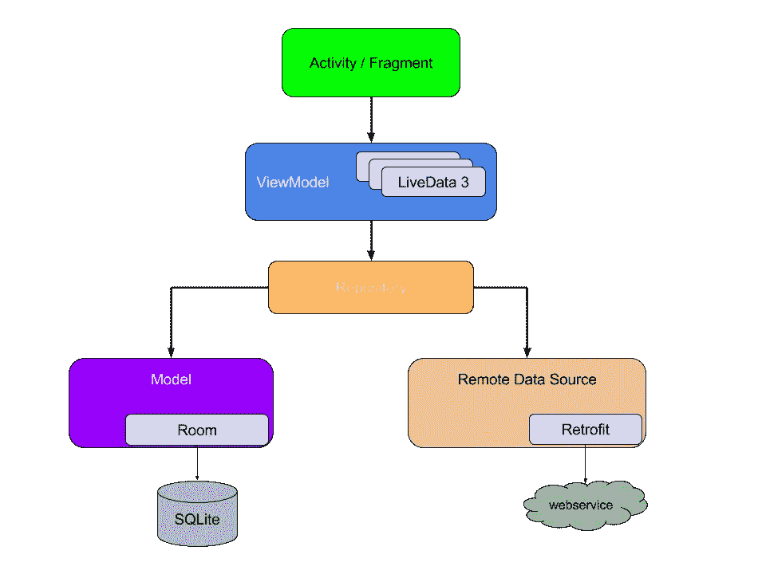
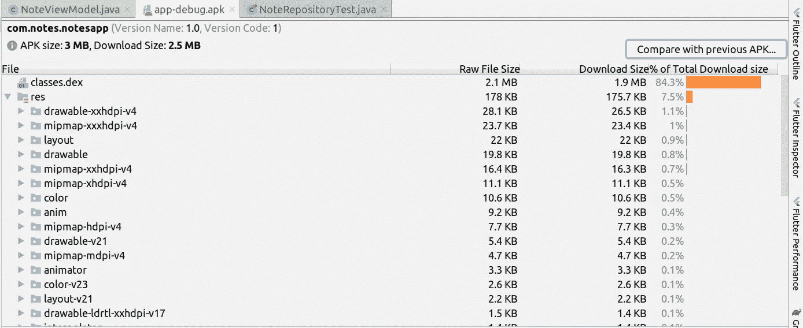
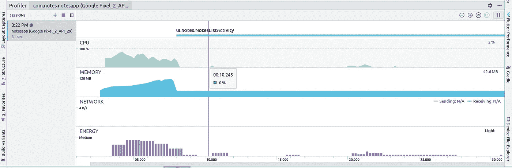
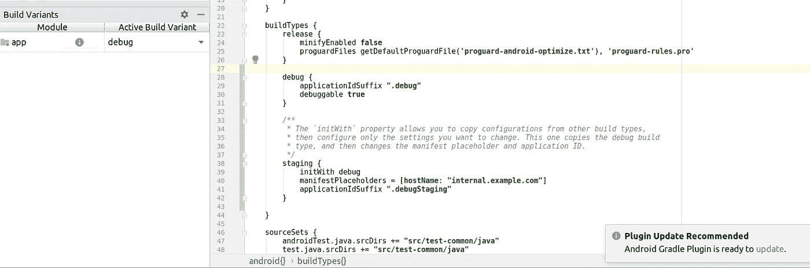
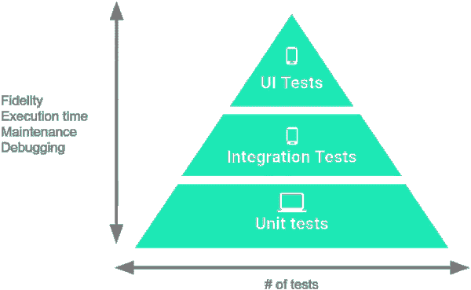
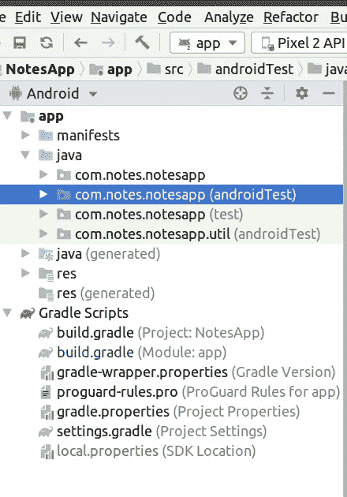

# 六年的经验:作为一名 Android 开发者我学到了什么

> 原文：<https://betterprogramming.pub/six-years-of-lessons-what-i-learned-as-an-android-developer-a825b55db7f0>

## 六年来为 Android 开发的经验教训

马库斯·斯皮斯克在 [Unsplash](https://unsplash.com/s/photos/coding?utm_source=unsplash&utm_medium=referral&utm_content=creditCopyText) 上的照片

我花了六年时间为不同的公司和应用程序编写代码。文化以及你编写或接近代码库的方式会随着你的经历而不断变化。

你应该处于这样一种情况，你的代码质量应该随着你的经验而提高，如果没有，是时候纠正它了。

# **1。选择正确的架构**

如果你是从零开始开发一个应用程序，那么你有很多优势。

其中之一就是选择正确的架构。通常，我们倾向于将所有内容都写在一个单活动文件中，因为这很简单。当您的代码开始增长时，这就成了问题。您的代码库变得如此庞大，最终您可能会在每个文件中拥有如此多的代码行。

考虑到代码的性能和维护，在早期阶段选择正确的架构总是明智的。

有许多架构，如 MVC、MVP、MVVM 和 MVI，可以帮助 Android 开发者轻松地维护、测试和开发新功能。

Android 应用的最终架构

上图显示了设计应用程序后，所有模块应该如何相互作用。虽然这完全取决于你为之工作的组织，但你可能会也可能不会有机会为你的应用选择一个架构。

但是，强烈建议您遵循适合您需求的特定架构。

关于哪种架构是最好的，有很多争论。

根据开发商指南:

> *“不可能有一种编写应用程序的方式最适合所有场景。也就是说，这种推荐的架构对于大多数情况和工作流来说都是一个很好的起点。”*

# **2。使用 Android Studio 的精华**

[Android Studio](https://developer.android.com/studio) 提供了在各种 Android 设备上构建应用程序的最快工具。

不幸的是，我们只探索了这个 IDE 的一点点。Android Studio 附带了许多工具，以下是我们在日常开发中应该使用的各种工具。

## 可视化布局编辑器

在布局编辑器中，我们可以通过将 UI 元素拖动到可视化设计编辑器中来快速构建布局，而不是手动编写布局 XML。

设计编辑器可以在不同的 Android 设备和版本上预览你的布局，你可以动态调整布局的大小，以确保它在不同的屏幕尺寸上都能很好地工作。

使用约束布局构建新布局时，布局编辑器尤其强大。

## APK 分析仪

使用 APK 分析器，我们可以减少花费在调试应用程序中的 DEX 文件和资源问题上的时间，并帮助减少 APK 大小。它也可以从命令行与 APK 分析器。

使用 APK 分析仪，您可以:

*   查看 APK 中文件的绝对和相对大小，如 DEX 和 Android 资源文件。
*   了解 DEX 文件的组成。
*   对两个 apk 进行并排比较。

Apk 分析仪

访问 Android [开发者工作室](https://developer.android.com/studio/build/apk-analyzer)阅读更多关于 APK 分析器的信息。

## 快速仿真器

如果你的目标是各种版本的 Android，并希望在不同的 API 级别上测试你的应用，那么模拟器将是一个完美的选择，而不是一个真正的设备。

该模拟器提供了真实 Android 设备的几乎所有功能。您可以模拟来电和短信，指定设备的位置，模拟不同的网络速度，模拟旋转和其他硬件传感器，访问谷歌 Play 商店，等等。

在模拟器中测试你的应用在某些方面比在物理设备上测试更快更容易。

## 侧写师

Android Profiler 工具提供实时数据，帮助您了解您的应用程序如何使用 CPU、内存、网络和电池资源。

仿形铣床

有各种各样的分析器，如 CPU 分析器、内存分析器、网络分析器和能量分析器。

Android Profiler 兼容 Android 5.0 (API 级别 21)及更高版本。您可以使用 Android Studio 中的高级分析器来监控应用程序的会话如何消耗 CPU 资源和内存。

内存分析器使用[泄漏金丝雀](https://github.com/square/leakcanary)帮助我们调试内存泄漏。

# 3.配置构建变体

您可以使用构建变体从单个项目创建不同版本的应用程序，以及如何正确管理您的依赖项和签名配置。

在大多数组织中，我们会有 QA 和 PROD 环境。为了为每个环境构建不同的应用程序，您可以从不同的构建类型中指定不同的基本 URL。

构建变体

您还可以基于 API 级别或其他设备变化，针对不同的设备构建不同版本的应用程序。

# 4.使用 Lint 检查改进您的代码

lint 工具有助于发现可能影响应用程序可靠性和效率的结构不良的代码。

Lint 会告诉您布局中是否有任何使用过的名称空间会占用大量空间。

它还告诉您其他结构性问题，例如使用不推荐使用的元素或目标 API 版本不支持的 API 调用。它会建议你使用任何库的最新版本。

使用新的`SparseArray<String>(...)`代替`HashMap`以获得更好的性能。`SparseArrays`将整数映射到`Objects`。与正常的对象数组不同，索引中可能会有间隙。

它旨在比使用`HashMap`将整数映射到对象更有效。

# 5.测试应用程序

测试驱动开发，也称为 TDD，是确保您在任何新代码中包含测试的一种方式。当遵循这个过程时，在编写实现它的代码之前，要为要添加的东西编写测试。

由于时间和资源有限，大多数创业公司可能不会采用 TDD 环境。但是它被许多公司广泛接受，他们在开发前进行测试。

测试 Android 应用程序的级别

有三种类型的测试可用于 Android。

## **1。单元测试**

单元测试用于测试方法和小模块。运行这些测试不需要仿真器或真实的设备，因为它们将在 JVM 上运行。

JUnit 和 [Robolectric](http://robolectric.org/) 是流行的 Android 单元测试框架，通过在 JVM 上运行测试，允许更快的测试执行。

## **2。仪器测试**

仪器测试依赖于 Android 框架。由于这种依赖性，它们需要仿真器或物理设备来运行。我们使用 [Mockito](https://site.mockito.org/) 来模仿插装测试中使用的对象。

## **3。用户界面测试**

UI 测试用于发现活动是否正确启动，或者视图是否正确显示。Espresso 和 [UI 自动机](https://developer.android.com/training/testing/ui-testing/uiautomator-testing.html)是广泛使用的 UI 测试工具。

下面是这些测试在应用程序中出现的包结构。

程序包结构

`Test` : 单元测试存在于该文件夹中。这些测试运行在 JVM 上，不需要 Android 设备或仿真器。

`android test`:所有的工具和 UI 测试都在这个文件夹中。这些测试需要一个实际的 Android 设备或模拟器才能运行。

# 6.使用版本控制

Git 和 BitBucket 是最常用的版本控制系统。

版本控制跟踪您对文件所做的更改，这样您就有了所做工作的记录，并且您可以在需要时恢复到特定的版本。

当您与团队一起工作时，版本控制使协作变得更加容易，并允许将所有的更改合并到源代码中。如果没有版本控制，就必须不断备份并将代码存储在安全的地方。

使用 Git，您的代码是安全的。您可以跟踪变更，并且可以维护特定于某个版本的不同存储库。省去了两个人一起工作，绞尽脑汁合并代码的过程。

Git 允许您展示自己的工作，并为许多开源项目做出贡献。通过查看候选人的工作贡献和个人项目，Git 已经成为许多公司使用的筛选方法之一。

# 7.发布知识

无论您是否是发布新版本的主要联系人，我们都建议您了解如何将应用发布到 Play Store。参见 [Android Developer Studio](https://developer.android.com/studio/publish) 了解更多关于发布应用的信息。

知道如何使用密钥存储文件签署 APK。记下您的密钥库密码和别名。您甚至可以在您的 [Gradle](https://gradle.org/) 文件中配置它们，以简化签名过程。

# **8。使用 Crashlytics**

Crashlytics 是最强大的轻量级崩溃报告解决方案。

Crashlytics 提供了深入可行的见解，甚至是您的应用崩溃的确切代码行。有了 crashlytics，你将花费更少的时间来识别和修复一个崩溃。

它还带有各种见解，如最重复的崩溃，崩溃百分比率等。

Crashlytics 还包括 Crashlytics Beta，这项服务可以让你轻松地向测试人员分发预发布的 iOS 和 Android 应用程序，以便你可以快速获得反馈。