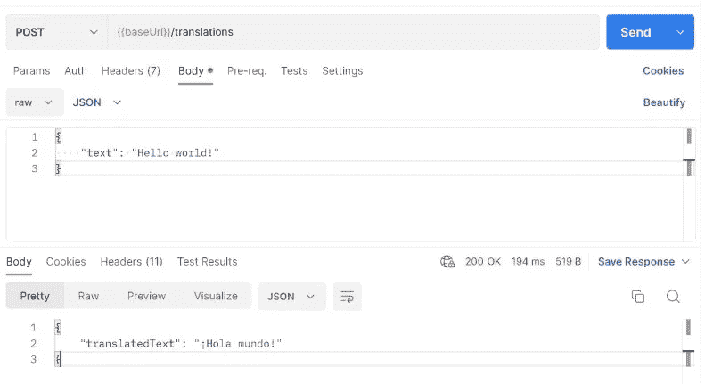

# 跳过 Lambda 函数，直接连接到您的 AWS 服务

> 原文：<https://betterprogramming.pub/skip-the-lambda-function-connect-directly-to-your-aws-services-5f10798f2d5a>

## 您知道 API Gateway 可以直接集成 100 多种服务吗？了解如何跳过 Lambda，以及在跳过时需要注意什么


图片来自 Freepik 上的[故事集](https://www.freepik.com/free-vector/enthusiastic-concept-illustration_10255231.htm#query=excited&position=11&from_view=search&track=sph)

无服务器是一个[不断改进](/quick-optimizations-you-should-make-to-your-serverless-applications-9cc73ec464b9)的永无止境的过程。

改进设计。减少延迟。为开发者体验优化 API。最小化成本。你明白了。

我最喜欢的增强无服务器系统的方法之一是减少支持它们的基础设施的数量。

早在 2021 年初，我在 Nimbella(现在的[数字海洋](https://www.digitalocean.com/))会议上做了一个关于[为快乐的客户对你的无服务器 API 进行功率调优](https://www.readysetcloud.io/talks/power-tuning-your-serverless-api)的演讲。这里有几个优化点，但我希望人们记住的关键点是 API Gateway 直接连接到 AWS 服务。

当执行像`DynamoDB GetItem`、`SQS SendMessage`或`Step Functions StartSyncExecution`这样的单一操作时，不需要 Lambda 函数。默认情况下，我们中的许多人会添加一个 Lambda 函数来执行简单的操作。

但是你不需要。

增加的 Lambda 函数增加了应用程序的成本和复杂性。也是不必要的代码。詹姆斯·贝斯维克说得好，“代码是一种负担。”

至此，让我们来讨论如何开始将 API 网关直接连接到下游服务，以跳过“Lambda glue”并减少延迟时间。

# 可用服务

当我对 API Gateway 支持的服务进行初步研究时，我期待着“六大”:Lambda、DynamoDB、SNS、SQS、EventBridge 和 Step 函数。

但是事实证明，[有 104 个服务](https://gist.github.com/allenheltondev/de6c777bb00171b29714c9d89f593573)可以直接集成。这是一个令人印象深刻的数字，它为数量惊人的用例打开了大门。

为了使这篇文章可读性更好，篇幅不超过 300 页，我们不会涉及与每个服务集成的细节，但是我们将浏览一个服务，看看组件以及如何将其扩展到您希望集成的任何服务。

该示例是一个通用集成，应该适用于上面列表中的大多数服务。

# 构建集成

我是 API 优先开发(T2)的倡导者。成功的关键是通过像[开放 API 规范](https://www.openapis.org/)这样的规范文档来定义你的 API。记住这一点，我们所有的集成都可以在规范中定义。

API Gateway 有一个[开放 API 扩展](https://docs.aws.amazon.com/apigateway/latest/developerguide/api-gateway-swagger-extensions-integration.html)，它接受您的定义并将其翻译成 AWS 资源。作为路径定义的一部分，它正好符合我们的规范，我们将使用它来配置直接集成。

通过 API gateway 直接连接服务主要关注于将请求有效负载转换为 SDK 格式，并将响应格式化为用户友好的有效负载。Alex Debrie 在他的[API 网关元素概述](https://www.alexdebrie.com/posts/api-gateway-elements/#step-2-transforming-the-request-with-the-integration-request)中详细介绍了这个阶段。

具体来说，通过这些直接集成，我们的重点是重新创建服务支持的 REST API 调用。这意味着我们必须找出头部并请求主体提供服务。

让我们举一个真实世界的例子。

我想构建一个端点，它接受英语文本字符串，并将其翻译成西班牙语返回。为此，我可以调用 [Amazon Translate](https://docs.aws.amazon.com/translate/latest/dg/what-is.html) 服务中的`TranslateText` API。

在我们的 API 规范中，这种集成最终会是这样的。

这个代码片段有很多东西需要解开。

首先，我们将谈论 URI。这告诉 API gateway 它将调用哪个服务和动作。 [API 网关文档](https://docs.aws.amazon.com/apigateway/latest/api/API_Integration.html#apigw-Type-Integration-uri)将该属性描述为:

> *URI 的形式为* `*arn:aws:apigateway:{region}:{service}:path|action/{service_api}*` *。这里，* `*{Region}*` *是 API 网关区域(如 us-east-1)；* `*{service}*` *是集成 AWS 服务的名称(如 s3)。动作可以用于一个 AWS 服务的基于动作的 API，使用一个* `*Action={name}&{p1}={v1}&p2={v2}*` *。随之而来的* `*{service_api}*` *是指一个被支持的动作* `*{name}*` *加上任何需要的输入参数。*
> 
> *或者，path 可用于基于 AWS 服务路径的 API。*

构建 URI 首先需要的是服务名。你可以从这个要点中得到服务的名称[。只是确保不包括`.amazonaws.com`部分。你只需要名字。在我们的例子中，我们使用 translate 作为服务名。](https://gist.github.com/shortjared/4c1e3fe52bdfa47522cfe5b41e5d6f22)

URI 的下一部分是决定我们是否需要`path`或`action`。不幸的是，每种服务都是不同的，支持也因集成的服务而异。

然而，我发现如果你不知道使用哪一个，你可以像我上面用`path/${AWS::AccountId}`那样建模，并在`X-Amz-Target`头中提供动作的识别信息。这是一个通用的实现，适用于许多服务。

我们主要关心两个标题:

*   `Content-Type`的应用`/x-amz-json-1.1`
*   `X-Amz-Target`

你会问为什么`Content-Type`头必须是这个特殊值而不是 application/JSON？不幸的是，它没有被官方记录，但是一个[可靠的推测](https://stackoverflow.com/questions/65118844/what-is-application-x-amz-json-and-how-is-it-different-from-application-json)相信它是一个告诉 AWS 服务额外行为的扩展。

`X-Amz-Target`头告诉服务您想要运行哪个操作。该值根据您正在集成的服务而变化，并不总是容易找到。

我发现定位`X-Amz-Target`值的最好方法是从[AWS 支持票](https://repost.aws/questions/QUbRw_C7KISoOrFN5ShYNuFQ/http-resolver-x-amz-target)中找到，建议查看服务的 [SDK 文档](https://github.com/aws/aws-sdk-js/tree/master/apis)并定位元数据中的`targetPrefix`字段。

在我们上面的例子中，亚马逊翻译的`[targetPrefix](https://github.com/aws/aws-sdk-js/blob/master/apis/translate-2017-07-01.normal.json#L12)`T11 是`AWSShineFrontendService_20170701`。因此，我们将它与我们想要运行的操作 [TranslateText](https://github.com/aws/aws-sdk-js/blob/master/apis/translate-2017-07-01.normal.json#L444) 结合起来，构建我们的最终头值`AWSShineFrontendService_20170701.TranslateText`。

上面的`requestTemplates`属性是一个转换，它接受请求负载并以正确的格式将其传递给服务。

服务运行后，responses 属性将响应转换为您希望返回给调用者的格式。

关于这些的更多细节， [Andres Moreno](https://twitter.com/andmoredev) 在他的关于[如何在 AWS 中不使用单一 Lambda 函数](https://www.andmore.dev/blog/build-serverless-api-with-no-lambda/)构建无服务器 API 的帖子中做了漂亮的描述。

构建直接集成的最后一部分是 IAM 角色。您必须构建一个允许 API Gateway 执行您正在集成的操作的角色。端点的角色可能如下所示:

您可以看到承担这个角色的主体的作用域是 API Gateway。遵循[最小特权](https://aws.amazon.com/blogs/security/techniques-for-writing-least-privilege-iam-policies/)原则，我们只允许它执行`TranslateText`操作。

这个角色在扩展的 credentials 属性中的 API 规范中被引用。

```
x-amazon-apigateway-integration: 
  credentials: 
    Fn::Sub: ${TranslateTextRole.Arn}
```

有了这个，我们就有了将我们的集成部署到云中的所有组件！请[参考本要点](https://gist.github.com/allenheltondev/4337bfc2165c4ef0bc31517159fede90)获取完整的集成副本。

在我们部署并到达终点后。成功！



*与亚马逊翻译成功整合*

它不仅可以工作，而且你可以看到它的速度非常快。做翻译的往返才 194ms！

# 直接整合的危险

从理论上讲，去掉 Lambda 函数是一个好主意。你需要维护的资源少了一个；这是“配置胜于代码”，总的来说，这是少了一个可能出错的部分。

但是也有一些缺点。

通过 API Gateway 直接与服务集成，您将失去[单元测试](https://www.techtarget.com/searchsoftwarequality/definition/unit-testing)的能力。由于没有代码运行，这些低级测试并不真正适用。

有些人会说你不需要对调用第三方服务进行单元测试。在这种情况下，您唯一可以测试的是传递给 AWS 操作的数据的形状。验证您的开发人员为正确的字段提供了正确的数据，这是一个值得的测试吗？

代替单元测试，在你的代码被部署后，你必须进一步依赖于[集成测试](https://www.guru99.com/integration-testing.html)的 [CI 过程](/are-you-really-ready-for-ci-cd-9a8bf6d01b8a)来捕捉任何错误。

另一个重要的考虑因素是数据完整性。如果您从 API 规范直接将数据插入 DynamoDB，您可能会绕过一些重要的验证、丰富或其他代码正在执行的模式检查。

当你的实体不可避免地改变时，在多个地方定义你的实体的形状(像一个共享的 [Lambda 层](/how-to-build-both-kinds-of-aws-lambda-layers-yes-there-are-two-edb945979f17)和你的开放 API 规范集成)增加了出错的可能性。开发人员可能只更新一个地方，而不更新另一个地方，导致数据格式陈旧。

导致开发人员回避直接集成的一个原因是使用了 [VTL](https://velocity.apache.org/engine/devel/vtl-reference.html) 和 [API 网关映射模板](https://docs.aws.amazon.com/apigateway/latest/developerguide/api-gateway-mapping-template-reference.html)。当你决定是否要将它融入你的应用程序时，这是需要考虑的事情。你的开发人员和任何维护你的应用程序的人都需要学习 VTL。

关于提升你的团队技能，有一些事情要说，但是有些情况可能更适合坚持你所知道的。尤其是当涉及到 VTL 的复杂性质时。

# 摘要

将 API 端点直接集成到 AWS 服务是减少延迟和最小化应用程序活动部分的好方法。简单的单操作端点非常适合这种类型的集成。

不幸的是，没有单一一致的方法来构建它们。他们有时觉得有点像是徒劳无功。但是您使用它们越多，您就越熟悉如何为给定的集成找到正确的信息。

如果你愿意承担风险，比如依赖集成测试而不是单元测试，在使用数据持久性集成时严格控制数据结构，以及学习 VTL，直接集成可能会很棒。

直接服务电话的简单和优雅令人惊叹。您将负责 IAM 角色和映射模板。就是这样！

我使用直接集成已经有一段时间了，但主要是用 DynamoDB、SQS 和阶跃函数。我的团队现在对 VTL 和与映射模板相关的调试问题相对比较满意。对我们来说，这个决定很容易。当我们可以直接整合时，我们会的。

成本降低了，性能提高了，由于代码减少了，bug 也减少了。

这并不适合所有人，但是适合那些选择直接集成更多服务的人——祝你们好运！

编码快乐！