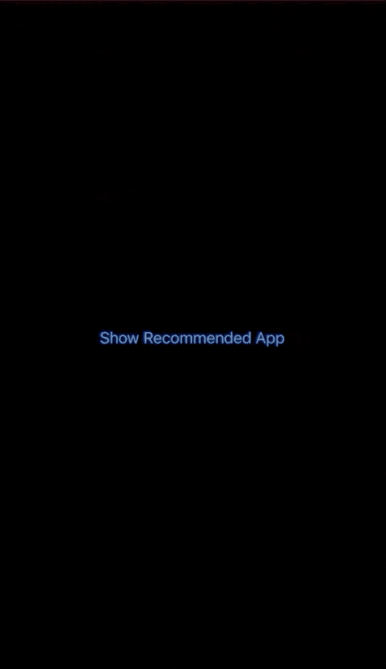

# 斯威夫图伊的斯科弗雷

> 原文：<https://betterprogramming.pub/skoverlay-in-swiftui-b2d102e7c08c>

## 向用户推荐其他应用程序，让他们即时下载该应用程序


照片由[整形的](https://unsplash.com/@shapelined?utm_source=medium&utm_medium=referral)在[未整形的](https://unsplash.com?utm_source=medium&utm_medium=referral)上拍摄。

在 2020 年 WWDC 大会上，苹果推出了`SKOverlay`，你可以用它向用户推荐其他应用，并允许他们立即下载应用。

请注意，您将无法在应用程序扩展上使用此功能。

`SKOverlay`向用户宣传你的其他应用程序非常有用。

> *“一个显示覆盖图的类，你可以用它来推荐另一个应用。”—* [*苹果开发者*](https://developer.apple.com/documentation/storekit/skoverlay)

# 先决条件

要学习本教程，您需要了解以下方面的一些基本知识:

*   迅速发生的
*   至少 Xcode 12+

*注意:这只支持 iOS 14+。*

# SKOverlay 入门

首先，您需要导入所需的框架:

```
import StoreKit
```

然后创建一个`State`来保存一个`bool`值:

```
@State private var showRecommended = false
```

接下来，插入一个`Button`，点击后会显示`SKOverlay`:

为了测试这一点，您需要在您的真实设备上运行它，而不是在模拟器上运行。确保你的真实设备至少是 iOS 14+。

让我们来了解一下如何取回`appIdentifier`。你可以在谷歌上输入以 iOS 结尾的应用程序名称来检索。例如，我会在谷歌上搜索我的一个应用程序:马来西亚法律 101 iOS。

这就是链接的样子:[https://apps.apple.com/my/app/malaysia-law-101/id1504421248](https://apps.apple.com/us/app/malaysia-law-101/id1504421248)。无论你的应用是在美国还是在我的市场，ID 都是一样的。

接下来，您只需提取数字(在本例中为 1504421248)并将其添加到参数中，如上面的代码所示。

截至目前，唯一可用的位置是`.bottom`和`.bottomRaised`。我们来看看有什么区别。

对于`.bottom`:



对于`.bottomRaised`:


感谢阅读！