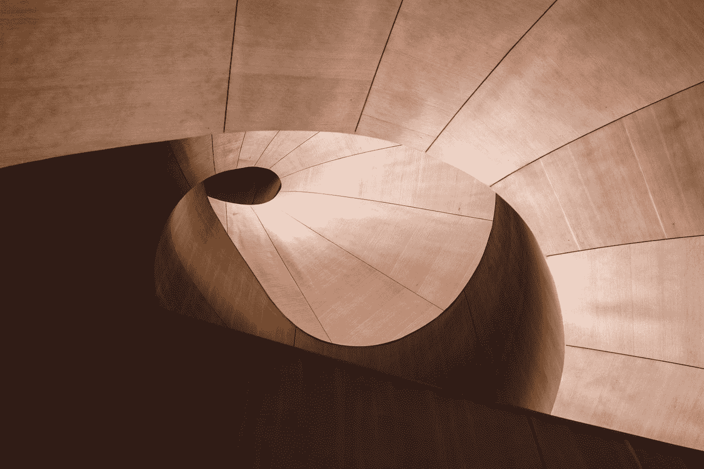
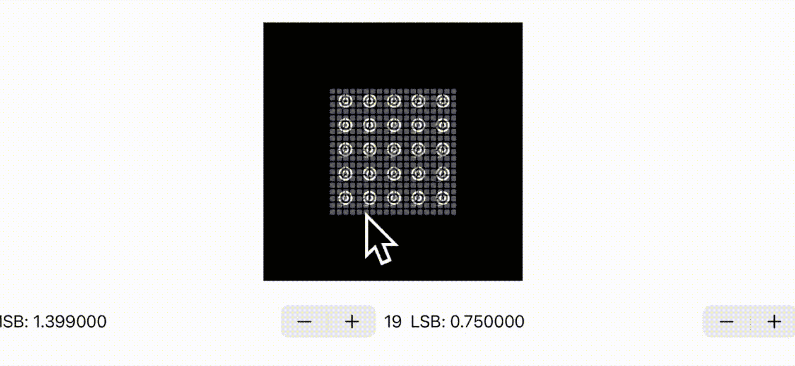

# 使用 SwiftUI 在 SpriteKit 中进行 skwarp 几何处理

> 原文：<https://betterprogramming.pub/skwarpgeometry-in-spritekit-with-swiftui-3b90dda1f6ff>

## 看一看肯定是 CS 毕业生设计的命令



尼克·希利尔在 [Unsplash](https://unsplash.com?utm_source=medium&utm_medium=referral) 上拍摄的照片。

作为一名计算机科学毕业生，我开始意识到我看待世界的方式与大多数人不同。时不时地，我会遇到一个非常神秘的命令，以至于我会悄悄地对自己说，“这肯定是一个 CS 毕业生设计的。”

SpriteKit 中的`SKWarpGeometry`就是这样一个命令。甚至关于这个主题的苹果文档页面也是由一名计算机系毕业生整理的。我知道这一点，因为它也有点令人费解。这是关于这个主题的一篇好文章。

加入我的探索，弄清楚这东西如何工作，如何使用它。

# 旅程

不久前，我写了几篇关于贝塞尔曲线的文章:

[](/using-bezier-curves-in-swiftui-9d080657fb15) [## 在 SwiftUI 中使用贝塞尔曲线

### 让我们构建一个简单的应用程序来探索贝塞尔路径

better 编程. pub](/using-bezier-curves-in-swiftui-9d080657fb15) [](/using-de-casteljaus-algorithm-bezier-curves-in-swiftui-3dcadd62635e) [## 在 SwiftUI 中使用 De Casteljau 算法/贝塞尔曲线

### 苹果的贝塞尔曲线代码很好，但有时你需要深入挖掘

better 编程. pub](/using-de-casteljaus-algorithm-bezier-curves-in-swiftui-3dcadd62635e) [](/a-better-bezier-curve-a-polynomial-in-swiftui-e0807e9cc214) [## 更好的贝塞尔曲线 SwiftUI 中的多项式

### 伯恩斯坦多项式是德·卡斯特尔约·贝齐尔的替代物

better 编程. pub](/a-better-bezier-curve-a-polynomial-in-swiftui-e0807e9cc214) 

在第一篇文章中，我开发了一个应用程序来帮助读者理解上述曲线中使用的数学公式。这是一个演示程序，让他们动态地改变参数，进入一个贝塞尔曲线。

这是一种尝试理解正在发生的事情的有趣方式，所以我决定建立一个简单的程序来对`SKWarpGeometry`做同样的事情。我希望这也是一个将 SwiftUI 卓越的布局功能与 SpriteKit 结合使用的很好的例子，尽管结果并不完全是这样。

# 外星象形文字

好了，让我们从这张动画 GIF 开始，它展示了扭曲几何体的最基本的矩阵。


使用`warp`命令集，你有 16 个变量来改变正方形的基本形状。按钮是 SwiftUI，而中心部分是 SpriteKit。我使用一个组合`PassThroughSubject`将两个框架链接在一起。转换背后的代码如下所示。向量的值`tL1`、`tL2`等。开始与`sourcePositions`相同。

演示应用程序的工作方式是，你有一个看起来像这里显示的一对(`source`或`destin`)的源向量。

```
source = vector_float2(0.0, 1.0) destin = vector_float2(1.0, 0.0) 
```

你有 8 个向量或者 16 个浮点数可以改变。

当我点击上面有图形的按钮时，`warp`命令会从这些值中选择一个，然后加上或减去 0.1。然后将其应用并转换为新的形状。看着这个让我想到了外星字母表。在我们的八对中，仅将一个浮点值改变 0.5，就会返回一个独特的形状。换两个彩车就更好了。事实上，如果我结合两种转换，我肯定有足够的变化来建立一个外星字母表。

# 后续步骤

现在你理解了基本概念，让我们进入下一个阶段。最后一个演示程序使用了一个 2x2 的网格。但是你的网格不需要是正方形的。它可以是 3x2、4x3 等。可能不太明显(至少对我来说)的是源值，所以我写了这段代码来解决这个问题:

让我们构建第二个演示程序，让您选择使用任何大小的矩阵。这项任务听起来容易做起来难。我用它来设计一个外星字母 x。



你看到的是一个由简单纹理组成的精灵节点。我随后用扭曲几何学绘制了它，把它切割成 25 个向量。你可以看到带白点的向量。当我点击这个点时，我有机会改变源/目的地图的值。你可以看到我在中间选择的向量的索引值，它的值显示在步进器中。我点击不同的向量，慢慢地但肯定地改变目的地地图，以建立你看到的字母逐渐出现。

这是弄清楚这是如何工作的一个很好的工具。我为什么这样做？因为:

*   我需要一个控制面的设计，它应该是可扩展的，并且比之前的设计更简单。网格是最有意义的。
*   我需要一种方法来改变向量中的值，以测试这些改变的效果。我在 SwiftUI 界面中选择了几个步进器。我确实试着用一些`drag`手势做到这一点，但是它……很丑。
*   我想使用两个`SKScenes`，一个用于控件，另一个用于被管理的精灵。我试过 SwiftUI 按钮，但在一些测试后，我又退而求其次。我需要调整顶部场景的不透明度来阻止它完全覆盖第一个场景。
*   最后，因为我要将我的形状扭曲到它本身，而不仅仅是侧面，我需要创建一个有纹理的精灵节点。没有它，对一些向量的改变是不可见的。

你会开始意识到做好这件事的复杂性。在这个例子中，我有 25 个向量，每个向量有两个点，它们的值可以增加或减少。将演示代码复制到您自己的项目中，然后进行试验。你很快就会明白我的意思。

## 将来的

这看起来不错，但是你怎么能让它变得更好呢？

*   你可以尝试用一种或多种渐变给 sprite 节点上色。参见我的文章,其中详细介绍了一种技术。
*   您可以添加一个按钮来记录该序列，以便回放。
*   如果您正在录制，您可以添加一个按钮来将序列保存到 XML 或 XLIST 中。
*   如果你正在保存序列，你也需要一个加载按钮来重新读取以前的设计。
*   我在这里什么都没做，但是也有很大的潜力。也许 SwiftUI 中的一个表盘可以做到这一点，这可能会很有趣。显然，你也需要把它们记录到你的序列中。我给[写了一篇关于 2D 和 3D 旋转的文章](/how-to-draw-in-3d-with-swiftui-7989cfcd35fc)。

## 更多的烈酒

如果你是 SpriteKit 的新手，你会发现大量关于这个主题的文章。我最喜欢的几首是由@ [阿图里·贾利](https://artturi-jalli.medium.com/?source=post_page-----8d66b83f8091--------------------------------)和@ [马克·J·范德黑](https://medium.com/@marc.vandehey?source=post_page-----79a750ef319f--------------------------------)写的:

[](https://medium.com/codex/integrate-spritekit-to-your-app-8d66b83f8091) [## 将 SpriteKit 集成到您的应用中

### 轻松连接 SpriteKit 和 UIKit，并将令人惊叹的 SpriteKit 动画添加到基于故事板的应用程序中。

medium.com](https://medium.com/codex/integrate-spritekit-to-your-app-8d66b83f8091) [](https://medium.com/@marc.vandehey/raincat-lesson-1-79a750ef319f) [## RainCat:第一课

### 如何在 Swift 3 中制作一个简单的 SpriteKit 游戏

medium.com](https://medium.com/@marc.vandehey/raincat-lesson-1-79a750ef319f) 

最后，在我离开之前，这里是第二个演示应用程序的源代码:

这让我想到了这篇文章的结尾。我希望你喜欢读它，就像我喜欢写它一样。请随意查看我在 Medium 上发表的 150 多篇文章，了解更多 Swift 内容。

[](https://marklucking.medium.com) [## 马克·卢金-中号

### 看看 SwiftUI、SpriteKit 和 Combine 之间的协同作用这是《从单例开始》中的第三篇文章…

marklucking.medium.com](https://marklucking.medium.com)