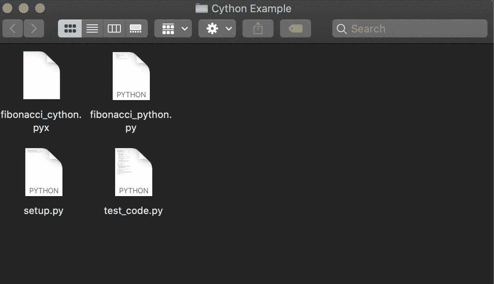
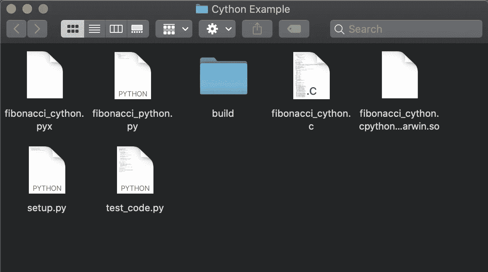

# 用 Cython 让您的 Python 代码扶摇直上

> 原文：<https://betterprogramming.pub/skyrocket-your-python-code-with-cython-6851e357bef8>

## 利用 C 的性能运行 Python 程序，速度快得惊人


照片由 [Shiro hatori](https://unsplash.com/@shiroscope?utm_source=medium&utm_medium=referral) 在 [Unsplash](https://unsplash.com?utm_source=medium&utm_medium=referral) 上拍摄

Python 是一种流行的编程语言。您可以在各种应用程序中使用它，例如 web 开发和数据科学。

Python 的一个主要缺点是速度慢。您可以在这里将 Python 的性能与其他编程语言[进行比较。](https://benchmarksgame-team.pages.debian.net/benchmarksgame/fastest/gpp-python3.html)

你可以做很多事情来加速你的 Python 程序。今天，您将学习如何使用 Cython 为您的 Python 提供类似 C 的性能。

当你真的需要“更快版本的 Python”时，使用 Cython 最适合你。换句话说，当其他招数，比如使用 CPU 或者优化 GPU 都无济于事的时候。

# 什么是 Cython

Cython 是一种编程语言。它是“具有类似 C 语言性能的 Python”它具有 Python 的语法，但是您需要为变量和函数指定类型信息。当你编译你的 Cython 程序时，它会编译成 c。

# 如何安装 Cython

通过在终端中运行以下命令，经由`pip`安装 Cython:

```
pip install cython
```

# Cython 计划工作流程

编写一个 Cython 程序

1.  写一个 Python 程序。
2.  转换成 Cython。
3.  编译你的 Cython 程序。
4.  运行生成的 C 程序。

# 如何将 Python 变成 Cython

要将 Python 程序转换成 Cython，将声明关键字和[类型信息](https://cython.readthedocs.io/en/latest/src/userguide/language_basics.html)添加到变量、函数等中。

以下是用于创建变量/函数的可能的声明关键字:

*   `**def**` 创建一个 Python 专用的函数。
*   `**cdef**`创建一个 C 语言专用的函数或变量。上面写着" C Define "
*   `**cpdef**`创建一个 C 和 Python 函数或变量。上面写着“C 和 Python 定义。”

以下是一些与变量和函数相关的常见类型:

*   `**int**`
*   `**float**`
*   `**double**`
*   `**list**`
*   `**dict**`

在这里找到其余的类型。

让我们看几个如何在 Cython 中指定类型的例子。

## 示例 1:变量

要在 Python 中声明一个名为`number`的浮点变量，您通常会这样做:

```
number = 10.0
```

要在 Cython 中实现这一点，您需要指定变量的类型，在本例中是 float:

```
**cdef** **float** number = 10.0
```

这一行写着“定义一个只有 Cython 的变量，它是一个`float`。称之为`number`，使其等于`10.0`。”

## 示例 2:函数

此 Python 函数返回两个整数之和:

```
**def** sum(n1, n2):
    **return** n1 + n2
```

要将其转换为 Cython，您需要

*   用`**cdef**`宣告。
*   指定函数的返回类型为`**int**`。
*   指定函数中的参数类型(均为整数)

```
**cdef** **int** sum(**int** n1, **int** n2):
    **return** n1 + n2
```

恭喜你。现在你知道如何把你的 Python 程序变成 Cython 了。

接下来让我们通过使用 Python 和 Cython 生成斐波那契数来检查 Cython 的性能。

# 斐波那契数—Python 与 Cython

斐波那契数列是一系列数字:`0, 1, 1, 2, 3, 5, 8, 13...`，其中每个数字都是前面两个数字的和。

在 Python 中有不同的方法可以生成斐波那契数。在这个例子中，您将使用递归方法。

让我们在 Python 和 Cython 中同样地实现`fibonacci()`函数，以便可靠地比较性能:

*   打开一个新文件夹，创建一个名为`fibonacci_python.py`的 Python 文件
*   在其中编写以下 Python 版本的`fibonacci()`函数:

*   接下来，在同一个文件夹中创建一个名为`fibonacci_python.pyx`的 Cython 文件。
*   要将上述代码转换为 Cython，请添加如下类型信息:

恭喜你。这是你的第一个 Cython 程序。我们来编译一下:

*   创建一个名为`setup.py`的文件
*   将以下几行复制到其中:

现在，您的文件夹应该如下所示:



*   接下来，在终端中运行以下命令(在 Cython 文件的文件夹中):

```
python setup.py build_ext --inplace
```

这会将您的 Cython 程序直接编译为 C。它还会创建一个文件夹和文件，其中包含运行生成的 C 程序所需的文件:



最后，测试您的`fibonacci()`功能

*   创建一个名为`test_code.py`的新 Python 文件，并将下面的代码粘贴到其中:

*   现在使用以下命令运行`test_code.py`文件:

```
python test_code.py
```

结果是第 10 个斐波那契数，也就是`55`:

```
55 55
```

它工作了。

接下来，让我们通过在一系列输入下运行`fibonacci()`函数来比较性能。

## 表演

在这个部分，你需要 [Matplotlib](https://matplotlib.org/) 。如果您没有它，您可以安装它:

```
pip install matplotlib
```

让我们运行两个版本的`fibonacci()`函数来比较运行时间。为此，将下面的代码复制粘贴到您的`test_code.py`文件中，并使用`python test_code.py`运行它。

简而言之，这段代码:

*   运行`fibonacci()`的 Python 和 Cython 版本，并记录运行时。
*   打印每次运行的运行时间和加速时间。
*   用 [Matplotlib](https://matplotlib.org/) 绘制运行时间。

## 结果

使用`fibonacci()`功能，Cython 计算数字的速度提高了 50-60 倍。与 Python 程序相比，这是一个令人难以置信的性能提升。

下图显示了运行时间:


test_code.py 程序生成的图形。

# 结论

您可以使用 Cython 来提高 Python 程序的性能。从语法上讲，它是一种类似 Python 的语言。唯一的区别是您需要指定类型信息。

当您运行 Cython 程序时，您的代码会转换为 C。您可以使用 Python 脚本运行这个 C 程序。完全不需要接触 C 代码。

例如，在 Cython 中计算斐波那契数比在 Python 中快 50-60 倍。

感谢您阅读这篇关于 Cython 的简短介绍。编码快乐！

我很想加入你的 LinkedIn 网络。随意连接 [Artturi Jalli](https://www.linkedin.com/in/artturi-jalli-29619413a) 。

# 你可能会发现见解深刻

[](/50-python-interview-questions-and-answers-5230fe2a0db6) [## 50 Python 面试问答

### Ace 您的下一次编码面试

better 编程. pub](/50-python-interview-questions-and-answers-5230fe2a0db6) [](/10-useful-python-snippets-to-code-like-a-pro-e3d9a34e6145) [## 10 个有用的 Python 片段，让你像专业人士一样编写代码

### 我每天使用的有用的提示和技巧

better 编程. pub](/10-useful-python-snippets-to-code-like-a-pro-e3d9a34e6145) [](/10-must-know-jupyter-notebook-tricks-51baea31922) [## 10 个必须知道的 Jupyter 笔记本技巧

### 节省时间，提高生产力

better 编程. pub](/10-must-know-jupyter-notebook-tricks-51baea31922) 

# 参考

 [## 欢迎来到 Cython 的文档——cy thon 3.0a 7 文档

### 🤝喜欢这个工具吗？帮助它变得更好！您的捐赠有所帮助！🤝

cython.readthedocs.io](https://cython.readthedocs.io/en/latest/)