# 如何构建一个 Slack 应用程序来抓取网站数据

> 原文：<https://betterprogramming.pub/slack-app-website-scraper-356d5d86bbd8>

## 使用斜杠命令抓取网站链接，并将结果发布在频道内

在[上一个教程](https://github.com/JanethL/WebScraper)中，我们学习了如何在标准库上使用 [crawler.api](https://stdlib.com/@crawler/lib/query) 来抓取使用 CSS 选择器的网站。我们用一个简单的 API 调用抓取了[《经济学人》](https://www.economist.com/)的首页标题和它们各自的 URL。

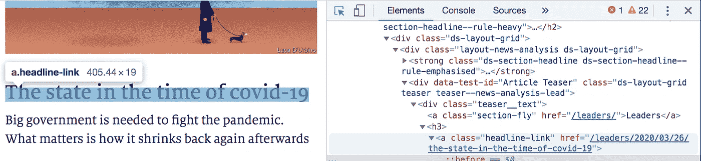

在本指南中，我们将学习检索并发送抓取的数据到 [Slack](http://slack.com) 中。我们将快速设置一个 [Slack](http://Slack.com) 应用程序，它使用斜杠命令搜索网站链接，并在 Slack 频道中发布结果，如下所示:

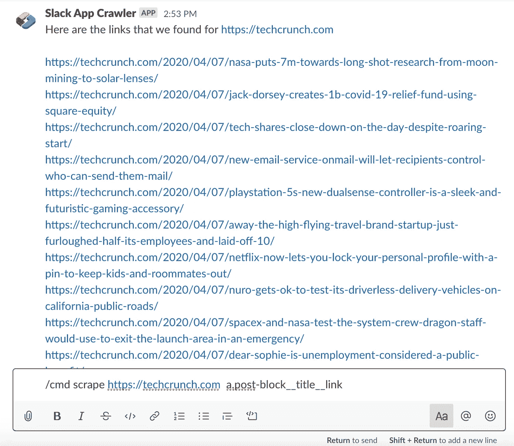

一旦你部署了这个 Slack 应用，你可以返回并修改代码来添加额外的逻辑，抓取不同的数据。

## **用例**

*   从[新闻网站](https://codeburst.io/how-to-easily-scrape-websites-for-data-using-autocode-maker-mode-4cb3de227de7)抓取数据，在 [Slack](http://slack.com) 频道内分享、比较和讨论。
*   收集[电子邮件地址的域名](https://medium.com/@keithwhor/build-an-e-mail-phone-number-scraper-in-7-minutes-with-google-sheets-standard-library-and-70ac1c27b562)并使用[clear bit API](https://stdlib.com/search/?q=clearbit')应用丰富功能——与您在 [Slack](http://slack.com) 的销售团队分享
*   快速收集[电话号码](https://medium.com/@keithwhor/build-an-e-mail-phone-number-scraper-in-7-minutes-with-google-sheets-standard-library-and-70ac1c27b562)并协助您的 SDR 团队在[空闲时间](http://slack.com)内开展电话营销活动
*   帮助你的营销团队从论坛和社交媒体中提取数据来进行情绪分析，所有这些都在[空闲期](http://Slack.com)内完成。

注意:请记住尊重你抓取的任何网站的爬虫的政策。

# **目录:**

*   从 Github 安装
*   测试你的 Slack 应用网站刮刀
*   做出改变
*   支持
*   感谢

# 从 Github 安装

前往 [Github 获取我的项目代码](https://github.com/JanethL/SlackAppWebscraper/blob/master/README.md)。点按“在自动编码中打开”按钮。

或者点击此链接直接进入 Autocode:[https://Autocode . stdlib . com/github/Janet HL/SlackAppWebscraper/master/？filename=README.md](https://autocode.stdlib.com/github/JanethL/SlackAppWebscraper/master/?filename=README.md) 。

系统会提示您登录或创建一个免费帐户。如果您有标准图书馆帐户，请单击“已注册”并使用您的标准图书馆凭据登录。

给你的项目起一个唯一的名字，然后从 Github 中选择 Start API Project:

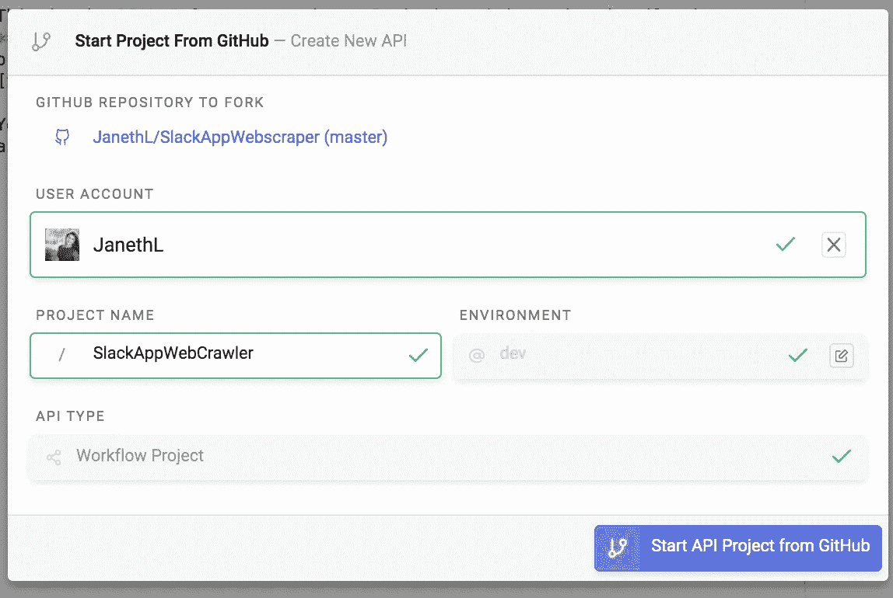

Autocode 会自动设置一个项目支架，将您的项目保存为 API 端点，但它尚未部署。

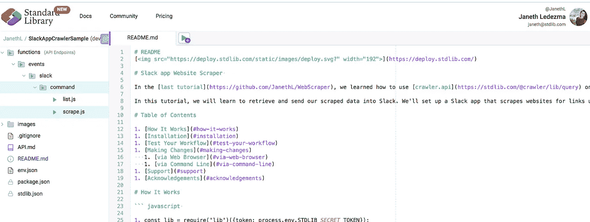

要将 API 部署到云中，请浏览`functions/events/slack/command/`文件夹并选择`scrape.js`文件。

选择“需要 1 个账户”红色按钮，这将提示您链接一个备用账户。

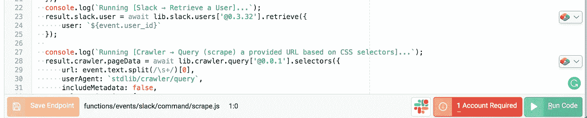

如果您已经使用标准库构建了 Slack 应用程序，您将看到现有的 Slack 帐户，或者您可以选择“链接新资源”来链接新的 Slack 应用程序。

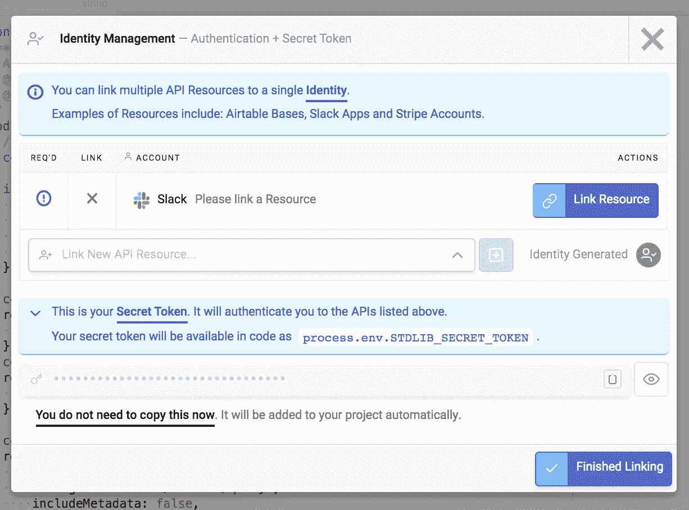

选择“安装标准库应用程序”。

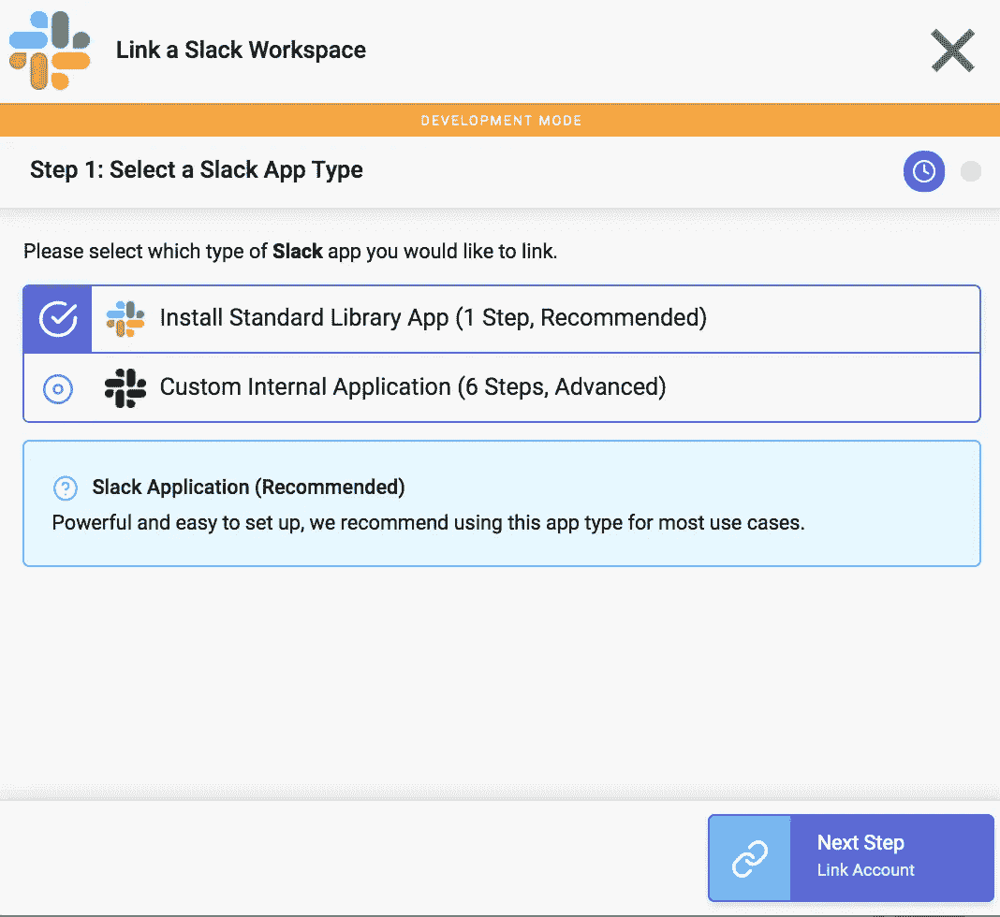

您应该会看到一个类似如下的 OAuth 弹出窗口:

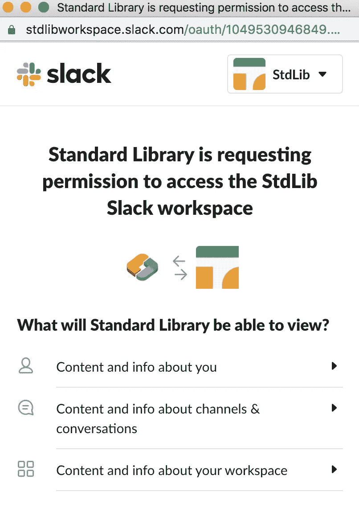

选择“允许”您可以选择使用名称和图像自定义您的 Slack 应用程序。

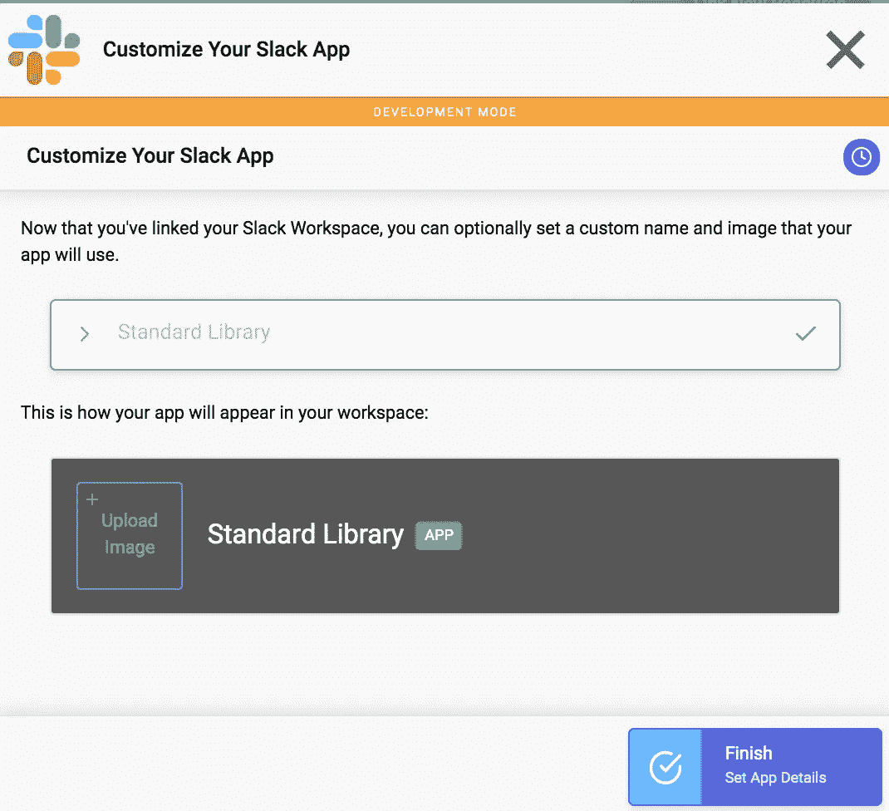

选择“.”绿色复选标记确认您已正确链接您的帐户。点击“完成链接”

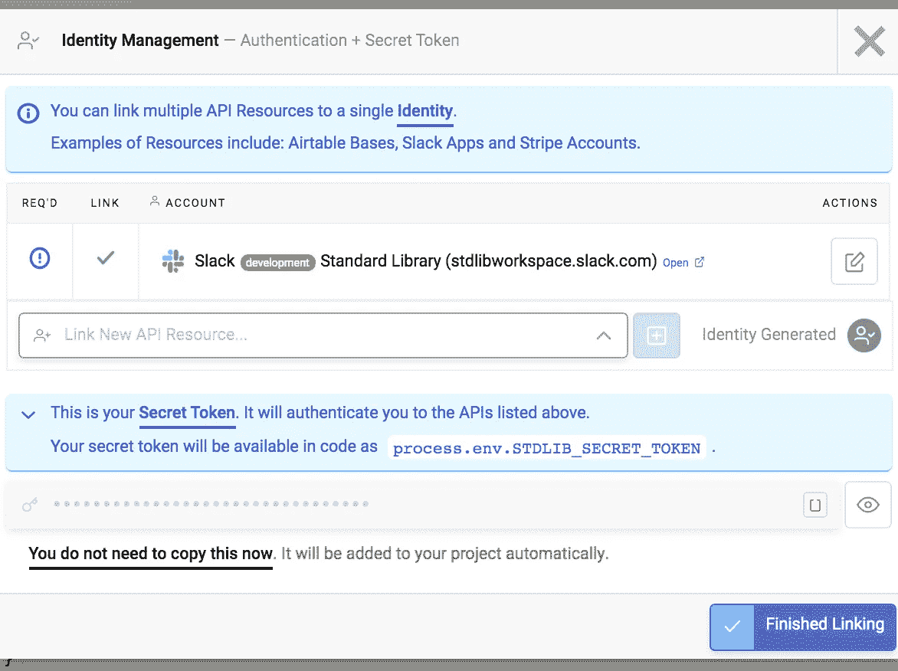

要将 API 部署到云中，请选择文件管理器左下角的“部署 API”。

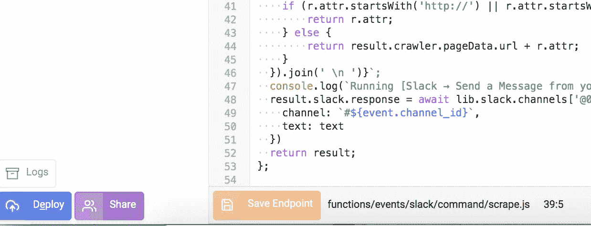

# 测试你的 Slack 应用网站刮刀

你们都完了。试试吧！您的 Slack 应用程序现在可以在您授权的 Slack 工作区中使用。

你的 Slack 应用应该会响应
`/cmd scrape <url> <selector>`，如你在这张截图中看到的:

我添加了一个额外的命令作为备忘单，并列出一些网站及其选择器来检索链接。

只需输入`/cmd list`，你应该看到你的应用程序回应如下消息(或者回顾[之前的教程，学习如何使用 css 选择器](https://codeburst.io/how-to-easily-scrape-websites-for-data-using-autocode-maker-mode-4cb3de227de7?source=your_stories_page---------------------------)进行抓取)。):

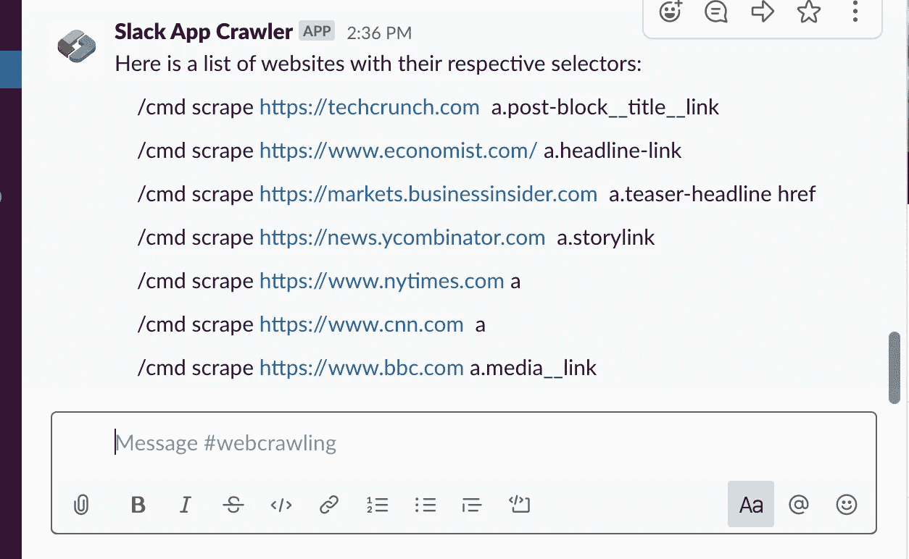

# 它是如何工作的

当你在 Slack 的消息框中提交`/cmd scrape https://techcrunch.com/ a.post-block__title__link`(或者任何 URL 后跟其各自的选择器)时，就会触发一个 webhook。在[标准库](https://github.com/JanethL/SlackAppWebscraper/blob/master/stdlib.com)上构建和托管的 webhook 将首先向 [crawler.api](https://stdlib.com/@crawler/lib/query) 发出请求，后者将返回一个 JSON 有效负载和查询结果。

然后，我们的 webhook 将为每个事件创建 Slack 消息，并将这些消息发布到调用命令的通道。

第一行代码导入了一个名为“lib”的 NPM 包，允许我们与标准库之上的其他 API 进行通信:

`const lib = require(‘lib’)({token: process.env.STDLIB_SECRET_TOKEN});`

**第 2–6 行**是注释，用作文档，允许标准库对我们的函数进行类型检查调用。如果调用没有提供正确(或预期类型)的参数，它将返回一个错误。

**第 7 行**是一个函数(module.exports ),它将导出我们在**第 8–54 行**中找到的全部代码。一旦我们部署了代码，这个函数将被封装到一个 HTTP 端点(API 端点)中，它将自动向 Slack 注册，这样每当 Slack 命令事件发生时，Slack 将发送事件有效负载供我们的 API 端点使用。

**第 11–16 行**是一个 if 语句，它处理不正确的输入，并使用`lib.slack.channels['@0.6.6'].messages.create`向 Slack 发送消息。

**第 18–21 行**向`lib.slack.conversations[‘@0.2.5’]` API 发出 HTTP GET 请求，并使用 info 方法检索 channel 对象，该对象包含有关 channel 的信息，包括名称、主题、目的等，并将其存储在 result.slack.channel 中。

**第 22–25 行**也向`lib.slack.users[‘@0.3.32’]`发出 HTTP GET 请求，并使用 retrieve 方法获取包含用户信息的用户对象，并将其存储在 result.slack.user 中

**第 27–39 行**向`lib.crawler.query['@0.0.1']`发出 HTTP GET 请求，并在调用 Slack 命令事件时传入输入。对于`url`，我们传递来自松弛事件`event.text.split(/\s+/)[0]`的第一个输入。

`userAgent`设置为默认:`stdlib/crawler/query`

`includeMetadata`是`False`(如果`True`，将在响应的 meta 字段中返回额外的元数据)

`selectorQueries`是一个只有一个对象的数组，值为{ `selector` : `event.text.split(/\s+/)[1]`，`resolver':'attr`，`attr` : `href` }

对于`selector`，我们使用`event.text.split(/\s+/)[1]`从 Slack 事件中检索第二个输入。

第 40–53 行使用在`channelId`和`Text`中传递的参数创建并发布您的消息。

你可以在这里阅读更多关于 [API 规范和参数](https://docs.stdlib.com/connector-apis/building-an-api/api-specification/)。

# 做出改变

现在你的应用已经上线，你可以随时返回添加额外的逻辑，用 [crawler.api](https://stdlib.com/@crawler/lib/query) 抓取网站数据。

有两种方法可以修改您的应用程序。第一种是通过我们的浏览器内编辑器 [Autocode](https://autocode.com/) 。第二种是通过[标准库 CLI](https://github.com/stdlib/lib) 。

## 通过网络浏览器

只需访问`[Autocode.com](https://autocode.com/)`并选择您的项目。通过这种方式，您可以轻松地进行更新和更改，保存您的更改并直接从浏览器进行部署。

# 运输到生产

标准库具有简单的开发/生产环境管理。如果您想发货生产，请访问`[build.stdlib.com](https://build.stdlib.com/)`，找到您的项目并选择`manage`。

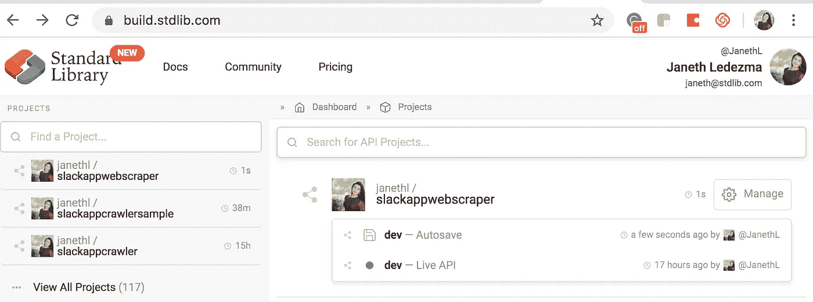

在环境管理屏幕中，只需单击“发货”

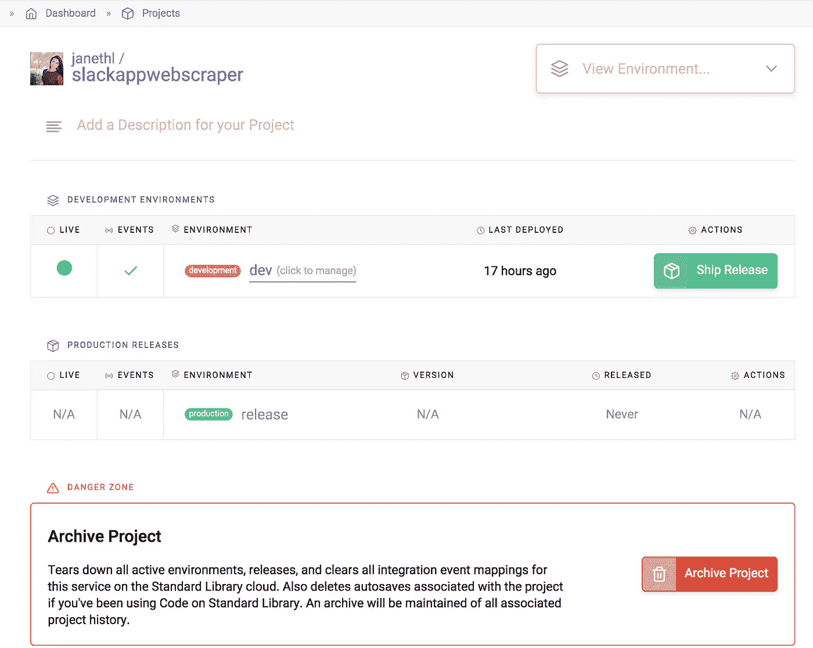

链接任何必要的资源，指定版本，然后单击“创建版本”继续。

这就是你需要做的！

# 支持

*   Via Slack: `[libdev.slack.com](https://libdev.slack.com/)`
*   您可以点击`[https://stdlib.com](https://stdlib.com/)`顶部栏中的`Community > Slack`请求邀请。
*   通过推特:[@桑达尔图书馆](https://twitter.com/StandardLibrary)
*   通过电子邮件:【support@stdlib.com 

# 感谢

感谢标准库团队和社区的所有支持！

在我们的[博客](https://stdlib.com/blog)上了解最新的平台变化。

快乐大厦！