# 从 CircleCI 获取 Android 版本的松弛版本通知

> 原文：<https://betterprogramming.pub/slack-build-notifications-from-circleci-for-android-builds-b39be7f480bf>

## 为你的应用建立一个有用的通知渠道

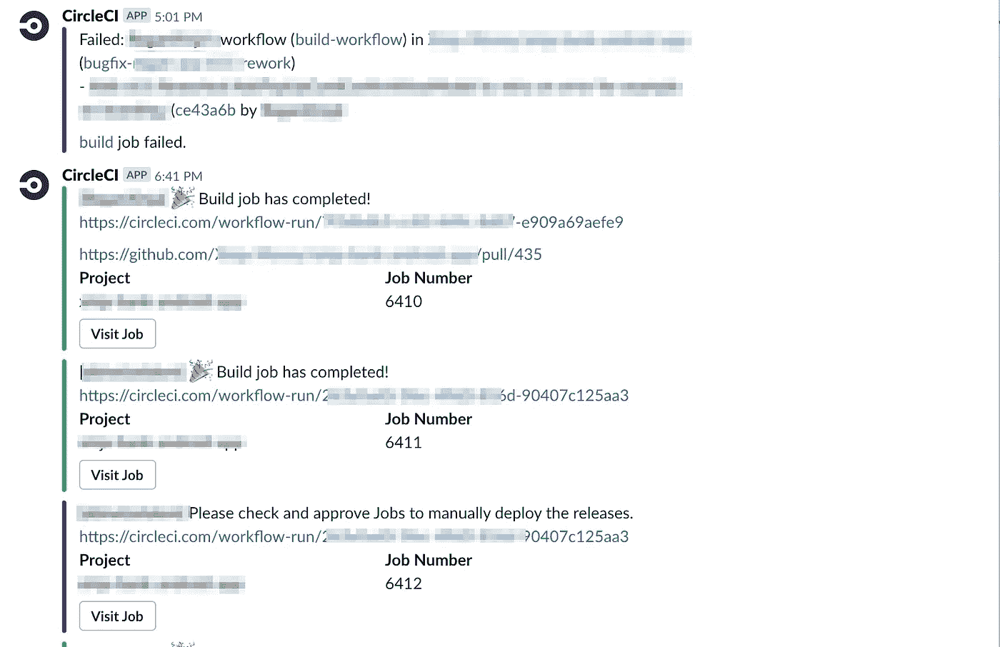

CircleCI 是一个众所周知的 Android 应用程序持续集成和分发平台。这篇文章讨论了您的 Android 项目如何利用 [CircleCI](https://circleci.com/) 和 [Slack](https://slack.com) 集成来为 Android 应用程序创建一个出色的构建通知通道。

我们将探索 CircleCI 为 Slack 通知提供的开箱即用集成，并研究它的不足之处。我们还将了解用于手动触发 Slack 通知的 [CircleCI Slack orb](https://github.com/CircleCI-Public/slack-orb) 。

本文将带您了解将 Slack 逐步集成到您的 Android 项目中的过程。

*   构建项目。
*   集成 Slack Webhook。
*   整合松弛球体。

# 构建项目

我们将逐步开始，编写一个简单的 CI 脚本来组装项目并运行单元测试。

*CircleCI 构建脚本(第一次迭代):*

```
version: 2.1

executors:
  android-executor:
    docker:
      - image: circleci/android:api-29
    environment:
      - JAVA_OPTIONS: "-Xmx3072m -XX:+HeapDumpOnOutOfMemoryError"

aliases:
  - &assemble
    run:
      name: Assemble Project
      command: ./gradlew assembleDebug
  - &unit_tests
    run:
      name: Run Unit Tests
      command: ./gradlew :app:testDebugUnitTest

jobs:

  build:
    executor: android-executor
    steps:
      - checkout
      - *assemble
      - *unit_tests

workflows:
  version: 2.1

  build-workflow:
    jobs:
      - build
```

上述脚本由以下组件组成:

## 安卓执行器

CircleCI 执行器封装了运行作业所需的底层环境。在我们的例子中，我们选择了**circle ci/Android:API-29**。这是一个 Docker 映像，针对构建面向 API 级别 29 的 Android 应用程序进行了优化。你可以在这里找到其他安卓图片[。](https://circleci.com/docs/2.0/circleci-images/#android)

## 别名

YAML [别名](https://medium.com/@kinghuang/docker-compose-anchors-aliases-extensions-a1e4105d70bd)让您在 YAML 文档中用锚点标识一个*项目*，然后在同一文档中用*别名*引用那个*项目*。我们已经定义了两个别名，这两个别名指的是组装项目然后运行单元测试的任务。

`assemble` 别名使用标准的`gradle`命令`./gradlew assembleDebug` 来编译项目。另一个别名，`unit_tests` 使用`gradle`来执行项目的单元测试。

## 乔布斯

现在我们已经定义了脚本的基础，我们将开始定义 CircleCI 作业。现在，我们将宣布一项名为`build`的工作，它( *surprise surprise！*)构建我们的项目。它使用了`assemble`和`unit_tests` 的别名。

## 工作流程

CircleCI 2.0 引入了[工作流](https://circleci.com/docs/2.0/workflows/)——确定其执行顺序的作业和规则的集合。因为我们只定义了一个作业，所以我们的`build-workflow` 很简单。每当有提交，CircleCI 就会运行名为`build`的作业。

在定义了构建作业和构建工作流之后，一旦您在 CircleCI 中跟踪您的 Android 项目并向其提交一个新的 commit，您将会看到以下内容。

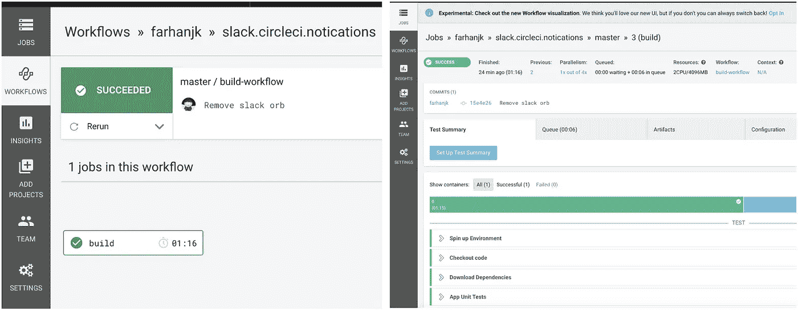

构建作业成功(如绿色所示)，工作流也成功。

# 集成 Slack Webhook

CircleCI 通过为 Slack [Webhooks](https://api.slack.com/messaging/webhooks) 提供开箱即用的集成，方便了发送 Slack 通知。您需要在项目设置中提供一个指向 Slack 通道的 Webhook url。

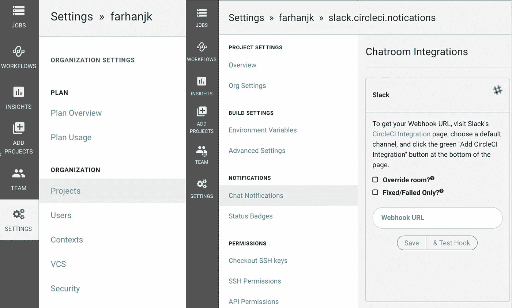

添加 Webhook URL 后，点击**测试挂钩**按钮。如果集成成功，您应该会在您的通道中看到类似下面的消息。

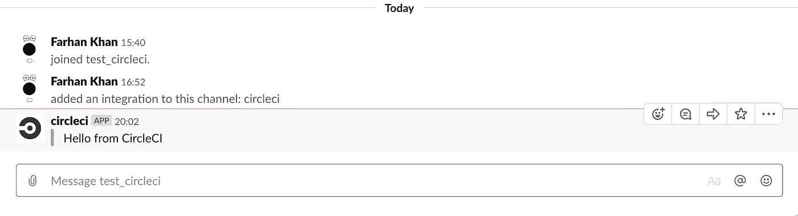

点击**保存**按钮，将 Webhook URL 保存在项目设置中。

当您完成上述操作后，将另一个提交推送到您的存储库。有两种可能性，要么构建成功，要么失败并出现错误。如果构建工作中有错误，CircleCI 会向您的通道推送一条消息。

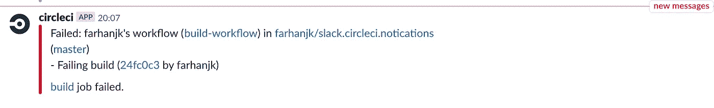

该消息指示失败的提交消息及其哈希、失败的工作流以及启动此工作流的用户。相当酷！

让我们尝试一个成功的构建。

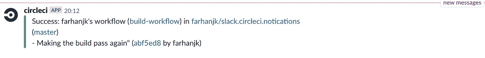

类似的消息将被发送到通道以传递生成。

# 集成松弛球体

在上一节中，我们探讨了开箱即用的 Slack 集成如何与 CircleCI 一起工作。虽然很方便，但它仅限于发布构建状态。有些情况下，我们可能希望对发送到 Slack 通道的消息以及触发这些消息的事件有更多的控制。看哪，圆形球体！

## CircleCI 松弛球

[CircleCI orbs](https://circleci.com/docs/2.0/using-orbs/) 是在 YAML 脚本中可重用的预建命令、作业和执行器的集合。这是一个强大的概念，因为它允许脚本编写者在编写脚本和重用现有脚本时避免重复。

CircleCI Slack orb 是一个元素集合，允许用户通过构建脚本向 Slack 通道发送消息。该脚本可以在被认为是用户感兴趣的任何事件上触发频道的通知。要在您的构建脚本中使用这个 orb，请添加以下几行。

```
orbs:
  slack: circleci/slack@3.4.1
```

## 部署

让我们来看一个实际的、真实的例子，看看如何使用 Slack orb。

我们已经有了一个可以构建项目的脚本。一旦单元测试通过，我们想要部署发布工件，以分发给测试人员和其他合作者。为此，我们修改我们的脚本以包含一个名为`deploy_apk` 的新的*别名*，然后在一个名为`deploy`的作业中使用它。

```
version: 2.1

executors:
  android-executor:
    docker:
      - image: circleci/android:api-29
    environment:
      - JAVA_OPTIONS: "-Xmx3072m -XX:+HeapDumpOnOutOfMemoryError"

aliases:
  - &assemble
    run:
      name: Assemble Project
      command: ./gradlew assembleDebug
  - &unit_tests
    run:
      name: Run Unit Tests
      command: ./gradlew :app:testDebugUnitTest
  #  Placeholder deployment task
  - &deploy_apk
    run:
      name: Deploy Release Artifact
      command: echo "Deploy release for distribution"

jobs:

  build:
    executor: android-executor
    steps:
      - checkout
      - *assemble
      - *unit_tests

  deploy:
    executor: android-executor
    steps:
      - checkout
      - *assemble
      - *deploy_apk

workflows:
  version: 2.1

  build-workflow:
    jobs:
      - build

      - pending-deployment:
          type: approval
          requires:
            - build

      - deploy:
          requires:
            - pending-deployment
```

我们的 YAML 脚本现在能够构建和部署项目了。然而，部署是有条件的。我们不想部署每个版本。因此，该脚本利用了 CircleCI 的另一个特性:[批准作业](https://circleci.com/blog/manual-job-approval-and-scheduled-workflow-runs/)。

在我们的构建工作流中，我们用类型`approval`定义了一个名为`pending-deployment`的作业。该作业在`build`作业成功完成后执行。一旦工作流到达一个`approval`任务，它就会被暂停。

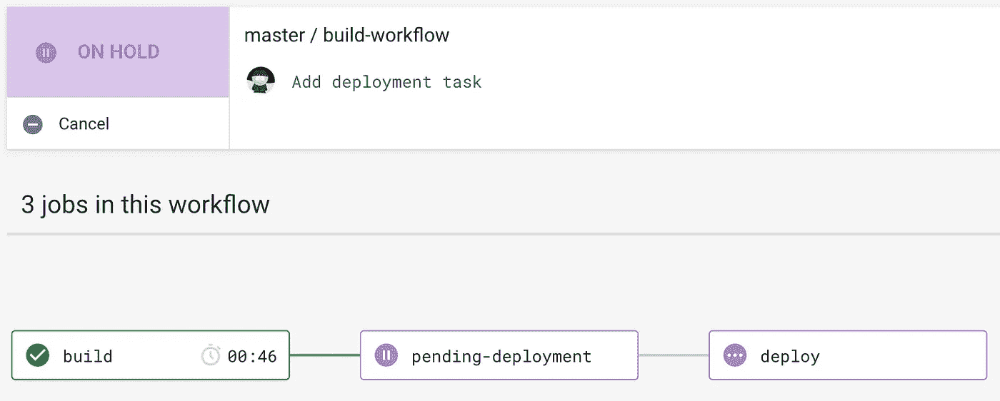

为了进一步执行该工作流，用户需要*批准*该`pending-deployment`作业。

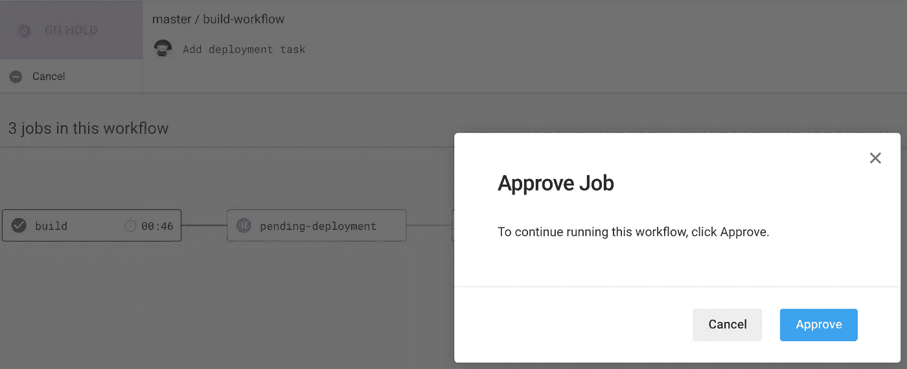

一旦获得批准，工作流将继续，并执行`deploy`作业，部署发布工件。

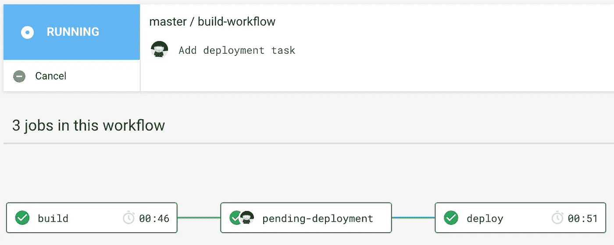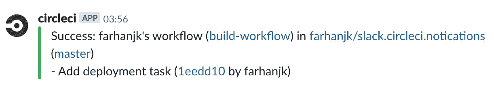

## 延期批准通知

既然我们已经有了一个用于构建和部署的工作条件工作流，那么当工作流等待批准时，在构建通道中获得一个通知将会非常棒。为了实现这一点，我们使用 CircleCI Slack orb 在构建作业完成时在 Slack 通道上发送一条消息。为此，我们在构建脚本中添加了以下别名:

```
slack-aliases:
  - &slack_channel_webhook
      ${CIRCLE_SLACK_WEBHOOK}
  - &notify_slack_for_approval
    slack/notify:
      color: '#400080'
      message: |
        [${CIRCLE_USERNAME}] Please check and approve Jobs to manually deploy the releases.
        https://circleci.com/workflow-run/${CIRCLE_WORKFLOW_ID}
      webhook: *slack_channel_webhook
```

注意我们使用了三个环境变量。

变量`CIRCLE_SLACK_WEBHOOK` 保存 webhook 的值，该值指向将发布消息的 Slack 通道。实际上，这与我们在上一节中使用的方法相同，同时为 CircleCI 启用了现成的 Slack 通知功能。这个变量可以添加到 CircleCI 上的项目设置中。

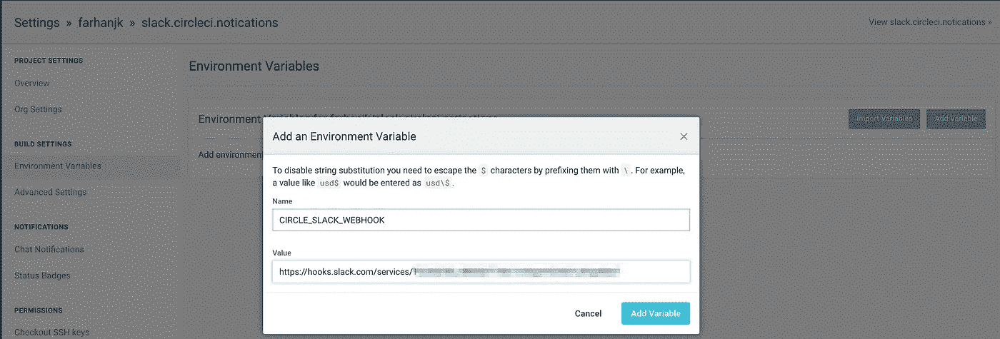

`CIRCLE_USERNAME` 和`CIRCLE_WORKFLOW_ID`是[内置环境变量](https://circleci.com/docs/2.0/env-vars/#built-in-environment-variables)，包含触发构建的用户名和当前工作流的唯一工作流 id。

CircleCI Slack orb 提供了一个名为 **slack/notify** 的任务。它需要两个参数。第一个参数是`message` ，这是我们将发布到频道的自定义消息。第二个参数是`Webhook`，它指向松弛通道的 webhook。

下一步是添加一个作业，该作业将使用上面的设置在部署作业准备好被触发时向我们的构建通道发送通知。

```
slack-approval-link:
    executor: general-executor
    steps:
      - *notify_slack_for_approval
```

请注意，我们已经为此作业指定了一个`general-executor`，而不是使用`android-executor`。

```
general-executor:
    docker:
      - environment:
          TERM: dumb
        image: 'cibuilds/base:latest'
    resource_class: small
```

这样做的原因是我们不希望 CircleCI 为 Slack orb 旋转整个 Android 构建环境。这个 orb 需要一个相当基本的 bash shell 来操作，而[基础执行器](https://github.com/cibuilds/base)对于我们的需求来说已经足够了。

将延迟批准通知作业添加到我们的工作流后，CI 脚本如下所示:

```
version: 2.1

executors:
  android-executor:
    docker:
      - image: circleci/android:api-29
    environment:
      - JAVA_OPTIONS: "-Xmx3072m -XX:+HeapDumpOnOutOfMemoryError"

  general-executor:
    docker:
      - environment:
          TERM: dumb
        image: 'cibuilds/base:latest'
    resource_class: small

aliases:
  - &assemble
    run:
      name: Assemble Project
      command: ./gradlew assembleDebug
  - &unit_tests
    run:
      name: Run Unit Tests
      command: ./gradlew :app:testDebugUnitTest
  #  Placeholder deployment task
  - &deploy_apk
    run:
      name: Deploy Release Artifact
      command: echo "Deploy release for distribution"

slack-aliases:
  - &slack_channel_webhook
      ${CIRCLE_SLACK_WEBHOOK}
  - &notify_slack_for_approval
    slack/notify:
      color: '#400080'
      message: |
        [${CIRCLE_USERNAME}] Please check and approve Jobs to manually deploy the releases.
        https://circleci.com/workflow-run/${CIRCLE_WORKFLOW_ID}
      webhook: *slack_channel_webhook

jobs:

  build:
    executor: android-executor
    steps:
      - checkout
      - *assemble
      - *unit_tests

  slack-approval-link:
    executor: general-executor
    steps:
      - *notify_slack_for_approval

  deploy:
    executor: android-executor
    steps:
      - checkout
      - *assemble
      - *deploy_apk

orbs:
  slack: circleci/slack@3.4.1

workflows:
  version: 2.1

  build-workflow:
    jobs:
      - build

      - slack-approval-link:
          requires:
            - build

      - pending-deployment:
          type: approval
          requires:
            - build

      - deploy:
          requires:
            - pending-deployment
```

将提交推送到存储库，以查看工作流的运行情况。


看，在构建通道中有一个 slack 消息，通知我们我们的部署工作正在等待批准！

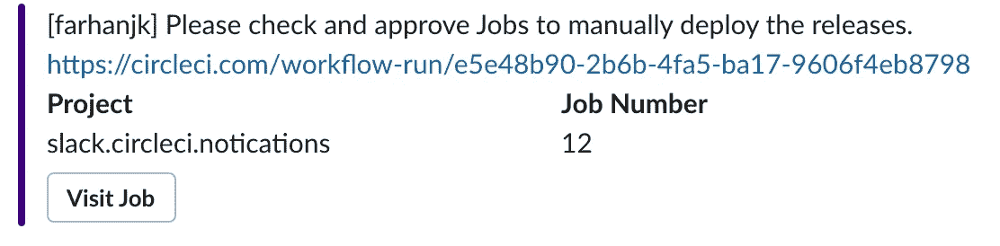

请注意用户名和工作流 URL 是如何成为此消息的一部分的。单击工作流 URL 会将用户带到您的工作流。

在这篇文章中，我们探讨了 CircleCI 和 Slack 之间的集成。我们已经介绍了 CircleCI 通过 Slack 集成提供的现成功能。我们还讨论了 CircleCI orbs，特别是 CircleCI Slack orb，它允许脚本基于手动识别的触发器发送定制的 Slack 通知。

如需完整参考，代码可从[这里](https://github.com/farhanjk/slack.circleci.notications)获得。

感谢您花时间阅读这篇文章！