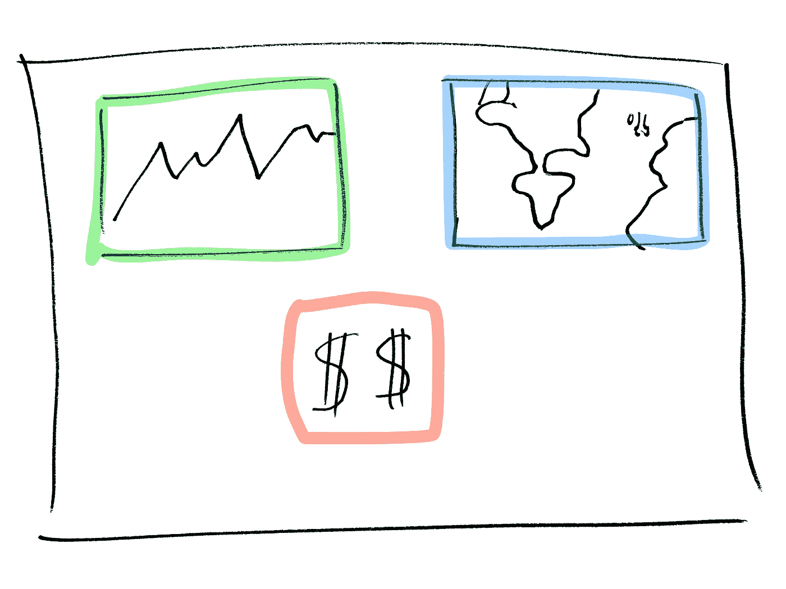
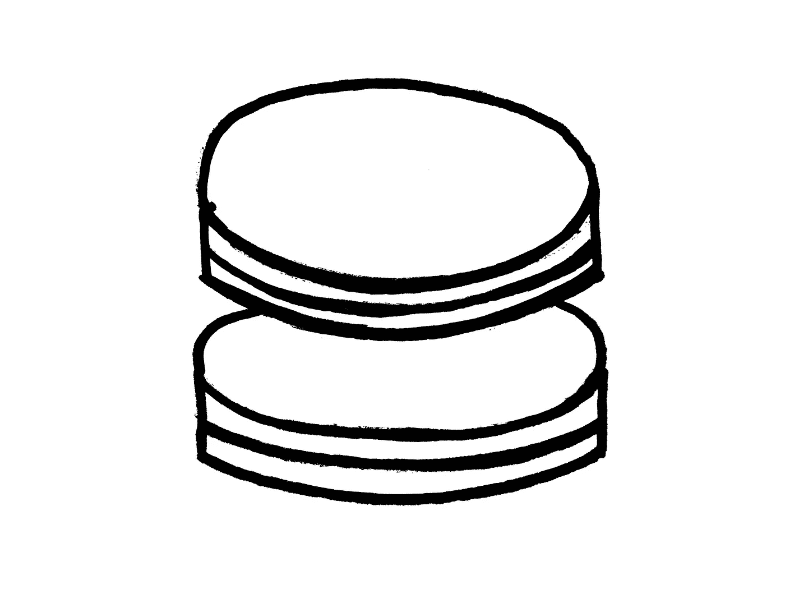

# 切片派:聪明的开发人员如何收紧敏捷反馈循环

> 原文：<https://betterprogramming.pub/slicing-pie-how-smart-developers-can-tighten-the-agile-feedback-loop-ed2e5abb3ba7>

## 满足用户的需求和管理者的期望将会非常容易

蒂莫西·穆扎的照片

在敏捷开发中，我们从一开始就不知道最终产品会是什么样子。

因此，我们依赖于一致的反馈回路的存在。这种反馈可能来自利益相关者(最重要的是用户)、遥测(自动收集的关于人们如何使用产品的数据，如点击或页面访问)或产品所有者。

我们越早了解对新开发的反应，我们就越能避免在那些最终会被丢弃的特性上浪费资源，因为它们被证明是不重要的，甚至是有害的。

我们经常将敏捷管理与产品人员联系在一起，但是*开发人员*实现新功能的方式对这个反馈循环的速度有直接影响。

如果他们做对了，循环就很快；如果他们做错了，那就慢了。让我们通过案例研究来探讨这两种方法。

# 案例研究:博客分析仪表板

假设您正在构建一个博客平台，并希望为您的用户实现一个分析仪表板。你计划好了一切:

您认为您的用户会发现三个主要的仪表板功能很有用。

1.  一段时间内的页面浏览量(绿色)。
2.  地理游客位置(蓝色)。
3.  从附属链接赚的钱(红色)。

大多数应用程序都是分层的。您可能有一个后端、一个前端和一个分层的架构。我认为这种建筑就像分层的糕点或馅饼。

你如何切饼(为这个故事安排你的开发工作)加速或减慢反馈循环。

# ***缓*** :迷你瀑布

您对仪表板应该是什么样子有很好的理解，所以您着手构建它:

1.  后端—从后端开始，构建为所有三个功能提供仪表板数据所需的所有服务和端点。唷，工作量真大！
2.  前端——您构建了您需要的所有前端通信(获取、模型、业务逻辑)。
3.  用户界面—最后，您构建仪表板 UI。

你像这样切馅饼

你可能会认为这是一个有效的方法！毕竟，你做了一些很棒的架构规划，而且执行得很漂亮。你肯定考虑到了用户的需求…或者… *你*有吗？

没有你想象的那么好！

你一直等到最后才向用户甚至你的产品所有者公开你的工作。没有考虑到这一点，您已经滑回了瀑布式开发，只是规模较小。

这样做，您扼杀了反馈循环，并且可能在引入需要修改甚至丢弃的功能时浪费了精力。

# 快速:真正的敏捷

所以，给你第二次机会。这次，像这样切馅饼:

将 UI 包含在每个切片中！

您一直在仪表板*中实现每个子功能。*

1.  一段时间内的页面访问量。
2.  地理游客位置。
3.  从附属链接赚的钱。

因为您已经在每个切片中包含了 UI 层，所以如果您进行部署，您可以从产品所有者和您的用户那里获得快速的反馈。

这种反馈是敏捷开发的精髓。它将指导您的工作，即使是在一个中型到大型开发任务的范围内。通过合并它，你可以省去构建错误的东西的痛苦。

使用正确的开发方法，您会发现满足用户的需求和项目经理的期望会变得更加容易——我敢说，非常容易。