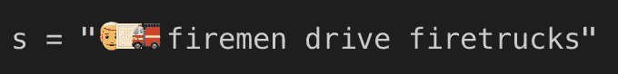

# 分割包含表情符号的字符串 Python 和 JavaScript 的区别

> 原文：<https://betterprogramming.pub/slicing-strings-containing-emoji-differences-between-python-and-javascript-4716c419718f>

## 或者“我如何学习了足够的 Unicode 实现来解决一个 Bug”


[福斯托·加西亚](https://unsplash.com/@faustogarmen?utm_source=unsplash&utm_medium=referral&utm_content=creditCopyText)在 [Unsplash](https://unsplash.com/search/photos/emoji?utm_source=unsplash&utm_medium=referral&utm_content=creditCopyText) 上拍摄的照片

上周，我在调查一个 bug，在这个过程中，我学到了很多关于 Unicode 的知识。在确定了错误的来源后，我在野外发现了更多的例子。我写这篇文章是为了传递我所学到的东西。当您执行以下操作时，该错误就会出现:

*   拥有一个 Python 3 后端…
*   正在处理混合了普通文本和表情符号的字符串…
*   基于字符串索引识别文本的跨度(例如，使用[空间](https://spacy.io/) )…
*   并将这些索引传递给 JavaScript 前端

为了让这一点变得切实可行，这里有一个我在野外发现的这个 bug 的例子，在 [spaCy 基于规则的匹配器演示](https://explosion.ai/demos/matcher?text=%F0%9F%91%A8%F0%9F%8F%BB%E2%80%8D%F0%9F%9A%92%20firemen%20drive%20firetrucks%0A&model=en_core_web_sm&pattern=%5B%7B%22id%22%3A0%2C%22attrs%22%3A%5B%7B%22name%22%3A%22LOWER%22%2C%22value%22%3A%22firemen%22%7D%5D%7D%5D)上。如果您试图在较大的字符串中查找子字符串“fireworks”👨🏻‍🚒消防员开消防车”，你看:


嗯……🤔

# 什么是 Unicode？

> Unicode 是一种通用字符集，它定义了来自大多数书写系统的字符列表，并为每个字符关联一个唯一的数字(代码点)。
> 
> Unicode 将字符作为抽象术语来处理。每个抽象字符都有一个关联的名称，例如拉丁文小写字母 a。该字符的渲染形式(字形)为`**a**`。
> 
> **代码点**是分配给单个字符的数字。
> 
> 代码点以格式`**U+<hex>**`表示，其中`**U+**`是表示 Unicode 的前缀，`**<hex>**`是十六进制的数字。例如`**U+0041**`和`**U+2603**`是代码点。
> 
> 代码点是从`**U+0000**`到`**U+10FFFF**`范围内的数字。
> 
> - Dmitri Pavlutin，“[关于 Unicode](https://dmitripavlutin.com/what-every-javascript-developer-should-know-about-unicode/) ，每个 JavaScript 开发人员都应该知道些什么。”

为了让这一点变得切实可行:“👨🏻‍🚒“被称为“[男消防员:浅肤色](https://www.iemoji.com/view/emoji/2017/skin-tones/man-firefighter-light-skin-tone)”，由代码点“U+1F468，U+1F3FB，U+200D，U+1F692”组成，依次为:

*   U+1F468 —👨[男人](https://codepoints.net/U+1F468?lang=en)
*   U+1F3FB —🏻[表情符号修改器 FITZPATRICK TYPE-1–2](https://codepoints.net/U+1F3FB)
*   u+200d—[零宽度连接器](https://codepoints.net/U+200D)
*   U+1F692 —🚒[消防车](https://codepoints.net/U+1F692)

一旦你知道了

> ***菲茨帕特里克皮肤分型测验*** *是一种针对人类肤色的数值分类图式。—* [ [维基百科](https://en.wikipedia.org/wiki/%F0%9F%8F%BB)

然后这开始变得有意义了。事实上，至少在 iTerm2 中，如果您尝试键入:

```
s = “👨🏻‍🚒 firemen drive firetrucks”
```

你看不到“男消防员:浅肤色”，而是:



接近？

## Python 中的 Unicode

不管您的终端显示什么，如果我们用 spaCy 处理这个字符串，我们会看到:

```
>>> doc = nlp(s)
>>> for token in doc:
...     print(token.text, token.idx)
... 
👨 0
🏻‍ 1
🚒 3
firemen 5
drive 13
firetrucks 19
```

我们可以用字符串切片来验证这一点:

```
>>> s[0]
'👨'
>>> s[1]
'🏻'
>>> s[2]
'\u200d'
>>> s[3]
'🚒'
>>> s[5:12]
'firemen'
```

## JavaScript 中的 Unicode

此时，我打开了 [Chrome 开发者控制台](https://developers.google.com/web/tools/chrome-devtools/console/)进行比较:

```
s = "👨🏻‍🚒 firemen drive firetrucks"
"👨🏻‍🚒 firemen drive firetrucks"
s[0]
"�"
s[1]
"�"
s[2]
"�"
s[3]
"�"
```

🤔—那就是……不一样。让我们检查一下 Python 中的一些内容:

```
>>> s
'👨🏻\u200d🚒 firemen drive firetrucks'
>>> len(s)
29
```

让我们看看 JavaScript 是否同意这一点:

```
s
"👨🏻‍🚒 firemen drive firetrucks"
s.length
32
```

哦不，JavaScript 字符串长了 3…

# 更多 Unicode:编码

所以，要么 Python 或者 JavaScript 是完全错误的，要么`len(s)`和`s.length` *意味着*不同的东西。

## Python 字符串 len(s)的含义

我不确定这一点，所以也许有人会在评论或 Twitter 上纠正我，但是 AFAICT，Python 索引指的是抽象的 Unicode 代码点。所以，由于大多数字符都是由一个码位组成的，所以大多数时候`s[i]`会在字符串 s 的第 I 个位置给出字母，但是，Unicode 允许修改其他码位的码位。我们已经看到了两个例子:`U+1F468`“人”可以被`U+1F3FB`“表情符号修饰符 FITZPATRICK TYPE-1–2”(或者任何肤色码点)修改，产生“浅肤色人”；一个男人或女人表情符号(带有可选的肤色修改器)可以添加到`U+200D U+1F692`“零宽度木工消防车”的前面🚒)去做消防员。

*我认为最准确的说法是“字素”。阅读我在本文末尾链接的博客文章，了解更多细节。*

修饰字符的一个非表情符号的例子是`U+0301`“组合锐音”:

```
>>> s = "cafe" + "\u0301"
>>> s
'café'
>>> len(s)
5
```

一个有趣的 Python 技巧是，您还可以通过名称引用 Unicode 字符，因此这也是有效的 Python 3:

```
>>> s = "cafe" + "\N{COMBINING ACUTE ACCENT}"
>>> s
'café'
>>> len(s)
5
```

## JavaScript String.length 的含义

JavaScript 字符串存在于较低的抽象层次。JavaScript 中字符串的索引不是引用一个抽象的代码点，而是引用一个由字符串的“编码”决定的数字。

依我看，这是语言的失败。Unicode 是 JS 中一个有漏洞的抽象，也就是说，为了正确使用它，你必须理解这个抽象是如何实现的。在 JavaScript 中，字符串是使用 UTF-16 实现的——一种将抽象的 Unicode 码位映射到一个或两个十六进制数的编码。

这里有一些 JavaScript 字符，用一个十六进制字符表示

```
'\u0041\u0042\u0043'
'ABC'

'I \u2661 JavaScript!'
'I ♡ JavaScript!'
```

然而，“一二”是我们问题的来源:

```
'\uD83D\uDCA9'
'💩' *// U+1F4A9 PILE OF POO*
```

回到我们的[浅色皮肤的消防员](https://www.iemoji.com/view/emoji/2017/skin-tones/man-firefighter-light-skin-tone):抽象的 Unicode 序列表示是四个 Unicode 码位:

```
U+1F468, U+1F3FB, U+200D, U+1F692
```

但是，当编码为 UTF-16 时，这四个字符表示为七个十六进制数字:

```
0xD83D 0xDC68 0xD83C 0xDFFB 0x200D 0xD83D 0xDE92
```

嗯…所以用 JavaScript 表示这个符号比用 Python 多花了 3 个槽…

# 解决

现在我们知道问题出在哪里了。Python 中的具体例子:

```
>>> s
'👨🏻\u200d🚒 firemen drive firetrucks'
>>> len(s)
29
```

相对于 JavaScript:

```
s
"👨🏻‍🚒 firemen drive firetrucks"
s.length
32
```

我们有两个选择来解决这个问题:

1.  我们可以强制 Python 在引用字符串索引之前用 UTF-16 编码字符串
2.  迫使 JavaScript 在更高的抽象层次上工作

我的某些审美意识强烈倾向于后者，ECMAScript 的设计者似乎也同意这一点。在较新版本的 JavaScript 中，您可以使用以下技巧让它像 Python 一样处理 Unicode:

```
s = "👨🏻‍🚒 firemen drive firetrucks"
"👨🏻‍🚒 firemen drive firetrucks"
s.length
32[...s].length
29
```

也就是说，将字符串析构为数组是以独立于编码的方式进行的。

```
[...s]
(29) ["👨", "🏻", "‍", "🚒", " ", "f", "i", "r", "e", "m", "e", "n", " ", "d", "r", "i", "v", "e", " ", "f", "i", "r", "e", "t", "r", "u", "c", "k", "s"]
```

提醒一下，我们正在尝试识别子字符串“fireworks”的索引 Python 说:

```
>>> s[0]
'👨'
>>> s[1]
'🏻'
>>> s[2]
'\u200d'
>>> s[3]
'🚒'
>>> s[5:12]
'firemen'
```

但是天真的 JavaScript 不起作用:

```
s.slice(5,12)
"🚒 fire"
```

但是，我们可以使用析构来清理这个问题:

```
[...s].slice(5,12).join('')
"firemen"
```

我们甚至可以将其封装在一个函数中:

```
const unicodeSlice = (s, start, end) => [...s].slice(start, end).join('')

unicodeSlice("👨🏻‍🚒 firemen drive firetrucks", 5, 12)
"firemen"
```

现在我们的问题解决了！作为一个额外的奖励，我们堵住了 JavaScript 处理 Unicode 的抽象漏洞。

## 附言

上面的函数不适合 TS 和 Babel 这样的 transpilers。一位[同事](https://github.com/kirillbuga)告诉我，如上定义的`unicodeSlice`:

> 在某些情况下，使用 Babel 或 TypeScript 传输文件后，它将被转换为:

```
U = (u = v.from,
        d = v.until,
        (c = v.segment) ? [].concat(c).slice(u, d).join("") : "")
```

> 因此，扩展操作符`…`将被转换为`[].concat(c)`，它不会将字符串分解为数组或符号，而是在数组中返回一个字符串，所以在转换后的代码中，您将得到`unicodeSplice('hello') --> ['hello']`

他建议使用`Array.from`，因为“它不会被编译，因为它在所有浏览器中都受支持，并且它接受任何可迭代的参数(字符串、数组类对象、对象等)。”所以看起来像(TS):

```
const unicodeSplice = (text: string | undefined, start: number, end: number) => (text ? Array.from(text).slice(start, end).join('') : '');
```

## Post Post 脚本

如果在 Python 中必须在这两种格式之间转换呢？上面我们讨论了如何强制 JS 以正确的方式处理 Unicode(没错，我说了，Python 处理得对，而 JS、JVM 等处理得不对)，但是假设这不是一个选项，你需要将 UTF-16 字符跨度从 Python 发送到 JS。我是这样做的: