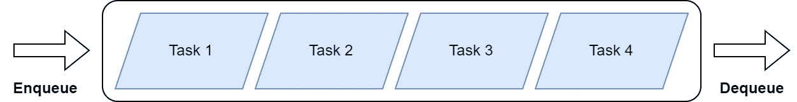
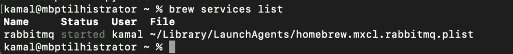
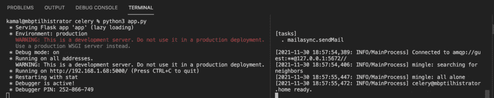
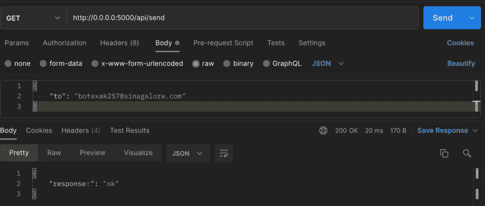

# HTTP 响应时间慢？芹菜来救场了！

> 原文：<https://betterprogramming.pub/slow-http-response-times-celery-to-the-rescue-76346eb4212c>

## 了解如何在 Python 中卸载计算密集型任务


照片由[格兰特·杜尔](https://unsplash.com/@grant_durr?utm_source=unsplash&utm_medium=referral&utm_content=creditCopyText)在 [Unsplash](https://unsplash.com/s/photos/rabbits?utm_source=unsplash&utm_medium=referral&utm_content=creditCopyText) 拍摄

在一个日益数据驱动的世界中，软件工程师构建响应迅速的应用程序是非常重要的。随着我们的软件需求变得越来越复杂，我们的计算需求也在不断升级。与此同时，用户希望他们日常使用的应用程序能够提供快速响应的性能。

长期运行的后台任务是当今大多数软件应用程序的必要组成部分。我们如何设计软件来优雅地处理这样的任务而不影响用户体验？
想象一下，如果用户不得不打开一个标签来完成上传或发送电子邮件。从用户体验的角度来看，这有多可怕？我们需要的是一种在后台以异步方式处理任务的方法。

# 芹菜和兔子

我们可以使用 Python 的 *Celery* 框架来处理后台任务。

> Celery 是一个用 Python 编写的异步任务队列框架。本质上，你可以把它想象成一个具有 FIFO(先进先出)原则的队列数据结构。

因此，放入队列的第一个任务首先获得进程。这使得计划任务成为可能。它还确保任务按照应用程序接收的顺序进行处理。



显示先进先出原则的队列

Celery 使用分布式消息传递的范例，这意味着它还包括一个消息队列。在本文中，我们将使用 RabbitMQ 作为消息队列。

现在您可能想知道，任务队列和消息队列之间有什么区别。

您可以将任务队列视为在机器或进程之间分配计算的一种方式。一个*工人*是由 Celery 提供的一个抽象，代表一个父进程。当客户端使用我们的应用程序时，一个 worker 产生一些子进程来处理单个任务。产生的进程将扫描任务队列，寻找要执行的任务。

然而，为了发送和接收这些任务，我们需要类似消息队列的东西，也称为消息代理。这就是 RabbitMQ 的用武之地。RabbitMQ 将负责将任务从任务队列发送到需要它们的工作者。注意，有可能使用一个叫做 Redis 的解决方案，但是在这篇文章中我们将坚持使用 RabbitMQ。

现在让我们继续编码吧！

# 设置

*注意:我无法让我的 Windows 电脑运行起来。*
*本文假设 Linux 或 macOS 环境。*

我们将构建一个简单的 Flask 应用程序，发送电子邮件来鼓励芹菜的使用。

首先安装以下 Python 包:

```
pip3 install yagmail
```

接下来，安装芹菜包:

```
pip3 install celery
```

不幸的是，由于安全原因，不可能简单地以编程方式发送电子邮件。
如果您使用 Gmail，您可以遵循“创建&使用应用程序密码”下的指南[在此](https://support.google.com/accounts/answer/185833?hl=en)为您的 Gmail 帐户设置一次性密码。记得记下密码。

接下来，创建一个名为 *default_settings.py* 的文件，并输入以下常量，用您的电子邮件和密码替换:

```
MAIL_USERNAME = <Username> 
MAIL_PASSWORD = <One-time password>
```

接下来，从[这里](https://docs.celeryproject.org/en/stable/getting-started/first-steps-with-celery.html#rabbitmq) (Linux)和[这里](https://docs.celeryproject.org/en/stable/getting-started/backends-and-brokers/rabbitmq.html#installing-rabbitmq-on-macos) (macOS)安装 RabbitMQ。

您可以使用以下命令确保 RabbitMQ 正在运行:

```
brew services list
```

终端应该如下所示:



RabbitMQ 服务正在运行。耶！

太好了！我们来编码吧！

# 用 RabbitMQ 初始化芹菜

我们首先初始化一个芹菜应用程序:

我们通过给出芹菜所在模块的名称来初始化芹菜，这是 python 文件的名称。第二个参数指定了我们希望使用的消息代理的 URL。

URL: `broker=’pyamqp://guest@localhost//’`，是 RabbitMQ 的默认 URL。

我们还初始化了一个非常简单的`yagmail`实例。

另外，您会注意到我们设置了一个 5 秒钟的计时器来模拟一个长时间运行的任务。

然后，我们定义一个常规的 Python 函数，负责执行一些长时间运行的计算，然后发送电子邮件通知用户处理完成。这可能是像图像处理，视频编码，或语音转录。

最后，该函数用符号 ***@*** 进行了注释，这表明我们正在用芹菜包提供的装饰函数进行包装。查看我的帖子[这里](https://haseebkamal.com/2021/11/24/how-to-write-dry-code-in-python-using-decorator-functions/)我用例子解释了装饰者，这样你就可以跟上了。

简而言之，注释表明这是一个芹菜任务。这意味着该功能将被委托给工作进程，并由 Celery 框架处理。

到目前为止一切顺利！

接下来，我们构建一个简单的 Flask 应用程序:

我们记得从芹菜 py 文件中导入`sendMail`函数。
在第 9 行中，我们简单地调用:

```
sendMail.delay(data)
```

这就是芹菜的功能。函数调用被添加到 Celery 任务队列中，并由 RabbitMQ 发送到一个可用的工作进程。

这里关键的一点是函数会立即返回—
调用是`asynchronous`。

这意味着下一行的返回调用会被毫不延迟地执行。这进一步意味着用户在得到 HTTP 响应之前不需要等待处理的发生。

# 运行芹菜和烧瓶

由于 Celery 作为一个独立的服务，我们需要在一个单独的终端实例中运行它。

首先从终端执行 Flask 应用程序，如下所示:

```
python3 app.py
```

接下来，打开一个单独的终端实例并执行以下命令:这将启动 Celery 服务。

```
celery -A mailasync worker --loglevel=INFO
```

希望您能看到如下内容。(右边烧瓶，左边芹菜。)



烧瓶在左边运行。芹菜在右边跑。

# 使用邮递员和临时邮件进行测试

精彩！

接下来，我们使用 Postman 进行测试。首先，进入[https://temp-mail.org/](https://temp-mail.org/)，复制显示的电子邮件地址，同时保持浏览器标签打开。这封电子邮件是可丢弃的和临时的，这意味着它是完美的测试。



使用邮递员测试

在 Postman 的正文中，记得用 temp-mail 中显示的电子邮件替换“to”下面的电子邮件。


收到来自工人的电子邮件！

一旦您点击 send，您应该立即得到一个 HTTP 200 响应，尽管在实际代码中有一个 5 秒的计时器。因此，您可以看到运行中的异步 Celery 代码。

正如所料，您可以检查临时邮箱，并确认芹菜工人在 5 秒钟后发送了电子邮件:

# 概述

厉害！这就是这篇文章的内容。

我们将芹菜用于需要时间处理的长期运行的后台任务。Celery 负责将这些任务委派给应用程序中的进程。确保它们按照发送的顺序进行处理。我们使用 RabbitMQ 作为消息代理来处理 Celery 中任务的发送和接收。

简而言之，使用 Celery 意味着用户不必在服务器处理他们的请求时保持标签页打开。也就是说，他们将立即收到 HTTP 响应。

在芹菜中也可以跟踪任务。您还会注意到，我们不需要使用芹菜工人函数的返回值。可能存在需要在应用程序中使用返回值的情况。这需要额外的配置，将是另一篇文章的主题。

希望你喜欢这篇文章。

*原载于*[](https://haseebkamal.com/2021/12/02/slow-http-response-times-celery-to-the-rescue/)**。**