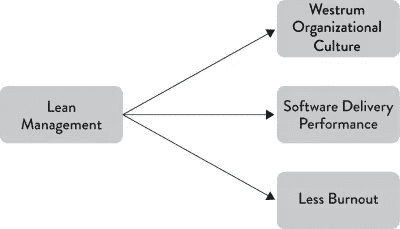

# 软件业生产率低下

> 原文：<https://betterprogramming.pub/slow-productivity-for-the-software-industry-3c363be9361f>

## 减少工作量能提高软件工程师的生产力吗？

罗德岛新港

上周，我读了《纽约客》的一篇非常有趣的文章:

我建议你通读整本书，但它的主旨是:当然，我们工作太多了，快累垮了。然而，知识工作者不仅仅是工作时间太长，我们还在做太多的事情。这是关键的一段:

> …自主性使得现代知识工作朝着一种越来越不可持续的结构随意发展。这种演变的问题不是你现在被要求工作多少小时，而是你在任何时候被分配的工作的 ***量*** 。
> 
> 就数量而言，我指的是你承诺要完成的义务总数——从回答一个小问题到完成一个大项目。当这个量增加超过某个阈值时，这些努力的重量会变得难以忍受。人类独一无二地擅长制定实现目标的长期战略计划。然而，当我们面对塞满了数百条信息的收件箱和填满多页的任务列表时，我们的计划能力就会动摇。当有太多的事情需要我们去想象去完成时，我们会让我们的执行功能机制短路，导致一种焦虑不安的感觉。
> 
> 这些心理斗争并不是有太多工作要做的唯一代价。大多数职业承诺带来了与其他人合作的需要。如果你同意为一个新产品制定一个营销计划，除了实际写计划之外，你可能需要几次会议和大量的电子邮件来收集必要的信息并使项目保持正轨。孤立来看，这个开销是合理的。然而，当你同时处理太多这样的项目时，所有相应的会议和信息的综合影响会占据你大部分的时间表，造成一种开销螺旋，你花在谈论工作上的时间比实际完成工作的时间多得多——这是一种车轮旋转的狂热主义，放大了挫折感，最终导致倦怠。

听起来熟悉吗？如果工作少被称为慢工作(呼应其他“慢”运动，如[慢餐](https://en.wikipedia.org/wiki/Slow_Food)，纽波特建议同时做更少的事情被称为**慢生产率**:

> 慢生产率的核心目标是将单个工人的产量保持在一个可持续的水平。

纽波特认为，在足够长的时间跨度内，员工会完成更多的工作，因为他们可以同时专注于更少的事情。此外，减少员工的“工作量”会让他们更快乐，更不容易筋疲力尽。

这篇文章是关于知识工作者的，但是我认为我们的行业——软件工程，在这个主题上有很多可以提供的。例如，我认为我们已经学到了很多通过限制在制品(WIP)来减少“量”的好处，在制品是一个团队一次工作的任务总数。

在优秀的书籍 [Accelerate](https://itrevolution.com/accelerate-book/) 中，研究人员发现减少 WIP 和使用其他[精益管理实践](https://kevinvecmanis.io/books/management/2020/11/20/Accelerate-Book-Review.html#management)是精英软件团队的核心能力。降低 WIP 已经被证实可以*加速*团队的工作，降低倦怠。

图 7.2 来自加速

除了限制 WIP 之外，这通常是 sprint 内部的规程，我认为我们需要通过限制在建项目(PIP)来连续关注季度。我最近承担了我的一个团队的临时工程经理的职责。

当我到达时，7 名软件工程师的团队正在进行 5 个独立的项目。每个项目都有一个领导在推动，也许还有另一个工程师的帮助。不出所料，在 sprint retros 和 1 对 1 的谈话中，这些工程师描述了独自承担一个项目的压力。他们也不知道其他团队成员在做什么。在团队的认可下，我们做了一些简单的改变:

*   我们将进行中的项目限制在 3 个。我们不会开始一个新的项目，除非我们只做 1 或 2 个项目。
*   在 sprint 开始时，没有人被分配具体的工作。工程师只有在没有他们可以通过配对、审查、测试或部署来帮助完成的开放任务时，才能开始新的工作。

由于我们降低了 WIP 和 PIP，工程师们一致喜欢这些变化。我们已经达到了我们的冲刺目标，我希望我们能达到我们的季度项目目标。

这并不总是容易的事情。限制 WIP，尤其是限制 PIP 需要工程和产品领导的同意和纪律。我们都感受到了将工程师的时间分配给两个项目以展示初步进展的压力。

但最终，这不会为你赢得任何分数，因为两个项目都在下滑。最终，做好这一点需要整个组织的认同。尝试在尽可能多的地方降低 PIP，然后展示一个季度接一个季度，交付了更多。

俄勒冈 Ecola 州立公园

希望你能训练利益相关者停止问类似“我们什么时候能完成这 5 个项目？”而是问:

*   “我们是在做 1-2 件最好的事情吗？”
*   “如果这个项目多花 50%的时间，我们还会做吗？”
*   “我们如何能更快地交付更小的产品？

同样值得注意的是，正如纽波特所做的那样，许多其他来源的“量”。对于我们的软件工程师来说，可能是随叫随到，生产监控，支持请求，基本上，每个人都必须使用 Slack。

作为一名经理和领导者，你应该了解所有这些来源，尽可能地限制或解释它们。例如，一个简单的解决办法是有一个支持队长。

这是一个简单的团队成员轮换，当前的支持队长实质上是从 sprint 中抽出来处理所有的工作时间支持、问题和生产监控，让其他人专注于 sprint 的工作。

此外，如果你必须安装 Slack，至少帮自己一个忙，关闭所有警报。

如果作为领导者，我们能在这方面做得很好，不仅我们团队的速度会提高，我们的工程师和经理的快乐也会提高。我很想听听大家对生产力低下的看法。什么对你有效？

# 笔记

举个例子，纽波特认为这是生产率低下的一大障碍:

> 低生产率的更大挑战是，它需要系统来管理尚未分配的工作…缓慢的生产效率要求您将该项目记录到一个系统中，在该系统中，当合适的人有所需的可用时间时，可以对其进行适当的优先级排序并最终进行分配。

吉拉，他在描述吉拉。