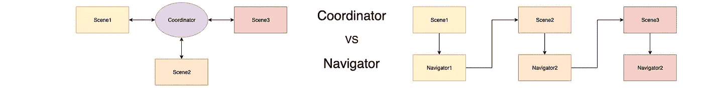

# iOS 中用于场景过渡的小导航器

> 原文：<https://betterprogramming.pub/small-navigators-for-scene-transitions-in-ios-9645392e800a>

## 可扩展 iOS 应用架构的组成部分

## 没有序列，没有协调器，只有简单的导航

您是否顺应潮流，使用新的协调员模式进行过渡？或者你的心还在为情节和故事板而跳动？那就让我摧毁你的幻想吧！😈

顺便说一下，这是一篇来自“可扩展的 iOS 应用架构”系列的文章。

# 塞格斯

谁还记得 2012 年 WWDC 奥运会？在那个时候，故事板和续集是一个热门话题。最后，你可以在 *InterfaceBuilder、*中看到整个应用程序流程，哪个屏幕通向哪里，屏幕看起来如何，如果你用一个按钮直接在故事板中连接一个连续过渡，就不再需要编码了。卓越的视觉编码！🤩

> 那些七年后仍在使用 segues 和故事板的人正在做一些错误的事情。

片段和故事板包含一些与可扩展架构相矛盾的问题:

1.  如果所有的屏幕都在一个故事板中，并行处理会导致很难解决**合并冲突**。
2.  即使你为每个屏幕使用一个单独的故事板，对这些故事板视图执行有意义的**代码审查**仍然是非常困难的。
3.  如果你在故事板中分配颜色或其他常量值，当一个值需要改变时，你需要找到所有的**硬编码值**。
4.  然后，如果代码中的值被覆盖，由于**碎片**的原因，找出故事板中的变化不起作用的原因可能会非常耗时。
5.  故事板定义了一个带有 segues 的**硬编码导航**，这使得导航不灵活。
6.  Segues 通常需要标识符，这些标识符在故事板中被冗余地定义一次，然后作为代码常量再次定义，这很容易出错。
7.  依赖注入和 segues 不能很好地协同工作。
8.  另外，**界面也不是很干净**。

你当然可以在这里列出更多的缺点，但是我只想快速地看一下代码，特别是进一步阐明最后一点。

例如，从第 3 行开始，这里定义了一个典型的 *ViewController1* 。

通常，segue 是通过`performSegue`启动的，如第 12 行所示。作为一个标识符，你必须传递一个字符串，希望这个字符串在某个地方被定义为常量。

这里以第 4 行为例。作为第二个参数，然后传递一个类型为`Any`的`sender`——两个参数和两个缺陷。

首先，使用字符串作为导航的常量不是类型安全的。没有什么能阻止我传递字符串“Foobar”并得到一个运行时异常。由于您必须在故事板中再次定义相同的字符串，这种情况比您想象的更常见。😨

第二个批评是`sender: Any?`参数。如果一个动作链接到一个值，就像这里用一个`selectedData`对象演示的那样，你通常希望在转换过程中将它传递给下一个 *ViewController* 。在实践中，通常归结为这样一个事实，您在这里将这个值作为一个`sender`传递，然后在第 21 行的`prepare`方法中将它转换回来。

看到`sender`被错误地用作目的地*视图控制器*的传递参数是很痛苦的。“发送者”的界面实际上说的是完全不同的东西。

摘自 Apple 的文档:

> 发送方:要用来启动序列的对象。

`selectedData`真的启动了这个序列吗？

向任何一个*和返回任何一个*转换都会让任何对“漂亮代码”有一点点感觉的人感到厌烦。🤢

在第 25 行中， *ViewController2* 需要的参数由 *ViewController1* 通过属性注入进行赋值。然而，这需要 *ViewController1* 知道 *ViewController2* ，这意味着直接依赖。

您可以通过使用*view controller 2 interface*协议轻松地解决这种直接依赖，但是如果您不能交换实际的 *ViewController2* 实例，因为它是由故事板硬编码的，那还有什么意义呢？😑

如果您查看 *ViewController2* ，您可以看到这个属性注入也导致了第 33 行中的 force unwrapped 属性。

例如，如果您忘记了第 25 行中的赋值，那么只有在值也被访问时，您才会注意到运行时的崩溃。您可以通过在第 38 行中进行相应的`precondition`测试来提前做这件事，但是它仍然不太好。

顺便说一句，如果你问为什么你应该使用一个`precondition`，我强烈推荐保罗·哈德森的帖子“[选择在 Swift](https://medium.com/@johnsundell/picking-the-right-way-of-failing-in-swift-e89125a6b5b5) 中失败的正确方式”。

然而，使用第 43 行的 *ViewController3* 所示的可选值并不会更好，因为接口中的可选值意味着 *ViewController3* 并不真正依赖于这个值，所以它也可能为零。

然而，在实践中，这只会导致未定义状态的变通方法，因为接口就是错误的。

你看到了吗？情节和故事板有很多问题，所以请不要使用它们！🙏
(除非你正在破解一个原型。)

# 协调者

2015 年， [Soroush Khanlou](https://medium.com/u/1dd85cec9280?source=post_page-----9645392e800a--------------------------------) 提出了“[协调员](http://khanlou.com/2015/01/the-coordinator/)”的概念。

[Andrey Panov](https://medium.com/u/94d4e9a9abab?source=post_page-----9645392e800a--------------------------------) 在他的文章[Coordinators Essential tutorial](https://medium.com/blacklane-engineering/coordinators-essential-tutorial-part-i-376c836e9ba7)中详细描述了 coordinator 模式。另一个有趣的博文和视频是保罗·哈德森[的“](https://medium.com/u/76b0105a5cfb?source=post_page-----9645392e800a--------------------------------)[如何在 iOS 应用](https://www.hackingwithswift.com/articles/71/how-to-use-the-coordinator-pattern-in-ios-apps)中使用协调器模式”。

中心思想是*视图控制器*不再负责转换。现在它是一个新类的责任，协调者。这可以用一个协议来抽象，这样就不再有直接的依赖性了。

*ViewController1* 和 *ViewController2* 是通过 *FirstCoordinator* 实例化的，因此彼此一无所知。他们对 FirstCoordinator 也一无所知，因为依赖关系是通过协调协议抽象出来的。

虽然这是基于一个 *UINavigationController* ，但这并不意味着需要使用 *UINavigationController* 。您可以自己定义过渡最终如何实现。这甚至可以通过故事板和连续镜头来完成！🤣
(不过说真的，不要用它们！🤨)

实例化后，协调器总是被分配给*视图控制器*。这样，进一步的过渡是可能的。

因此，导航到第 11 行中的另一个 *ViewController* 是没有问题的。或者该导航也可以在*视图控制器 2* 中进行。

然而，当 *ViewController2* 调用协调器上的`controller2`时，就变得有趣了，因为接口允许这样做。😏

当然，这有时是有意义的，例如，在类似于文件夹的内容结构中，但对于文件/叶来说就不是这样了。

每一个其他的*视图控制器*也可以从任何地方调用`controller2`真的有意义吗？

因此，如果接口也为树叶和所有其他没有意义的情况提供这些转换，那么接口就是错误的。

> 不要提供错误的接口！

如果要应用不同的过渡或动画，例如，通过推送从 *ViewController1* 到 *ViewController3* ，但是在模式上从 *ViewController2* 到 *ViewController3* ，这也可能是有趣的。

然后，协调器将需要像`controller3from1`和`controller3from2`或类似的方法。这看起来很奇怪，不是吗？

你可能会想到类似`controller3(showModal: Bool)`的东西，但是我们又回到了糟糕的界面。**真的是**想要**每一个**控制器包括 *ViewController3* 都能通过推送显示 *ViewController3* 模态**和**吗？

现在你可能会问:为什么这是一个问题？如果从*视图控制器 1* 导航到*视图控制器 3* 没有意义，就不要调用*视图控制器 1* 中的`controller3`！🤔

是的，这就是为什么你应该把所有东西都标记为*私有*并且只在必要的时候打开为*公共*的原因。这是封装和良好的 API 设计的核心概念:**只提供真正必要的东西**。

当然，你可以将你的框架的所有 100 个方法作为 *public* 提供，但是这将会淹没你的框架的新用户，因为本质上只有三个方法是真正需要使用的。

通过*私有*和*内部*访问修饰符隐藏其他 97 个，你不仅使可见的 API 更小更清晰，还降低了误用框架的风险。

这同样适用于你的导航界面。如果不打算从 *ViewController1* 移动到 *ViewController3* ，那么干脆不要提供这种可能性。

如果设计改变了，而且从某一点来说是有意义的，那么就增加这种可能性但不要提前打开潘多拉的盒子。😉

你可以通过建立 1:1 的关系来解决这个问题。每个 *ViewController* 都有自己的协调器，每个协调器只提供那些对这个 *ViewController* 有意义的过渡。然而，它让我们更接近一个*导航仪*。😁

协调模式现在似乎非常流行。所以，谁对它满意，当然就应该使用它。然而，我想重新介绍一个老方法。

# 航海家

一艘*航海家*级的任务是什么？当然是为了从一个场景导航到另一个场景。

在我的文章《[完美的 iOS 应用架构](https://medium.com/@sven.korset/the-perfect-ios-app-architecture-24259417843f)》中，我写了关于*场景*的概念和*导航器*的具体角色。简而言之:场景= app 屏幕(包括 View、ViewController、Navigator 等)。在下面的例子中，为了简单起见，我使用一个*场景*作为*视图控制器*。

每个场景都有自己的*导航器*，告诉你可以从这个场景导航到哪些场景。

根据环境(iPad/iPhone)或测试场景，具体实现可能会导致不同的 *ViewControllers* 或不同的动画。

在第 3 行中，首先定义了一个 *BaseViewController* ，所有*场景*类都是从它派生的，而不是直接从 *UIViewController* 派生的。这是为了简化`init`方法，同时也是为了挫败任何使用情节和故事板的企图。😇

第 35 行和第 24 行定义了*场景 1* 及其关联的*场景 1 导航器*。*导航器*需要一个 *UIViewController* 来执行场景的过渡。这是通过*场景 1* 的`init`方法中第 43 行的属性注入来分配的。

然后在第 47 行触发导航(为简单起见，省略了*导航界面*)。通常，这将由*逻辑*来完成，而不是由*视图控制器*来完成，但是原理是相同的。

逻辑知道应用程序应该导航到一个新的场景。还必须知道并传递任何参数。然而，转换实际上如何工作对于逻辑来说并不重要。这就是*导航器*负责的事情。

具体的过渡最终看起来如何，只有第 27 行的*导航员*知道。

无论是通过 push 或 modal，还是通过特殊动画，甚至是针对测试场景的完全不同的 *ViewController* ，这些都是当前 *Navigator* 实例的具体实现细节。

当然，正如第 54 行中的*场景 2* 所暗示的那样，依赖注入是一条可行之路。

*导航仪*不应该直接依赖于其他场景，可以用一个*工厂*来解决这个。如何做到这一点在我的文章“[在 Swift](https://medium.com/@sven.korset/resolving-dependencies-in-swift-ee0f8f2dfbe3) 中手动完成的依赖管理”中有所描述，或者你可以在我的 [DemoApp 项目](https://github.com/indieSoftware/DemoArchitecture) (DAP)中进行调查。🧐

基本上，一个*导航器*不会做任何特别的事情。片段被省略，先前在*视图控制器*中的内容现在在*导航器*中。一个简单的界面提供了场景的所有过渡。仅此而已！😁

# 差别

但是与协调模式的最大区别是什么呢？

1.  每个场景都有自己的*导航器*。有了这个，开发人员就可以立即看到这个场景中所有的过渡，这些过渡不仅是可能的，而且是允许的。当查看一个*协调器*时，开发人员仍然需要知道所有可能的转换中哪些是有意义的，因而是允许的。在一个*航海家*看来，这是显而易见的。所有提供的过渡都有意义。
2.  不需要一个`start`方法。当然，在某个地方，应用程序必须被启动，但是一个 *AppDelegate* 实际上并不执行转换，它只是设置一个`rootViewController`，仅此而已。为此，你不需要*导航器* / *协调器*。
3.  *导航器* / *协调器*不需要传递给其他*视图控制器*。当然，必须注入其他依赖，每个场景都要创建自己的*导航器*，但是*协调器*的元级“协调所有*视图控制器*”就被去掉了。
4.  在一些文章中，他们更详细地讨论了流以及流与流之间的返回值。在某种程度上，他们引入了子协调器和特殊嵌套，使得协调器变得非常复杂和难以理解。相比之下，*导航器*概念简单、清晰、易于理解。

本质上，一个*协调器*代表一个 *n* : *n* 的关系，而*导航器*代表一个 1: *m* 的关系，其中 *m* ≤ *n* 和 *n* 等于你的 app 或者某个特定流程中*view controller*/*场景*的数量。这样你就有了一个巨大的、整体式的*协调器*和 *n* 小型的、易于维护的*导航器*。

但是等等，有时候我想有一个 *n* :1 的关系，应该可以从应用程序中的每一个其他场景导航到*场景 2* 。有了*协调器*，我就只需要编写一次这个方法。有了*导航器*，我不得不一遍又一遍地写，甚至更糟，使用复制粘贴。你会怎么解决这个问题？🤔

没问题，只需使用**协议和协议扩展**。

在第 1 行中，定义了一个*场景 2 导航*协议。该协议提供了到*场景 2* 的转换，但是需要 *ViewController* 来执行转换。所以，这不是导航**或**，而是导航**部分**。这个协议使一个类能够**导航到场景 2** 。

在第 6 行，协议通过`scene2`的实现被扩展。这是应该为所有到*场景 2* 的过渡执行的过渡代码，无论从哪个场景。至少对于实现这个协议的所有场景是这样。

在第 15 行，我们又有了我们的*导航器*，但是在这种情况下，它没有为*场景 2* 转换提供自己的实现。这是通过扩展*场景 1 导航*自动添加的，以应用于第 19 行的*场景 2 导航*。

在你所有的*导航器*中，你所要做的就是添加一行像这样的内容。如果从*场景 2* 导航到*场景 2* 或者从其他特定场景导航没有意义，那么干脆不要扩展相应的*导航器*，也不要为那个*导航器*写这样一行。

现在你可以轻松控制了，界面保持清晰和正确，仍然没有重复的代码。😊

# 结论

你是使用*协调器*还是*导航器*由你决定。差别没那么大。我喜欢简单干净的，而不是复杂庞大的。所以我更倾向于*导航仪*的概念，但是每个人都有自己的看法。

最重要的是，它不再是由*视图控制器*完成的，无论过渡看起来像什么，请**不要使用连续镜头和故事板**！😉