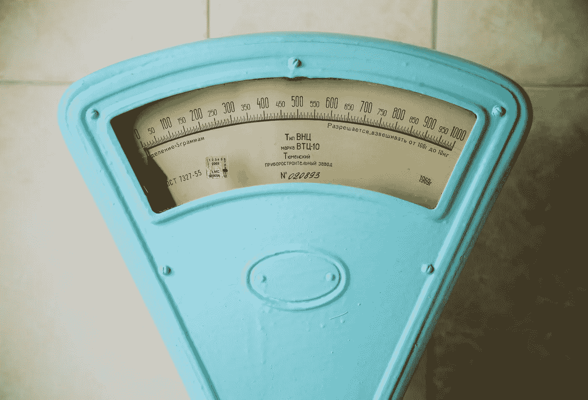

# 将你的 Docker 图片缩小一半的小技巧

> 原文：<https://betterprogramming.pub/small-tip-to-shrink-your-docker-images-size-33a58e71783a>

## 优化您的 Docker 图像



今天我想解释一下我最近发现的一个减小 Docker 图片尺寸的小技巧，在我的例子中，我可以将图片尺寸减小一半！

让我们假设您正在使用 Ruby 或 Python 之类的语言，即使这些语言没有经过编译，它们通常也需要一些系统库才能正常工作，特别是，如果您正在使用数据库(MySQL、SQLite、Postgres ),您需要为您的机器的特定架构编译 gem 或库。

在我的例子中，我正在使用 Ruby，并试图安装 SQLite gem，不幸的是，它需要`build-base`系统库。

这是我正在做的项目:[法恩兹分析](https://github.com/a-chris/faenz)

[](https://github.com/a-chris/faenz) [## GitHub - a-chris/faenz: Faenz 是一个轻量级、开源和隐私友好的网络分析工具…

### Faenz 是一个轻量级，开源和隐私友好的网络分析。符合 GDPR 标准。不含饼干。Heroku & Docker…

github.com](https://github.com/a-chris/faenz) 

所以我想安装它，编译 SQLite gem 并卸载我不再需要的所有东西，这是我的 docker 文件:

```
FROM ruby:3.0.4-alpine3.15
WORKDIR /faenz-analytics
RUN apk update && \
    apk add make && \
    apk add build-base && \ # this takes 200Mb of space!!
    apk add sqlite-dev

# ...some instructions

RUN bundle install  # installing Ruby gems
RUN apk del build-base

# ...some other instructions
```

很简单，对吧？我们安装了`build-base`，编译，安装了宝石，移除了`build-base`，以减小图像尺寸。

问题是这不起作用！图像大小与我们没有移除`build-base`时一样。让我们找出原因。

我们编写了三个`RUN`指令，每个指令生成一个图层，Docker 将这些图层放在一起创建最终的图像:

1.  第一个`RUN`安装系统库
2.  第二步`RUN`用 Ruby 或者你正在使用的任何语言安装 gems/库
3.  第三个`RUN`删除系统库

因为我们在其中一层安装了系统库，它们会占用一些空间，并且会增加图像大小，所以我们无法在下一层减小图像大小。

就像一个没有负数的和。从一层到另一层，尺寸只能增加或保持不变。

## 什么？不要放弃，我们会成功的

下面是解决方案:把这些操作放在同一个层！

```
FROM ruby:3.0.4-alpine3.15
WORKDIR /faenz-analytics
RUN apk update && \
    apk add make && \
    apk add sqlite-dev

# ...some instructions

RUN apk add build-base && \
    bundle install && \
    apk del build-base

# ...some other instructions
```

将操作组合在一条`RUN`指令中可以避免 Docker 浪费空间在一个层中存储`build-base`。该层是在指令的末尾生成的，所以我们将安装、使用`build-base`并立即删除它，这样该层将不再包含它。

有了这个小技巧，我的图像大小从 400MB 变成了 170MB，还不到一半！

如果您想夸大微优化，您可以通过删除该命令创建的缓存，将相同的解决方案应用于`apk update`(或者 Debian/ubuntu 映像的`apt-get update`):

```
RUN apk update && \
    add build-base && \
    # install other dependencies here...
    bundle install && \
    apk del build-base && \
    rm -rf /var/cache/apk && \
    rm -rf tmp/cache
```

正如有人已经指出的，我们也可以通过多阶段构建来解决这个问题:在中间构建中安装这个依赖项，然后将 gem 移动到最终的映像构建中。我认为这种方法对于这个特定的问题来说真的很难，因为您必须跟踪许多文件并将它们移动到另一个构建中。

事实上，在我之前链接的同一个项目中，我一直在使用多阶段构建来构建前端资产，并将它们移动到最终的映像构建中。

我不是 Docker 专家，所以，如果你知道一个更好的解决方案，或者想分享类似的技巧来缩小图像尺寸，请留下评论，我洗耳恭听