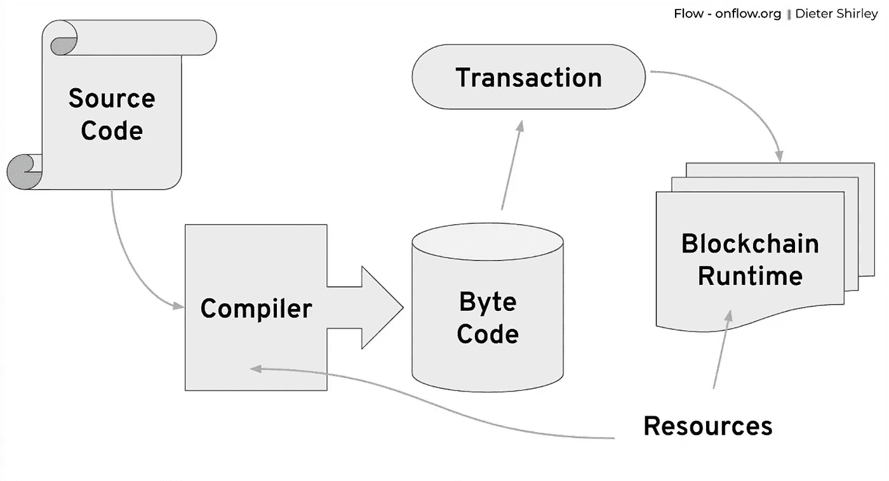
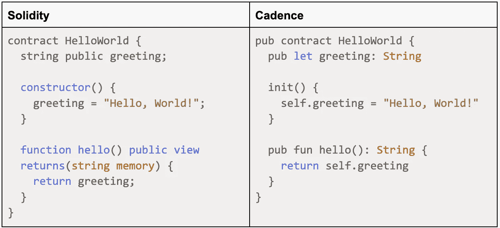
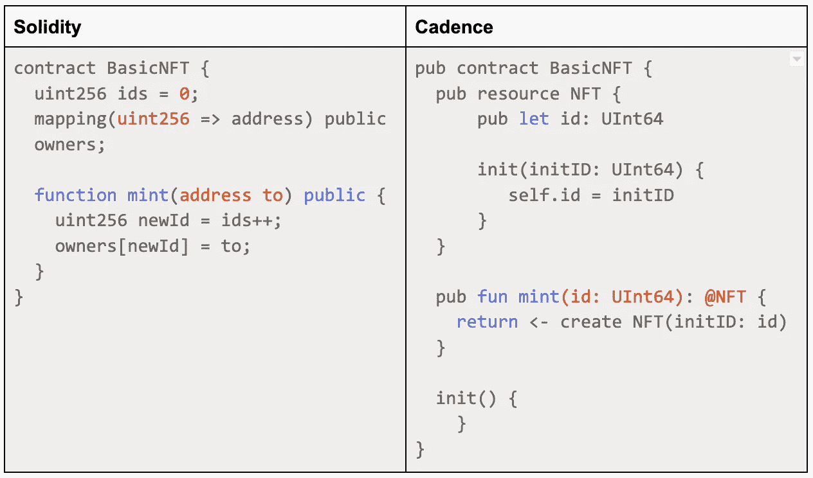

# 智能合约:以太坊和流量哪个更好？

> 原文：<https://betterprogramming.pub/smart-contracts-which-is-better-ethereum-or-flow-39f766c72e5d>

## 希望编写智能合同的开发人员有几个可靠的选择。以下是帮助您做出决定的差异

自从引入智能合约技术以来，Solidity 一直是智能合约开发人员选择的编码语言。

然而，如果你是一个 Solidity 开发者，你已经知道它有缺点。在其他缺陷中，主要的安全问题可能源于对某些数据类型的简单错误处理，并且没有内置的访问控制。

为流量区块链开发的一种新的智能合同语言 Cadence 借鉴了 Solidity 的疏忽，并自然地解决了它的许多固有问题。而且如果你已经知道了扎实，学起来也很直接！

本文介绍了 Cadence 智能合同语言，详细说明了它如何改进 Solidity，然后在一些常见的智能合同示例上对这两种语言进行了并排比较。最后，你应该对 Cadence 很熟悉，并准备好开始心流了！

# 关于凯登丝

Cadence 是支持流量区块链的编程语言，由 [Dapper Labs](https://www.google.com/url?q=https://www.dapperlabs.com/&sa=D&source=editors&ust=1660707011831346&usg=AOvVaw2svO7O5k7V2jqwbOSfn15E) 创建，用于支持大规模加密游戏和 NFT 项目。(你可能听说过 NBA 顶级投篮——他们最成功的项目之一。)它的语法可能很熟悉，因为它的灵感来自流行的现代语言，如 Swift、Rust 和 Kotlin。Cadence 是静态的和强类型的，具有面向资源的方法和基于能力的安全模型。

这意味着 Cadence 针对数字资产创建和管理进行了高度优化。

Cadence 引入的最重要的创新是其基于资源的范例。这种方法使得创建、跟踪和管理用户资产变得非常容易。资产与用户的账户存储直接相关，而不是像以太坊那样依赖中央公共账本作为事实的来源。因此，作为资源创建的资产(如 NFT)一次只能存在于一个位置。这确保他们只有一个所有者—外部拥有的帐户或智能合同。

*资源是具有受控创建和运行时支持的线性类型*

# 踏频如何提高稳定性

Cadence 在许多方面都优于 Solidity。让我们看三个例子——小的编码错误、安全性和访问控制以及契约部署。

# 那些小小的编码错误

一些最大的可靠性问题通常源于最小的错误。例如，仅用默认值初始化变量——尽管有时很方便——如果变量不变，可能会导致意想不到的结果。固定范围的数据类型可能导致潜在的下溢或上溢情况，如果该数据类型表示货币值，这将是灾难性的。

在 Cadence 中，变量值必须在初始化时设置，从默认值中删除任何不需要的结果。此外，Cadence 中的整数会自动检查下溢或溢出情况，而你需要继承 OpenZeppelin 的[安全数学库](https://docs.openzeppelin.com/contracts/2.x/api/math)或使用高于 0.8 的版本。

# 安全和访问控制

当涉及到安全性和访问控制时，Solidity 要求您创建自定义修饰符或继承其他基于安全性的智能合约，但也有许多默认情况下是公共的功能。

借助 Cadence 的[基于能力的安全模型](https://docs.onflow.org/cadence/language/capability-based-access-control/#gatsby-focus-wrapper)，账户只能执行他们有权访问的功能。这意味着 Cadence 将访问控制从根本上构建到了语言本身中。此外，Cadence 中资源对象上定义的方法不容易受到[重入攻击](https://hackernoon.com/hack-solidity-reentrancy-attack)，这是 Solidity 开发人员在创建他们的逻辑流时必须敏锐意识到的。

# 智能合同部署

当发现 Solidity smart contracts 中的问题时，如果不部署一个全新的合同，开发人员就无法修复它们。即使这样，脆弱的契约仍然存在。开发人员必须确保他们的用户群切换到新的合同。

在 Cadence 中，[智能合同可升级性](https://docs.onflow.org/cadence/language/contract-updatability/)是内置的且透明的。当代码被声明为安全的和最终的时，可以通过从智能契约的所有者移除密钥来使契约不可变。

总的来说，Cadence 是一种更安全、更可靠的智能合同语言，错误空间更小。

现在让我们看看用 Solidity 和 Cadence 编写的智能合同之间的区别。我们将完成一个简单的 Hello World 契约和一个更复杂的 NFT 实现。

# 简单合同

先说一个空前的经典。我们都用多种语言写过“Hello World ”,所以这是对 Cadence 的一个简单介绍。

让我们一步一步来。

# 合同定义

首先，我们有了契约定义。明显的区别是 Cadence 契约有一个访问控制修饰符:在本例中是 pub。该修改器确保流网络中的每个人都可以访问契约，这是实体契约的默认行为。

然而，在 Cadence 中，我们也可以将访问控制设置为`access(account)`。这将合同访问权限限制为部署该合同的帐户。在这里，我们已经看到了心流和以太坊之间的主要区别。我们不会简单地将合同部署到流量区块链；我们将它们部署到我们的帐户存储中。在流区块链上，每个帐户都用存储初始化，在存储中可以存储资源和结构。这个存储有自己的权限，这允许我们对谁可以执行我们的契约的方法进行细粒度的控制。

# 合同变量

下一行定义了一个作用于我们的契约的字符串变量。分号在 Cadence 中是可选的，一个`let`关键字用于定义变量。

Cadence 有两种类型的变量——可变的和不可变的。用`let`创建的变量是不可变的，也称为常量；我们只能设置一次，并且在合同有效期内不能更改。我们用`var`关键字定义可变变量(可以改变的变量)。

在这种情况下，我们在 init 方法中设置变量值，因为 Cadence 确保这个方法对于每个契约部署只调用一次。

# 方法

与 Solidity 的`constructor`相当的抑扬顿挫就是`init`法。此方法只被调用一次，即在部署协定时。

在 init 方法中，我们设置了 greeting 变量的值。虽然 Solidity 默认写入契约变量，但 Cadence 写入局部变量，并要求您使用 self-object 来访问契约变量。这个决定可以防止您在输入错误时意外写入合同变量。

我们契约的第二个方法返回问候变量。在 Cadence 和 Solidity 中，我们必须声明方法的访问是公共的，这两种语言都要求我们定义返回类型。在这种情况下，它是一个字符串。

但是扎实在这里要求我们更低级。它要求我们明确地告诉它字符串的位置。它还让我们将函数标记为 view，这样我们就不会意外地修改区块链的状态。

然而，Cadence 不需要这种底层控制，因为它是强静态类型的。潜在的错误在程序运行之前就被捕获了，通过删除多余的关键字使整个方法声明更具可读性。

# NFT 合同

接下来，让我们看一个来自两种语言的基本 NFT 契约:

因为两种语言对这个例子有不同的处理方式，所以让我们分别来看一下:首先遍历 Solidity 例子，然后是 Cadence。

# 固态

在 Solidity 中，NFT 是 id 的列表。您必须在智能合约中跟踪这些 id，并手动增加它们以确保唯一性。Solidity 对 NFT 和它们的唯一性一无所知。只是一个映射到它们主人的 id 列表。全部在合同内手动管理。如果 ID 增量处理不当，这就为错误留下了空间，可能导致多个 NFT 具有相同的 ID。

在本例中，NFT 没有附加任何附加数据，但是您可以向 URI 添加另一个映射 ID。该合同确保每一个新铸造的 NFT 映射到一个所有者的地址。

这当然是一个简单的例子。通常，您需要扩展几个接口来获得远程安全的 NFT 契约和特性，比如用于将众所周知的 jpg 附加到您的 NFT 的元数据，但是基本机制是相同的。

# 节奏

现在，让我们看看 Cadence 版本以及它如何改进这个 Solidity 示例。

# 资源定义

Cadence 示例从一个名为`NFT`的资源类型开始。注意到`NFT`前面的@符号了吗？此符号是必需的，因为它确保资源类型的用法和行为保持明确。

我们可以从资源中创建实例，并且它可以像结构一样具有属性。与常规结构的不同之处在于，资源是一种特殊的类型，除了它存储的数据之外，它还处理所有权。

在资源类型`NFT`中，有一个 id 字段。`id`字段是一个整数，`UInt64`，它是赋予每个 NFT 资源的唯一 id。这个`id`对于每个 NFT 资源都是不同的，这意味着资源不能被复制或组合。接下来，使用`init`函数初始化`id`字段。

就像 [Rust 的借用检查器](https://blog.logrocket.com/introducing-the-rust-borrow-checker/)确保只有一个函数可以修改一个变量一样，Cadence 确保它的资源也是如此。

# 资源创建

创建新资源时，我们必须在存储位置之间移动它。如果我们让资源保持原样，我们的智能契约将无法正常运行，因此这迫使我们对资源及其存储位置进行仔细考虑。这种形式的控制还确保资源永远不会丢失或被意外删除；他们一次只能在一个地方。

当我们调用 mint 函数时，它将创建我们的`NFT`资源的一个新实例。该函数返回一个类型为`NFT`的资源，并从前面定义的资源中获取字段`id`。`create`关键字有点像面向对象编程中的 new 操作符，创建一个新的资源。`<-`或 move-operator 表明，在我们调用它之后，这个资源在源上是不可用的。

# 存储资源

`self.account`变量将指向我们用作合同部署目标的账户。正如我们之前了解到的:智能合约不是部署在流网络上的全局名称空间中，而是部署在属于您的帐户的特殊链上存储中。因此，智能契约知道它被部署到哪个帐户，并可以在其方法中使用该信息。

在这个例子中，我们使用帐户的 save 方法。在最后一个`init`函数中，我们将资源移动到`save`方法的第一个参数中，并告诉它帐户中的哪个路径应该存储我们的 NFT。

既然我们的 NFT 是资源，那么流网上的任何实体都无法复制；我们不必明确地跟踪它的唯一性。

# 摘要

Cadence 是针对资产创建和管理而优化的智能合约编程语言的新版本。这是一种现代的替代方案，通过强制管理变量和资源、基础级别的安全和访问控制以及在智能合同变得不可改变之前升级智能合同的能力等手段，缓解了可靠性的不足。Cadence 向您展示了流生态系统的可能性，并整合了 Rust 等语言的许多功能。

因此，如果您是一名开发人员，希望用一种更安全的语言编写智能合同，Cadence 是一个很好的选择。要了解更多信息，请查看 [Cadence 文档](https://docs.onflow.org/cadence/)和 [Flow 开发者门户](https://developers.onflow.org/)。

祝您愉快！