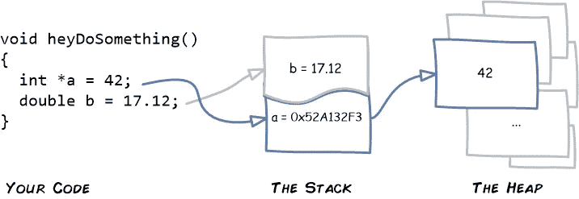

# 理解 C++中的智能指针

> 原文：<https://betterprogramming.pub/smart-pointers-in-cpp-708486276526>

## 更聪明地工作，而不是更努力


米拉德·法库里安在 [Unsplash](https://unsplash.com/photos/58Z17lnVS4U) 上拍摄的照片

```
**Table of Contents**· [Introduction](#5ac0)
· [The Problem](#306d)
· [The Solution](#f76b)
· [To access smart pointers:](#6768)
· [Sample Usage](#34de)
· [Questions](#1ef6)
  ∘ [Why was the constructor invoked but not the destructor?](#d2dc)
  ∘ [What if we pass a std::unique_ptr by value to a function?](#e6cc)
  ∘ [Why use the heap? Stacks manage memory automatically.](#2773)
· [Conclusion](#e77c)
· [Supplemental Material](#76e3)
  ∘ [[1] Stack and Heap, Franziska Hinkelmann](#fe65)
  ∘ [[2] Pointers, Kale Blankenship](#64c1)
  ∘ [[3] Pointers and References, Teri Radichel](#b6ad)
  ∘ [[4] Heap versus Stack for Python Programmers, Naser Tamimi](#d8cb)
  ∘ [[5] Stack, Heaps, and Pointers, Young Coder](#44c1)
```

# TL；速度三角形定位法(dead reckoning)

C ++智能指针是类对象，其行为类似于原始指针，但是管理在堆上创建的对象的生命周期。它们在软件开发中非常有用，因为它们自动化了删除对象的过程，并有助于防止内存泄漏。这个博客系列将讨论智能指针的基础知识以及如何在 C++程序中使用它们。具体来说，我们现在讨论基础知识，下面的博客将深入讨论不同类型的智能指针。

在此完成后，查看该系列的第二部分和第三部分的[。](/understanding-smart-pointers-in-cpp-6c3854593503?sk=6ad6b404237c36c4b10a5c3b65a724d9)

[](/understanding-smart-pointers-in-cpp-6c3854593503) [## 现代 C++:智能指针的近距离观察

### “理解智能指针”的续篇

better 编程. pub](/understanding-smart-pointers-in-cpp-6c3854593503) [](/understanding-smart-pointer-iii-909512a5eb05) [## 通过直观的视觉效果解释 C++智能指针

### 我的 C++指针系列的第 3 部分

better 编程. pub](/understanding-smart-pointer-iii-909512a5eb05) 

# 介绍

S 智能指针是类对象，其行为类似于内置指针，并管理通过 new 创建的对象，因此无需担心何时以及是否删除——智能指针会在适当的时间自动删除被管理的对象。

```
**💡** Wait, so it is the job of the developer to manage memory allocation and, hence, the deallocation? *Short answer: it depends on whether the memory is of the heap or stack.* Stacks (aka run-time stack) is responsible for program execution and function calls. The heap, independent of the stack, is extra storage available for dynamically storing objects. The sequentially stored items of the stack are processed frame by frame: destroyed once popped off. The heap stores memory in no sort of order, dynamically, and preserved until deleted explicitly. See [1] for more on heaps and stacks.
```

智能指针在语法上得到定义和使用，几乎与内置(或原始)指针完全一样。在许多情况下，我们可以用智能指针代替普通指针。本质上，通过简单地用智能指针替换普通指针来做同样的事情。有关指针的更多信息，请参见[2]。

智能指针包含一个内置指针，作为其模板类的一部分，模板类的类型参数是所指向对象的类型，因此我们可以声明指向任何种类的类对象的智能指针。当谈到动态分配的对象时，我们经常谈论谁拥有它们。拥有某物意味着它是你的，你可以随意保留或销毁。在 C++中，所有权不仅指引用或使用对象的代码，更重要的是指负责删除对象的代码。

我们实现了*所有权*关于在哪里用智能指针释放对象的内存。如果我们没有正确执行*所有权*，我们可能会因为试图跟踪指向不再存在的对象的指针而导致内存泄漏或意外行为。

智能指针通过删除智能指针析构函数(即对象被删除的地方)使得正确实现*所有权*变得更加容易。由于编译器确保在销毁对象时调用类对象的析构函数，智能指针销毁可以自动处理指向对象的删除。智能指针*拥有*对象并为我们删除它。

这个博客系列从智能指针的概述开始:问题、类型和用法。然后，我们将研究作为 C++标准库一部分的三个类。

1.  `std::unique_ptr` ( [来源](https://en.cppreference.com/w/cpp/memory/unique_ptr))
2.  `std::shared_ptr` ( [来源](https://en.cppreference.com/w/cpp/memory/shared_ptr))
3.  `std::weak_ptr` ( [来源](https://en.cppreference.com/w/cpp/memory/weak_ptr))

命名方案反映了功能，每个方案都有特定的用途；所选择的智能指针类型因使用情况而异。

在继续基础知识之前，让我们首先定义列出的类型:(1) `unique_ptr`实现唯一的*所有权* —一次只有一个智能指针*拥有*对象；销毁拥有智能指针的*时，拥有*智能指针的*对象自动销毁。`shared_ptr`②实行共有*所有制*。任意数量的智能指针共同拥有对象。在销毁最后一个拥有的智能指针时，拥有的对象被销毁。*

最后，(3) `weak_ptr` *不拥有*任何对象，并且在对象何时或是否被删除方面不起作用。更确切地说，`weak_ptr`只是在`shared_ptr`的管理下观察物体，并提供用于确定被观察物体是否仍然存在的工具。`weak_ptr`的 C++11 实现使用了`shared_ptr`。

# 问题是

资源有时需要从堆中分配(例如，静态变量、锁):必须在某个时候释放的资源。否则，内存泄漏:内存泄漏的长时间运行的程序会慢慢耗尽内存，从而降低性能。

正如微软写的*现代 C++* 所说，

> 智能指针在 [<内存>](https://docs.microsoft.com/en-us/cpp/standard-library/memory?view=msvc-170) 头文件的`std`命名空间中定义。它们对 [RAII](https://docs.microsoft.com/en-us/cpp/cpp/object-lifetime-and-resource-management-modern-cpp?view=msvc-170) 或*资源获取是初始化*编程习语至关重要。这个习语的主要目标是确保在初始化对象的同时获取资源，以便在一行代码中创建并准备好对象的所有资源。
> 
> 实际上，RAII 的主要原则是将任何堆分配的资源(例如，动态分配的内存或系统对象句柄)的所有权交给堆栈分配的对象，该对象的析构函数包含删除或释放资源的代码以及任何相关的清理代码。
> 
> 在大多数情况下，当您初始化原始指针或资源句柄以指向实际资源时，请立即将指针传递给智能指针。在现代 C++中，原始指针只用于有限范围的小代码块、循环或助手函数，在这些地方，性能是至关重要的，并且不会混淆所有权。"[ [来源](https://docs.microsoft.com/en-us/cpp/cpp/smart-pointers-modern-cpp?view=msvc-170)

# 解决方案

C++98 中的智能指针:`std::auto_ptr`。([来源](https://en.cppreference.com/w/cpp/memory/auto_ptr))

C++11 中的智能指针:`std::unique_ptr`、`std::shared_ptr`、`std::weak_ptr`。

## **提示**

`std::auto_ptr`，C++98 弃用，C++17 移除。这是一次标准化 C++11 的尝试，c++ 11 更好。唯一合法的用例`std::auto_ptr`是需要用 C++98 编译器编译代码。否则，用`std::unique_ptr`代替`std::auto_ptr`，永不回头。

智能指针是类对象，其行为类似于原始指针，但管理的对象是`new`以及何时或是否删除它们——智能指针在适当的时间自动删除被管理的对象。

**提示**

智能指针包含一个内置指针，定义为一个模板类，其类型参数是所指向对象的类型，因此您可以声明指向任何类型的类对象的智能指针。

因此，这个自动释放内存的原始指针容器，意味着程序中的内存泄漏是无关紧要的。

从 C++11 开始，智能指针的三种类型如下所示:

1.  `std::unique_ptr`
2.  `std::shared_ptr`
3.  `std::weak_ptr`

# 要访问智能指针:

每个都可以通过标准库头`<memory>` ( [源](https://en.cppreference.com/w/cpp/header/memory))访问。

```
#include <memory>
```

# 示例用法

要实例化一个唯一的指针并给它赋值 25(即键入`int`):

```
std::unique_ptr<int>myPtr1 = std::make_unique<int>(25);
```

我们如何使用这个指针？

```
std::cout << myPtr1 << std::endl;
```

> *0x60000049c030*

指针存储对象的地址。要访问智能指针的值，我们必须取消对它的引用。使用星号符号`*`。

```
std::cout << myPtr1 << std::endl;
std::cout << *myPtr1 << std::endl;
```

> *0x6000003ec030 25*

因此，就有了地址和值。

**不共享唯一指针。**

```
std::unique_ptr<int>myPtr1 = std::make_unique<int>(25);
std::unique_ptr<int>myPtr2 = myPtr1;
```

> *错误:调用隐式删除的复制构造函数' STD::unique _ ptr<int>'*

我们可以使用`move`方法将`myPtr1`指向的值移动到`myPtr2`的值。

```
std::unique_ptr<int>myPtr1 = std::make_unique<int>(25);
std::unique_ptr<int>myPtr2 = std::move(myPtr1);std::cout << *myPtr2 << std::endl;
```

> *25*

现在，如果我们遵从`move`之后的`myPtr1`会怎么样。

```
std::unique_ptr<int>myPtr1 = std::make_unique<int>(25);
std::unique_ptr<int>myPtr2 = std::move(myPtr1);std::cout << *myPtr2 << std::endl;
std::cout << *myPtr1 << std::endl;
```

> *25 异常:铿锵:* `*myPtr1*` *被移动后使用*

变量`myPtr1`为空。

**自动处理内存释放。**

这里有一个类来演示这个概念:

```
class MyClass{
public:
    MyClass(){
        std::cout << "Constructor invoked" << std::endl;
    }
    ~MyClass(){
        std::cout << "Destructor invoked" << std::endl;
    }
};
```

创建对象时，调用构造函数；析构函数在删除时被调用。

```
int main() { std::unique_ptr<MyClass>myPtr1 = std::make_unique<MyClass>();
    std::system("read -p 'Press Enter to continue...' var"); return 0;
}
```

> *构造函数被调用，按回车键继续…*

# 问题

## 为什么调用了构造函数而没有调用析构函数？

一旦对象不再在范围内，它就会被删除。在上面的例子中，我们从未执行完`main()`。因此，对象总是在范围内。进一步限制范围的方法是添加弯曲的括号。

```
int main() {
    { std::unique_ptr<MyClass>myPtr1 = std::make_unique<MyClass>();

    } std::system("read -p 'Press Enter to continue...' var");
    return 0;
}
```

> *构造函数调用析构函数调用回车继续…*

一个`unique_ptr`取得一个指针的*所有权*

*   模板:模板参数是*拥有的*指针引用的类型(即指针类型`T*`中的`T`)
*   C++标准库(C++11)的一部分
*   它的析构函数调用*拥有的*指针上的`delete`
*   当`unique_ptr`对象为`delete`d 或超出范围时调用

## 如果我们把一个 std::unique_ptr 按值传递给一个函数会怎么样？

对于 C++程序员来说，内存管理是一个不小的负担。智能指针是有帮助的，但是完全理解是必须的。

这段代码不会被编译，因为没有复制`std::unique_ptr`。因此，将其作为参数传递给函数将无法编译。

为了让编译器相信这没问题，可以使用`std::move`。

```
ptr = f(std::move(ptr));
```

如果这不清楚，也许理解引用(即通过值传递参数而不是通过引用传递参数)将有助于巩固这一课[3]。

## 为什么不完全避免堆呢？因此，不会发生内存泄漏，因为堆栈会自动管理内存资源。

Young Coder 总结了在程序中只假设静态内存不切实际的原因:

1.  堆栈上的空间是有限的，因此不适合更大的对象。
2.  堆栈上的内存大小是动态的:大小必须是恒定的，并且事先已知。
3.  堆栈遵循*先入后出* (FILO)范式——只能访问最顶层的项目，因此不能随机访问另一个项目。
4.  由于(3)，感兴趣的项目顶部的每个*堆栈帧*必须被解除分配以访问中间的那个。

进入堆——一个没有特定顺序的内存池，可以通过一个变量集来访问它的内存地址值。

请注意，堆栈将一个项目推到最后一个序列的顶部；堆没有这样的顺序。



从图解的[指南到堆栈、堆和指针](https://medium.com/young-coder/an-illustrated-guide-to-memory-the-stack-the-heap-and-pointers-40a604f7bc53)【5】。

# 结论

智能指针是一种有用的类类型，它使程序员能够使用指针，而无需手动分配和释放内存。按照微软的说法，我们应该远离原始指针，除非它的作用范围有限并且使用简单(例如，在一个循环或简单的代码块中)。

现在你已经准备好深入研究三种类型的智能指针:接下来是`std::unique_ptr`，然后是`std::shared_ptr`和`std::weak_ptr`，最后，我们将比较、对比并在实践中使用每一种。

# 补充材料

这里提出的主题本身就很重要。为了使您的 C++代码在运行时在速度和内存使用方面达到最优，对内存管理的良好理解是必不可少的！下面是整篇文章中引用的相关参考资料。

## **【1】栈和堆，** [弗兰齐斯卡·欣克尔曼](https://medium.com/u/1bb43593ad65?source=post_page-----708486276526--------------------------------)

[](https://medium.com/fhinkel/confused-about-stack-and-heap-2cf3e6adb771) [## 对栈和堆感到困惑？

### 坦白说，我总是很难把堆栈和堆分开。是的，我读过内存管理，然后…

medium.com。](https://medium.com/fhinkel/confused-about-stack-and-heap-2cf3e6adb771) 

## [2]指针，[羽衣甘蓝布兰肯希普](https://medium.com/u/c1aeceaf7f53?source=post_page-----708486276526--------------------------------)

 [## Go:指针是性能优化吗？

### 在过去的几周里，我已经回答了几个关于指针作为一种性能的问题/断言…

medium.co.m](https://medium.com/@vCabbage/go-are-pointers-a-performance-optimization-a95840d3ef85) 

## [3]指针和参考文献，[泰瑞·拉迪奇](https://medium.com/u/863161906cc5?source=post_page-----708486276526--------------------------------)

[](https://medium.com/cloud-security/pointers-and-references-157b854da2c5) [## 指针和引用

### 当您的代码指出安全问题时

medium.com](https://medium.com/cloud-security/pointers-and-references-157b854da2c5) 

## [4]Python 程序员的堆与栈，[纳赛尔·塔米米](https://medium.com/u/f94e8b97c7aa?source=post_page-----708486276526--------------------------------)

[](https://towardsdatascience.com/python-memory-and-objects-e7bec4a2845) [## Python、内存和对象

### 数据科学家的内存管理基础

towardsdatascience.com](https://towardsdatascience.com/python-memory-and-objects-e7bec4a2845) 

## [5]堆栈、堆和指针，[年轻的编码者](https://medium.com/u/7d4570c805e6?source=post_page-----708486276526--------------------------------)

[](https://medium.com/young-coder/an-illustrated-guide-to-memory-the-stack-the-heap-and-pointers-40a604f7bc53) [## 堆栈、堆和指针的图解指南

### 现代编程如何保证代码安全

medium.com](https://medium.com/young-coder/an-illustrated-guide-to-memory-the-stack-the-heap-and-pointers-40a604f7bc53) 

请注意，以上物品不是替换品，而是赠品。对于那些对这里所涉及的主题不熟悉的人来说，最好通读以上内容，参考以上需要更深入了解的主题，然后以挑战自己对细节保持理性的方式返回并重读。

所有的评论，问题，和补充信息在下面分享，如被允许，将不胜感激！

```
**Want to Connect?**Follow Dr. Robinson on [LinkedIn](https://www.linkedin.com/company/superannotate/), [Twitter](https://twitter.com/jrobvision), [Facebook](https://www.facebook.com/superannotate), and [Instagram](https://www.instagram.com/doctor__jjj/).Visit my homepage for papers, blogs, email signups, and more!
```

[](https://www.jrobs-vision.com/) [## 人工智能工程师|约瑟夫·p·罗宾逊

### 问候！我是 Vicarious Surgical 的人工智能工程师，致力于推进下一代外科机器人技术。我的…

www.jrobs-vision.com](https://www.jrobs-vision.com/) [](https://jvision.medium.com/membership) [## 通过我的推荐链接加入 Medium 约瑟夫·罗宾逊博士

### 作为一个媒体会员，你的会员费的一部分会给你阅读的作家，你可以完全接触到每一个故事…

jvision.medium.com](https://jvision.medium.com/membership)