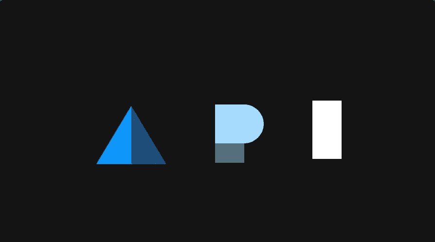
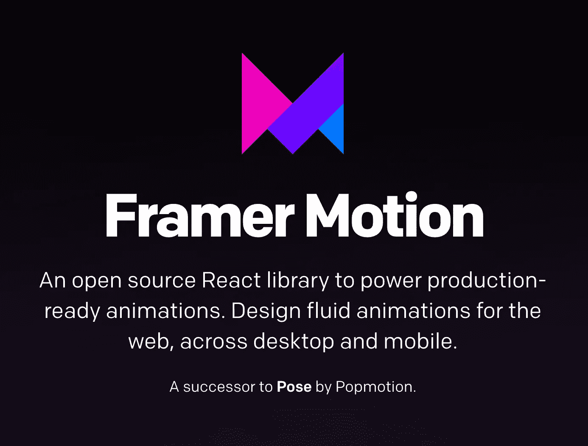
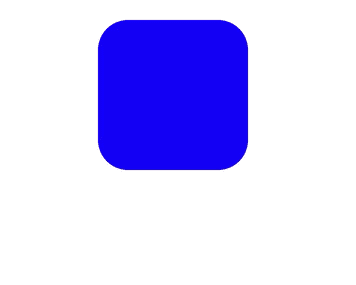
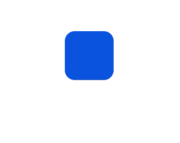
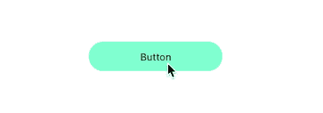
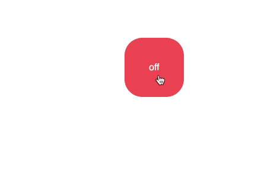

# 具有反应和帧运动的平滑动画

> 原文：<https://betterprogramming.pub/smooth-animations-with-react-and-framer-motion-c272b6f22f67>

## Frame Motion 是一个开源的 React 库，用于制作现成的动画



具有帧运动的动画

# 什么是框架运动？

成帧器运动是[姿势](https://popmotion.io/pose)动画库的继承者。像 Pose 一样，它提供了一个声明式 API 来支持 React 应用程序中的动画和手势。 [Motion](https://www.framer.com/motion/) 试图让 API 在最简单的情况下更简单，在处理高级情况时更灵活。



成帧器运动—[https://www.framer.com/motion/](https://www.framer.com/motion/)

成帧器动作特别强大，因为它解决了设计中的另一个大问题:切换。

设计师们经常花上几天时间来完善动画，直到最后一个春天，却发现在开发过程中细节丢失了。通过在原型制作和生产中使用相同的动画库，您现在可以保证以更真实、更有效的方式确保您的动画始终是一对一的。

# 入门指南

*注:成帧器动作要求* ***版本 React 16.8 以上*** *。*

## 装置

从 npm 安装`framer-motion`。

```
npm install framer-motion
```

安装完成后，您可以通过`framer-motion`包将 Motion 导入到组件中。

我们可以用`motion.div`元素替换常规 div。使用运动元素可以让我们访问许多可以用来制作动画的属性。

# 鼓舞

让我们看看这个超级简单的反应和帧运动组件。当组件安装后，它将在两秒钟内旋转 360 度。



旋转元件

`animate`属性可以接受一个值对象。当其中一个改变时，`motion`组件将自动动画到新的状态。

让我们以 pop 为例，一旦组件挂载，我们的元素将“弹出”。


“流行”

注意我们是如何指定在`animate`属性中的元素会发生什么的。这是我们给出动画制作指导的地方。属性是我们告诉动画持续时间的地方。

我们甚至可以通过将值作为数组传递来为每个`transition`、`animate`属性和样式指定多个值。这给了我们一个选项，将“pop”和旋转动画合并成一个动画。



"旋转-弹出"

# 手势动画

Motion 提供了`whileHover`和`whileTap`辅助道具，当手势处于活动状态时，这些辅助道具会将组件临时动画化为可视状态。



处理手势，如悬停和点击按钮

请注意制作元素动画是多么简单。既然我们已经学习了框架运动的基础知识，让我们来看一个更复杂的例子。如果你目前正在学习 JavaScript，我推荐你阅读“[一种更聪明的学习 JavaScript 的方法:使用技术将你的努力减半的新方法”](https://amzn.to/2LRyq8p)这本书。

# 棒形纽扣



大多数触发器有两种状态:要么开要么关，`true`或`false`。让我们创建一个开关组件，根据其当前状态打开或关闭。

toggle.js 组件

这里要带走的关键点是我们运动元素上的`variant`道具。变体让我们为动画定义多种状态。

变体是组件可以处于的预定义可视状态。通过给一个组件和它的孩子`variants`匹配的名字，整个反应树可以通过改变一个道具来激活。

通过使用变体，父母可以轻松地用特殊的`transition`道具(如`staggerChildren`)编排孩子的动画。

变体也可以是动态函数，根据传递给每个组件的`custom`属性的数据返回不同的属性。

*注意:注意我们是如何使用钩子的。如果钩子对你来说很陌生，* [*看看这篇文章*](https://codeburst.io/demystifying-react-hooks-a0b56a6254c2) *。*

[](https://codeburst.io/demystifying-react-hooks-a0b56a6254c2) [## 揭秘 React 挂钩

### 你可能听说过 React 的新概念，叫做钩子。钩子在 React 版本 16.8 中发布，它们让…

codeburst.io](https://codeburst.io/demystifying-react-hooks-a0b56a6254c2) 

# 接下来去哪里

查看完整的属性列表，自定义挂钩，以及您可以使用 Framer Motion 完成的酷动画。这是一个非常值得学习的动画库，它将大幅提升你的应用程序的视觉效果。

[](https://www.framer.com/api/motion/) [## 成帧器运动 API

### 一个开源的、可用于生产的动作库，用于 React on web

www.framer.com](https://www.framer.com/api/motion/) 

我还推荐通读“ [SVG 动画:从常见的 UX 实现到复杂的响应动画](https://amzn.to/2yrLuJ6)”这本书，以便更好地理解动画。

# 源代码

如果你想尝试使用 Framer Motion，这里有源代码和代码沙盒。

[](https://github.com/indreklasn/react-framer-motion-examples) [## indreklasn/react-帧-运动-示例

### 用 CodeSandbox 创建。为 indreklasn/react-framer-motion-examples 开发贡献一份力量

github.com](https://github.com/indreklasn/react-framer-motion-examples) 

Codesandbox

感谢阅读！❤