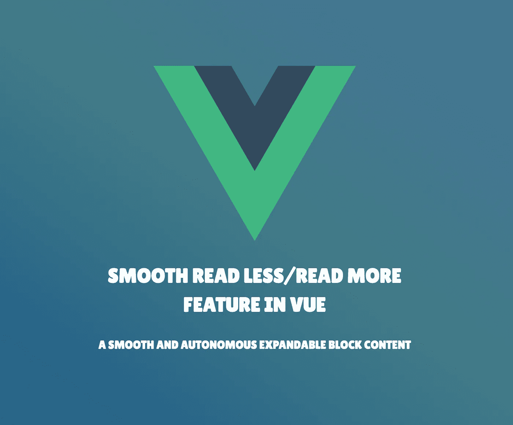
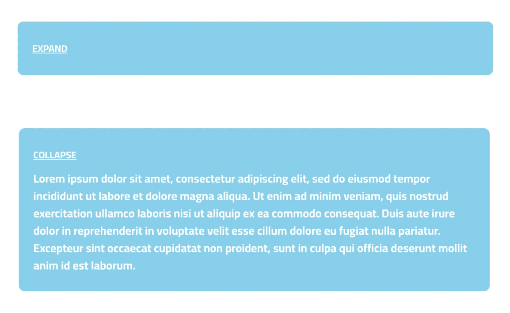
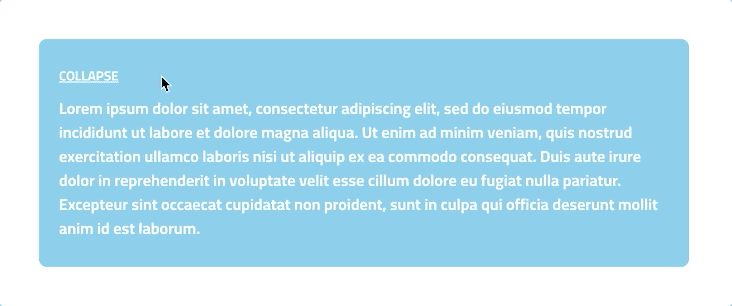
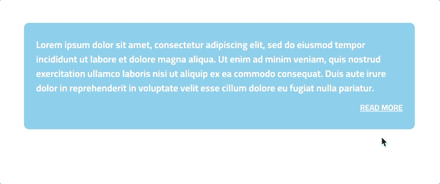
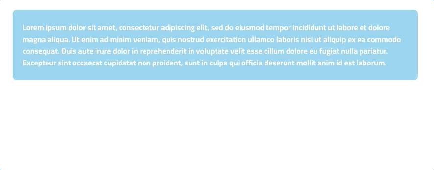

# Vue 中的平滑少读/多读功能

> 原文：<https://betterprogramming.pub/smooth-read-less-read-more-feature-in-vue-83d26734cb92>

## 平滑且自主的可扩展块内容

最后，我被要求创建一个基本的少读/多读数据块内容。很基本的东西，对吧？

然而，在网上浏览 Vue 3 版本并不成功。对于这么简单的东西，我不想使用库。最后，我用了一个自制的解决方案。

让我向您介绍一个 100 行代码的组件，它提供:

*   流畅的动画
*   可定制的初始高度:用于折叠状态
*   自主行为:检测切换按钮的必要性

一切都将逐步引入，这样你就可以在任何适合你需要的时候停下来。

# 简单的可扩展块内容

首先，您需要从一个基本块内容组件开始。切换按钮将显示或隐藏块的主体。这里没有什么超级复杂的。代码如下:

来源:作者

## 用流畅的动画

开始有趣的是添加一个平滑的动画。Vue 为过渡和动画提供了完整的文档。

 [## 过渡| Vue.js

### vue . js——渐进式 JavaScript 框架

vuejs.org](https://vuejs.org/guide/built-ins/transition.html) 

我推荐你阅读 JavaScript 钩子部分，它解释了如何在动画中控制转换过程和 CSS 行为。

这里必须注意几点:

*   周围`Transition`组件的使用(L11)
*   几个 Javascript 钩子定义了动画的行为(L11-L16)
*   带有`transition`属性的 CSS 转换定义(L96)

可扩展块内容(来源:作者)

我们现在能够显示包含以下内容的块内容:

*   流畅的动画

让我们继续，然后允许一个初始高度，这将站在折叠状态。

# 调整折叠状态的高度

改进具有初始高度的部件是另一个难点。

实际上，`overflow` CSS 规则不是一个“可转换”的属性，这意味着在转换过程中不能有一个可以与`height`结合的中间状态。

因此，我们将不得不用一个预览块内容来保存折叠的内容。此外，我们必须使用两个新变量:

*   最初显示的可见行数
*   那些线条的高度(`line-height`)

这里，应注意几个技术要点:

`[Transition](https://vuejs.org/guide/built-ins/transition.html#the-transition-component)` [组件](https://vuejs.org/guide/built-ins/transition.html#the-transition-component)

它现在嵌套了两个不同的块:预览和扩展内容。

## **过渡模式**

注意 L9 上的`mode="out-in"`。它确保两个块之间的转换顺利完成:预览块首先离开 DOM 然后将扩展的内容输入到 DOM 中。

`visibleLines`道具

这个新道具有助于定义预览块的高度。此外，我们需要`line-height`，这里设置为`24px`。根据你的排版风格随意修改。您甚至可以将它作为组件的`prop`来提供。这个道具会用两次。

首先，在 L48 上，计算预览块的高度，以便可以在过渡钩子中使用它。

第二，在 L108 上的`style`标签中设置预览`div`的`max-height`。Vue 使用关键字`v-bind`帮助完成这项工作(更多细节[在这里](https://vuejs.org/api/sfc-css-features.html#v-bind-in-css))，它依赖于底层的 [CSS 变量](https://developer.mozilla.org/en-US/docs/Web/CSS/Using_CSS_custom_properties)。

用少读/多读功能屏蔽内容(来源:作者)

我们刚刚完成了组件的第二个预期特征:

*   可定制的初始高度:用于折叠状态

这个平滑的少读/多读功能运行得很好…但没那么好。与预览的最小高度相比，如果内容不够长会怎么样？嗯，切换按钮在任何情况下都会被呈现。那不是超级方便。

然后，我们来看看如何克服这个问题。

# 奖励点:自主触发需要检测

我想你已经在这里找到了。目标是让组件检测是否有必要显示切换按钮。

为此，我们将只使用`onMounted`钩子(可能您可以使用一个观察器)和一个[模板引用](https://vuejs.org/guide/essentials/template-refs.html#accessing-the-refs)。不多不少。

从下面的 L59 到 L64，你会看到只需要将实际预览高度与`maxHeightCollapsed`进行比较。

我们终于完成了:

自主切换按钮需要检测(来源:作者)

# 简单地

嗯，这是一个快速的…但正如你可能已经看到的，Vue 提供了一堆工具来快速轻松地控制过渡行为。此外，CSS 变量管理有助于动态设置组件的初始状态。

我希望这篇文章能帮助您创建超级漂亮的可扩展包装器和可切换的块内容。首先，我感到惊讶的是，这个话题在网上并没有被广泛报道。但是最后我想通了，创建这样的组件并没有那么复杂。

# 资源

 [## 过渡| Vue.js

### vue . js——渐进式 JavaScript 框架

vuejs.org](https://vuejs.org/guide/built-ins/transition.html)  [## 使用 CSS 自定义属性(变量)- CSS:级联样式表| MDN

### 自定义属性(有时称为 CSS 变量或级联变量)是由 CSS 作者定义的实体…

developer.mozilla.org](https://developer.mozilla.org/en-US/docs/Web/CSS/Using_CSS_custom_properties)  [## 模板参考| Vue.js

### 虽然 Vue 的声明性呈现模型为您抽象出了大部分直接的 DOM 操作，但仍然可能有…

vuejs.org](https://vuejs.org/guide/essentials/template-refs.html#accessing-the-refs)